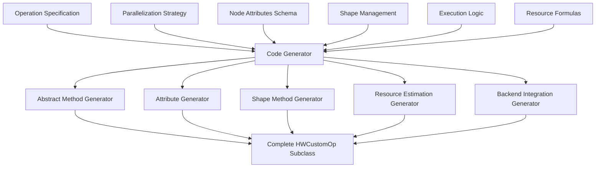

# HWCustomOp Automatic Code Generation Requirements

Based on comprehensive analysis of all HWCustomOp subclasses in FINN, this document outlines the key information needed for automatic code generation of new HWCustomOp implementations.

## Core Information Requirements

### 1. **Operation Specification**
```python
operation_spec = {
    "name": "CustomOperation",
    "operation_type": "compute|spatial|data_movement|element_wise|memory|activation",
    "description": "Brief operation description",
    "complexity_class": "simple|moderate|complex",  # Affects generated code structure
}
```

### 2. **Parallelization Strategy**
```python
parallelization = {
    "pe_strategy": {
        "enabled": True|False,
        "type": "output_parallel|channel_parallel|element_parallel|threshold_parallel",
        "constraint": "output_channels % PE == 0",  # Divisibility requirement
    },
    "simd_strategy": {
        "enabled": True|False, 
        "type": "input_parallel|kernel_parallel|spatial_parallel|channel_parallel",
        "constraint": "input_channels % SIMD == 0",
    },
    "stream_width_formula": {
        "input": "PE * input_datatype.bitwidth()" | "SIMD * input_datatype.bitwidth()",
        "output": "PE * output_datatype.bitwidth()",
    }
}
```

### 3. **Node Attributes Schema**
```python
node_attributes = {
    # Operation-specific parameters
    "operation_params": {
        "MW": ("i", True, 0),  # Matrix width
        "MH": ("i", True, 0),  # Matrix height
        "Kernel": ("ints", True, []),  # Kernel dimensions
        "Stride": ("ints", True, [1, 1]),  # Stride values
        # ... other operation-specific params
    },
    
    # Parallelization parameters
    "parallelization_params": {
        "PE": ("i", True, 0) if pe_strategy["enabled"] else None,
        "SIMD": ("i", True, 0) if simd_strategy["enabled"] else None,
    },
    
    # Datatype parameters
    "datatype_params": {
        "inputDataType": ("s", True, ""),
        "outputDataType": ("s", True, ""),
        "weightDataType": ("s", True, "") if has_weights else None,
        "accDataType": ("s", False, "INT32") if needs_accumulator else None,
    },
    
    # Memory parameters
    "memory_params": {
        "mem_mode": ("s", False, "internal_embedded", memory_modes) if has_weights else None,
        "ram_style": ("s", False, "auto", ["auto", "block", "distributed", "ultra"]),
        "runtime_writeable_weights": ("i", False, 0, {0, 1}) if supports_runtime_weights else None,
    }
}
```

### 4. **Shape Management Specifications**
```python
shape_management = {
    "input_shape_formula": {
        "normal": "tuple(batch_dims + [input_features])",
        "folded": "tuple(batch_dims + [input_features//SIMD, SIMD])" if uses_simd else "tuple(batch_dims + [input_features//PE, PE])",
    },
    "output_shape_formula": {
        "normal": "tuple(batch_dims + [output_features])", 
        "folded": "tuple(batch_dims + [output_features//PE, PE])",
    },
    "shape_constraints": [
        "input_features % SIMD == 0" if uses_simd else None,
        "output_features % PE == 0" if uses_pe else None,
    ]
}
```

### 5. **Execution Logic Template**
```python
execution_logic = {
    "operation_type": "matmul|conv|elementwise|pooling|lookup|threshold|custom",
    "core_computation": {
        "matmul": "np.matmul(input_A, input_B)",
        "elementwise": "input_A + input_B",  # or other element-wise ops
        "lookup": "embedding_table[indices]",
        "custom": "user_provided_function",
    },
    "special_modes": {
        "binary_optimization": True|False,  # XNOR-popcount
        "activation_integration": True|False,  # Multi-threshold
        "accumulator_optimization": True|False,  # Width minimization
    }
}
```

### 6. **Resource Estimation Formulas**
```python
resource_estimation = {
    "bram_formula": {
        "memory_based": "math.ceil(memory_depth * memory_width / bram_capacity)",
        "lut_based": "0",  # For operations using LUTs instead
    },
    "lut_formula": {
        "datapath_based": "operation_complexity * datatype_width",
        "memory_based": "0",  # For BRAM-based operations
    },
    "dsp_formula": {
        "multiply_based": "num_multipliers * parallelism_factor",
        "non_multiply": "0",
    },
    "uram_formula": {
        "large_memory": "math.ceil(memory_size / uram_capacity)",
        "small_memory": "0",
    }
}
```

### 7. **Backend Support Configuration**
```python
backend_support = {
    "hls_backend": {
        "enabled": True|False,
        "requires_custom_pragmas": True|False,
        "cpp_interface_style": "packed|hls_vector",
        "custom_includes": ["list", "of", "includes"],
    },
    "rtl_backend": {
        "enabled": True|False,
        "requires_custom_verilog": True|False,
        "interface_style": "axi_stream|custom",
    }
}
```

### 8. **Memory Architecture Support**
```python
memory_support = {
    "memory_modes": ["internal_embedded", "internal_decoupled", "external"],
    "weight_file_formats": ["hls_header", "decoupled_verilog_dat", "decoupled_runtime"],
    "runtime_reconfiguration": True|False,
    "axi_interfaces": {
        "axilite": True|False,  # For runtime weights
        "aximm": True|False,    # For external memory
    }
}
```

## Code Generation Templates

### 9. **Method Generation Patterns**
```python
method_templates = {
    "get_nodeattr_types": "auto_generate_from_node_attributes_schema",
    "get_normal_input_shape": "auto_generate_from_shape_management",
    "get_folded_input_shape": "auto_generate_from_parallelization_strategy", 
    "get_instream_width": "auto_generate_from_parallelization_and_datatype",
    "execute_node": "auto_generate_from_execution_logic",
    "bram_estimation": "auto_generate_from_resource_estimation_formulas",
    "get_exp_cycles": "auto_generate_from_parallelization_and_operation_complexity",
}
```

## Code Generation System Architecture



## Implementation Priority

1. **Phase 1**: Simple operations (element-wise, basic data movement)
2. **Phase 2**: Medium complexity (spatial operations, basic compute)
3. **Phase 3**: Complex operations (MVAU/VVAU with full memory management)

This systematic approach captures the essential patterns identified across all 25+ HWCustomOp subclasses and provides a framework for automatic generation based on high-level specifications.