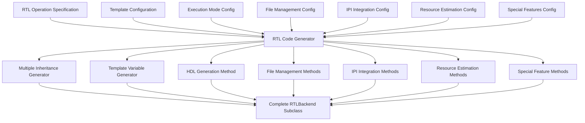

# RTLBackend Automatic Code Generation Requirements

Based on comprehensive analysis of all RTLBackend subclasses in FINN, this document outlines the key information needed for automatic code generation of new RTLBackend implementations.

## Core Information Requirements for RTLBackend Code Generation

### 1. **RTL Operation Specification**
```python
rtl_operation_spec = {
    "name": "CustomOperation_rtl",
    "base_kernel_class": "ConvolutionInputGenerator|MVAU|VVAU|Thresholding|StreamingFIFO|StreamingDataWidthConverter|FMPadding",
    "complexity_level": "low|medium|high",  # Affects template complexity
    "has_dynamic_config": True|False,  # AXI-Lite interface support
    "finn_rtllib_module": "module_name",  # Corresponding finn-rtllib module
    "implementation_styles": ["default", "parallel", "vivado"],  # Optional style variants
}
```

### 2. **Multiple Inheritance Configuration**
```python
inheritance_pattern = {
    "base_classes": [
        "base_kernel_class",  # e.g., MVAU, Thresholding
        "RTLBackend"
    ],
    "init_pattern": {
        "super_call": "super().__init__(onnx_node, **kwargs)",
        "custom_initialization": []  # Additional init steps if needed
    },
    "attribute_merging": {
        "my_attrs": {},  # RTL-specific attributes
        "merge_order": ["my_attrs", "base_class_attrs", "rtl_backend_attrs"]
    }
}
```

### 3. **Template-Based Generation Configuration**
```python
template_config = {
    "template_location": "finn-rtllib/{module_name}/template/{template_name}.sv",
    "variable_naming_convention": "$UPPERCASE_WITH_UNDERSCORES$|UPPERCASE_WITHOUT_DELIMITERS",
    "template_variables": {
        # Module identification
        "module_naming": {
            "$TOP_MODULE_NAME$": "generated_module_name",
            "$MODULE_NAME_AXI_WRAPPER$": "wrapper_name",
        },
        
        # Datatype variables
        "datatype_params": {
            "$ACTIVATION_WIDTH$": "input_datatype.bitwidth()",
            "$WEIGHT_WIDTH$": "weight_datatype.bitwidth()",
            "$ACCU_WIDTH$": "accumulator_width",
            "$SIGNED_ACTIVATIONS$": "datatype.signed",
            "$BIT_WIDTH$": "stream_width",
        },
        
        # Parallelization variables
        "parallelization_params": {
            "$PE$": "parallelism_factor",
            "$SIMD$": "simd_factor", 
            "$MW$": "matrix_width",
            "$MH$": "matrix_height",
        },
        
        # Configuration variables
        "config_params": {
            "$FORCE_BEHAVIORAL$": "use_behavioral_simulation",
            "$USE_AXILITE$": "has_dynamic_config",
            "$DEEP_PIPELINE$": "enable_deep_pipeline",
        }
    },
    "custom_variable_generation": "operation_specific_function"  # For complex variables
}
```

### 4. **Dual Execution Mode Support**
```python
execution_modes = {
    "standard_pattern": {
        "enabled": True,  # 6/8 implementations use this
        "cppsim_delegation": "base_class.execute_node(self, context, graph)",
        "rtlsim_delegation": "RTLBackend.execute_node(self, context, graph)",
    },
    "custom_rtlsim": {
        "enabled": False,  # For MVAU/VVAU/DynMVU/Thresholding
        "input_processing": "custom_input_conversion_logic",
        "simulation_control": "custom_simulation_object_management",
        "output_processing": "custom_output_conversion_logic",
        "multi_input_support": True|False,  # For weight + activation streams
    }
}
```

### 5. **File Management Configuration**
```python
file_management = {
    "generated_files": {
        "wrapper": {
            "synthesis": "{module_name}_wrapper.v",
            "simulation": "{module_name}_wrapper_sim.v",  # Optional
        },
        "memory_files": [
            "{module_name}_mem_{pe}_{stage}.dat"  # For memory-based operations
        ]
    },
    "source_files": {
        "finn_rtllib_files": [
            "core_module.sv",
            "supporting_module.sv"
        ],
        "copy_pattern": "copy_from_finn_rtllib_to_codegen_dir"
    },
    "file_list_generation": {
        "absolute_path_support": True,
        "path_variables": {
            "code_gen_dir": "self.get_nodeattr('code_gen_dir_ipgen')",
            "rtllib_dir": "os.path.join(os.environ['FINN_ROOT'], 'finn-rtllib/{module}/')"
        }
    }
}
```

### 6. **IPI Integration Configuration**
```python
ipi_integration = {
    "tcl_command_generation": {
        "add_files": "add_files -norecurse {file_path}",
        "create_module": "create_bd_cell -type module -reference {top_module} {instance_name}",
        "vivado_ip_mode": {  # For StreamingFIFO_rtl style
            "enabled": False,
            "ip_configuration_commands": []
        }
    },
    "implementation_style_switching": {
        "enabled": False,  # Only StreamingFIFO_rtl
        "styles": ["rtl", "vivado"],
        "command_generation_per_style": {}
    }
}
```

### 7. **Resource Estimation Configuration**
```python
resource_estimation = {
    "estimation_methods": {
        "lut_estimation": {
            "complexity": "simple|advanced",
            "formula": "constant|datapath_based|memory_primitive_based",
            "implementation": "return 0|return PE*SIMD*complexity_factor|advanced_calculation"
        },
        "bram_estimation": {
            "complexity": "simple|advanced", 
            "formula": "memory_size_based|primitive_modeling",
            "cascade_support": True|False,  # ConvolutionInputGenerator_rtl
        },
        "uram_estimation": {
            "depth_trigger": "threshold_for_uram_vs_bram",
            "formula": "ceil(memory_size / uram_capacity)"
        },
        "dsp_estimation": {
            "formula": "PE * SIMD|multiplier_count|implementation_dependent"
        }
    },
    "advanced_estimation": {
        "memory_primitive_selection": True|False,  # Thresholding_rtl
        "buffer_partitioning": True|False,  # ConvolutionInputGenerator_rtl
        "cascade_configurations": True|False,
    }
}
```

### 8. **Special Features Configuration**
```python
special_features = {
    "dynamic_configuration": {
        "enabled": False,  # ConvolutionInputGenerator_rtl, FMPadding_rtl
        "axi_lite_interface": True,
        "runtime_parameter_updates": [],
        "config_generation_method": "get_dynamic_config()"
    },
    "implementation_style_selection": {
        "enabled": False,  # ConvolutionInputGenerator_rtl, StreamingFIFO_rtl
        "selection_logic": "select_impl_style()",
        "styles": {
            "default": "standard_implementation",
            "parallel": "advanced_parallel_implementation", 
            "vivado": "vivado_ip_based_implementation"
        }
    },
    "dsp_implementation_selection": {
        "enabled": False,  # MVAU_rtl, VVAU_rtl
        "fpga_part_dependent": True,
        "datatype_dependent": True,
        "selection_method": "_resolve_impl_style()",
        "pipeline_depth_calculation": "_resolve_segment_len()"
    },
    "pumped_compute": {
        "enabled": False,  # MVAU_rtl only
        "clock_domain_management": True,
        "double_pumped_dsp": True
    },
    "advanced_memory_management": {
        "enabled": False,  # Thresholding_rtl
        "threshold_file_generation": "make_weight_file()",
        "memory_geometry_analysis": "get_pe_mem_geometries()",
        "binary_search_tree_organization": True
    }
}
```

### 9. **Template Variable Generation Patterns**
```python
template_variable_patterns = {
    "common_variables": {
        "module_identification": [
            "$TOP_MODULE_NAME$", "$MODULE_NAME_AXI_WRAPPER$"
        ],
        "datatype_related": [
            "$ACTIVATION_WIDTH$", "$WEIGHT_WIDTH$", "$ACCU_WIDTH$",
            "$SIGNED_ACTIVATIONS$", "$BIT_WIDTH$", "$ELEM_BITS$"
        ],
        "parallelization": [
            "$PE$", "$SIMD$", "$MW$", "$MH$"
        ],
        "configuration_flags": [
            "$FORCE_BEHAVIORAL$", "$USE_AXILITE$", "$DEEP_PIPELINE$"
        ]
    },
    "operation_specific_variables": {
        "convolution_input_generator": [
            "$HEAD_INCR_SIMD$", "$HEAD_INCR_KW$", "$HEAD_INCR_KH$",
            "$TAIL_INCR_W$", "$TAIL_INCR_H$", "$TAIL_INCR_LAST$",
            "$LOOP_H_ITERATIONS$", "$LOOP_W_ITERATIONS$",
            "$IS_DEPTHWISE$", "$INNERMOST_STATE$"
        ],
        "thresholding": [
            "$THRESHOLDS_PATH$", "$BIAS$", "$N$", "$WT$", "$WI$",
            "$SIGNED$", "$FPARG$", "$O_BITS$",
            "$DEPTH_TRIGGER_URAM$", "$DEPTH_TRIGGER_BRAM$"
        ],
        "dynamic_mvu": [
            "$N_VECTORS$"  # Runtime vector count
        ]
    },
    "variable_generation_functions": {
        "simple_attribute_mapping": "direct_node_attribute_to_template_variable",
        "calculated_values": "derived_from_multiple_attributes",
        "conditional_generation": "based_on_operation_mode_or_style"
    }
}
```

### 10. **Code Generation Templates**
```python
code_generation_templates = {
    "class_structure": """
class {operation_name}_rtl({base_kernel_class}, RTLBackend):
    def __init__(self, onnx_node, **kwargs):
        super().__init__(onnx_node, **kwargs)
    
    def get_nodeattr_types(self):
        # Auto-generated from template_config
        
    def generate_hdl(self, model, fpgapart, clk):
        # Auto-generated from template_config and file_management
        
    def get_rtl_file_list(self, abspath=False):
        # Auto-generated from file_management
        
    def code_generation_ipi(self):
        # Auto-generated from ipi_integration
        
    def execute_node(self, context, graph):
        # Auto-generated from execution_modes
        
    # Resource estimation methods auto-generated from resource_estimation
    
    # Special feature methods auto-generated from special_features
""",
    
    "method_generators": {
        "generate_hdl": "template_processing_generator",
        "get_rtl_file_list": "file_list_generator", 
        "code_generation_ipi": "tcl_command_generator",
        "execute_node": "execution_mode_generator",
        "resource_estimation": "resource_formula_generator"
    }
}
```

## RTLBackend Code Generation System Architecture



## Implementation Complexity Levels

### Low Complexity (149-188 lines)
**Pattern**: StreamingDataWidthConverter_rtl, FMPadding_rtl
- Standard dual execution mode
- Simple template variables
- Basic resource estimation
- Minimal special features

### Medium Complexity (242-356 lines) 
**Pattern**: StreamingFIFO_rtl, MVAU_rtl, VVAU_rtl, DynMVU_rtl
- Custom execution handling OR implementation style switching
- Moderate template complexity
- DSP implementation selection (MVAU/VVAU family)
- Advanced resource estimation

### High Complexity (516-982 lines)
**Pattern**: Thresholding_rtl, ConvolutionInputGenerator_rtl
- Advanced memory management OR dual implementation styles
- Complex template variable generation
- Dynamic configuration support
- Sophisticated resource estimation with primitive modeling

## Code Generation Priority

1. **Phase 1**: Low complexity operations with standard patterns
2. **Phase 2**: Medium complexity with custom execution or style switching  
3. **Phase 3**: High complexity with advanced memory management and dynamic config

## Key Design Insights

### Consistency Patterns
- **Universal**: Multiple inheritance, template processing, file management
- **Frequent**: Standard execution modes, common template variables
- **Unique**: Implementation style switching, dynamic configuration, advanced memory management

### Template Variable Management
- **Naming**: Consistent `$UPPERCASE_WITH_UNDERSCORES$` (except StreamingFIFO_rtl outlier)
- **Categories**: Module ID, datatype, parallelization, configuration flags
- **Generation**: Direct mapping, calculated values, conditional generation

### Special Considerations
- **StreamingFIFO_rtl**: Unique variable naming without `$` delimiters
- **MVAU/VVAU family**: Complex DSP implementation selection
- **ConvolutionInputGenerator_rtl**: Most complex with dual implementation styles
- **Thresholding_rtl**: Advanced memory primitive selection

This systematic approach captures the essential RTL backend patterns and provides a framework for automatic generation of RTLBackend subclasses with appropriate complexity levels and feature sets.