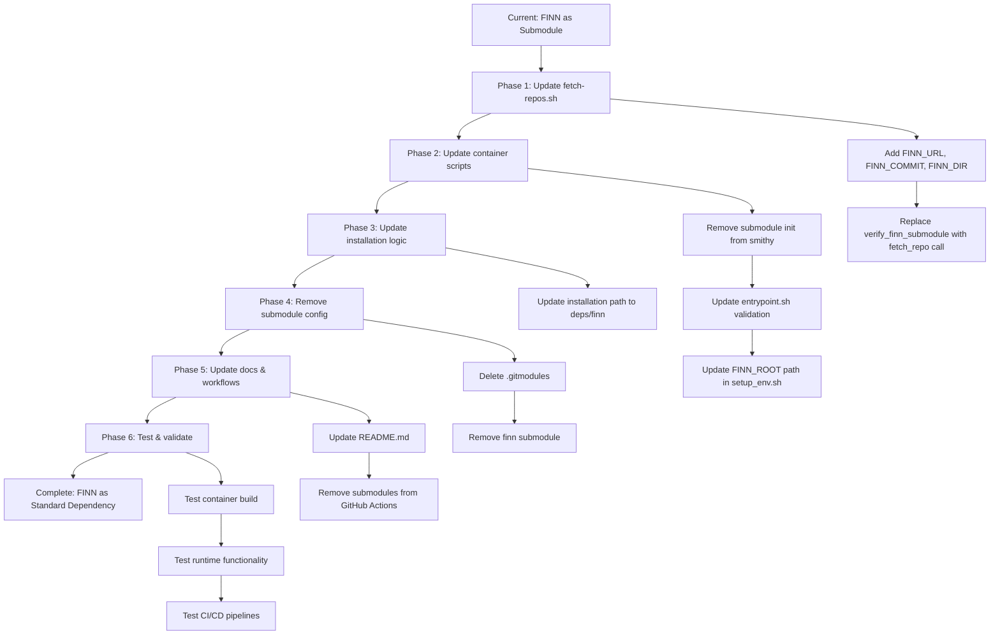

# FINN Submodule to Standard Dependency Migration Plan

## Overview

This document outlines the detailed plan to migrate FINN from a git submodule back to the standard fetch-repos.sh dependency workflow used by other dependencies in the Brainsmith project.

## Current State Analysis

### Current Configuration
- **FINN Location**: Git submodule at repository root (`finn/`)
- **Source**: `https://github.com/Xilinx/finn.git` branch `custom/transformer`
- **Configuration**: Defined in `.gitmodules`

### Current Workflow Issues
1. **Inconsistent dependency management**: FINN uses submodules while other deps use fetch-repos.sh
2. **Complex initialization**: Requires `git submodule update --init --recursive`
3. **CI/CD complexity**: All workflows need `submodules: recursive`
4. **Development overhead**: Submodule state management and commit tracking

### Files Currently Using Submodule Pattern
- [`smithy`](smithy:260-265) - Submodule initialization during build
- [`docker/fetch-repos.sh`](docker/fetch-repos.sh:73-89) - `verify_finn_submodule()` function
- [`docker/entrypoint.sh`](docker/entrypoint.sh:59-63) - Submodule validation check
- [`.gitmodules`](.gitmodules) - Submodule configuration
- [`README.md`](README.md:17-39) - Submodule setup instructions
- GitHub Actions workflows - `submodules: recursive` checkout

## Target State

### Desired Configuration
- **FINN Location**: Standard dependency at `deps/finn/`
- **Source**: Same URL and branch (`custom/transformer`)
- **Workflow**: Fetched via [`docker/fetch-repos.sh`](docker/fetch-repos.sh) like other dependencies

### Standard Dependency Pattern
Following the same pattern as other dependencies:
- **qonnx**: `deps/qonnx/` from branch `custom/brainsmith`
- **finn-experimental**: `deps/finn-experimental/` from specific commit
- **brevitas**: `deps/brevitas/` from specific commit

## Migration Plan

### Phase 1: Update fetch-repos.sh for Standard Dependency Management

#### 1.1 Add FINN Dependency Configuration

**File**: [`docker/fetch-repos.sh`](docker/fetch-repos.sh)

**Changes**:
```bash
# Add to dependency URLs section (around line 20)
FINN_URL="https://github.com/Xilinx/finn.git"

# Add to dependency commits/branches section (around line 32)  
FINN_COMMIT="custom/transformer"  # Use branch reference like qonnx

# Add to dependency directories section (around line 46)
FINN_DIR="finn"
```

#### 1.2 Replace Submodule Verification with Standard Fetch

**File**: [`docker/fetch-repos.sh`](docker/fetch-repos.sh)

**Remove**:
```bash
# Delete lines 73-89: verify_finn_submodule() function
verify_finn_submodule() {
    if [ ! -e "$BSMITH_DIR/finn/.git" ] || [ ! -f "$BSMITH_DIR/finn/setup.py" ]; then
        recho "FINN submodule not initialized!"
        recho "Please run: git submodule update --init --recursive"
        recho "Or clone with: git clone --recursive <repo-url>"
        exit 1
    fi
    
    # Check if submodule is on correct branch/commit
    local current_branch=$(git -C "$BSMITH_DIR/finn" rev-parse --abbrev-ref HEAD 2>/dev/null || echo "detached")
    if [ "$current_branch" != "custom/transformer" ]; then
        yecho "FINN submodule is not on expected branch 'custom/transformer' (currently on: $current_branch)"
        yecho "This may cause compatibility issues"
    fi
    
    gecho "FINN submodule verified at $BSMITH_DIR/finn"
}
```

**Replace line 181**:
```bash
# Change from:
verify_finn_submodule

# To:
fetch_repo $FINN_URL $FINN_COMMIT $FINN_DIR
```

### Phase 2: Update Container Scripts

#### 2.1 Remove Submodule Initialization from smithy

**File**: [`smithy`](smithy:260-265)

**Remove**:
```bash
# Delete lines 260-265
# Ensure Git submodules are initialized
gecho "Ensuring Git submodules are initialized..."
if ! git submodule update --init --recursive; then
    recho "Failed to initialize submodules"
    exit 1
fi
```

#### 2.2 Update Entrypoint Validation Logic

**File**: [`docker/entrypoint.sh`](docker/entrypoint.sh:59-63)

**Change**:
```bash
# Change from:
if [ "$BSMITH_SKIP_DEP_REPOS" = "0" ] && ([ ! -e "$BSMITH_DIR/finn/.git" ] || [ ! -f "$BSMITH_DIR/finn/setup.py" ]); then
    recho "FINN submodule not found or not initialized"
    recho "Please run: git submodule update --init --recursive"
    exit 1
fi

# To:
if [ "$BSMITH_SKIP_DEP_REPOS" = "0" ] && [ ! -f "$BSMITH_DIR/deps/finn/setup.py" ]; then
    recho "FINN dependency not found or not fetched"
    recho "Dependencies should be automatically fetched during container initialization"
    exit 1
fi
```

#### 2.3 Update Environment Paths

**File**: [`docker/setup_env.sh`](docker/setup_env.sh:17)

**Change**:
```bash
# Change from:
export FINN_ROOT="${BSMITH_DIR}/finn"

# To: 
export FINN_ROOT="${BSMITH_DIR}/deps/finn"
```

### Phase 3: Update Installation Logic

#### 3.1 Update Package Installation Path

**File**: [`docker/entrypoint.sh`](docker/entrypoint.sh:151-159)

**Change**:
```bash
# Change from:
if [ -d "${BSMITH_DIR}/finn" ]; then
    emit_status "INSTALLING_PACKAGES" "finn"
    gecho "Installing finn..."
    if ! pip install --user -e ${BSMITH_DIR}/finn; then
        install_success=false
        failed_packages+="finn "
    fi
fi

# To:
if [ -d "${BSMITH_DIR}/deps/finn" ]; then
    emit_status "INSTALLING_PACKAGES" "finn"
    gecho "Installing finn..."
    if ! pip install --user -e ${BSMITH_DIR}/deps/finn; then
        install_success=false
        failed_packages+="finn "
    fi
fi
```

### Phase 4: Remove Git Submodule Configuration

#### 4.1 Remove .gitmodules File

**Action**: Delete [`.gitmodules`](.gitmodules) file entirely

#### 4.2 Remove FINN Submodule

**Commands**:
```bash
# Deinitialize the submodule
git submodule deinit finn

# Remove the submodule from git tracking
git rm finn

# Remove the submodule's git metadata
rm -rf .git/modules/finn

# Commit the changes
git commit -m "Remove FINN submodule - migrating to standard dependency"
```

### Phase 5: Update Documentation and Workflows

#### 5.1 Update README.md

**File**: [`README.md`](README.md:17-39)

**Remove**:
```markdown
2. Clone this repo with submodules (SSH cloning is currently required):
```bash
git clone --recurse-submodules git@github.com:microsoft/Brainsmith.git
```

   If you already cloned without submodules, initialize them:
```bash
git submodule update --init --recursive
```

3. **Dependencies**: This repository uses Git submodules for major dependencies:
   - **FINN** (at repository root): Submodule pointing to the `custom/transformer` branch
```

**Replace with**:
```markdown
2. Clone this repository:
```bash
git clone git@github.com:microsoft/Brainsmith.git
```

3. **Dependencies**: Dependencies are automatically fetched during Docker container initialization:
   - **FINN**: Fetched from `custom/transformer` branch to `deps/finn/`
   - **Other dependencies**: Managed via `docker/fetch-repos.sh`
```

#### 5.2 Update GitHub Actions Workflows

Remove `submodules: recursive` from all workflow files:

**Files to update**:
- [`.github/workflows/build-and-push.yml`](.github/workflows/build-and-push.yml:26)
- [`.github/workflows/pr-tests.yml`](.github/workflows/pr-tests.yml:37)  
- [`.github/workflows/run-smithy-test.yml`](.github/workflows/run-smithy-test.yml:43)
- [`.github/workflows/scheduled-tests.yml`](.github/workflows/scheduled-tests.yml:36)

**Change**:
```yaml
# Remove this section:
- name: Checkout code
  uses: actions/checkout@v4
  with:
    submodules: recursive
    fetch-depth: 0

# Replace with:
- name: Checkout code
  uses: actions/checkout@v4
  with:
    fetch-depth: 0
```

### Phase 6: Testing and Validation

#### 6.1 Container Build Testing

**Test Steps**:
1. Clean build test:
   ```bash
   ./smithy cleanup
   ./smithy build
   ```

2. Verify FINN is fetched to correct location:
   ```bash
   ./smithy exec "ls -la /workspace/deps/finn/"
   ```

3. Verify FINN installation:
   ```bash
   ./smithy exec "python -c 'import finn; print(finn.__file__)'"
   ```

#### 6.2 Runtime Testing  

**Test Steps**:
1. Start daemon and test FINN import:
   ```bash
   ./smithy daemon
   ./smithy exec "python -c 'import finn; print(finn.__version__ if hasattr(finn, \"__version__\") else \"imported successfully\")'"
   ```

2. Test FINN functionality:
   ```bash
   ./smithy exec "python -c 'from finn.util.basic import get_finn_root; print(get_finn_root())'"
   ```

3. Test dependency interactions:
   ```bash
   ./smithy exec "python -c 'import finn, qonnx, brevitas; print(\"All dependencies imported successfully\")'"
   ```

#### 6.3 CI/CD Testing

**Validation Steps**:
1. Trigger GitHub Actions workflow
2. Verify builds complete without submodule errors
3. Ensure all tests pass with new dependency structure

## Migration Workflow Diagram



## Implementation Checklist

### Phase 1: fetch-repos.sh Updates
- [ ] Add FINN_URL, FINN_COMMIT, FINN_DIR variables
- [ ] Remove verify_finn_submodule() function
- [ ] Add fetch_repo call for FINN
- [ ] Test fetch-repos.sh script execution

### Phase 2: Container Script Updates  
- [ ] Remove submodule initialization from smithy
- [ ] Update entrypoint.sh validation logic
- [ ] Update FINN_ROOT path in setup_env.sh
- [ ] Test container scripts

### Phase 3: Installation Logic Updates
- [ ] Update FINN installation path in entrypoint.sh
- [ ] Test package installation process

### Phase 4: Submodule Removal
- [ ] Delete .gitmodules file
- [ ] Run git submodule deinit finn
- [ ] Run git rm finn
- [ ] Remove .git/modules/finn directory
- [ ] Commit submodule removal

### Phase 5: Documentation & Workflows
- [ ] Update README.md instructions
- [ ] Remove submodules from build-and-push.yml
- [ ] Remove submodules from pr-tests.yml
- [ ] Remove submodules from run-smithy-test.yml
- [ ] Remove submodules from scheduled-tests.yml

### Phase 6: Testing & Validation
- [ ] Test clean container build
- [ ] Verify FINN location and import
- [ ] Test FINN functionality
- [ ] Test dependency interactions
- [ ] Validate CI/CD workflows
- [ ] Performance comparison testing

## Benefits of Migration

### Simplified Dependency Management
- **Consistency**: All dependencies managed through single mechanism
- **Predictability**: Same fetch/install pattern for all dependencies
- **Maintainability**: Single script to update dependency versions

### Improved Developer Experience
- **Simplified setup**: No submodule initialization required
- **Easier updates**: Standard git pull workflow
- **Reduced complexity**: No submodule state management

### Enhanced CI/CD
- **Faster checkouts**: No recursive submodule fetching
- **Simplified workflows**: Standard checkout actions
- **Better reliability**: Fewer failure points in build process

### Operational Benefits
- **Consistent versioning**: All deps use same version control approach
- **Easier troubleshooting**: Single dependency resolution mechanism
- **Better isolation**: Dependencies contained in deps/ directory

## Risk Assessment and Mitigation

### Risk: Version Control Complexity
**Impact**: Medium  
**Probability**: Low  
**Mitigation**: Use branch reference like qonnx for consistency, document version update process

### Risk: Build Process Disruption
**Impact**: High  
**Probability**: Low  
**Mitigation**: Phase-by-phase implementation with testing at each step

### Risk: Dependency Resolution Issues
**Impact**: Medium  
**Probability**: Low  
**Mitigation**: Enhanced validation in entrypoint.sh with clear error messages

### Risk: CI/CD Pipeline Failures
**Impact**: High  
**Probability**: Low  
**Mitigation**: Test workflow changes in feature branch before merging

### Risk: Developer Workflow Disruption
**Impact**: Low  
**Probability**: Medium  
**Mitigation**: Clear communication and updated documentation

## Success Criteria

### Functional Requirements
- [ ] FINN successfully fetched to `deps/finn/` during container build
- [ ] FINN imports and functions correctly from new location
- [ ] All existing FINN-dependent functionality works unchanged
- [ ] Container build time comparable or improved

### Process Requirements
- [ ] No submodule commands required for setup
- [ ] Standard git workflow for repository management
- [ ] CI/CD pipelines work without submodule configuration
- [ ] Documentation reflects new dependency workflow

### Quality Requirements
- [ ] All tests pass with new dependency structure
- [ ] No performance degradation
- [ ] Error messages are clear and actionable
- [ ] Rollback plan available if issues occur

## Rollback Plan

If migration issues occur:

1. **Immediate Rollback**:
   ```bash
   git revert <migration-commit>
   git submodule update --init --recursive
   ```

2. **Restore Submodule Configuration**:
   - Restore `.gitmodules` file
   - Re-add submodule: `git submodule add https://github.com/Xilinx/finn.git finn`
   - Checkout correct branch: `git -C finn checkout custom/transformer`

3. **Restore Container Scripts**:
   - Restore submodule initialization in smithy
   - Restore submodule validation in entrypoint.sh
   - Restore original FINN_ROOT path

4. **Restore Workflows**:
   - Re-add `submodules: recursive` to GitHub Actions

## Post-Migration Maintenance

### Updating FINN Version
```bash
# Edit docker/fetch-repos.sh
FINN_COMMIT="new-commit-hash-or-branch"

# Rebuild container
./smithy cleanup
./smithy build
```

### Monitoring and Validation
- Monitor container build times
- Track any FINN-related issues
- Validate dependency consistency across environments
- Update documentation as needed

## Conclusion

This migration will restore FINN to the standard dependency workflow, providing consistency with other dependencies while simplifying the overall build and development process. The phased approach ensures minimal disruption while providing comprehensive testing and validation at each step.