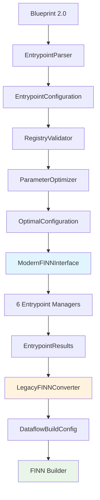

# FINN-BrainSmith Final Implementation Plan
## Optimal 6-Entrypoint Architecture + Legacy FINN Conversion Layer

## Architecture Overview



## Core Design Benefits

1. **Clean Modern Architecture**: Optimal 6-entrypoint system engineered from first principles
2. **Legacy FINN Compatibility**: Translation layer handles current FINN without compromising design
3. **Future-Proof**: When FINN implements 6-entrypoints, we just remove the conversion layer
4. **Isolated Complexity**: All legacy handling contained in conversion layer, not throughout system

## Enhanced Architecture with Conversion Layer

### Phase 1: Core Optimal System (Week 1-3)
*Implement the optimal 6-entrypoint architecture as designed*

### Phase 2: Legacy FINN Conversion Layer (Week 4)
*Add translation layer to interface with current FINN*

```python
# brainsmith/core/finn/legacy_converter.py
class LegacyFINNConverter:
    """
    Converts optimal 6-entrypoint results to legacy FINN DataflowBuildConfig
    
    This is the ONLY place in the codebase that deals with legacy FINN format.
    When FINN implements 6-entrypoints, this entire module gets deleted.
    """
    
    def __init__(self):
        self.entrypoint_to_steps_mapping = self._build_step_mapping()
        
    def convert_to_legacy_build_config(self, 
                                     entrypoint_results: EntrypointResults,
                                     optimal_config: OptimalConfiguration
                                     ) -> DataflowBuildConfig:
        """
        Convert 6-entrypoint results to legacy FINN BUILD_STEPS format
        
        Args:
            entrypoint_results: Results from executing 6 entrypoints
            optimal_config: Optimal configuration used
            
        Returns:
            DataflowBuildConfig compatible with current FINN
        """
        
        # Convert entrypoint results to flat step sequence
        legacy_steps = self._convert_entrypoints_to_steps(entrypoint_results)
        
        # Extract FINN configuration parameters
        finn_config = self._extract_finn_parameters(optimal_config)
        
        # Build legacy configuration
        build_config = DataflowBuildConfig(
            steps=legacy_steps,
            target_fps=finn_config.get('target_fps', 1000),
            synth_clk_period_ns=finn_config.get('clock_period', 5.0),
            board=finn_config.get('board', 'U250'),
            folding_config_file=self._generate_folding_config(optimal_config),
            **finn_config
        )
        
        return build_config
    
    def _convert_entrypoints_to_steps(self, results: EntrypointResults) -> List[str]:
        """Map 6-entrypoint execution to legacy step sequence"""
        
        steps = []
        
        # Entrypoint 1: Canonical Ops → custom steps
        canonical_ops = results.entrypoint_1_results
        for op in canonical_ops.applied_operations:
            steps.extend(self._get_steps_for_canonical_op(op))
        
        # Entrypoint 2: Topology Transforms → streamlining steps
        topology_transforms = results.entrypoint_2_results
        steps.extend([
            'custom_step_cleanup',
            'custom_step_qonnx2finn',
            'custom_streamlining_step'
        ])
        
        # Add model-specific steps if needed
        if topology_transforms.applied_model_specific_transforms:
            steps.extend(['custom_step_remove_head', 'custom_step_remove_tail'])
        
        # Entrypoint 3: HW Kernels → FINN inference and specialization
        hw_kernels = results.entrypoint_3_results
        steps.extend([
            'custom_step_generate_reference_io',
            'custom_step_infer_hardware',
            'step_create_dataflow_partition'
        ])
        
        # Entrypoint 4: HW Specializations → FINN specialization
        steps.append('step_specialize_layers')
        
        # Entrypoint 5: HW Kernel Transforms → optimization steps
        hw_kernel_transforms = results.entrypoint_5_results
        steps.extend([
            'step_target_fps_parallelization',
            'step_apply_folding_config',
            'step_minimize_bit_width'
        ])
        
        # Entrypoint 6: HW Graph Transforms → final FINN steps
        steps.extend([
            'step_generate_estimate_reports',
            'step_hw_codegen',
            'step_hw_ipgen',
            'step_set_fifo_depths',
            'step_create_stitched_ip',
            'custom_step_shell_metadata_handover'
        ])
        
        return steps
    
    def _extract_finn_parameters(self, config: OptimalConfiguration) -> Dict[str, Any]:
        """Extract FINN-specific parameters from optimal configuration"""
        
        finn_params = {}
        
        # Extract from HW specializations
        hw_spec_config = config.entrypoint_configs[EntrypointType.HW_SPECIALIZATIONS]
        finn_params.update({
            'target_fps': hw_spec_config.configuration.get('target_fps', 1000),
            'synth_clk_period_ns': hw_spec_config.configuration.get('clock_period_ns', 5.0),
            'board': hw_spec_config.configuration.get('target_device', 'U250')
        })
        
        # Extract from graph transforms
        graph_config = config.entrypoint_configs[EntrypointType.HW_GRAPH_TRANSFORMS]
        finn_params.update({
            'auto_fifo_depths': graph_config.configuration.get('auto_fifo_sizing', True),
            'split_large_fifos': graph_config.configuration.get('split_large_fifos', False)
        })
        
        return finn_params
    
    def _generate_folding_config(self, config: OptimalConfiguration) -> str:
        """Generate folding configuration file from optimal parameters"""
        
        # Extract folding parameters from HW kernel transforms
        kernel_transform_config = config.entrypoint_configs[EntrypointType.HW_KERNEL_TRANSFORMS]
        folding_params = kernel_transform_config.configuration.get('folding_parameters', {})
        
        # Convert to FINN folding config format
        folding_config = {}
        for layer_name, params in folding_params.items():
            folding_config[layer_name] = {
                'PE': params.get('pe_parallelism', 1),
                'SIMD': params.get('simd_width', 1),
                'mem_mode': params.get('memory_mode', 'internal_decoupled'),
                'resType': params.get('resource_type', 'lut')
            }
        
        # Save to temporary file and return path
        config_path = f"/tmp/folding_config_{hash(str(folding_config))}.json"
        with open(config_path, 'w') as f:
            json.dump(folding_config, f, indent=2)
        
        return config_path

@dataclass 
class EntrypointResults:
    """Results from executing all 6 entrypoints"""
    entrypoint_1_results: CanonicalOpsResults
    entrypoint_2_results: TopologyTransformResults  
    entrypoint_3_results: HWKernelResults
    entrypoint_4_results: HWSpecializationResults
    entrypoint_5_results: HWKernelTransformResults
    entrypoint_6_results: HWGraphTransformResults
    
    execution_metrics: Dict[str, Any]
    intermediate_models: Dict[EntrypointType, Any]
```

### Enhanced Modern FINN Interface with Conversion

```python
# brainsmith/core/finn/modern_interface.py - Enhanced
class ModernFINNInterface:
    """
    Optimal FINN interface with legacy conversion capability
    """
    
    def __init__(self, use_legacy_finn: bool = True):
        self.registry = UnifiedRegistry()
        self.entrypoint_managers = self._initialize_entrypoint_managers()
        self.use_legacy_finn = use_legacy_finn
        
        if use_legacy_finn:
            self.legacy_converter = LegacyFINNConverter()
    
    def build_accelerator(self, 
                         model_path: str, 
                         optimal_config: OptimalConfiguration
                         ) -> FINNResult:
        """
        Execute optimal 6-entrypoint build with legacy FINN compatibility
        """
        
        # Execute 6-entrypoint process
        entrypoint_results = self._execute_all_entrypoints(model_path, optimal_config)
        
        if self.use_legacy_finn:
            # Convert to legacy FINN and build
            legacy_config = self.legacy_converter.convert_to_legacy_build_config(
                entrypoint_results, optimal_config
            )
            
            # Execute legacy FINN build
            finn_result = self._execute_legacy_finn_build(
                entrypoint_results.intermediate_models[EntrypointType.HW_GRAPH_TRANSFORMS],
                legacy_config
            )
        else:
            # Future: Native 6-entrypoint FINN build
            finn_result = self._execute_native_6_entrypoint_build(entrypoint_results)
        
        return FINNResult(
            success=True,
            entrypoint_results=entrypoint_results,
            finn_build_result=finn_result,
            optimal_config=optimal_config,
            conversion_metadata=self._get_conversion_metadata() if self.use_legacy_finn else None
        )
    
    def _execute_legacy_finn_build(self, 
                                  preprocessed_model: Any, 
                                  build_config: DataflowBuildConfig
                                  ) -> Dict[str, Any]:
        """Execute build using current FINN with preprocessed model"""
        
        try:
            from finn.builder.build_dataflow import build_dataflow
            
            # Use the model that's already been processed through our 6 entrypoints
            # FINN just needs to do the final compilation steps
            result = build_dataflow(model=preprocessed_model, cfg=build_config)
            
            return {
                'success': True,
                'build_results': result,
                'note': 'Built using legacy FINN with 6-entrypoint preprocessing'
            }
            
        except Exception as e:
            logger.error(f"Legacy FINN build failed: {e}")
            return {
                'success': False,
                'error': str(e),
                'note': 'Legacy FINN build failed - model preprocessing succeeded'
            }
```

### Enhanced Core API

```python
# brainsmith/core/api.py - Enhanced with conversion layer
def forge_v2(model_path: str, 
            blueprint_2_0_path: str,
            use_legacy_finn: bool = True,
            **kwargs
            ) -> ForgeResult:
    """
    Next-generation BrainSmith forge with legacy FINN compatibility
    
    Args:
        model_path: Path to ONNX model
        blueprint_2_0_path: Path to Blueprint 2.0 YAML  
        use_legacy_finn: Use legacy FINN conversion (True until FINN implements 6-entrypoints)
        
    Returns:
        ForgeResult with optimal accelerator built through legacy FINN
    """
    
    # Execute optimal 6-entrypoint process
    blueprint = load_blueprint_2_0(blueprint_2_0_path)
    design_space = EntrypointDesignSpace(blueprint)
    optimal_configs = design_space.generate_optimal_configurations(**kwargs)
    
    # Build with legacy FINN conversion
    finn_interface = ModernFINNInterface(use_legacy_finn=use_legacy_finn)
    build_results = []
    
    for config in optimal_configs:
        result = finn_interface.build_accelerator(model_path, config)
        build_results.append(result)
    
    best_result = select_best_result(build_results, kwargs.get('objectives', []))
    
    return ForgeResult(
        best_accelerator=best_result,
        pareto_solutions=build_results,
        architecture_used="6_entrypoint_with_legacy_finn_conversion",
        future_migration_note="When FINN implements 6-entrypoints, set use_legacy_finn=False"
    )
```

## Implementation Timeline with Conversion Layer

**Week 1-2**: Core optimal architecture (Blueprint 2.0, registries, entrypoint managers)
**Week 3**: 6-entrypoint execution pipeline  
**Week 4**: Legacy FINN conversion layer
**Week 5**: Integration testing and optimization

## Benefits of This Approach

1. **Best of Both Worlds**: Optimal modern architecture + current FINN compatibility
2. **Clean Separation**: Legacy handling isolated in conversion layer
3. **Future-Proof**: When FINN gets 6-entrypoints, just remove conversion layer
4. **Immediate Value**: Can deploy with current FINN while building toward future
5. **No Compromise**: Core architecture remains optimal, not polluted by legacy concerns

## Migration Path

1. **Phase 1**: Deploy with legacy conversion (immediate deployment)
2. **Phase 2**: When FINN implements 6-entrypoints, remove conversion layer
3. **Phase 3**: Full native 6-entrypoint builds

The conversion layer is a **temporary bridge** that lets us deploy the optimal architecture immediately while waiting for FINN to catch up.