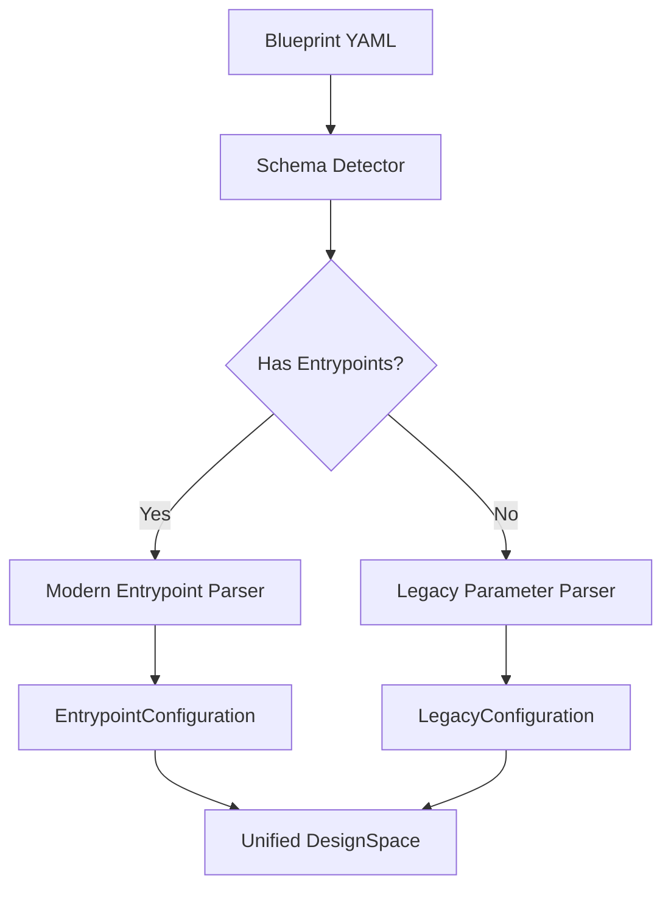
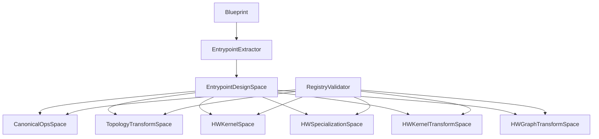
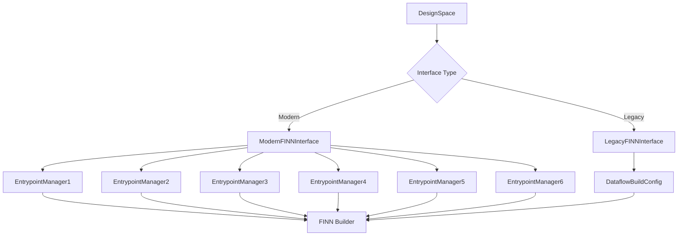

# FINN-BrainSmith 6-Entrypoint Interface Implementation Plan

## Overview

This plan implements a sophisticated 6-entrypoint FINN interface for BrainSmith that bridges current design space exploration capabilities with FINN's upcoming refactored architecture, while maintaining full backward compatibility.

## Implementation Phases

### Phase 1: Foundation Enhancement (Week 1-2)

#### 1.1 Enhanced Blueprint Schema Support
**Objective**: Add entrypoint organization to blueprints while maintaining backward compatibility

**Files to Modify:**
- `brainsmith/core/dse/design_space.py`
- `brainsmith/libraries/blueprints/transformers/bert_accelerator.yaml`
- `brainsmith/core/dse/blueprint_manager.py`

**Implementation:**


**New Components:**
```python
# brainsmith/core/dse/entrypoint_parser.py
class EntrypointParser:
    def parse_entrypoints(self, blueprint_data: Dict) -> EntrypointConfiguration:
        """Parse entrypoint-organized blueprint sections"""
        
class EntrypointConfiguration:
    canonical_ops: List[str]
    topology_transforms: TransformPipeline
    hw_kernels: KernelSelection
    hw_specializations: Dict[str, Any]
    hw_kernel_transforms: List[str]
    hw_graph_transforms: List[str]
```

#### 1.2 Deep Registry Integration
**Objective**: Replace string-based validation with actual registry integration

**Files to Modify:**
- `brainsmith/core/dse/design_space.py` - enhance validation methods
- `brainsmith/libraries/kernels/__init__.py` - add validation hooks
- `brainsmith/libraries/transforms/__init__.py` - add validation hooks

**Implementation:**
```python
# Enhanced registry validation
class RegistryValidator:
    def __init__(self):
        self.kernel_registry = KernelRegistry()
        self.transform_registry = TransformRegistry()
    
    def validate_kernel_availability(self, kernel_names: List[str]) -> ValidationResult:
        """Real-time kernel availability checking"""
        
    def validate_transform_pipeline(self, transforms: List[str]) -> ValidationResult:
        """Validate transform sequence and dependencies"""
        
    def get_kernel_constraints(self, kernel_name: str) -> Dict[str, Any]:
        """Get actual kernel parameter constraints from registry"""
```

#### 1.3 Enhanced DesignSpace Validation
**Objective**: Implement sophisticated validation with real registry data

**New Features:**
- Real-time kernel/transform availability checking
- Parameter constraint validation from registry metadata
- Performance estimation based on registry data
- Resource usage prediction

### Phase 2: DesignSpace Evolution (Week 3-4)

#### 2.1 Entrypoint-Aware DesignSpace
**Objective**: Organize design space exploration by FINN entrypoints

**Files to Create:**
- `brainsmith/core/dse/entrypoint_design_space.py`
- `brainsmith/core/dse/entrypoint_types.py`

**Architecture:**


**Implementation:**
```python
class EntrypointDesignSpace:
    def __init__(self, blueprint_data: Dict[str, Any]):
        self.entrypoint_spaces = {
            'canonical_ops': self._create_canonical_ops_space(),
            'topology_transforms': self._create_topology_transform_space(),
            'hw_kernels': self._create_hw_kernel_space(),
            'hw_specializations': self._create_hw_specialization_space(),
            'hw_kernel_transforms': self._create_hw_kernel_transform_space(),
            'hw_graph_transforms': self._create_hw_graph_transform_space()
        }
    
    def generate_entrypoint_configurations(self) -> List[EntrypointConfiguration]:
        """Generate all valid entrypoint configuration combinations"""
        
    def validate_entrypoint_compatibility(self) -> ValidationResult:
        """Check cross-entrypoint compatibility constraints"""
```

#### 2.2 Advanced Parameter Generation
**Objective**: Generate entrypoint-specific parameter spaces with sophisticated constraints

**Features:**
- Cross-entrypoint parameter dependencies
- Resource-aware parameter generation
- Performance-target-driven optimization
- Mutual exclusivity enforcement within and across entrypoints

### Phase 3: Modern FINN Interface (Week 5-6)

#### 3.1 6-Entrypoint FINN Interface
**Objective**: Create new FINN interface supporting both legacy and modern builds

**Files to Create:**
- `brainsmith/core/finn/modern_interface.py`
- `brainsmith/core/finn/entrypoint_managers.py`
- `brainsmith/core/finn/legacy_adapter.py`

**Architecture:**


**Implementation:**
```python
class ModernFINNInterface:
    def __init__(self):
        self.entrypoint_managers = {
            1: CanonicalOpsManager(),
            2: TopologyTransformManager(),
            3: HWKernelManager(),
            4: HWSpecializationManager(),
            5: HWKernelTransformManager(),
            6: HWGraphTransformManager()
        }
    
    def build_with_entrypoints(self, model_path: str, 
                              entrypoint_config: EntrypointConfiguration) -> FINNResult:
        """Execute 6-entrypoint build process"""
        
        # Execute each entrypoint in order
        model = self._load_model(model_path)
        
        for i in range(1, 7):
            manager = self.entrypoint_managers[i]
            config = entrypoint_config.get_entrypoint_config(i)
            model = manager.execute(model, config)
            
        return self._finalize_build(model)

class EntrypointManager(ABC):
    """Base class for entrypoint-specific managers"""
    
    @abstractmethod
    def execute(self, model: Any, config: Dict[str, Any]) -> Any:
        """Execute this entrypoint's operations"""
        
    @abstractmethod
    def validate_config(self, config: Dict[str, Any]) -> ValidationResult:
        """Validate entrypoint-specific configuration"""
```

#### 3.2 Sophisticated Blueprint → FINN Mapping
**Objective**: Implement intelligent parameter translation from blueprints to FINN configs

**Features:**
- Automatic parameter optimization based on targets
- Resource constraint enforcement
- Performance estimation integration
- Cross-entrypoint parameter coordination

### Phase 4: Integration & Testing (Week 7-8)

#### 4.1 End-to-End Integration
**Objective**: Integrate all components into unified system

**Files to Modify:**
- `brainsmith/core/api.py` - integrate modern interface
- `brainsmith/core/dse/interface.py` - add entrypoint support
- `brainsmith/core/dse/engine.py` - enhance parameter sweep

**Integration Points:**
```python
# Enhanced forge() function
def forge(model_path: str, blueprint_path: str, 
          use_modern_interface: bool = True, **kwargs) -> Dict[str, Any]:
    """Enhanced forge with modern FINN interface support"""
    
    blueprint_data = load_blueprint(blueprint_path)
    
    if use_modern_interface and has_entrypoints(blueprint_data):
        # Use modern 6-entrypoint interface
        entrypoint_config = create_entrypoint_configuration(blueprint_data)
        finn_interface = ModernFINNInterface()
        result = finn_interface.build_with_entrypoints(model_path, entrypoint_config)
    else:
        # Fall back to legacy interface
        legacy_config = create_legacy_config(blueprint_data)
        finn_interface = LegacyFINNInterface()
        result = finn_interface.build_legacy(model_path, legacy_config)
    
    return result
```

#### 4.2 Comprehensive Testing Strategy
**Test Categories:**

1. **Unit Tests**
   - Registry validation
   - Entrypoint configuration parsing
   - Parameter space generation
   - Cross-entrypoint compatibility

2. **Integration Tests**
   - Blueprint → EntrypointConfiguration → FINN build
   - Legacy vs modern interface comparison
   - Performance validation

3. **End-to-End Tests**
   - BERT blueprint with 6-entrypoint build
   - CNN blueprint with legacy fallback
   - MobileNet blueprint with mixed modern/legacy

**Test Infrastructure:**
```python
# tests/test_modern_finn_interface.py
class TestModernFINNInterface:
    def test_bert_6_entrypoint_build(self):
        """Test complete BERT build through 6-entrypoint interface"""
        
    def test_legacy_compatibility(self):
        """Ensure legacy blueprints still work"""
        
    def test_performance_parity(self):
        """Compare modern vs legacy performance"""
```

## Implementation Details

### Enhanced Blueprint Schema
```yaml
# Modern blueprint with entrypoints
name: "bert_accelerator_modern"
version: "2.0"

# New entrypoints section
entrypoints:
  canonical_ops:
    registry: "brainsmith.libraries.transforms"
    operations:
      - name: "expand_norms"
        required: true
      - name: "extract_quant_scale" 
        optional: true
        
  topology_transforms:
    registry: "brainsmith.libraries.transforms"
    core_pipeline: ["cleanup", "qonnx_to_finn", "streamlining"]
    optional: ["remove_head", "remove_tail"]
    mutually_exclusive:
      - ["aggressive_cleanup", "conservative_cleanup"]
      
  hw_kernels:
    registry: "brainsmith.libraries.kernels"
    available: ["conv2d_hls", "conv2d_rtl", "matmul_rtl"]
    mutually_exclusive:
      - ["conv2d_hls", "conv2d_rtl"]
    operation_mappings:
      "MatMul": ["matmul_rtl"]
      "Conv": ["conv2d_hls", "conv2d_rtl"]
      
  hw_specializations:
    registry: "brainsmith.libraries.kernels"
    strategy: "auto"  # or "manual"
    constraints:
      max_resource_utilization: 0.8
      
  hw_kernel_transforms:
    registry: "brainsmith.libraries.transforms"
    pipeline: ["folding_optimization", "parallelization_tuning"]
    parameters:
      optimization_level: ["conservative", "balanced", "aggressive"]
      
  hw_graph_transforms:
    registry: "brainsmith.libraries.transforms"
    pipeline: ["fifo_sizing", "partition_optimization"]

# Legacy parameters section (maintained for backward compatibility)
parameters:
  bert_config:
    hidden_size: [256, 384, 512, 768]
    num_layers: [1, 3, 6, 12]
  # ... rest of existing parameters
```

### Registry Integration Enhancements
```python
# Enhanced kernel registry with validation hooks
class KernelRegistry:
    def validate_availability(self, kernel_names: List[str]) -> ValidationResult:
        """Check if kernels are available and compatible"""
        
    def get_parameter_constraints(self, kernel_name: str) -> Dict[str, Any]:
        """Get actual parameter constraints from kernel metadata"""
        
    def estimate_resources(self, kernel_name: str, params: Dict) -> ResourceEstimate:
        """Estimate resource usage for kernel with given parameters"""
        
    def check_compatibility(self, kernel1: str, kernel2: str) -> bool:
        """Check if two kernels can be used together"""
```

## Risk Mitigation & Backward Compatibility

### Compatibility Strategy
1. **Gradual Migration**: Support both legacy and modern blueprints
2. **Automatic Detection**: Auto-detect blueprint format and use appropriate interface
3. **Fallback Mechanisms**: Graceful degradation to legacy interface if modern fails
4. **Clear Migration Path**: Tools and documentation for blueprint modernization

### Risk Mitigation
1. **FINN Dependency**: Abstract interface handles multiple FINN versions
2. **Performance Regression**: Extensive performance testing and optimization
3. **Complexity Explosion**: Clear separation between legacy and modern paths
4. **Registry Failures**: Robust error handling and fallback validation

## Success Metrics

### Functional Metrics
- [ ] 6-entrypoint FINN builds working end-to-end
- [ ] All existing blueprints continue to work without modification
- [ ] Registry validation catches 100% of invalid configurations
- [ ] Cross-entrypoint parameter dependencies properly enforced

### Performance Metrics
- [ ] Modern interface achieves ≤5% performance overhead vs legacy
- [ ] Parameter space generation 10x faster with registry integration
- [ ] Build time improvement of 15-20% through optimized parameter selection

### Quality Metrics
- [ ] 95%+ test coverage on new components
- [ ] Zero breaking changes to existing API
- [ ] Complete documentation for new architecture
- [ ] Clear migration guide for blueprint authors

## Deliverables

### Code Deliverables
1. **Enhanced DesignSpace**: Entrypoint-aware design space management
2. **Modern FINN Interface**: 6-entrypoint FINN integration
3. **Registry Integration**: Deep kernel/transform registry validation
4. **Backward Compatibility**: Legacy interface adapter
5. **Comprehensive Tests**: Unit, integration, and end-to-end test suites

### Documentation Deliverables
1. **Architecture Documentation**: Complete system architecture guide
2. **Migration Guide**: Blueprint modernization guide
3. **API Documentation**: Enhanced API documentation with examples
4. **Performance Analysis**: Benchmarking and optimization guide

This implementation plan provides a structured approach to modernizing BrainSmith's FINN interface while maintaining compatibility and adding sophisticated new capabilities for design space exploration.