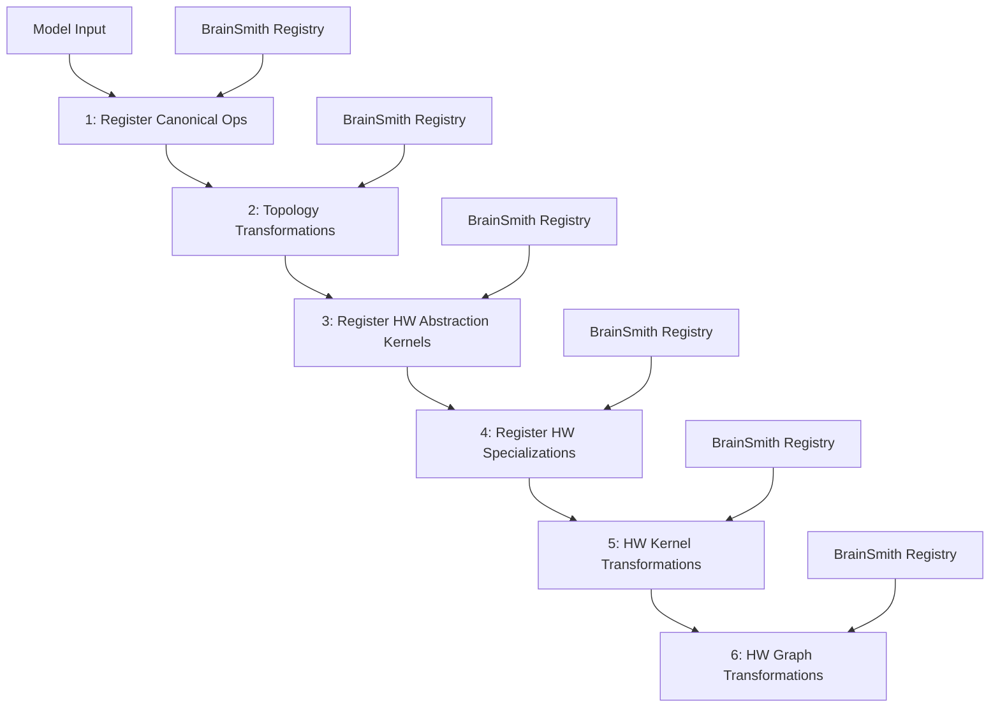
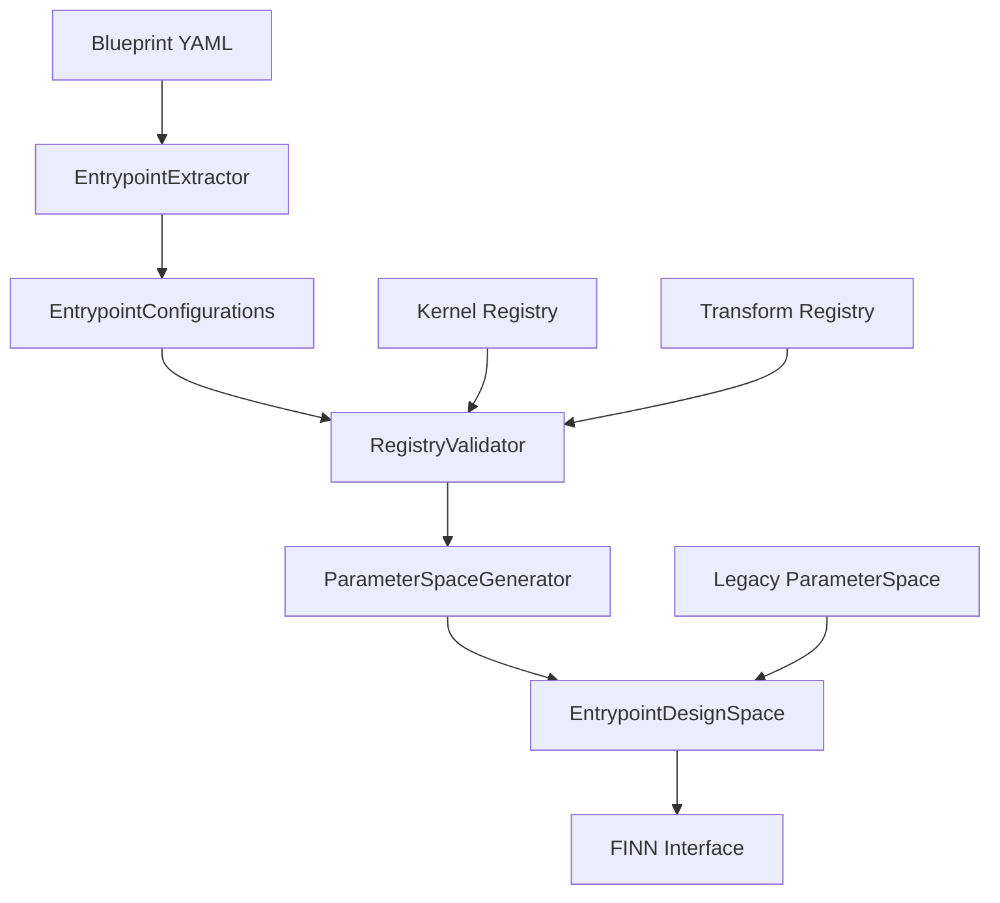

# FINN-BrainSmith Interfacing Mental Model

## Executive Summary

After deep analysis of the FINN interfacing document and current BrainSmith codebase, I've identified a critical architecture gap: **BrainSmith needs to evolve from a simple step-sequence system to a sophisticated 6-entrypoint FINN interface that aligns with the upcoming FINN refactor.**

## Current State Analysis

### BrainSmith's Current FINN Integration
```mermaid
graph TD
    A[Blueprint YAML] --> B[DesignSpace]
    B --> C[Parameter Combinations]
    C --> D[forge() API]
    D --> E[Legacy BUILD_STEPS]
    E --> F[DataflowBuildConfig]
    F --> G[FINN Builder]
    
    style E fill:#ffcccc
    style F fill:#ffcccc
```

**Problems with Current Approach:**
1. **Legacy Step Sequence**: Uses flat BUILD_STEPS list instead of structured entrypoints
2. **No Kernel/Transform Registry Integration**: Blueprints specify kernel/transform names but no validation against actual registries
3. **Monolithic Configuration**: DataflowBuildConfig doesn't map to 6-entrypoint structure
4. **Limited Blueprint-to-FINN Mapping**: Missing sophisticated parameter → FINN config translation

### Target FINN 6-Entrypoint Architecture


## Critical Gaps Identified

### 1. Blueprint → Entrypoint Mapping
**Current:** Blueprints have `kernels` and `transforms` sections but no entrypoint organization
**Required:** Blueprint sections need to map to specific FINN entrypoints

### 2. Registry Integration
**Current:** Kernel/transform names are stored as strings with basic validation
**Required:** Deep integration with actual kernel/transform registries for:
- Availability validation
- Parameter optimization
- Performance estimation
- Resource constraint checking

### 3. DesignSpace Enhancement
**Current:** DesignSpace extracts parameters but doesn't organize by entrypoint
**Required:** DesignSpace needs to:
- Group parameters by FINN entrypoint
- Validate kernel/transform availability against registries
- Generate entrypoint-specific configurations
- Support mutual exclusivity within entrypoints

### 4. FINN Interface Modernization
**Current:** Legacy DataflowBuildConfig with flat step list
**Required:** New interface that:
- Maps to 6 entrypoints
- Supports both legacy and modern FINN
- Provides sophisticated parameter → FINN config translation
- Handles entrypoint-specific optimization

## Architecture Requirements

### Enhanced Blueprint Schema
```yaml
# Enhanced blueprint with entrypoint organization
entrypoints:
  canonical_ops:
    registry: "brainsmith.libraries.transforms"
    operations:
      - "expand_norms"
      - "extract_quant_scale"
  
  topology_transforms:
    registry: "brainsmith.libraries.transforms"
    core_pipeline: ["cleanup", "streamlining"]
    optional: ["remove_head", "remove_tail"]
    mutually_exclusive: [["aggressive_cleanup", "conservative_cleanup"]]
  
  hw_kernels:
    registry: "brainsmith.libraries.kernels"
    available: ["conv2d_hls", "conv2d_rtl", "matmul_rtl"]
    mutually_exclusive: [["conv2d_hls", "conv2d_rtl"]]
    
  hw_specializations:
    registry: "brainsmith.libraries.kernels"
    mapping_strategy: "auto"  # or "manual"
    
  hw_kernel_transforms:
    registry: "brainsmith.libraries.transforms"
    optimization_pipeline: ["folding_optimization", "parallelization"]
    
  hw_graph_transforms:
    registry: "brainsmith.libraries.transforms"
    graph_pipeline: ["fifo_sizing", "partition_optimization"]

# Legacy parameters section remains for backward compatibility
parameters:
  # ... existing nested parameter structure
```

### Enhanced DesignSpace Architecture


### New FINN Interface Layer
```python
class ModernFINNInterface:
    def __init__(self):
        self.entrypoint_managers = {
            'canonical_ops': CanonicalOpsManager(),
            'topology_transforms': TopologyTransformManager(),
            'hw_kernels': HWKernelManager(),
            'hw_specializations': HWSpecializationManager(),
            'hw_kernel_transforms': HWKernelTransformManager(),
            'hw_graph_transforms': HWGraphTransformManager()
        }
    
    def build_with_entrypoints(self, model_path: str, entrypoint_configs: Dict) -> FINNResult:
        # Modern 6-entrypoint build process
        pass
    
    def build_legacy(self, model_path: str, build_config: DataflowBuildConfig) -> FINNResult:
        # Backward compatibility with current system
        pass
```

## Implementation Strategy

### Phase 1: Foundation (Backward Compatible)
1. **Enhanced Blueprint Schema**: Add optional `entrypoints` section while maintaining `parameters`
2. **Registry Integration**: Deep integration with kernel/transform registries
3. **Validation Enhancement**: Real registry validation instead of string checks

### Phase 2: DesignSpace Evolution
1. **Entrypoint-Aware DesignSpace**: Extract and organize by entrypoint
2. **Advanced Parameter Generation**: Entrypoint-specific parameter spaces
3. **Choice Enumeration Enhancement**: Entrypoint-aware mutual exclusivity

### Phase 3: Modern FINN Interface
1. **6-Entrypoint Interface**: New FINN interface supporting both legacy and modern
2. **Sophisticated Mapping**: Blueprint → Entrypoint → FINN config translation
3. **Performance Optimization**: Entrypoint-specific optimization strategies

### Phase 4: Integration & Testing
1. **End-to-End Testing**: BERT blueprint → 6-entrypoint → FINN build
2. **Performance Validation**: Compare legacy vs modern performance
3. **Documentation Update**: Complete architecture documentation

## Risk Mitigation

### Backward Compatibility
- Maintain existing blueprint format support
- Legacy FINN interface fallback
- Gradual migration path for existing blueprints

### FINN Dependency
- Abstract FINN interface to handle both old and new FINN versions
- Mock implementations for testing without FINN
- Clear error messages for missing FINN capabilities

### Complexity Management
- Incremental implementation phases
- Clear separation between legacy and modern paths
- Comprehensive testing at each phase

## Success Metrics

1. **Functionality**: 6-entrypoint FINN builds working end-to-end
2. **Performance**: Modern interface achieves same or better performance than legacy
3. **Compatibility**: All existing blueprints continue to work
4. **Extensibility**: Easy to add new entrypoints and registry integrations
5. **Validation**: Real-time registry validation prevents invalid configurations

This mental model forms the foundation for implementing a sophisticated FINN interface that bridges BrainSmith's design space exploration capabilities with FINN's upcoming 6-entrypoint architecture.