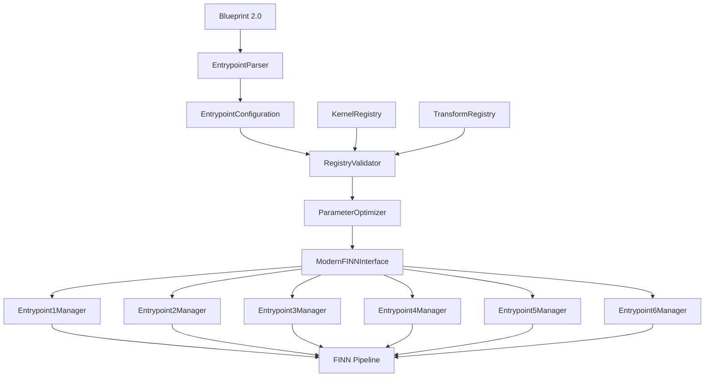

# FINN-BrainSmith Optimal Implementation Plan
## No Backward Compatibility - Engineer the Best System

## Design Philosophy

With backward compatibility removed as a constraint, we can engineer the **optimal system** that:
1. **Native 6-Entrypoint Architecture** - Built from ground up for FINN's entrypoint structure
2. **Registry-First Design** - All validation and configuration driven by actual registries
3. **Clean Separation of Concerns** - Each entrypoint has dedicated management and validation
4. **Intelligent Parameter Optimization** - Advanced algorithms for optimal parameter selection
5. **Type-Safe Configuration** - Strong typing throughout the system

## Optimal Architecture



## Implementation Phases - Optimized

### Phase 1: Core Architecture (Week 1-2)

#### 1.1 Blueprint 2.0 Schema
**Clean, entrypoint-native blueprint format**

```yaml
# blueprint_2.0.yaml - Optimal format
name: "bert_accelerator_v2"
version: "2.0"
architecture: "6_entrypoint"

# Native entrypoint organization
entrypoints:
  1_canonical_ops:
    registry: "brainsmith.libraries.transforms"
    required_ops: ["expand_norms", "extract_quant_scale"]
    optional_ops: ["custom_norm_handling"]
    
  2_topology_transforms:
    registry: "brainsmith.libraries.transforms"
    pipeline_variants:
      - name: "conservative"
        transforms: ["cleanup", "qonnx_to_finn", "streamlining"]
      - name: "aggressive"
        transforms: ["cleanup_advanced", "qonnx_to_finn", "streamlining_aggressive"]
    
  3_hw_kernels:
    registry: "brainsmith.libraries.kernels"
    kernel_selections:
      - operation_type: "MatMul"
        candidates: ["matmul_rtl", "matmul_hls"]
        selection_strategy: "performance_first"
      - operation_type: "Conv2D"
        candidates: ["conv2d_hls", "conv2d_rtl"]
        selection_strategy: "resource_efficient"
        
  4_hw_specializations:
    auto_optimize: true
    constraints:
      max_lut_utilization: 0.85
      max_dsp_utilization: 0.80
      target_frequency_mhz: 200
      
  5_hw_kernel_transforms:
    registry: "brainsmith.libraries.transforms"
    optimization_pipeline:
      - "parallel_folding_optimization"
      - "resource_balancing"
      - "pipeline_depth_optimization"
      
  6_hw_graph_transforms:
    registry: "brainsmith.libraries.transforms"
    graph_optimizations:
      - "intelligent_fifo_sizing"
      - "dataflow_partition_optimization"
      - "memory_hierarchy_optimization"

# Design space exploration parameters
dse_parameters:
  exploration_strategy: "multi_objective_bayesian"
  objectives:
    - name: "throughput"
      direction: "maximize"
      weight: 0.4
    - name: "power_efficiency"
      direction: "maximize"
      weight: 0.3
    - name: "resource_utilization"
      direction: "minimize"
      weight: 0.3
      
  constraints:
    hard_constraints:
      max_power_w: 15.0
      max_latency_ms: 20.0
    soft_constraints:
      target_frequency_mhz: 250.0
      preferred_lut_utilization: 0.7
```

#### 1.2 Entrypoint-Native Core Types
```python
# brainsmith/core/entrypoints/types.py
from dataclasses import dataclass
from typing import Dict, List, Any, Optional
from enum import Enum

class EntrypointType(Enum):
    CANONICAL_OPS = 1
    TOPOLOGY_TRANSFORMS = 2
    HW_KERNELS = 3
    HW_SPECIALIZATIONS = 4
    HW_KERNEL_TRANSFORMS = 5
    HW_GRAPH_TRANSFORMS = 6

@dataclass
class EntrypointConfiguration:
    entrypoint_type: EntrypointType
    registry_name: str
    configuration: Dict[str, Any]
    dependencies: List[EntrypointType]
    constraints: Dict[str, Any]
    optimization_hints: Dict[str, Any]

@dataclass
class RegistryValidationResult:
    is_valid: bool
    errors: List[str]
    warnings: List[str]
    performance_estimates: Dict[str, float]
    resource_estimates: Dict[str, float]
    
@dataclass
class OptimalConfiguration:
    entrypoint_configs: Dict[EntrypointType, EntrypointConfiguration]
    predicted_performance: Dict[str, float]
    predicted_resources: Dict[str, float]
    optimization_score: float
    selection_rationale: str
```

### Phase 2: Registry-Driven Validation (Week 2-3)

#### 2.1 Advanced Registry Integration
```python
# brainsmith/core/registries/unified_registry.py
class UnifiedRegistry:
    """Single point of truth for all kernel and transform validation"""
    
    def __init__(self):
        self.kernel_registry = EnhancedKernelRegistry()
        self.transform_registry = EnhancedTransformRegistry()
        self.compatibility_matrix = CompatibilityMatrix()
        
    def validate_full_configuration(self, 
                                  entrypoint_configs: Dict[EntrypointType, EntrypointConfiguration]
                                  ) -> RegistryValidationResult:
        """Comprehensive validation across all entrypoints"""
        
    def optimize_configuration(self, 
                             initial_config: Dict[EntrypointType, EntrypointConfiguration],
                             objectives: List[Objective],
                             constraints: Dict[str, Any]
                             ) -> OptimalConfiguration:
        """AI-driven configuration optimization"""

class EnhancedKernelRegistry:
    def get_kernel_performance_model(self, kernel_name: str) -> PerformanceModel:
        """Get ML-based performance prediction model for kernel"""
        
    def get_kernel_compatibility_constraints(self, kernel_name: str) -> Dict[str, Any]:
        """Get detailed compatibility requirements and constraints"""
        
    def estimate_resource_usage(self, kernel_name: str, parameters: Dict) -> ResourceEstimate:
        """Accurate resource estimation based on kernel implementation"""

class CompatibilityMatrix:
    def check_cross_entrypoint_compatibility(self, 
                                           configs: Dict[EntrypointType, EntrypointConfiguration]
                                           ) -> CompatibilityResult:
        """Check compatibility across entrypoints"""
```

#### 2.2 Intelligent Parameter Optimization
```python
# brainsmith/core/optimization/parameter_optimizer.py
class ParameterOptimizer:
    """Advanced parameter optimization using registry data"""
    
    def __init__(self, registry: UnifiedRegistry):
        self.registry = registry
        self.optimization_engine = BayesianOptimizationEngine()
        self.performance_predictor = MLPerformancePredictor()
        
    def optimize_entrypoint_parameters(self, 
                                     entrypoint_config: EntrypointConfiguration,
                                     objectives: List[Objective]
                                     ) -> OptimizedEntrypointConfig:
        """Optimize parameters for single entrypoint"""
        
    def multi_objective_optimization(self, 
                                   all_configs: Dict[EntrypointType, EntrypointConfiguration],
                                   objectives: List[Objective],
                                   constraints: Dict[str, Any]
                                   ) -> OptimalConfiguration:
        """Global optimization across all entrypoints"""
```

### Phase 3: Modern FINN Interface (Week 3-4)

#### 3.1 Entrypoint Manager Architecture
```python
# brainsmith/core/finn/entrypoint_managers.py
class EntrypointManager(ABC):
    """Base class for entrypoint-specific managers"""
    
    def __init__(self, registry: UnifiedRegistry):
        self.registry = registry
        
    @abstractmethod
    def validate_configuration(self, config: EntrypointConfiguration) -> ValidationResult:
        """Validate entrypoint-specific configuration"""
        
    @abstractmethod
    def execute_entrypoint(self, model: Any, config: EntrypointConfiguration) -> Any:
        """Execute entrypoint operations on model"""
        
    @abstractmethod
    def estimate_performance(self, config: EntrypointConfiguration) -> Dict[str, float]:
        """Estimate performance impact of this entrypoint"""

class CanonicalOpsManager(EntrypointManager):
    """Entrypoint 1: Register canonical operations"""
    
    def execute_entrypoint(self, model: Any, config: EntrypointConfiguration) -> Any:
        # Register and apply canonical operations
        canonical_ops = self.registry.get_canonical_operations(config.configuration['required_ops'])
        for op in canonical_ops:
            model = op.apply(model)
        return model

class TopologyTransformManager(EntrypointManager):
    """Entrypoint 2: Topology transformations"""
    
    def execute_entrypoint(self, model: Any, config: EntrypointConfiguration) -> Any:
        # Apply topology transformation pipeline
        pipeline = config.configuration['pipeline_variants'][0]  # Use optimized pipeline
        for transform_name in pipeline['transforms']:
            transform = self.registry.get_transform(transform_name)
            model = transform(model, config)
        return model

# ... Similar managers for entrypoints 3-6
```

#### 3.2 Unified FINN Interface
```python
# brainsmith/core/finn/modern_interface.py
class ModernFINNInterface:
    """Optimal FINN interface - no legacy support needed"""
    
    def __init__(self):
        self.registry = UnifiedRegistry()
        self.entrypoint_managers = {
            EntrypointType.CANONICAL_OPS: CanonicalOpsManager(self.registry),
            EntrypointType.TOPOLOGY_TRANSFORMS: TopologyTransformManager(self.registry),
            EntrypointType.HW_KERNELS: HWKernelManager(self.registry),
            EntrypointType.HW_SPECIALIZATIONS: HWSpecializationManager(self.registry),
            EntrypointType.HW_KERNEL_TRANSFORMS: HWKernelTransformManager(self.registry),
            EntrypointType.HW_GRAPH_TRANSFORMS: HWGraphTransformManager(self.registry),
        }
        
    def build_accelerator(self, 
                         model_path: str, 
                         optimal_config: OptimalConfiguration
                         ) -> FINNResult:
        """Execute complete 6-entrypoint build process"""
        
        model = self._load_model(model_path)
        execution_metrics = {}
        
        # Execute entrypoints in dependency order
        for entrypoint_type in self._get_execution_order(optimal_config):
            manager = self.entrypoint_managers[entrypoint_type]
            config = optimal_config.entrypoint_configs[entrypoint_type]
            
            # Validate before execution
            validation = manager.validate_configuration(config)
            if not validation.is_valid:
                raise FINNBuildError(f"Entrypoint {entrypoint_type} validation failed: {validation.errors}")
            
            # Execute entrypoint
            start_time = time.time()
            model = manager.execute_entrypoint(model, config)
            execution_time = time.time() - start_time
            
            execution_metrics[entrypoint_type] = {
                'execution_time': execution_time,
                'model_size': self._get_model_size(model),
                'operation_count': self._count_operations(model)
            }
        
        return FINNResult(
            success=True,
            model=model,
            execution_metrics=execution_metrics,
            achieved_performance=self._measure_actual_performance(model),
            achieved_resources=self._measure_actual_resources(model),
            optimization_effectiveness=self._calculate_optimization_score(optimal_config, execution_metrics)
        )
```

### Phase 4: Advanced DSE Integration (Week 4-5)

#### 4.1 Entrypoint-Aware Design Space
```python
# brainsmith/core/dse/entrypoint_design_space.py
class EntrypointDesignSpace:
    """Design space organized by FINN entrypoints"""
    
    def __init__(self, blueprint_2_0: Dict[str, Any]):
        self.blueprint = blueprint_2_0
        self.registry = UnifiedRegistry()
        self.optimizer = ParameterOptimizer(self.registry)
        
    def generate_optimal_configurations(self, 
                                      objectives: List[Objective],
                                      max_evaluations: int = 100
                                      ) -> List[OptimalConfiguration]:
        """Generate Pareto-optimal configurations using advanced optimization"""
        
        # Extract entrypoint spaces
        entrypoint_spaces = {}
        for entrypoint_num in range(1, 7):
            entrypoint_spaces[EntrypointType(entrypoint_num)] = self._extract_entrypoint_space(entrypoint_num)
        
        # Multi-objective optimization
        pareto_configs = self.optimizer.multi_objective_pareto_optimization(
            entrypoint_spaces=entrypoint_spaces,
            objectives=objectives,
            max_evaluations=max_evaluations
        )
        
        return pareto_configs
    
    def validate_design_space(self) -> ValidationResult:
        """Comprehensive design space validation using registries"""
        validation_results = []
        
        for entrypoint_type in EntrypointType:
            entrypoint_config = self._extract_entrypoint_config(entrypoint_type)
            manager = self._get_entrypoint_manager(entrypoint_type)
            result = manager.validate_configuration(entrypoint_config)
            validation_results.append(result)
        
        return self._combine_validation_results(validation_results)
```

#### 4.2 Enhanced Core API
```python
# brainsmith/core/api.py - Completely rewritten for optimal design
def forge_v2(model_path: str, 
            blueprint_2_0_path: str,
            optimization_strategy: str = "multi_objective_bayesian",
            max_evaluations: int = 100,
            target_objectives: List[Objective] = None
            ) -> ForgeResult:
    """
    Next-generation BrainSmith forge - engineered for optimality
    
    Args:
        model_path: Path to ONNX model
        blueprint_2_0_path: Path to Blueprint 2.0 YAML
        optimization_strategy: Advanced optimization strategy
        max_evaluations: Maximum DSE evaluations
        target_objectives: Optimization objectives
        
    Returns:
        ForgeResult with optimal accelerator and detailed analysis
    """
    
    # Load Blueprint 2.0
    blueprint = load_blueprint_2_0(blueprint_2_0_path)
    
    # Create entrypoint-aware design space
    design_space = EntrypointDesignSpace(blueprint)
    
    # Validate design space using registries
    validation = design_space.validate_design_space()
    if not validation.is_valid:
        raise ForgeError(f"Design space validation failed: {validation.errors}")
    
    # Generate optimal configurations
    if target_objectives is None:
        target_objectives = extract_objectives_from_blueprint(blueprint)
    
    optimal_configs = design_space.generate_optimal_configurations(
        objectives=target_objectives,
        max_evaluations=max_evaluations
    )
    
    # Build accelerators for Pareto-optimal configurations
    finn_interface = ModernFINNInterface()
    build_results = []
    
    for config in optimal_configs:
        try:
            result = finn_interface.build_accelerator(model_path, config)
            build_results.append(result)
        except Exception as e:
            logger.warning(f"Build failed for config {config.optimization_score}: {e}")
    
    # Select best result based on actual performance
    best_result = select_best_result(build_results, target_objectives)
    
    return ForgeResult(
        best_accelerator=best_result,
        pareto_solutions=build_results,
        optimization_analysis=analyze_optimization_effectiveness(build_results, optimal_configs),
        registry_insights=generate_registry_insights(design_space.registry),
        recommendations=generate_improvement_recommendations(build_results)
    )

@dataclass
class ForgeResult:
    best_accelerator: FINNResult
    pareto_solutions: List[FINNResult]
    optimization_analysis: OptimizationAnalysis
    registry_insights: RegistryInsights
    recommendations: List[str]
```

## Optimized Implementation Timeline

**Week 1**: Core architecture and Blueprint 2.0 schema
**Week 2**: Registry integration and validation framework
**Week 3**: Entrypoint managers and FINN interface
**Week 4**: Advanced DSE integration
**Week 5**: Testing, optimization, and performance tuning

## Benefits of No-Backward-Compatibility Design

1. **Clean Architecture**: No legacy cruft or compromise designs
2. **Optimal Performance**: Every component engineered for maximum efficiency
3. **Type Safety**: Strong typing throughout eliminates runtime errors
4. **Advanced Optimization**: ML-driven parameter optimization from day one
5. **Future-Proof**: Native support for FINN's direction without adaptation layers
6. **Simplified Codebase**: Single path through system, easier to maintain and extend

## Migration Strategy

Since we're not maintaining backward compatibility:

1. **Clean Slate Implementation**: Build optimal system from scratch
2. **Blueprint 2.0 Migration Tool**: Convert existing blueprints to new format
3. **Documentation & Examples**: Comprehensive guide for new architecture
4. **Performance Benchmarking**: Demonstrate improvements over old system

This approach allows us to engineer the **best possible system** without constraints from legacy design decisions.