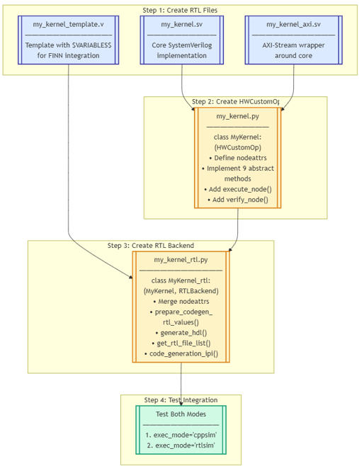

# Brainsmith Hardware Kernels

## Definition

Hardware Kernels are synthesizable hardware modules that implement neural network operators. They serve as the foundational components from which Brainsmith constructs accelerators.

### Interfaces

To ensure complete modularity, kernel interfaces are limited to the following:

- *Control* - Clock and reset (optional second clock for double-pumped designs)
- *Input/Output* - AXI-Stream for activations and weights. A minium of one input and one output.
- *Config* - (Optional) Maximum of a single AXI-Lite interface for runtime configuration/debugging

See [protocol_validator.py](brainsmith/tools/kernel_integrator/rtl_parser/protocol_validator.py) for complete interface signal definitions, and the name suffix rules for RTL interfaces.

## Why Kernels?

Brainsmith chooses **kernels** as its fundamental abstraction for several reasons:
1. **Preserve Design Space** - AI models are designed and expressed in terms of Layers/nodes, and preserving this design granularity allows for natural extension from AI frameworks like PyTorch/ONNX.
2. **Prevent Exponential Explosion** - Although there is theoretical value in fully decomposing models to individual operations, this exponetially explodes the design space.
3. **Hand Optimization** - Allows hardware engineers to design kernels hand-optimized on the kernel scale without requireing deep knowledge of the AI model. This allows for hand-optimized performance that fully generated designs lack, while maintaining flexibility by composing the final hardware graph through Brainsmith.

## Implementation & Examples

Each kernel requires five components for full functionality:

### 1. RTL/HLS Source Code

RTL/HLS hardware implementations of neural network operations with top-level interfaces matching the required specification. RTL (SystemVerilog) implementations generally provide maximum control while Vitis HLS enables faster development.

- RTL example: FINN's [`thresholding.sv`](https://github.com/Xilinx/finn/blob/main/finn-rtllib/thresholding/hdl/thresholding.sv) + [`thresholding_axi.sv`](https://github.com/Xilinx/finn/blob/main/finn-rtllib/thresholding/hdl/thresholding_axi.sv)
- HLS example: [`brainsmith/kernels/layernorm/layernorm.hpp`](brainsmith/kernels/layernorm/layernorm.hpp)

### 2. Codegen Template 

RTL/HLS wrapper template for runtime code generation, bridging high-level Kernel Operators with the actual implementation. For RTL templates this usually takes the form of a standard verilog (*not* SystemVerilog) with key variables replaced with string substitution. For HLS kernels there is a generalized structured kernel template, with different template functions to fill in the Backend Operator. These templates enable FINN to programmatically configure and instantiate hardware blocks with the exact parameters needed for each layer in a neural network.

- RTL example: FINN's [`thresholding_template_wrapper.v`](https://github.com/Xilinx/finn/blob/main/finn-rtllib/thresholding/hdl/thresholding_template_wrapper.v)
- HLS example: FINN's generic [`templates.py`](https://github.com/Xilinx/finn/blob/main/src/finn/custom_op/fpgadataflow/templates.py) + [`brainsmith/kernels/layernorm/layernorm_hls.py`](../brainsmith/kernels/layernorm/layernorm_hls.py)

***PRE-RELEASE NOTE***: Templating is undergoing review to standardize & simplify between RTL & HLS Kernels.

### 3. Kernel Operator (HWCustomOp)

An ONNX node defining the interface and infrastructure of the kernel, implementing the abstract HWCustomOp. The Kernel Operator defines the contract for streaming dataflow operations with AXI Stream interfaces, managing execution modes (rtlsim/cppsim) and hardware attributes like FIFO depths and partitioning.

- Parent class: [`HWCustomOp`](https://github.com/Xilinx/finn/blob/main/src/finn/custom_op/fpgadataflow/hwcustomop.py)
- RTL example: FINN's [`thresholding.py`](https://github.com/Xilinx/finn/blob/main/src/finn/custom_op/fpgadataflow/thresholding.py)
- HLS example: [`brainsmith/kernels/layernorm/layernorm.py`](../brainsmith/kernels/layernorm/layernorm.py)

***PRE-RELEASE NOTE***: HWCustomOp is in the process of automation and consolidation to simplify new Kernel implementation.

### 4. Kernel Inference Transform

Detection and conversion logic to identify compatible ONNX operations in a graph and replace them with the target kernel's HWCustomOp. Each transform performs three essential tasks: 
1. **Pattern matching** - Find all instances of the ONNX op/subgraph your kernel can implement
2. **Validation** - Ensure operations meet hardware requirements (like integer datatypes and compatible shapes)
3. **Conversion** - Instantiate configured HWCustomOp instances with extracted parameters

Some kernels may require additional pre-processing transforms to prepare the graph for conversion. For example, [`ExpandNorms`](../brainsmith/transforms/cleanup/expand_norms.py) breaks the standard ONNX operator `LayerNormalization` into `FuncLayerNorm`, `Add`, and `Mul` ops so that each component can be lowered to a seperate kernel.

- Example: [`brainsmith/kernels/layernorm/infer_layernorm.py`](../brainsmith/kernels/layernorm/infer_layernorm.py)

### 5. Backend Operator (RTLBackend/HLSBackend)

HLSBackend generates C++ code with pragmas that gets synthesized to RTL via Xilinx Vitis HLS, supporting both C++ and RTL simulation modes. RTLBackend works directly with pre-written Verilog modules from finn-rtllib, offering more hardware control but only RTL simulation. Both backends inherit from HWCustomOp and ultimately produce Verilog IP blocks, with HLS trading some control for easier development and RTL providing maximum optimization potential.

- Parent class (RTL): [`RTLBackend`](https://github.com/Xilinx/finn/blob/main/src/finn/custom_op/fpgadataflow/rtlbackend.py)
- Parent class (HLS): [`HLSBackend`](https://github.com/Xilinx/finn/blob/main/src/finn/custom_op/fpgadataflow/hlsbackend.py)
- RTL example: FINN's [`thresholding_rtl.py`](https://github.com/Xilinx/finn/blob/main/src/finn/custom_op/fpgadataflow/rtl/thresholding_rtl.py)
- HLS example: [`brainsmith/kernels/layernorm/layernorm_hls.py`](../brainsmith/kernels/layernorm/layernorm_hls.py)

***PRE-RELEASE NOTE***: Backend Operators are undergoing review to standardize & simplify between RTL & HLS Kernels.
