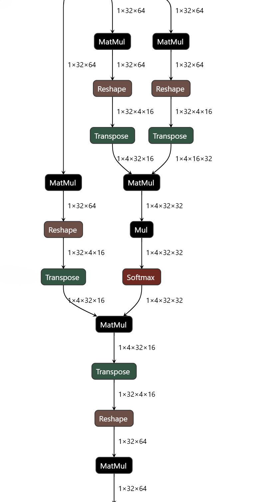
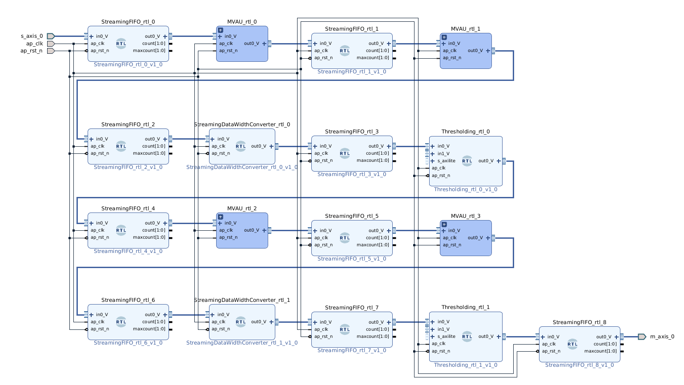

---
hide:
  - toc
---

# Brainsmith

## Compile Neural Networks to FPGA Accelerators

Brainsmith is an end-to-end compiler to transform ONNX models into dataflow accelerators for FPGAs. Through design space exploration, it evaluates hardware configurations to find the optimal configuration for your use case.

<div class="comparison-grid" markdown>

<div class="comparison-item" markdown>

<div class="comparison-title">ONNX Model</div>



</div>

<div class="comparison-arrow">
→
</div>

<div class="comparison-item" markdown>

<div class="comparison-title">Dataflow Core</div>



</div>

</div>

**Automated RTL generation from ONNX models. Design space exploration to identify optimal configurations.**

[Get Started](getting-started.md){ .md-button .md-button--primary }
[View on GitHub](https://github.com/microsoft/brainsmith){ .md-button }

---

## Key Features

<div class="grid cards" markdown>

-   :material-chart-timeline-variant:{ .lg .middle } **Automatic Design Space Exploration**

    ---

    Navigate parallelization factors, resource allocation, and architectural choices. Explore multiple configurations to identify promising designs.

-   :material-code-braces:{ .lg .middle } **Schema-Driven Kernel Development**

    ---

    Define hardware semantics declaratively. Validation, design space construction, and interface generation are derived from schema definitions.

-   :material-chip:{ .lg .middle } **Synthesizable RTL Generation**

    ---

    Generate Verilog/VHDL with standard AXI-Stream interfaces. Compatible with Vivado IP Integrator workflows.

-   :material-puzzle:{ .lg .middle } **Growing Kernel Library**

    ---

    Built-in support for MVAU, LayerNorm, Softmax, and other common operations. Extensible architecture for adding custom kernels.

-   :material-speedometer:{ .lg .middle } **Performance Estimation**

    ---

    Resource estimation, cycle-accurate simulation support, and throughput analysis. Evaluate design tradeoffs before synthesis.

-   :material-layers:{ .lg .middle } **Blueprint Inheritance**

    ---

    Reuse and customize configurations through YAML inheritance. Design space exploration with branch points and step operations.

</div>

---

## Basic Usage

Generate an accelerator with a single command:

```bash
# Design space exploration and RTL generation
smith model.onnx blueprint.yaml

# Output: RTL + performance estimates + resource reports
```

Or use the Python API for programmatic control:

```python
from brainsmith import explore_design_space

# Explore design space
results = explore_design_space(
    model_path="bert_model.onnx",
    blueprint_path="config.yaml"
)

# Analyze results
stats = results.compute_stats()
print(f"Explored {stats['total']} configurations")
print(f"Successful: {stats['successful']}")
```

---

## Get Started

<div class="grid cards" markdown>

-   :material-rocket-launch:{ .lg .middle } **Quickstart Guide**

    ---

    Install Brainsmith and run your first accelerator build in 30 minutes with the BERT example.

    [:octicons-arrow-right-24: Getting Started](getting-started.md)

-   :material-hammer-wrench:{ .lg .middle } **Kernel Development**

    ---

    Learn the schema-driven architecture and build custom hardware operators for your models.

    [:octicons-arrow-right-24: Hardware Kernels](developer-guide/hardware-kernels.md)

-   :material-file-document-outline:{ .lg .middle } **Blueprint Configuration**

    ---

    Master the YAML configuration format for design space definition and pipeline customization.

    [:octicons-arrow-right-24: Blueprint Schema](developer-guide/blueprint-schema.md)

-   :material-book-open-variant:{ .lg .middle } **API Reference**

    ---

    Explore complete API documentation for DSE, dataflow modeling, and component registry.

    [:octicons-arrow-right-24: API Documentation](api/index.md)

</div>

---

## Built For

<div class="grid" markdown style="display: grid; grid-template-columns: repeat(auto-fit, minmax(280px, 1fr)); gap: 1.5rem; margin: 1rem 0;">

<div markdown>

**AI Researchers**

Explore FPGA deployment for edge devices with strict latency requirements. Evaluate FPGA acceleration as an alternative to CPU/GPU inference.

</div>

<div markdown>

**Hardware Engineers**

Build neural network accelerators using schema-driven kernel definitions. Design space exploration handles configuration space navigation.

</div>

<div markdown>

**MLOps Teams**

Explore FPGA deployment as an alternative to GPU inference. Design space exploration automates configuration search.

</div>

</div>

---

## Example Results

The BERT example demonstrates the design space exploration workflow:

- Design space exploration identifies resource/performance tradeoffs
- Example targets V80 platform using Vivado 2024.2
- Compatible with Xilinx Zynq/Ultrascale+ platforms

*Results from examples/bert - your mileage may vary based on model and target platform*

---

## Example: BERT Accelerator

```yaml
# blueprint.yaml - Define your design space
name: "BERT Accelerator"
clock_ns: 5.0  # 200MHz target

design_space:
  kernels:
    - MVAU           # Matrix-vector operations
    - LayerNorm      # Layer normalization
    - Softmax        # Attention softmax

  steps:
    - "streamline"           # Graph optimization
    - "infer_kernels"        # Hardware kernel mapping
    - "specialize_layers"    # Backend selection
    - "dataflow_partition"   # Multi-layer offload
```

Run design space exploration:

```bash
smith bert.onnx blueprint.yaml --output-dir ./results
```

Results include:
- Synthesizable RTL in `results/stitched_ip/`
- Performance estimates in `results/report/estimate_reports.json`
- Detailed build logs for debugging

---

## Open Source & Collaborative

Brainsmith is MIT-licensed and builds upon a foundation of proven open-source tools:

- [FINN](https://github.com/Xilinx/finn) - Dataflow compiler for quantized neural networks
- [QONNX](https://github.com/fastmachinelearning/qonnx) - Quantized ONNX representation
- [Brevitas](https://github.com/Xilinx/brevitas) - PyTorch quantization library

Brainsmith extends FINN with automated design space exploration, blueprint inheritance, and a schema-driven kernel system. FINN provides the low-level RTL generation and QONNX transformations.

Developed through collaboration between **Microsoft** and **AMD**.

**License**: MIT - see [LICENSE](https://github.com/microsoft/brainsmith/blob/main/LICENSE)

---

## Community & Support

- [GitHub Issues](https://github.com/microsoft/brainsmith/issues) - Report bugs or request features
- [GitHub Discussions](https://github.com/microsoft/brainsmith/discussions) - Ask questions and share experiences
- [Contributing Guide](https://github.com/microsoft/brainsmith/blob/main/CONTRIBUTING.md) - Learn how to contribute

**New to Brainsmith?** [Get started with the quickstart guide →](getting-started.md)
