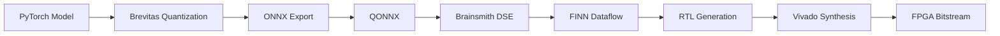

# Brainsmith

**From PyTorch to RTL - FPGA Accelerator Compiler for AI**

Brainsmith automates design space exploration (DSE) and implementation of neural networks on FPGA, from PyTorch to RTL. It builds on FINN, QONNX, and Brevitas to create dataflow accelerators with tunable parameters.

---

## Pre-Release

!!! warning "Pre-Release Status"
    This repository is in a pre-release state and under active co-development by Microsoft and AMD.

## Key Features

- **Plugin System** - Extensible architecture for registering custom kernels, transforms, and build steps
- **Blueprint Interface** - YAML-based declarative configuration with inheritance support
- **Segment-based Execution** - Efficient DSE through intelligent computation reuse
- **BERT Demo** - Example end-to-end acceleration (PyTorch to stitched-IP RTL)

## Quick Links

<div class="grid cards" markdown>

- :material-clock-fast: **[Quick Start](getting-started/quickstart.md)**

    Get up and running in minutes

- :material-cog: **[Installation](getting-started/installation.md)**

    Set up your development environment

- :material-book-open-variant: **[Architecture](architecture/overview.md)**

    Understand how Brainsmith works

- :material-code-braces: **[API Reference](api-reference/core.md)**

    Explore the codebase

</div>

## Architecture Overview



## Example: Design Space Exploration

```bash
# Run DSE with ONNX model and blueprint
smith model.onnx blueprint.yaml --output-dir ./results
```

## Built With

Brainsmith builds upon:

- [FINN](https://github.com/Xilinx/finn) - Dataflow compiler for quantized neural networks
- [QONNX](https://github.com/fastmachinelearning/qonnx) - Quantized ONNX representation
- [Brevitas](https://github.com/Xilinx/brevitas) - PyTorch quantization library

## License

This project is licensed under the MIT License - see the [LICENSE](https://github.com/microsoft/brainsmith/blob/main/LICENSE) file for details.

## Acknowledgments

Brainsmith is developed through a collaboration between Microsoft and AMD.
