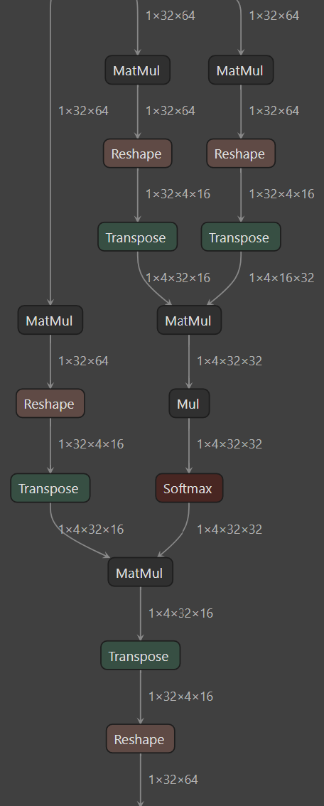

# Brainsmith

## Open-source AI acceleration on FPGA: from ONNX to RTL

Brainsmith compiles ONNX models to optimized FPGA accelerators, intelligently exploring hardware configurations to find designs that maximize performance within your resource constraints.

---

## From ONNX to Dataflow Accelerator

Brainsmith transforms your neural network into a streaming dataflow architecture optimized for FPGA execution:

=== "Input: ONNX Graph"

    Your quantized neural network model:

    

    *Multi-head attention layer represented as standard ONNX operations (MatMul, Reshape, Transpose, Softmax)*

=== "Output: Dataflow Accelerator"

    Optimized hardware pipeline with streaming kernels:

    

    *Synthesizable RTL with specialized kernels (MVAU, Thresholding) connected via AXI-Stream FIFOs*

Each kernel executes concurrently in hardware, processing data as it streams through the pipeline—no instruction fetch overhead, minimal memory access, maximum throughput.

---

## See It In Action

Declarative design space `blueprint` in YAML:

```yaml
name: "BERT Accelerator"
board: V80
clock_ns: 5.0  # 200MHz
output: "estimates"

design_space:
  kernels:
    - MVAU
    - LayerNorm: [LayerNorm_hls, LayerNorm_rtl]
```

Run design space exploration:

```bash
smith dfc bert_quantized.onnx blueprint.yaml
```

Get performance estimates across all configurations in 30-60 minutes. Choose your design point, generate RTL, synthesize to bitstream.

---

## Get Started

**New to FPGA acceleration?**

→ [Quick Start](getting-started.md#quick-start) - Run the BERT example and explore results


**Ready to build your own?**

→ [Installation](getting-started.md) - Set up your development environment

→ [Blueprints](developer-guide/3-reference/blueprints.md) - Learn the configuration format


**Extending Brainsmith?**

→ [Kernel Op Developer Guide](developer-guide/kernel_ops/README.md) - Complete guide to building FPGA hardware kernels

→ [Component Registry](developer-guide/2-core-systems/component-registry.md) - Add custom kernels and transforms

→ [Kernels](developer-guide/3-reference/kernels.md) - Understand kernel architecture and create custom operations

---

## Built With

Brainsmith builds upon:

- [FINN](https://github.com/Xilinx/finn) - Dataflow compiler for quantized neural networks
- [QONNX](https://github.com/fastmachinelearning/qonnx) - Quantized ONNX representation
- [Brevitas](https://github.com/Xilinx/brevitas) - PyTorch quantization library

Developed through collaboration between **Microsoft** and **AMD**.

**License**: MIT - see [LICENSE](https://github.com/microsoft/brainsmith/blob/main/LICENSE)
