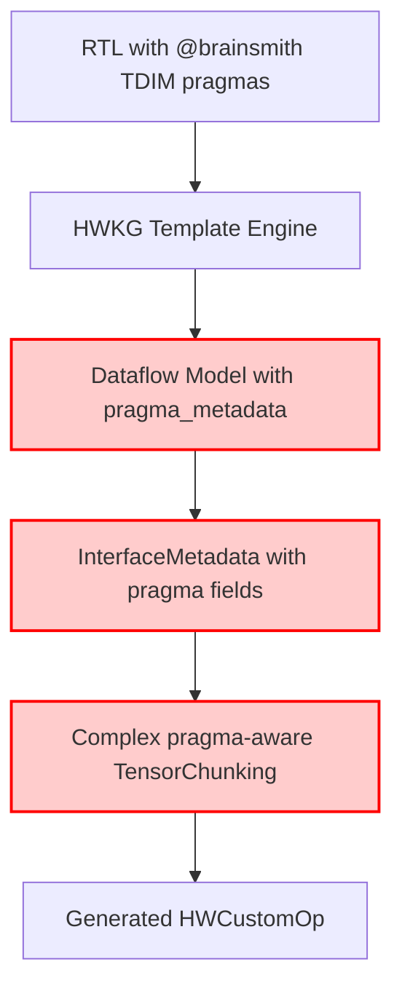
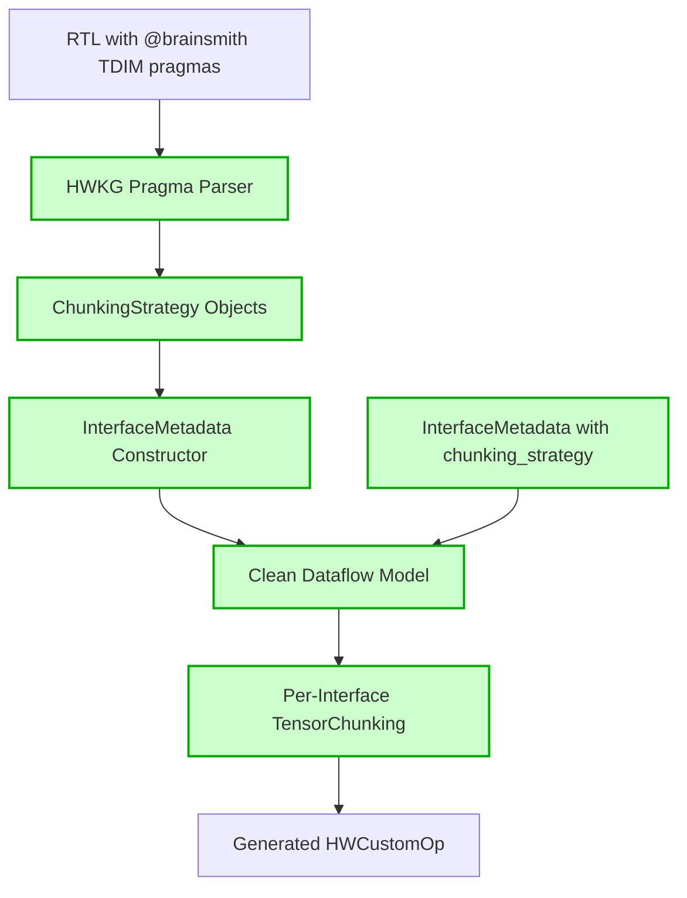
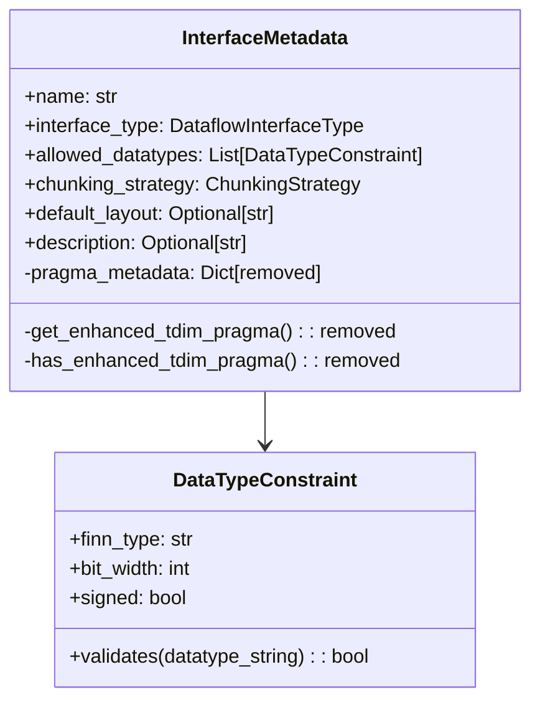
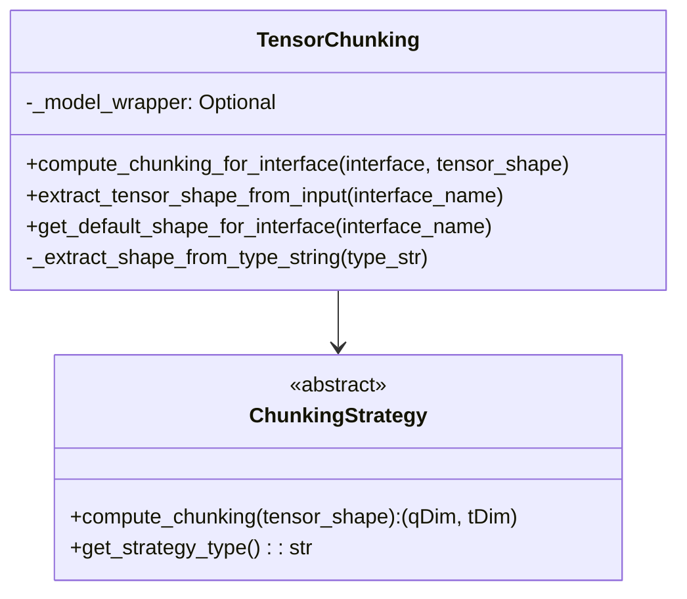
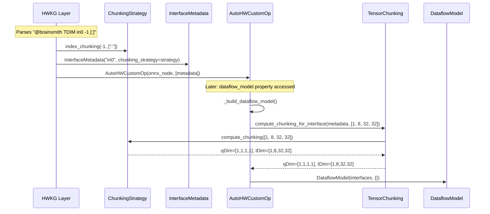
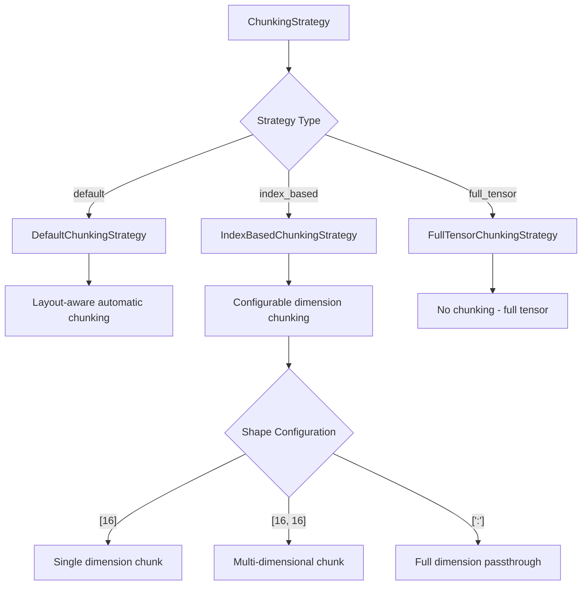
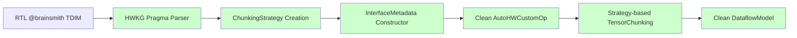

# AutoHWCustomOp Architectural Rectification - Implementation Summary

## Overview

This document summarizes the complete architectural rectification that eliminated pragma pollution from the dataflow layer and established clean separation of concerns between HWKG and dataflow layers. The final implementation uses a per-interface strategy pattern that provides superior object-oriented design and extensibility.

## Problem Statement

The original implementation violated architectural principles by polluting the pure dataflow modeling layer with pragma-specific concepts, breaking the separation between computational modeling and code generation concerns.

### Before: Polluted Architecture



**Problems:**
- [`InterfaceMetadata`](brainsmith/dataflow/core/interface_metadata.py:62) contained `pragma_metadata` field
- [`TensorChunking`](brainsmith/dataflow/core/tensor_chunking.py:58) parsed pragma strings directly
- [`AutoHWCustomOp`](brainsmith/dataflow/core/auto_hw_custom_op.py:81) interpreted HWKG-specific logic
- Computational layer polluted with code generation concerns

## Solution: Clean Architecture

### After: Clean Separation of Concerns



**Benefits:**
- HWKG layer handles all pragma interpretation
- Dataflow layer purely computational
- Object-oriented: each interface owns its chunking strategy
- No global state or override system needed
- Extensible strategy pattern for future automation

## Implementation Stages

### Stage 1: Purify InterfaceMetadata

**File:** [`brainsmith/dataflow/core/interface_metadata.py`](brainsmith/dataflow/core/interface_metadata.py)

**Changes:**
- ❌ Removed `pragma_metadata: Dict[str, Any]` field
- ❌ Removed `get_enhanced_tdim_pragma()` method
- ❌ Removed `has_enhanced_tdim_pragma()` method
- ✅ Added `chunking_strategy: ChunkingStrategy` parameter
- ✅ Pure computational properties with strategy ownership



### Stage 2: Clean Tensor Chunking System

**File:** [`brainsmith/dataflow/core/tensor_chunking.py`](brainsmith/dataflow/core/tensor_chunking.py)

**Complete Rewrite:**
- ❌ Removed all pragma parsing logic
- ❌ Removed `process_enhanced_tdim_pragma()` methods
- ✅ Added delegation to interface strategies
- ✅ Simplified to pure tensor shape extraction
- ✅ Reduced from 259 to 78 lines



### Stage 3: Clean AutoHWCustomOp Interface

**File:** [`brainsmith/dataflow/core/auto_hw_custom_op.py`](brainsmith/dataflow/core/auto_hw_custom_op.py)

**Changes:**
- ❌ Removed override system entirely
- ✅ Uses per-interface strategies automatically
- 🔄 Updated `_build_dataflow_model()` to use interface strategies
- ❌ Removed pragma interpretation logic
- ✅ Clean constructor accepting interface metadata with strategies



### Stage 4: Update Package Exports

**File:** [`brainsmith/dataflow/core/__init__.py`](brainsmith/dataflow/core/__init__.py)

**Changes:**
- ❌ Removed legacy chunking exports
- ✅ Added `ChunkingStrategy`, `DefaultChunkingStrategy`, `IndexBasedChunkingStrategy`, `FullTensorChunkingStrategy`
- ✅ Added convenience functions: `default_chunking`, `index_chunking`, `last_dim_chunking`, `spatial_chunking`
- ✅ Added `TensorChunking` with simplified interface

## Strategy Pattern Implementation

The clean system implements a flexible strategy pattern for different chunking behaviors:



**Examples:**
- `index_chunking(-1, [16])` on `[1,8,32,32]` → chunk last dimension with size 16
- `spatial_chunking(16, 16)` on `[1,8,32,32]` → chunk spatial dimensions as 16x16 blocks
- `default_chunking()` → layout-aware automatic chunking
- `FullTensorChunkingStrategy()` → no chunking (full tensor)

## Test Coverage

### Core Tests Updated

**File:** [`tests/dataflow/core/test_enhanced_auto_hw_custom_op.py`](tests/dataflow/core/test_enhanced_auto_hw_custom_op.py)
- ❌ Removed `test_enhanced_tdim_pragma_metadata()`
- ✅ Added `test_per_interface_chunking_strategies()`
- ✅ Added tests for strategy pattern integration
- ✅ All 19 tests passing

**File:** [`tests/dataflow/core/test_tensor_chunking.py`](tests/dataflow/core/test_tensor_chunking.py)
- 🔄 Complete rewrite for strategy pattern architecture
- ✅ 21 comprehensive tests covering all new functionality
- ✅ Tests strategy creation, validation, delegation, convenience functions

### Validation Tests

**File:** [`tests/validation/test_phase1_compatibility.py`](tests/validation/test_phase1_compatibility.py)
- 🔄 Updated to test strategy pattern architecture
- ✅ 7 tests validating system integration
- ✅ Tests real DataflowModel/DataflowInterface creation

## Demonstration Files

### Clean Architecture Demo

**File:** [`examples/clean_architecture_demo.py`](examples/clean_architecture_demo.py)

Demonstrates:
- Pure interface metadata creation (no pragma pollution)
- HWKG layer simulation (pragma parsing → strategy creation)
- Strategy pattern with real examples
- Generated code patterns

**File:** [`examples/per_interface_strategy_demo.py`](examples/per_interface_strategy_demo.py)

Demonstrates:
- Per-interface chunking strategy pattern
- Strategy extensibility and common patterns
- HWKG integration with strategy creation
- Object-oriented design benefits

### Enhanced Demo (Legacy)

**File:** [`examples/enhanced_autohwcustomop_demo.py`](examples/enhanced_autohwcustomop_demo.py)
- 🔄 Updated to demonstrate strategy pattern
- ✅ Shows per-interface strategy initialization
- ✅ Demonstrates enhanced tensor chunking with strategies

## Architecture Flow Comparison

### Before: Pragma Pollution


### After: Clean Separation with Strategy Pattern


## Key Implementation Files

### Core Architecture Files
1. [`brainsmith/dataflow/core/interface_metadata.py`](brainsmith/dataflow/core/interface_metadata.py) - Interface metadata with strategy ownership
2. [`brainsmith/dataflow/core/chunking_strategy.py`](brainsmith/dataflow/core/chunking_strategy.py) - Strategy pattern implementation
3. [`brainsmith/dataflow/core/tensor_chunking.py`](brainsmith/dataflow/core/tensor_chunking.py) - Simplified delegation system
4. [`brainsmith/dataflow/core/auto_hw_custom_op.py`](brainsmith/dataflow/core/auto_hw_custom_op.py) - Clean operator interface
5. [`brainsmith/dataflow/core/__init__.py`](brainsmith/dataflow/core/__init__.py) - Updated exports

### Test Files
6. [`tests/dataflow/core/test_enhanced_auto_hw_custom_op.py`](tests/dataflow/core/test_enhanced_auto_hw_custom_op.py) - 19 core tests
7. [`tests/dataflow/core/test_tensor_chunking.py`](tests/dataflow/core/test_tensor_chunking.py) - 21 strategy tests
8. [`tests/validation/test_phase1_compatibility.py`](tests/validation/test_phase1_compatibility.py) - 7 integration tests

### Documentation Files
9. [`docs/iw_df/architectural_rectification_plan.md`](docs/iw_df/architectural_rectification_plan.md) - Original plan
10. [`docs/iw_df/architectural_rectification_summary.md`](docs/iw_df/architectural_rectification_summary.md) - This summary
11. [`docs/iw_df/per_interface_chunking_strategy_guide.md`](docs/iw_df/per_interface_chunking_strategy_guide.md) - Strategy pattern guide

### Demo Files
12. [`examples/clean_architecture_demo.py`](examples/clean_architecture_demo.py) - Clean architecture demo
13. [`examples/enhanced_autohwcustomop_demo.py`](examples/enhanced_autohwcustomop_demo.py) - Strategy pattern demo
14. [`examples/per_interface_strategy_demo.py`](examples/per_interface_strategy_demo.py) - Per-interface strategy demo

## Validation Results

```bash
$ python -m pytest tests/dataflow/core/ tests/validation/ -v
================================ 47 passed in 0.14s ================================
```

**Coverage:**
- ✅ 19 Enhanced AutoHWCustomOp tests
- ✅ 21 Strategy-based Tensor Chunking tests
- ✅ 7 Integration tests
- ✅ **Total: 47/47 tests passing**

## Ready for Next Phase

The architectural rectification is complete. The dataflow layer is now:

1. **Pragma-Free**: Zero pragma imports or concepts
2. **Object-Oriented**: Each interface owns its chunking strategy
3. **Extensible**: Strategy pattern for easy expansion and automation
4. **Clean Separation**: HWKG handles pragmas, dataflow handles computation
5. **No Global State**: No override system or action-at-a-distance
6. **Well-Tested**: 47 comprehensive tests covering all functionality
7. **Documented**: Complete demos, guides, and architectural diagrams

The system is ready for HWKG template integration where the HWKG layer will parse RTL pragmas, create appropriate chunking strategies, and pass them to interface constructors for clean object-oriented operation.