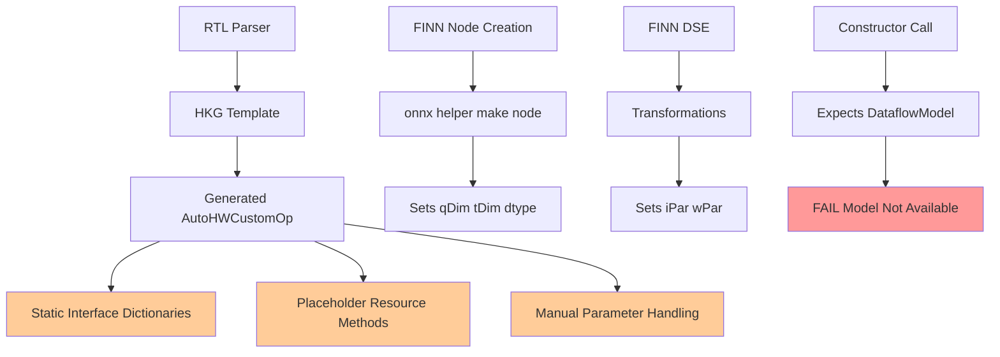
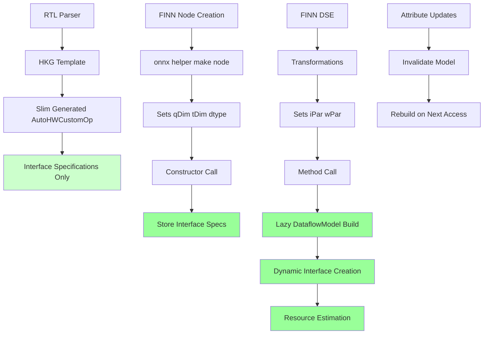
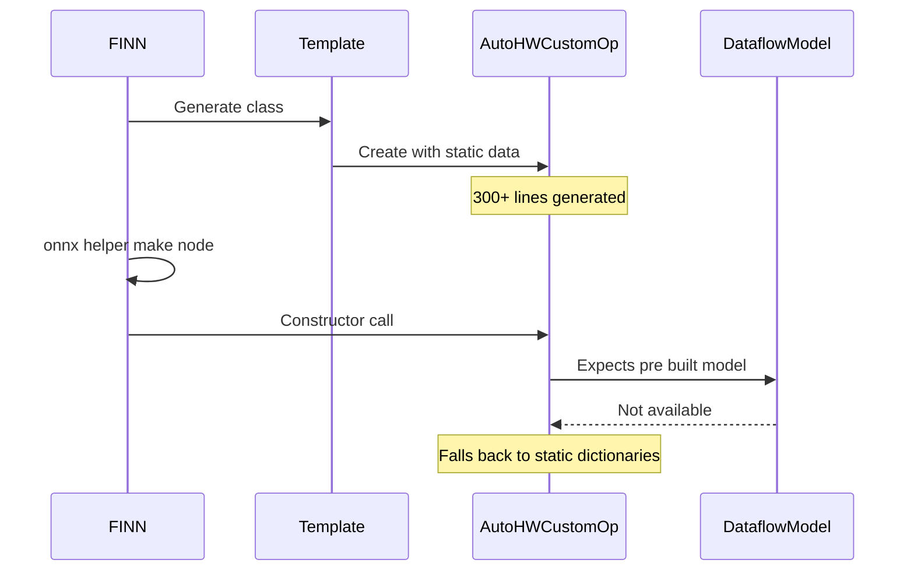
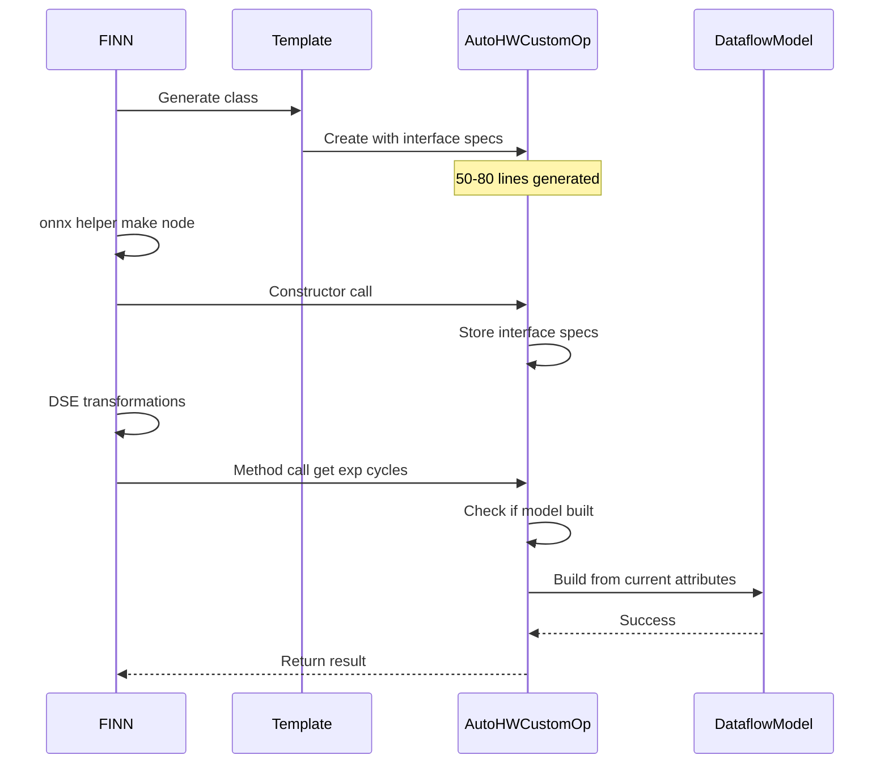
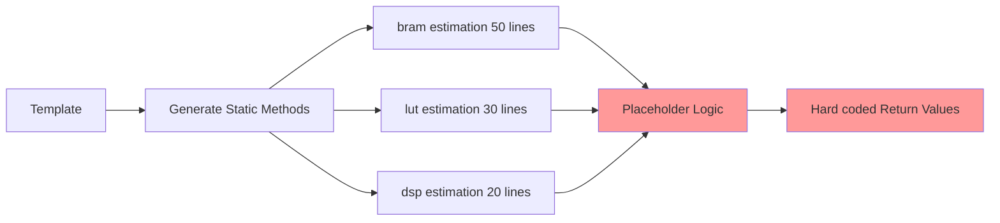
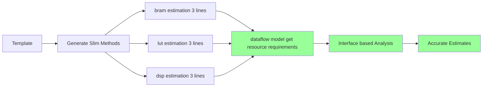
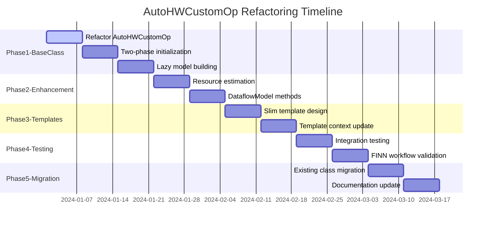
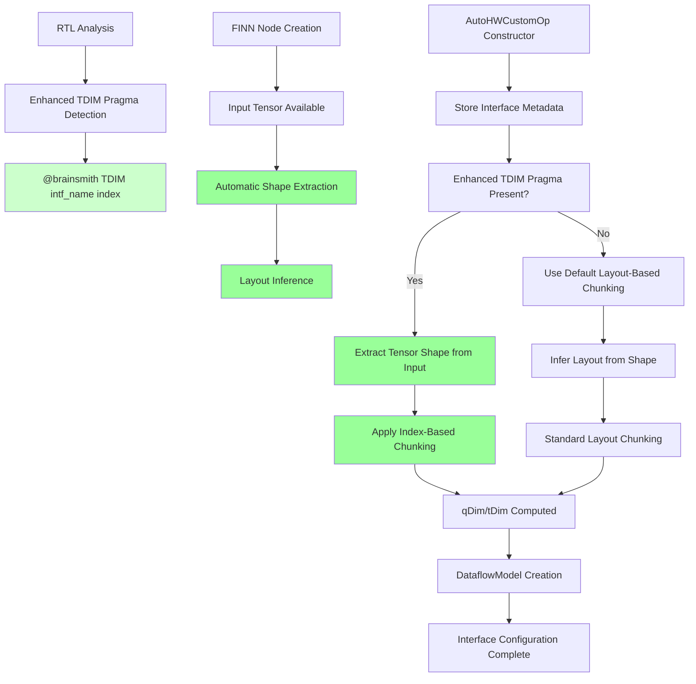
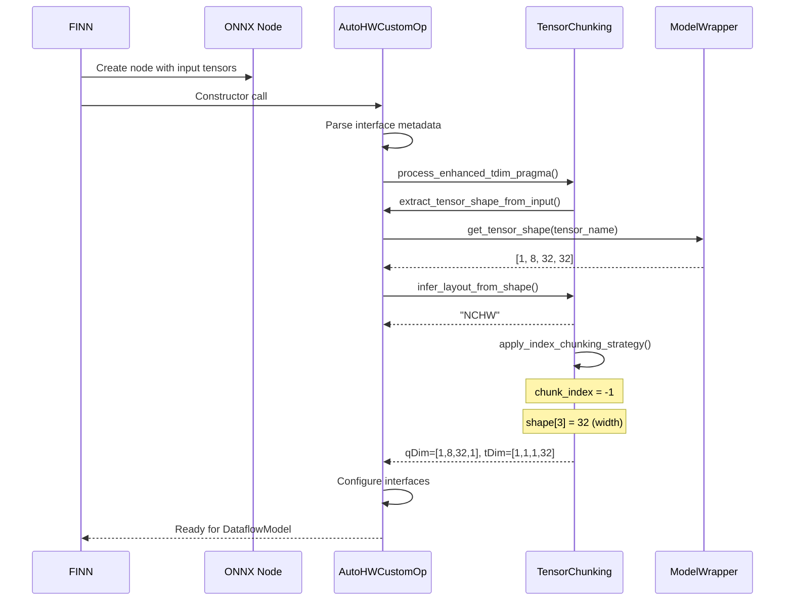

# AutoHWCustomOp Architecture Comparison

## Current Architecture (Problematic)



## Proposed Architecture (Two-Phase Initialization)



## Code Flow Comparison

### Current Flow (Broken)


### Proposed Flow (Fixed)


## Resource Estimation Comparison

### Current Approach


### Proposed Approach


## Template Complexity Reduction

### Before (Current Template)
```
Lines of Code: 298 total
├── Static Interface Specs: 83-104 (21 lines × N interfaces)
├── Resource Estimation: 136-232 (96 lines of placeholders)
├── Parameter Handling: 114-135 (21 lines)
├── Verification Logic: 236-256 (20 lines)
└── Boilerplate: 50+ lines

Complexity: High
Maintainability: Poor
Customization: Manual override required
```

### After (Proposed Template)
```
Lines of Code: 50-80 total
├── Interface Specs: 8-12 (JSON format)
├── Resource Estimation: 12-20 (delegates to DataflowModel)
├── Constructor: 5-8 lines
└── Optional Customization: 10-30 lines

Complexity: Low
Maintainability: Excellent  
Customization: DataflowModel-based
```

## Benefits Summary

| Aspect | Current | Proposed | Improvement |
|--------|---------|----------|-------------|
| Generated Code Lines | 300+ | 50-80 | 75-80% reduction |
| Template Complexity | High | Low | Major simplification |
| FINN Compatibility | Broken | Full + Enhanced Tensor Chunking | Complete fix + Enhancement |
| Interface Configuration | Manual qDim/tDim | Automatic Shape Extraction + Enhanced TDIM | Intuitive + Zero-config |
| Chunking Strategy | None | Index-based with Auto Shape Detection | Advanced chunking control |
| Resource Accuracy | Placeholder | Interface-based | Significant improvement |
| Maintenance Burden | High | Low | Major reduction |
| Customization | Manual | DataflowModel + Enhanced TDIM Pragma | Systematic + Zero-config |

## Implementation Timeline



## Architecture Benefits

This architectural refactoring resolves both the verbosity issue and the FINN workflow compatibility problem while significantly improving maintainability and accuracy of the generated AutoHWCustomOp classes.

### Key Improvements

1. **Code Reduction**: From 300+ lines to 50-80 lines per generated class
2. **FINN Compatibility**: Full support for onnx.helper.make_node workflow
3. **Resource Estimation**: Interface-aware algorithms replace placeholder logic
4. **Maintainability**: Simplified templates with DataflowModel integration
5. **Performance**: Lazy model building optimizes memory usage
6. **Extensibility**: Clean separation of concerns for future enhancements

## Enhanced Tensor Chunking Workflow (Final Solution)



## Tensor Shape Extraction Process



## Enhanced TDIM Pragma Comparison

### Legacy Approach (Complex)
```systemverilog
// Manual qDim/tDim specification
// Requires deep HLS knowledge
qDim = [1, 8, 32, 1]
tDim = [1, 1, 1, 32]
```

### Final Enhanced Approach (Simple)
```systemverilog
// @brainsmith TDIM in0_V_data_V -1
// Automatic shape extraction + index-based chunking
// Zero configuration required
```

### Key Simplifications in Final Solution

1. **No Manual Shape Specification**: Removed `[:] ` and `[C, H, W]` syntax complexity
2. **Automatic Tensor Detection**: Shape extracted from ONNX input tensors
3. **Smart Layout Inference**: 4D→NCHW, 3D→CHW, 2D→NC, 1D→C
4. **Minimal Pragma Syntax**: Just interface name + chunk index
5. **Zero Configuration**: Works without any pragmas using sensible defaults