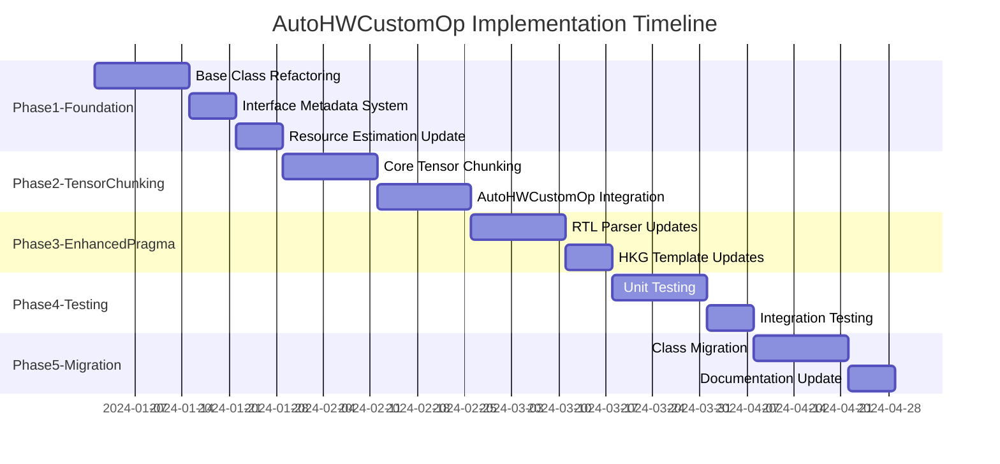

# AutoHWCustomOp Refactoring: Step-by-Step Implementation Plan

## Overview

This document provides a detailed, actionable implementation plan for the AutoHWCustomOp refactoring project. The plan is structured in phases with clear dependencies, deliverables, and acceptance criteria.

## Implementation Phases

### Phase 1: Foundation - Base Class Refactoring
**Duration**: 2-3 weeks  
**Dependencies**: None  
**Risk Level**: Medium

#### 1.1 Refactor AutoHWCustomOp Base Class
**Files to Modify:**
- `brainsmith/dataflow/core/auto_hw_custom_op.py`

**Tasks:**
1. **Implement Two-Phase Initialization**
   ```python
   # Add to AutoHWCustomOp.__init__()
   self._dataflow_model = None
   self._model_built = False
   self._interface_metadata = []
   ```

2. **Add Lazy DataflowModel Building**
   ```python
   def _ensure_dataflow_model_built(self):
       """Build DataflowModel on first access if not already built."""
       if not self._model_built:
           self._build_dataflow_model()
           self._model_built = True
   
   def _build_dataflow_model(self):
       """Build DataflowModel from current ONNX node attributes."""
       # Implementation here
   ```

3. **Add Model Invalidation System**
   ```python
   def _invalidate_dataflow_model(self):
       """Mark model as needing rebuild after attribute changes."""
       self._model_built = False
       self._dataflow_model = None
   ```

**Acceptance Criteria:**
- [ ] AutoHWCustomOp constructor works without pre-built DataflowModel
- [ ] Lazy model building triggers on first resource estimation call
- [ ] Model invalidation works when attributes change
- [ ] All existing tests pass with new base class

#### 1.2 Create Interface Metadata System
**Files to Create:**
- `brainsmith/dataflow/core/interface_metadata.py`

**Tasks:**
1. **Define InterfaceMetadata Class**
   ```python
   @dataclass
   class InterfaceMetadata:
       name: str
       interface_type: DataflowInterfaceType
       allowed_datatypes: List[DataTypeConstraint]
       pragma_metadata: Dict[str, Any] = field(default_factory=dict)
   ```

2. **Define DataTypeConstraint Class**
   ```python
   @dataclass
   class DataTypeConstraint:
       datatype: DataType
       bit_width: int
       signed: bool = False
   ```

**Acceptance Criteria:**
- [ ] InterfaceMetadata class properly encapsulates interface data
- [ ] DataTypeConstraint replaces dictionary-based constraints
- [ ] Type safety and IDE support improved
- [ ] Unit tests for metadata classes pass

#### 1.3 Update Resource Estimation Methods
**Files to Modify:**
- `brainsmith/dataflow/core/auto_hw_custom_op.py`

**Tasks:**
1. **Refactor Resource Methods to Use DataflowModel**
   ```python
   def get_exp_cycles(self):
       self._ensure_dataflow_model_built()
       return self._dataflow_model.get_exp_cycles()
   
   def bram_estimation(self):
       self._ensure_dataflow_model_built()
       return self._dataflow_model.get_bram_requirements()
   ```

**Acceptance Criteria:**
- [ ] Resource methods delegate to DataflowModel
- [ ] Accurate estimations replace placeholder logic
- [ ] Performance acceptable with lazy building
- [ ] Resource estimation tests pass

### Phase 2: Enhanced Tensor Chunking System
**Duration**: 3-4 weeks  
**Dependencies**: Phase 1 complete  
**Risk Level**: High

#### 2.1 Implement Core Tensor Chunking
**Files to Create:**
- `brainsmith/dataflow/core/tensor_chunking.py` (enhance existing)

**Tasks:**
1. **Add Automatic Shape Extraction**
   ```python
   def extract_tensor_shape_from_input(self, interface_name: str, onnx_node) -> List[int]:
       """Extract tensor shape from corresponding input tensor."""
       input_index = self._map_interface_to_input_index(interface_name)
       input_tensor_name = onnx_node.input[input_index]
       
       if hasattr(self, '_model_wrapper') and self._model_wrapper:
           return self._model_wrapper.get_tensor_shape(input_tensor_name)
       
       # Fallback logic
   ```

2. **Implement Smart Layout Inference**
   ```python
   def infer_layout_from_shape(self, tensor_shape: List[int]) -> str:
       """Infer tensor layout with smart defaults."""
       shape_to_layout = {
           4: "NCHW", 3: "CHW", 2: "NC", 1: "C"
       }
       return shape_to_layout.get(len(tensor_shape), "UNKNOWN")
   ```

3. **Add Index-Based Chunking Strategy**
   ```python
   def apply_index_chunking_strategy(self, tensor_shape: List[int], 
                                   chunk_index: int) -> Tuple[List[int], List[int]]:
       """Apply index-based chunking from enhanced TDIM pragma."""
       # Implementation with negative index support
   ```

**Acceptance Criteria:**
- [ ] Automatic shape extraction works for all tensor types
- [ ] Layout inference provides sensible defaults
- [ ] Index-based chunking handles positive/negative indices
- [ ] Comprehensive unit tests for all chunking strategies

#### 2.2 Integrate with AutoHWCustomOp
**Files to Modify:**
- `brainsmith/dataflow/core/auto_hw_custom_op.py`

**Tasks:**
1. **Add Tensor Chunking Integration**
   ```python
   def _compute_dimensions_from_input_tensor(self, interface_name: str, 
                                           metadata: InterfaceMetadata) -> Tuple[List[int], List[int]]:
       """Compute qDim/tDim using automatic tensor shape extraction."""
       chunker = TensorChunking()
       enhanced_tdim = metadata.pragma_metadata.get("enhanced_tdim")
       
       if enhanced_tdim:
           return chunker.process_enhanced_tdim_pragma(
               enhanced_tdim, interface_name, self.onnx_node
           )
       else:
           # Default chunking logic
   ```

**Acceptance Criteria:**
- [ ] AutoHWCustomOp uses tensor chunking for dimension computation
- [ ] Fallback to default behavior when no enhanced pragmas present
- [ ] Integration tests pass with various tensor shapes
- [ ] Performance acceptable for typical use cases

### Phase 3: Enhanced TDIM Pragma System
**Duration**: 2-3 weeks  
**Dependencies**: Phase 2 complete  
**Risk Level**: Medium

#### 3.1 Update RTL Parser for Enhanced Pragmas
**Files to Modify:**
- `brainsmith/tools/hw_kernel_gen/rtl_parser.py`
- `brainsmith/tools/hw_kernel_gen/pragma_parser.py`

**Tasks:**
1. **Add Enhanced TDIM Pragma Parser**
   ```python
   class EnhancedTDIMPragma(BasePragma):
       def _parse_inputs(self) -> Dict:
           """Parse: @brainsmith TDIM <interface_name> <index>"""
           if len(self.inputs) != 2:
               raise PragmaError("Enhanced TDIM requires interface_name and chunk_index")
           
           return {
               "interface_name": self.inputs[0],
               "chunk_index": int(self.inputs[1])
           }
   ```

2. **Update Pragma Registration**
   ```python
   PRAGMA_REGISTRY = {
       "TDIM": EnhancedTDIMPragma,
       # ... other pragmas
   }
   ```

**Acceptance Criteria:**
- [ ] Enhanced TDIM pragma syntax properly parsed
- [ ] Validation for chunk_index parameter
- [ ] Integration with existing pragma system
- [ ] RTL parser tests pass with new pragma format

#### 3.2 Update HKG Templates
**Files to Modify:**
- `brainsmith/tools/hw_kernel_gen/templates/hw_custom_op.py.j2`

**Tasks:**
1. **Create Slim Template Generation**
   ```jinja2
   class {{ class_name }}(AutoHWCustomOp):
       def __init__(self, onnx_node, **kwargs):
           self._interface_metadata = [
               
               InterfaceMetadata(
                   name="{{ interface.name }}",
                   interface_type=DataflowInterfaceType.{{ interface.type }},
                   allowed_datatypes=[
                       
                       DataTypeConstraint({{ dtype.to_constraint() }}),
                       
                   ],
                   pragma_metadata={{ interface.pragma_metadata | tojson }}
               ),
               
           ]
           super().__init__(onnx_node, **kwargs)
   ```

2. **Remove Static Dictionary Generation**
   - Remove verbose interface specifications
   - Remove placeholder resource estimation methods
   - Keep only essential customization hooks

**Acceptance Criteria:**
- [ ] Generated classes are 50-80 lines (vs 300+ previously)
- [ ] InterfaceMetadata objects replace static dictionaries
- [ ] Enhanced TDIM pragma data properly embedded
- [ ] Template generation tests pass

### Phase 4: Testing and Validation
**Duration**: 2-3 weeks  
**Dependencies**: Phase 3 complete  
**Risk Level**: Low

#### 4.1 Comprehensive Unit Testing
**Files to Create:**
- `tests/dataflow/core/test_enhanced_auto_hw_custom_op.py`
- `tests/dataflow/core/test_tensor_chunking.py`
- `tests/dataflow/core/test_interface_metadata.py`

**Tasks:**
1. **Test Automatic Shape Extraction**
   ```python
   def test_extract_tensor_shape_from_input():
       # Test with various tensor shapes and layouts
       
   def test_layout_inference():
       # Test smart defaults for different dimensions
       
   def test_index_chunking_strategy():
       # Test positive/negative indices
   ```

2. **Test Enhanced TDIM Pragma Processing**
   ```python
   def test_enhanced_tdim_pragma_parsing():
       # Test pragma syntax validation
       
   def test_pragma_application():
       # Test pragma metadata integration
   ```

**Acceptance Criteria:**
- [ ] 90%+ code coverage for new components
- [ ] All edge cases covered (empty tensors, invalid indices, etc.)
- [ ] Performance benchmarks meet requirements
- [ ] No regressions in existing functionality

#### 4.2 Integration Testing
**Files to Create:**
- `tests/integration/test_enhanced_hkg_pipeline.py`
- `tests/integration/test_finn_workflow_compatibility.py`

**Tasks:**
1. **End-to-End Pipeline Testing**
   ```python
   def test_complete_enhanced_hkg_pipeline():
       # RTL parsing → Template generation → FINN integration
       
   def test_finn_workflow_compatibility():
       # Test with real FINN transformations
   ```

2. **Performance Testing**
   ```python
   def test_lazy_model_building_performance():
       # Measure construction vs first-access times
       
   def test_memory_usage():
       # Ensure lazy building reduces memory footprint
   ```

**Acceptance Criteria:**
- [ ] Complete HKG pipeline works end-to-end
- [ ] FINN workflow compatibility verified
- [ ] Performance requirements met
- [ ] Memory usage optimized

### Phase 5: Migration and Documentation
**Duration**: 2-3 weeks  
**Dependencies**: Phase 4 complete  
**Risk Level**: Low

#### 5.1 Migrate Existing Classes
**Files to Update:**
- All existing AutoHWCustomOp subclasses

**Tasks:**
1. **Create Migration Script**
   ```python
   def migrate_auto_hw_custom_op_class(source_file, target_file):
       """Migrate existing class to new architecture."""
       # Parse existing class
       # Extract interface specifications
       # Generate new slim class
       # Preserve customizations
   ```

2. **Batch Migration Process**
   - Identify all existing AutoHWCustomOp subclasses
   - Run migration script
   - Validate migrated classes
   - Update any custom logic

**Acceptance Criteria:**
- [ ] All existing classes successfully migrated
- [ ] No functionality regressions
- [ ] Code size reduction achieved (75%+)
- [ ] Migration validation tests pass

#### 5.2 Update Documentation and Examples
**Files to Update:**
- User guides and tutorials
- API documentation
- Example notebooks

**Tasks:**
1. **Update User Documentation**
   - Zero-configuration usage examples
   - Enhanced TDIM pragma guide
   - Migration guide for existing users

2. **Create Tutorial Content**
   - Getting started with new architecture
   - Advanced tensor chunking strategies
   - Troubleshooting guide

**Acceptance Criteria:**
- [ ] Complete documentation suite updated
- [ ] Tutorial examples work out-of-box
- [ ] Migration guide tested with real users
- [ ] API documentation accurate and complete

## Implementation Timeline



## Risk Mitigation

### High-Risk Areas
1. **Tensor Shape Extraction**: May fail with complex ONNX graphs
   - **Mitigation**: Comprehensive fallback strategies and extensive testing

2. **FINN Workflow Compatibility**: Breaking changes could affect downstream users
   - **Mitigation**: Extensive integration testing and gradual rollout

3. **Performance Regression**: Lazy building might be slower than expected
   - **Mitigation**: Performance benchmarking and optimization

### Validation Strategy
1. **Continuous Integration**: All phases include automated testing
2. **User Acceptance Testing**: Early feedback from FINN users
3. **Gradual Rollout**: Opt-in migration before making it default
4. **Rollback Plan**: Ability to revert to old architecture if needed

## Success Metrics

| Metric | Target | Measurement Method |
|--------|--------|-------------------|
| Code Reduction | 75%+ | Line count comparison |
| FINN Compatibility | 100% | Integration test pass rate |
| Performance | No regression | Benchmark comparison |
| Migration Success | 95%+ classes | Automated migration validation |
| User Adoption | 80%+ positive feedback | User survey |

## Resource Requirements

### Development Team
- **Lead Developer**: Full-time, all phases
- **RTL/Pragma Expert**: Part-time, Phase 3
- **Testing Engineer**: Full-time, Phase 4
- **Documentation Specialist**: Part-time, Phase 5

### Infrastructure
- **CI/CD Pipeline**: Enhanced for new testing requirements
- **Test Environment**: FINN integration test setup
- **Documentation Platform**: Updated for new architecture

## Conclusion

This implementation plan provides a structured approach to delivering the AutoHWCustomOp refactoring with minimal risk and maximum benefit. The phased approach allows for early feedback and course correction while ensuring backward compatibility and smooth migration for existing users.