# Implementation Plan: Gap Resolution for Interface-Wise Dataflow Modeling Framework

## Executive Summary

This document provides a comprehensive implementation plan to address the 44 identified gaps in the Interface-Wise Dataflow Modeling framework. The plan is structured in **four phases** with clear priorities, dependencies, and success criteria.

**Overall Strategy**: Focus on **critical path issues** first to enable basic functionality, then enhance capabilities systematically to reach production readiness.

**Timeline**: 18 weeks total across 4 phases
**Resources**: 1-2 developers for Phase 1-2, up to 3 developers for Phase 3-4
**Success Criteria**: Complete framework enables automated generation of production-quality HWCustomOp classes

## Implementation Strategy Overview

### Phase Structure

| Phase | Focus | Duration | High Priority Gaps | Status Goal |
|-------|-------|----------|-------------------|-------------|
| **Phase 1** | **Critical Fixes** | 4 weeks | 7 gaps | Template generation works |
| **Phase 2** | **Core Enhancement** | 5 weeks | 6 gaps | End-to-end pipeline robust |
| **Phase 3** | **Advanced Features** | 5 weeks | 10 gaps | Production-ready framework |
| **Phase 4** | **Optimization & Polish** | 4 weeks | 21 gaps | Industry-grade solution |

### Gap Resolution Strategy

```mermaid
graph TD
    A[Phase 1: Critical Fixes] --> B[Phase 2: Core Enhancement]
    B --> C[Phase 3: Advanced Features]
    C --> D[Phase 4: Optimization & Polish]
    
    A --> E[Template Generation Works]
    B --> F[Robust Pipeline]
    C --> G[Production Ready]
    D --> H[Industry Grade]
    
    E --> I[✅ Basic Functionality]
    F --> J[✅ Real-World Usage]
    G --> K[✅ Advanced Capabilities] 
    H --> L[✅ Competitive Solution]
```



## Phase 1: Critical Fixes (Weeks 1-4)

**Objective**: Fix blocking issues that prevent basic template generation and code compilation.

**Success Criteria**: Template generation succeeds without errors, generated code compiles successfully.

### 1.1 Missing Utility Classes (Week 1)

**Priority**: 🔴 Critical
**Effort**: 1 week
**Dependencies**: None

**Tasks**:

#### 1.1.1 Implement ConstraintValidator Class
```python
# File: brainsmith/dataflow/core/validation.py
class ConstraintValidator:
    """Validates constraints for dataflow interfaces and models."""
    
    def __init__(self):
        self.validation_rules = {}
    
    def validate_interface_constraints(self, interface: DataflowInterface) -> ValidationResult:
        """Validate constraints for a single interface."""
        # Implementation details...
    
    def validate_model_constraints(self, model: DataflowModel) -> ValidationResult:
        """Validate constraints across entire model."""
        # Implementation details...
```

**Deliverables**:
- [ ] `ConstraintValidator` class with full validation methods
- [ ] Unit tests covering all validation scenarios
- [ ] Integration with existing validation framework

#### 1.1.2 Complete TensorChunking Implementation
```python
# File: brainsmith/dataflow/core/tensor_chunking.py
class TensorChunking:
    def compute_optimal_chunking(self, original_shape: List[int], 
                                target_parallelism: int) -> Tuple[List[int], List[int]]:
        """Compute optimal qDim/tDim for given parallelism target."""
        # Implementation details...
    
    def validate_chunking_consistency(self, qDim: List[int], 
                                    tDim: List[int],
                                    original_shape: List[int]) -> bool:
        """Validate that chunking maintains tensor integrity."""
        # Implementation details...
```

**Deliverables**:
- [ ] Complete `TensorChunking` methods
- [ ] Validation of chunking mathematics
- [ ] Performance optimization for large tensors

#### 1.1.3 Data Structure Completions
```python
# File: brainsmith/dataflow/core/dataflow_model.py
@dataclass
class ParallelismConfiguration:
    """Complete parallelism configuration for a kernel."""
    iPar: Dict[str, int]
    wPar: Dict[str, int] 
    derived_sDim: Dict[str, List[int]]
    resource_estimates: Dict[str, int]
    performance_estimates: Dict[str, float]

@dataclass  
class InitiationIntervals:
    """Container for initiation interval calculations."""
    cII: Dict[str, int]
    eII: Dict[str, int]
    L: int
    bottleneck_analysis: Dict[str, Any]
    optimization_opportunities: List[str]
```

**Deliverables**:
- [ ] All referenced data classes implemented
- [ ] Type annotations complete and consistent
- [ ] JSON serialization support for debugging

### 1.2 Jinja2 Template Syntax Fixes (Week 2)

**Priority**: 🔴 Critical
**Effort**: 1 week
**Dependencies**: None

**Tasks**:

#### 1.2.1 Fix Complex Conditional Expressions
```jinja2
{# Before (broken) #}
"axi_protocol": "{{ 'axi_stream' if 'axis' in interface.name else 'axi_lite' if 'axilite' in interface.name else 'global_control' }}"

{# After (fixed) #}


  

  

"axi_protocol": "{{ axi_protocol }}"
```

#### 1.2.2 Fix Map Filter Usage
```jinja2
{# Before (broken) #}
"input_interfaces": {{ input_interfaces|map(attribute='name')|list }},

{# After (fixed) #}
"input_interfaces": [
  "{{ iface.name }}",
],
```

#### 1.2.3 Add Missing Template Filters
```python
# File: brainsmith/tools/hw_kernel_gen/hkg.py
def setup_template_environment(self, env: Environment):
    """Setup Jinja2 environment with custom filters."""
    
    def number_filter(value):
        """Check if value is a number."""
        return isinstance(value, (int, float))
    
    def camelcase_filter(value):
        """Convert string to CamelCase."""
        return ''.join(word.capitalize() for word in str(value).split('_'))
    
    def bitwidth_filter(datatype):
        """Extract bitwidth from datatype."""
        if hasattr(datatype, 'bitwidth'):
            return datatype.bitwidth
        return 8  # Default
    
    env.filters['number'] = number_filter
    env.filters['camelcase'] = camelcase_filter
    env.filters['bitwidth'] = bitwidth_filter
```

**Deliverables**:
- [ ] All template syntax errors fixed
- [ ] Custom filters implemented and tested
- [ ] Template validation script to catch future errors

### 1.3 Template Context Validation (Week 2)

**Priority**: 🔴 Critical
**Effort**: 0.5 weeks (parallel with 1.2)
**Dependencies**: Template syntax fixes

**Tasks**:

#### 1.3.1 Context Validation Framework
```python
# File: brainsmith/tools/hw_kernel_gen/template_validation.py
class TemplateContextValidator:
    """Validates template context before rendering."""
    
    def __init__(self, template_requirements: Dict[str, Any]):
        self.requirements = template_requirements
    
    def validate_context(self, context: Dict[str, Any]) -> ValidationResult:
        """Validate that context meets template requirements."""
        result = ValidationResult()
        
        for required_key, expected_type in self.requirements.items():
            if required_key not in context:
                result.add_error(f"Missing required context key: {required_key}")
            elif not isinstance(context[required_key], expected_type):
                result.add_error(f"Context key {required_key} has wrong type")
        
        return result
```

**Deliverables**:
- [ ] Context validation framework
- [ ] Template requirement specifications
- [ ] Automatic context validation in HKG pipeline

### 1.4 AutoRTLBackend Method Completion (Week 3)

**Priority**: 🔴 Critical
**Effort**: 1 week
**Dependencies**: Utility classes (1.1)

**Tasks**:

#### 1.4.1 Complete DataflowModel Methods
```python
# File: brainsmith/dataflow/core/dataflow_model.py
class DataflowModel:
    def get_all_interfaces(self) -> List[DataflowInterface]:
        """Get all interfaces in the model."""
        return list(self.interfaces.values())
    
    def get_resource_requirements(self, parallelism_config: ParallelismConfiguration) -> Dict[str, Any]:
        """Calculate resource requirements for given parallelism."""
        # Implementation based on existing partial implementation
        requirements = {
            "memory_bits": self._calculate_memory_requirements(parallelism_config),
            "lut_ops": self._estimate_lut_requirements(parallelism_config),
            "dsp_ops": self._estimate_dsp_requirements(parallelism_config),
            "transfer_bandwidth": self._calculate_bandwidth_requirements(parallelism_config)
        }
        return requirements
```

#### 1.4.2 Complete AutoHWCustomOp Helper Methods
```python
# File: brainsmith/dataflow/core/auto_hw_custom_op.py
class AutoHWCustomOp:
    def _get_current_parallelism_config(self) -> ParallelismConfiguration:
        """Get current parallelism configuration."""
        iPar = {}
        wPar = {}
        
        for iface in self.dataflow_model.input_interfaces:
            iPar[iface.name] = self.get_nodeattr(f"{iface.name}_parallel") or 1
            
        for iface in self.dataflow_model.weight_interfaces:
            wPar[iface.name] = self.get_nodeattr(f"{iface.name}_parallel") or 1
        
        return ParallelismConfiguration(
            iPar=iPar,
            wPar=wPar,
            derived_sDim=self._calculate_derived_sDim(iPar, wPar),
            resource_estimates={},  # Will be populated by resource estimation
            performance_estimates={}  # Will be populated by performance estimation
        )
```

**Deliverables**:
- [ ] All missing methods implemented
- [ ] Method documentation complete
- [ ] Unit tests for new methods

### 1.5 Template Error Handling (Week 4)

**Priority**: 🔴 Critical
**Effort**: 1 week
**Dependencies**: Template syntax fixes (1.2), context validation (1.3)

**Tasks**:

#### 1.5.1 Robust Template Rendering
```python
# File: brainsmith/tools/hw_kernel_gen/hkg.py
def render_template_safely(self, template_name: str, context: Dict[str, Any]) -> str:
    """Render template with comprehensive error handling."""
    try:
        # Validate context first
        validation_result = self.template_validator.validate_context(context)
        if not validation_result.is_valid():
            raise TemplateValidationError(f"Context validation failed: {validation_result.errors}")
        
        # Render template
        template = self.jinja_env.get_template(template_name)
        rendered = template.render(**context)
        
        # Validate rendered output
        if not rendered.strip():
            raise TemplateRenderingError("Template rendered to empty string")
        
        return rendered
        
    except TemplateNotFound as e:
        raise TemplateError(f"Template not found: {template_name}") from e
    except TemplateSyntaxError as e:
        raise TemplateError(f"Template syntax error in {template_name}: {e}") from e
    except UndefinedError as e:
        raise TemplateError(f"Undefined variable in {template_name}: {e}") from e
```

**Deliverables**:
- [ ] Comprehensive error handling for template operations
- [ ] Clear error messages with context
- [ ] Graceful degradation for non-critical template failures

### Phase 1 Validation

**Exit Criteria**:
- [ ] All template generation succeeds without errors
- [ ] Generated code compiles successfully  
- [ ] Basic end-to-end test passes (template generation → compilation)
- [ ] No import errors in generated code
- [ ] Template validation framework operational

**Validation Script**:
```python
# File: tests/phase1_validation.py
def test_phase1_completion():
    """Validate Phase 1 completion criteria."""
    
    # Test template generation
    hkg = HardwareKernelGenerator(test_rtl, test_compiler_data, output_dir)
    generated_files = hkg.run(stop_after="generate_hw_custom_op")
    
    # Verify all files generated
    assert all(Path(f).exists() for f in generated_files.values())
    
    # Verify generated code compiles
    for file_path in generated_files.values():
        if file_path.endswith('.py'):
            compile_python_file(file_path)  # Should not raise
    
    # Verify imports work
    import_generated_modules(generated_files)  # Should not raise
```

## Phase 2: Core Enhancement (Weeks 5-9)

**Objective**: Make the framework robust for real-world usage with comprehensive resource estimation and broader test coverage.

**Success Criteria**: Framework handles multiple kernel types reliably, resource estimation is realistic, FINN integration works.

### 2.1 Kernel-Specific Resource Estimation (Weeks 5-6)

**Priority**: 🔴 High
**Effort**: 2 weeks
**Dependencies**: Phase 1 completion

**Tasks**:

#### 2.1.1 BRAM Estimation Algorithms
```python
# File: brainsmith/dataflow/core/resource_estimation.py
class ResourceEstimator:
    """Kernel-specific resource estimation algorithms."""
    
    def estimate_bram_usage(self, interfaces: List[DataflowInterface], 
                           parallelism: ParallelismConfiguration,
                           kernel_type: str) -> int:
        """Estimate BRAM usage based on kernel type and configuration."""
        
        if kernel_type.lower() in ['thresholding', 'activation']:
            return self._estimate_thresholding_bram(interfaces, parallelism)
        elif kernel_type.lower() in ['conv', 'convolution']:
            return self._estimate_convolution_bram(interfaces, parallelism)
        elif kernel_type.lower() in ['matmul', 'gemm']:
            return self._estimate_matmul_bram(interfaces, parallelism)
        else:
            return self._estimate_generic_bram(interfaces, parallelism)
    
    def _estimate_thresholding_bram(self, interfaces, parallelism) -> int:
        """Specific BRAM estimation for thresholding kernels."""
        weight_memory = 0
        activation_buffer = 0
        
        # Calculate weight storage (thresholds)
        for iface in interfaces:
            if iface.interface_type == DataflowInterfaceType.WEIGHT:
                weight_bits = (
                    np.prod(iface.qDim) * np.prod(iface.tDim) * iface.dtype.bitwidth
                )
                weight_memory += weight_bits
        
        # Calculate activation buffering needs
        pe = parallelism.wPar.get('weights', 1)
        buffer_depth = max(32, pe * 8)  # Minimum buffering
        activation_buffer = buffer_depth * 8  # Assume 8-bit activations
        
        # Convert to BRAM blocks (36Kb each)
        total_bits = weight_memory + activation_buffer
        bram_blocks = math.ceil(total_bits / (36 * 1024))
        
        return max(1, bram_blocks)
```

#### 2.1.2 LUT and DSP Estimation Algorithms
```python
def estimate_lut_usage(self, interfaces: List[DataflowInterface],
                      parallelism: ParallelismConfiguration,
                      kernel_type: str) -> int:
    """Estimate LUT usage with kernel-specific models."""
    
    base_luts = 500  # Base control logic
    interface_luts = 0
    computation_luts = 0
    
    # Interface complexity
    for iface in interfaces:
        if iface.interface_type in [DataflowInterfaceType.INPUT, DataflowInterfaceType.OUTPUT]:
            stream_width = iface.calculate_stream_width()
            interface_luts += stream_width // 8 * 10  # ~10 LUTs per byte of stream width
    
    # Computation complexity
    if kernel_type.lower() in ['thresholding']:
        # Comparison logic scales with parallelism
        pe = parallelism.wPar.get('weights', 1) 
        computation_luts += pe * 50  # ~50 LUTs per comparison unit
    elif kernel_type.lower() in ['conv', 'matmul']:
        # MAC units scale with parallelism
        total_macs = sum(parallelism.wPar.values()) * sum(parallelism.iPar.values())
        computation_luts += total_macs * 100  # ~100 LUTs per MAC without DSP
    
    return base_luts + interface_luts + computation_luts

def estimate_dsp_usage(self, interfaces: List[DataflowInterface],
                      parallelism: ParallelismConfiguration, 
                      kernel_type: str,
                      target_fpga: str = "xczu7ev") -> int:
    """Estimate DSP usage based on arithmetic operations."""
    
    if kernel_type.lower() in ['thresholding', 'activation']:
        return 0  # No multiplication operations
    
    if kernel_type.lower() in ['conv', 'matmul', 'gemm']:
        # Count multiplication operations
        total_macs = 0
        for input_iface in interfaces:
            if input_iface.interface_type == DataflowInterfaceType.INPUT:
                input_par = parallelism.iPar.get(input_iface.name, 1)
                for weight_iface in interfaces:
                    if weight_iface.interface_type == DataflowInterfaceType.WEIGHT:
                        weight_par = parallelism.wPar.get(weight_iface.name, 1)
                        total_macs += input_par * weight_par
        
        # DSP efficiency depends on bitwidths and FPGA type
        input_bitwidth = max(iface.dtype.bitwidth for iface in interfaces 
                           if iface.interface_type == DataflowInterfaceType.INPUT)
        weight_bitwidth = max(iface.dtype.bitwidth for iface in interfaces
                            if iface.interface_type == DataflowInterfaceType.WEIGHT)
        
        if target_fpga.startswith("xczu"):  # UltraScale+
            if input_bitwidth <= 8 and weight_bitwidth <= 9:
                macs_per_dsp = 3  # DSP58 efficiency
            elif input_bitwidth <= 8 and weight_bitwidth <= 8:
                macs_per_dsp = 2  # DSP48 efficiency
            else:
                macs_per_dsp = 1  # Full width usage
        else:  # Other FPGAs
            macs_per_dsp = 1
        
        return math.ceil(total_macs / macs_per_dsp)
    
    return 0
```

**Deliverables**:
- [ ] Kernel-specific resource estimation algorithms
- [ ] Validation against synthesis results (where available)
- [ ] Resource estimation accuracy within 25% of actual usage
- [ ] Documentation of estimation models and assumptions

### 2.2 Real-World Kernel Test Coverage (Week 7)

**Priority**: 🔴 High  
**Effort**: 1 week
**Dependencies**: Resource estimation (2.1)

**Tasks**:

#### 2.2.1 Multi-Kernel Test Suite
```python
# File: tests/integration/test_multi_kernel_coverage.py
class TestMultiKernelCoverage:
    """Test suite covering multiple real-world kernel types."""
    
    def test_convolution_kernel_end_to_end(self):
        """Test convolution kernel with complex interface patterns."""
        rtl_content = self.create_conv2d_rtl()
        compiler_data = self.create_conv2d_compiler_data()
        
        hkg = HardwareKernelGenerator(rtl_file, compiler_data, output_dir)
        generated_files = hkg.run()
        
        # Verify convolution-specific features
        hwcustomop = self.import_generated_hwcustomop(generated_files["hw_custom_op"])
        
        # Test resource estimation
        bram_estimate = hwcustomop.bram_estimation()
        dsp_estimate = hwcustomop.dsp_estimation() 
        assert bram_estimate > 0  # Should use memory for weights
        assert dsp_estimate > 0   # Should use DSPs for MAC operations
    
    def test_matmul_kernel_scalability(self):
        """Test matrix multiplication kernel scalability."""
        rtl_content = self.create_matmul_rtl(matrix_size=1024)
        
        hkg = HardwareKernelGenerator(rtl_file, compiler_data, output_dir)
        generated_files = hkg.run()
        
        hwcustomop = self.import_generated_hwcustomop(generated_files["hw_custom_op"])
        
        # Test resource scaling
        for parallelism in [1, 4, 16, 64]:
            hwcustomop.set_nodeattr("input_parallel", parallelism)
            hwcustomop.set_nodeattr("weight_parallel", parallelism)
            
            bram = hwcustomop.bram_estimation()
            dsp = hwcustomop.dsp_estimation()
            
            # Resources should scale with parallelism
            assert bram >= parallelism
            assert dsp >= parallelism
    
    def test_custom_arithmetic_kernel(self):
        """Test custom arithmetic kernel with mixed-precision."""
        rtl_content = self.create_custom_arithmetic_rtl()
        enhanced_rtl = self.add_complex_pragmas(rtl_content)
        
        hkg = HardwareKernelGenerator(enhanced_rtl, compiler_data, output_dir)
        generated_files = hkg.run()
        
        # Verify mixed precision handling
        hwcustomop = self.import_generated_hwcustomop(generated_files["hw_custom_op"])
        input_dtype = hwcustomop.get_input_datatype()
        output_dtype = hwcustomop.get_output_datatype()
        assert input_dtype != output_dtype
```

**Deliverables**:
- [ ] At least 3 additional kernel types tested end-to-end
- [ ] Each test covers unique interface patterns
- [ ] All generated code compiles and passes basic validation
- [ ] Test suite runs in reasonable time (< 5 minutes total)

### 2.3 SetFolding Integration (Week 8)

**Priority**: 🔴 High
**Effort**: 1 week
**Dependencies**: Core enhancement completion

**Tasks**:

#### 2.3.1 FINN Integration Layer
```python
# File: brainsmith/dataflow/integration/finn_setfolding.py
class DataflowSetFoldingIntegration:
    """Integration layer between dataflow modeling and FINN SetFolding."""
    
    def __init__(self, dataflow_model: DataflowModel):
        self.dataflow_model = dataflow_model
    
    def get_finn_parallelism_bounds(self) -> Dict[str, Tuple[int, int, List[int]]]:
        """Get parallelism bounds in FINN SetFolding format."""
        bounds = {}
        
        # Input interfaces (SIMD bounds)
        for iface in self.dataflow_model.input_interfaces:
            min_par = 1
            max_par = np.prod(iface.tDim)
            
            # Divisibility constraints
            divisors = []
            for dim in iface.tDim:
                divisors.extend([i for i in range(1, dim + 1) if dim % i == 0])
            
            bounds[f"{iface.name}_SIMD"] = (min_par, max_par, sorted(set(divisors)))
        
        # Weight interfaces (PE bounds)  
        for iface in self.dataflow_model.weight_interfaces:
            min_par = 1
            max_par = np.prod(iface.qDim)
            
            divisors = []
            for dim in iface.qDim:
                divisors.extend([i for i in range(1, dim + 1) if dim % i == 0])
            
            bounds[f"{iface.name}_PE"] = (min_par, max_par, sorted(set(divisors)))
        
        return bounds
    
    def apply_setfolding_results(self, folding_config: Dict[str, int]):
        """Apply SetFolding optimization results back to dataflow model."""
        for param_name, value in folding_config.items():
            if param_name.endswith('_SIMD'):
                iface_name = param_name[:-5]
                if iface_name in self.dataflow_model.interfaces:
                    self.dataflow_model.interfaces[iface_name].apply_parallelism(iPar=value)
            elif param_name.endswith('_PE'):
                iface_name = param_name[:-3]
                if iface_name in self.dataflow_model.interfaces:
                    self.dataflow_model.interfaces[iface_name].apply_parallelism(wPar=value)
```

**Deliverables**:
- [ ] SetFolding integration layer implemented
- [ ] Dataflow constraints properly exported to FINN format
- [ ] Integration tested with real FINN transformations
- [ ] Performance improvement demonstrated

### 2.4 Error Path Testing (Week 9)

**Priority**: 🔴 High
**Effort**: 1 week
**Dependencies**: All previous tasks

**Tasks**:

#### 2.4.1 Comprehensive Error Testing
```python
# File: tests/error_handling/test_comprehensive_error_handling.py
class TestErrorHandling:
    """Comprehensive error path testing."""
    
    def test_invalid_rtl_inputs(self):
        """Test handling of various invalid RTL inputs."""
        test_cases = [
            ("syntax_error", "module broken ( input clk output rst );"),
            ("no_interfaces", "module empty (); endmodule"),
            ("conflicting_pragmas", self.create_conflicting_pragma_rtl()),
            ("unsupported_constructs", self.create_unsupported_rtl())
        ]
        
        for case_name, rtl_content in test_cases:
            with pytest.raises(HardwareKernelGeneratorError):
                hkg = HardwareKernelGenerator(rtl_content, valid_compiler_data, output_dir)
                hkg.run()
    
    def test_resource_constraint_violations(self):
        """Test handling of resource constraint violations."""
        massive_kernel = self.create_rtl_with_excessive_parallelism()
        
        hkg = HardwareKernelGenerator(massive_kernel, compiler_data, output_dir)
        generated_files = hkg.run()
        
        hwcustomop = self.import_generated_hwcustomop(generated_files["hw_custom_op"])
        
        # Should handle excessive parallelism gracefully
        hwcustomop.set_nodeattr("input_parallel", 1024)
        validation_result = hwcustomop.validate_constraints()
        assert not validation_result.is_valid() or validation_result.has_warnings()
    
    def test_template_error_handling(self):
        """Test template generation error handling."""
        # Test various template error scenarios
        error_scenarios = [
            "missing_template_file",
            "undefined_template_variable", 
            "invalid_template_syntax",
            "context_validation_failure"
        ]
        
        for scenario in error_scenarios:
            with pytest.raises(TemplateError):
                self.trigger_template_error(scenario)
```

**Deliverables**:
- [ ] Comprehensive error path testing
- [ ] Clear, actionable error messages for all error scenarios
- [ ] Error recovery mechanisms where appropriate
- [ ] Error handling documentation

### Phase 2 Validation

**Exit Criteria**:
- [ ] Framework handles at least 3 different kernel types reliably
- [ ] Resource estimation accuracy within 25% of synthesis results
- [ ] SetFolding integration functional and tested
- [ ] All error paths tested with appropriate error messages
- [ ] Performance acceptable for typical usage patterns

## Phase 3: Advanced Features (Weeks 10-14)

**Objective**: Implement advanced features that make the framework production-ready and competitive.

**Success Criteria**: Framework supports advanced optimization, comprehensive documentation, and industry-grade capabilities.

### 3.1 Advanced Parallelism Constraints (Weeks 10-11)

**Priority**: 🟡 Medium → High
**Effort**: 2 weeks
**Dependencies**: Phase 2 completion

**Tasks**:

#### 3.1.1 Resource-Bounded Constraints
```python
# File: brainsmith/dataflow/core/constraints.py
@dataclass
class ResourceBoundedConstraint(Constraint):
    """Constraint based on resource limitations."""
    resource_type: str  # 'BRAM', 'LUT', 'DSP', 'URAM'
    max_usage: int
    target_fpga: str
    
    def evaluate(self, interfaces: List[DataflowInterface], 
                parallelism: ParallelismConfiguration) -> ValidationResult:
        """Evaluate constraint against current configuration."""
        estimator = ResourceEstimator()
        usage = estimator.estimate_resource_usage(
            interfaces, parallelism, self.resource_type, self.target_fpga
        )
        
        result = ValidationResult()
        if usage > self.max_usage:
            result.add_error(ValidationError(
                component=f"resource.{self.resource_type}",
                error_type="resource_exceeded",
                message=f"{self.resource_type} usage {usage} exceeds limit {self.max_usage}",
                severity=ValidationSeverity.ERROR,
                context={"usage": usage, "limit": self.max_usage}
            ))
        
        return result
```

#### 3.1.2 Frequency and Cross-Layer Constraints
```python
@dataclass
class FrequencyBoundedConstraint(Constraint):
    """Constraint based on frequency requirements."""
    min_frequency_mhz: float
    target_fpga: str
    
    def evaluate(self, interfaces: List[DataflowInterface],
                parallelism: ParallelismConfiguration) -> ValidationResult:
        """Evaluate timing constraints."""
        timing_analyzer = TimingAnalyzer(self.target_fpga)
        estimated_freq = timing_analyzer.estimate_max_frequency(interfaces, parallelism)
        
        result = ValidationResult()
        if estimated_freq < self.min_frequency_mhz:
            result.add_error(ValidationError(
                component="timing.frequency",
                error_type="timing_violation", 
                message=f"Estimated frequency {estimated_freq:.1f} MHz below requirement {self.min_frequency_mhz} MHz",
                severity=ValidationSeverity.ERROR
            ))
        
        return result

@dataclass  
class CrossLayerConstraint(Constraint):
    """Constraint spanning multiple layers in neural network."""
    layer_relationships: Dict[str, str]
    throughput_requirements: Dict[str, float]
    
    def evaluate(self, model_layers: List[DataflowModel]) -> ValidationResult:
        """Evaluate constraints across multiple layers."""
        result = ValidationResult()
        
        for layer_name, depends_on in self.layer_relationships.items():
            layer_model = next((l for l in model_layers if l.name == layer_name), None)
            dep_model = next((l for l in model_layers if l.name == depends_on), None)
            
            if layer_model and dep_model:
                layer_throughput = layer_model.calculate_throughput()
                dep_throughput = dep_model.calculate_throughput()
                
                if layer_throughput > dep_throughput * 1.1:  # 10% tolerance
                    result.add_error(ValidationError(
                        component=f"cross_layer.{layer_name}",
                        error_type="throughput_mismatch",
                        message=f"Layer {layer_name} throughput exceeds dependency {depends_on}",
                        severity=ValidationSeverity.WARNING
                    ))
        
        return result
```

**Deliverables**:
- [ ] All advanced constraint types implemented
- [ ] Constraint evaluation integrated with optimization
- [ ] Constraint violation handling and recommendations
- [ ] Documentation and examples for each constraint type

### 3.2 Batch Processing Support (Week 12)

**Priority**: 🟡 Medium
**Effort**: 1 week  
**Dependencies**: Advanced constraints (3.1)

**Tasks**:

#### 3.2.1 Multi-Kernel Pipeline
```python
# File: brainsmith/tools/hw_kernel_gen/batch_hkg.py
class BatchHardwareKernelGenerator:
    """Batch processing support for multiple kernels."""
    
    def __init__(self, kernel_specs: List[Dict[str, str]], output_dir: str):
        self.kernel_specs = kernel_specs
        self.output_dir = Path(output_dir)
        self.dependency_graph = {}
        self.generators = {}
    
    def analyze_dependencies(self):
        """Analyze dependencies between kernels."""
        for spec in self.kernel_specs:
            hkg = HardwareKernelGenerator(
                spec['rtl_file'], spec['compiler_data'], 
                str(self.output_dir / spec['name'])
            )
            hkg.run(stop_after="build_dataflow_model")
            self.generators[spec['name']] = hkg
            
            dependencies = self._extract_dependencies(hkg.dataflow_model)
            self.dependency_graph[spec['name']] = dependencies
    
    def generate_batch(self) -> Dict[str, Dict[str, Path]]:
        """Generate all kernels in dependency order."""
        generated_files = {}
        generation_order = self._topological_sort(self.dependency_graph)
        
        for kernel_name in generation_order:
            hkg = self.generators[kernel_name]
            self._apply_cross_kernel_optimization(hkg, generated_files)
            
            kernel_files = hkg.run()
            generated_files[kernel_name] = kernel_files
            
        return generated_files
```

**Deliverables**:
- [ ] Batch processing pipeline for multiple kernels
- [ ] Dependency analysis and topological sorting
- [ ] Cross-kernel optimization opportunities identified
- [ ] Batch processing documentation and examples

### 3.3 Performance Optimization Algorithms (Week 13)

**Priority**: 🟡 Medium
**Effort**: 1 week
**Dependencies**: Batch processing (3.2)

**Tasks**:

#### 3.3.1 Advanced Optimization Algorithms
```python
# File: brainsmith/dataflow/optimization/advanced_optimizers.py
class SimulatedAnnealingOptimizer:
    """Simulated annealing optimization for parallelism parameters."""
    
    def __init__(self, dataflow_model: DataflowModel, constraints: List[Constraint]):
        self.model = dataflow_model
        self.constraints = constraints
        self.temperature = 1000.0
        self.cooling_rate = 0.95
        self.min_temperature = 1.0
    
    def optimize(self, objectives: Dict[str, float]) -> ParallelismConfiguration:
        """Optimize parallelism using simulated annealing."""
        current_config = self._get_initial_configuration()
        current_cost = self._evaluate_configuration(current_config, objectives)
        best_config = current_config
        best_cost = current_cost
        
        while self.temperature > self.min_temperature:
            neighbor_config = self._generate_neighbor(current_config)
            neighbor_cost = self._evaluate_configuration(neighbor_config, objectives)
            
            if self._should_accept(current_cost, neighbor_cost, self.temperature):
                current_config = neighbor_config
                current_cost = neighbor_cost
                
                if neighbor_cost < best_cost:
                    best_config = neighbor_config
                    best_cost = neighbor_cost
            
            self.temperature *= self.cooling_rate
        
        return best_config
    
    def _evaluate_configuration(self, config: ParallelismConfiguration, 
                               objectives: Dict[str, float]) -> float:
        """Multi-objective cost function."""
        self.model.apply_parallelism_configuration(config)
        
        intervals = self.model.calculate_initiation_intervals(config.iPar, config.wPar)
        resources = self.model.get_resource_requirements(config)
        
        cost = 0.0
        cost += objectives.get('latency', 0.0) * intervals.L
        cost += objectives.get('bram', 0.0) * resources.get('memory_bits', 0) / (36 * 1024)
        cost += objectives.get('lut', 0.0) * resources.get('lut_ops', 0)
        cost += objectives.get('dsp', 0.0) * resources.get('dsp_ops', 0)
        
        # Add constraint penalties
        for constraint in self.constraints:
            validation_result = constraint.evaluate([iface for iface in self.model.interfaces.values()], config)
            if not validation_result.is_valid():
                cost += 1000000  # Large penalty for constraint violations
        
        return cost

class GeneticAlgorithmOptimizer:
    """Genetic algorithm for multi-objective parallelism optimization."""
    
    def __init__(self, dataflow_model: DataflowModel, constraints: List[Constraint]):
        self.model = dataflow_model
        self.constraints = constraints
        self.population_size = 50
        self.generations = 100
        self.mutation_rate = 0.1
        self.crossover_rate = 0.8
    
    def optimize(self, objectives: Dict[str, float]) -> ParallelismConfiguration:
        """Multi-objective optimization using genetic algorithm."""
        population = self._initialize_population()
        
        for generation in range(self.generations):
            # Evaluate fitness
            fitness_scores = [self._evaluate_fitness(individual, objectives) 
                            for individual in population]
            
            # Selection
            selected = self._tournament_selection(population, fitness_scores)
            
            # Crossover and mutation
            next_population = []
            for i in range(0, len(selected), 2):
                if i + 1 < len(selected):
                    child1, child2 = self._crossover(selected[i], selected[i+1])
                    child1 = self._mutate(child1)
                    child2 = self._mutate(child2)
                    next_population.extend([child1, child2])
            
            population = next_population
        
        # Return best individual
        final_fitness = [self._evaluate_fitness(individual, objectives) 
                        for individual in population]
        best_index = np.argmin(final_fitness)
        
        return population[best_index]
```

**Deliverables**:
- [ ] Advanced optimization algorithms implemented
- [ ] Multi-objective optimization supported
- [ ] Optimization quality significantly improved over baseline
- [ ] Performance benchmarks for optimization algorithms

### 3.4 Comprehensive Documentation System (Week 14)

**Priority**: 🔴 High (for production readiness)
**Effort**: 1 week
**Dependencies**: All previous features

**Tasks**:

#### 3.4.1 API Documentation Generation
```python
# File: brainsmith/tools/hw_kernel_gen/doc_generator.py
class APIDocumentationGenerator:
    """Generates comprehensive API documentation."""
    
    def __init__(self, generated_classes: Dict[str, Path]):
        self.generated_classes = generated_classes
        self.api_docs = {}
    
    def generate_api_docs(self) -> Dict[str, str]:
        """Generate complete API documentation."""
        for class_type, class_file in self.generated_classes.items():
            if class_type == "hw_custom_op":
                self.api_docs["hwcustomop"] = self._generate_hwcustomop_docs(class_file)
            elif class_type == "rtl_backend":
                self.api_docs["rtlbackend"] = self._generate_rtlbackend_docs(class_file)
        
        # Generate overview documentation
        self.api_docs["overview"] = self._generate_overview_docs()
        
        return self.api_docs
    
    def _generate_hwcustomop_docs(self, class_file: Path) -> str:
        """Generate HWCustomOp API documentation."""
        class_ast = self._parse_python_file(class_file)
        
        doc_sections = []
        doc_sections.append("# HWCustomOp API Reference\n")
        doc_sections.append(self._extract_class_docstring(class_ast))
        
        # Method documentation
        methods = self._extract_methods(class_ast)
        for method in methods:
            doc_sections.append(self._format_method_docs(method))
        
        # Usage examples
        doc_sections.append(self._generate_usage_examples(class_ast))
        
        return "\n".join(doc_sections)
```

#### 3.4.2 Tutorial and Example Generation
```python
def generate_tutorial_content(self, kernel_examples: List[str]) -> str:
    """Generate comprehensive tutorial content."""
    
    tutorial_sections = [
        "# Getting Started with Interface-Wise Dataflow Modeling\n",
        self._generate_introduction(),
        self._generate_basic_usage_example(),
        self._generate_advanced_examples(kernel_examples),
        self._generate_optimization_guide(),
        self._generate_troubleshooting_section()
    ]
    
    return "\n".join(tutorial_sections)

def _generate_basic_usage_example(self) -> str:
    """Generate basic usage example."""
    return """
## Basic Usage Example

### Step 1: Prepare RTL and Compiler Data

```systemverilog
// my_kernel.sv
module my_kernel #(
    parameter int PE = 1,
    parameter int SIMD = 1
)(
    input  logic ap_clk,
    input  logic ap_rst_n,
    
    input  logic [31:0] s_axis_tdata,
    input  logic        s_axis_tvalid,
    output logic        s_axis_tready,
    
    output logic [31:0] m_axis_tdata,
    output logic        m_axis_tvalid,
    input  logic        m_axis_tready
);
    // Implementation...
endmodule
```

```python
# my_kernel_compiler_data.py
onnx_metadata = {
    "