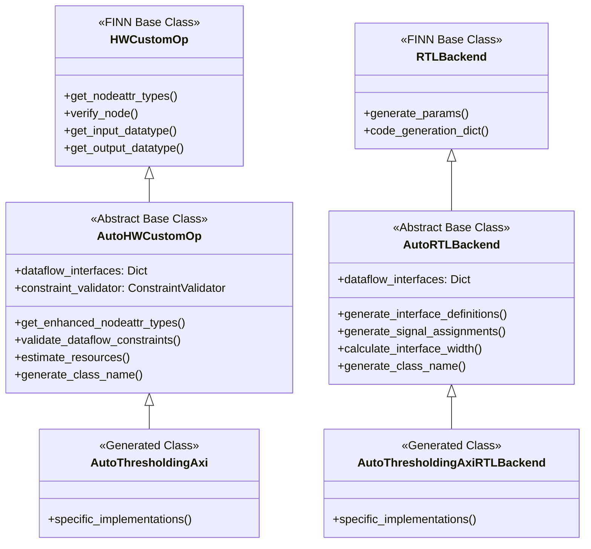

# AutoHWCustomOp and AutoRTLBackend Base Classes Implementation Plan

## Overview

This document outlines the implementation plan for creating `AutoHWCustomOp` and `AutoRTLBackend` base classes to improve the architecture of our Hardware Kernel Generator (HKG) system. These base classes will provide common functionality for auto-generated classes and fix the current class naming issues.

## Problem Statement

### Current Issues
1. **Class Naming Problem**: `thresholding_axi` → `AutoThresholdingaxi` (incorrect CamelCase)
2. **Code Duplication**: Common functionality duplicated across templates
3. **FINN Dependency**: Direct dependency on FINN classes in templates
4. **Testing Limitations**: Difficult to test without full FINN environment

### Expected Solution
1. **Correct Class Naming**: `thresholding_axi` → `AutoThresholdingAxi`
2. **Centralized Functionality**: Common code in base classes
3. **Better Abstraction**: Lightweight base classes defining interface contracts
4. **Enhanced Testing**: Standalone operation for development

## Architecture Design



## File Structure

```
brainsmith/
├── dataflow/
│   ├── core/
│   │   ├── auto_hw_custom_op.py      # AutoHWCustomOp base class
│   │   ├── auto_rtl_backend.py       # AutoRTLBackend base class
│   │   └── class_naming.py           # Class naming utilities
│   └── integration/
│       └── rtl_conversion.py         # Existing integration code
└── tools/
    └── hw_kernel_gen/
        ├── templates/
        │   ├── hw_custom_op.py.j2    # Updated to use AutoHWCustomOp
        │   └── rtl_backend.py.j2     # Updated to use AutoRTLBackend
        └── hkg.py                    # Updated class name generation
```

## Implementation Details

### 1. AutoHWCustomOp Base Class

**File**: `brainsmith/dataflow/core/auto_hw_custom_op.py`

**Key Features**:
- Dataflow interface management
- Constraint validation framework
- Resource estimation algorithms
- Class naming utilities
- Enhanced node attributes

**Core Methods** (Fully Implemented in Base Class):
```python
class AutoHWCustomOp:
    def __init__(self, onnx_node, **kwargs)
    def get_enhanced_nodeattr_types() -> Dict
    def validate_dataflow_constraints() -> ValidationResult
    
    # Fully standardized methods (no template generation needed)
    def get_input_datatype(self, ind: int = 0) -> DataType
    def get_output_datatype(self, ind: int = 0) -> DataType
    def get_normal_input_shape(self, ind: int = 0) -> List[int]
    def get_normal_output_shape(self, ind: int = 0) -> List[int]
    def get_folded_input_shape(self, ind: int = 0) -> List[int]
    def get_folded_output_shape(self, ind: int = 0) -> List[int]
    def get_instream_width(self, ind: int = 0) -> int
    def get_outstream_width(self, ind: int = 0) -> int
    def get_exp_cycles(self) -> int
    def get_op_and_param_counts(self) -> Dict
    def derive_characteristic_fxns(self) -> Dict
    def generate_params(self, model, path)
    
    # Resource estimation methods
    def estimate_bram_usage(self) -> int
    def estimate_lut_usage(self) -> int
    def estimate_dsp_usage(self) -> int
    
    # Utility methods
    def get_interface_config(self, interface_name: str) -> Dict
    @staticmethod
    def generate_class_name(kernel_name: str) -> str
    def _validate_datatype_constraints(interface_name: str, datatype: str) -> bool
```

**FINN Integration**:
```python
try:
    from finn.custom_op.fpgadataflow.hwcustomop import HWCustomOp
    FINN_AVAILABLE = True
except ImportError:
    FINN_AVAILABLE = False
    # Minimal stub for standalone operation
    class HWCustomOp:
        def __init__(self, onnx_node, **kwargs): pass
        def get_nodeattr_types(self): return {}
```

### 2. AutoRTLBackend Base Class

**File**: `brainsmith/dataflow/core/auto_rtl_backend.py`

**Key Features**:
- Interface code generation
- Signal assignment automation
- Parameter file generation
- Template context enhancement

**Core Methods**:
```python
class AutoRTLBackend:
    def __init__(self)
    def get_enhanced_nodeattr_types() -> Dict
    def generate_interface_definitions() -> List[Dict]
    def generate_signal_assignments() -> List[Dict]
    def calculate_interface_width(interface_name: str) -> int
    def generate_enhanced_code_dict() -> Dict
    @staticmethod
    def generate_class_name(kernel_name: str) -> str
    def _extract_weights_for_interface(interface_name: str, model) -> np.ndarray
    def _generate_config_values(interface_name: str, model) -> List[int]
```

### 3. Class Naming Utility

**File**: `brainsmith/dataflow/core/class_naming.py`

**Primary Function**:
```python
def generate_class_name(kernel_name: str, prefix: str = "Auto") -> str:
    """
    Convert kernel_name to proper CamelCase class name.
    
    Examples:
        thresholding_axi -> AutoThresholdingAxi
        conv_layer -> AutoConvLayer
        batch_norm -> AutoBatchNorm
    
    Args:
        kernel_name: Underscore-separated kernel name
        prefix: Class name prefix (default: "Auto")
        
    Returns:
        Properly formatted CamelCase class name
    """
    # Split on underscores and capitalize each part
    parts = kernel_name.split('_')
    camel_case = ''.join(word.capitalize() for word in parts)
    return f"{prefix}{camel_case}"
```

## Template Updates

### Current Template Structure
```jinja2
class {{ class_name }}(HWCustomOp):  # Direct FINN dependency
    def __init__(self, onnx_node, **kwargs):
        super().__init__(onnx_node, **kwargs)
        # 600+ lines of repeated method implementations...
        
    def get_input_datatype(self, ind: int = 0) -> DataType:
        # 30+ lines of template logic
        
    def get_normal_input_shape(self, ind: int = 0) -> List[int]:
        # 25+ lines of template logic
        
    # ... many more repeated methods
```

### New Template Structure
```jinja2
class {{ class_name }}(AutoHWCustomOp):  # Our base class
    def __init__(self, onnx_node, **kwargs):
        # Initialize with dataflow interfaces metadata
        super().__init__(onnx_node, **kwargs)
        
        # All standard methods inherited from base class
        # Templates now only need kernel-specific implementations
```

**Dramatic Simplification**: Templates go from ~600 lines to ~50 lines since all standard methods are implemented in the base class.

### Required Changes

1. **hw_custom_op.py.j2**:
   - **MAJOR SIMPLIFICATION**: Remove ~500 lines of method implementations
   - Change inheritance from `HWCustomOp` to `AutoHWCustomOp`
   - Keep only dataflow interface metadata definition
   - Remove all these methods (now in base class):
     - `get_input_datatype()` & `get_output_datatype()`
     - `get_normal_input_shape()` & `get_normal_output_shape()`
     - `get_folded_input_shape()` & `get_folded_output_shape()`
     - `get_instream_width()` & `get_outstream_width()`
     - `get_exp_cycles()`
     - `get_op_and_param_counts()`
     - `derive_characteristic_fxns()`
     - `generate_params()`
     - All resource estimation methods
   - Use `generate_class_name()` utility

2. **rtl_backend.py.j2**:
   - **MAJOR SIMPLIFICATION**: Remove ~200 lines of common method implementations
   - Change inheritance from `RTLBackend` to `AutoRTLBackend`
   - Keep only kernel-specific RTL generation logic
   - Use `generate_class_name()` utility

3. **hkg.py**:
   - Update class name generation to use `generate_class_name()` utility
   - Update template context to pass only essential kernel-specific data

## Implementation Phases

### Phase 1: Base Class Creation
1. Create `brainsmith/dataflow/core/auto_hw_custom_op.py`
2. Create `brainsmith/dataflow/core/auto_rtl_backend.py`
3. Create `brainsmith/dataflow/core/class_naming.py`
4. Add imports to `brainsmith/dataflow/core/__init__.py`

### Phase 2: Template Updates
1. Update `hw_custom_op.py.j2` template
2. Update `rtl_backend.py.j2` template
3. Update `hkg.py` class generation logic
4. Update template imports

### Phase 3: Testing & Validation
1. Update existing test cases
2. Create new test cases for base classes
3. Verify class naming fixes
4. Test standalone operation capabilities

## Expected Benefits

### Immediate Benefits
- ✅ **Fixed Class Naming**: `AutoThresholdingAxi` instead of `AutoThresholdingaxi`
- ✅ **Massive Template Simplification**: Templates reduced from ~600 lines to ~50 lines
- ✅ **Eliminated Code Duplication**: Standard methods implemented once in base class
- ✅ **Better Testing**: Can test without full FINN environment
- ✅ **Consistent Interface**: All generated classes follow same patterns
- ✅ **Faster Generation**: Much less template processing needed

### Long-term Benefits
- ✅ **Maintainability**: Changes to standard methods only need to be made in base class
- ✅ **Extensibility**: Easy to add new features to all generated classes
- ✅ **Validation**: Centralized constraint validation and error handling
- ✅ **Performance**: Optimized algorithms implemented once, used by all classes
- ✅ **Quality**: Thoroughly tested base implementations vs. generated code
- ✅ **Debugging**: Easier to debug base class methods vs. generated template code

## Testing Strategy

### Unit Tests
- Test class naming utility with various kernel names
- Test base class functionality in isolation
- Test FINN integration and fallback behavior

### Integration Tests
- Test template generation with new base classes
- Verify generated classes work correctly
- Test end-to-end workflow with new architecture

### Regression Tests
- Ensure existing functionality still works
- Verify no breaking changes to public APIs
- Test backward compatibility

## Risk Mitigation

### Potential Risks
1. **Breaking Changes**: Existing code might break with new architecture
2. **FINN Compatibility**: Changes might not be compatible with future FINN versions
3. **Performance Impact**: Additional abstraction layers might impact performance

### Mitigation Strategies
1. **Gradual Migration**: Implement base classes alongside existing templates initially
2. **Comprehensive Testing**: Extensive test coverage before replacing existing system
3. **Documentation**: Clear migration guide for users
4. **Backward Compatibility**: Maintain support for existing generated classes during transition

## Success Criteria

### Primary Goals
- [ ] Class naming issue resolved: `AutoThresholdingAxi` correctly generated
- [ ] Base classes successfully created and integrated
- [ ] Templates updated to use new base classes
- [ ] All existing tests pass with new architecture

### Secondary Goals
- [ ] Improved code maintainability and readability
- [ ] Enhanced testing capabilities
- [ ] Better separation of concerns
- [ ] Comprehensive documentation

## Next Steps

1. **Review and Approve Plan**: Get stakeholder approval for implementation approach
2. **Create Base Classes**: Implement `AutoHWCustomOp` and `AutoRTLBackend`
3. **Update Templates**: Modify Jinja2 templates to use new base classes
4. **Test and Validate**: Comprehensive testing of new architecture
5. **Deploy and Monitor**: Roll out changes and monitor for issues

---

*This implementation plan addresses the fundamental architectural issues in our HKG system and provides a solid foundation for future enhancements.*