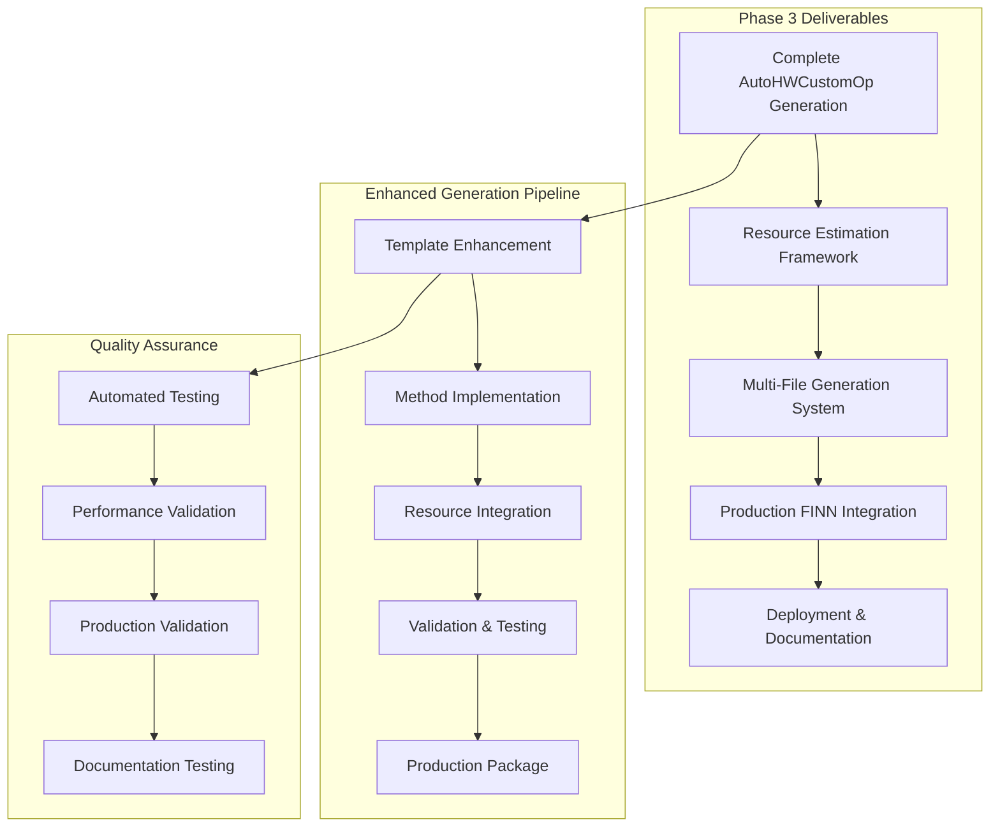
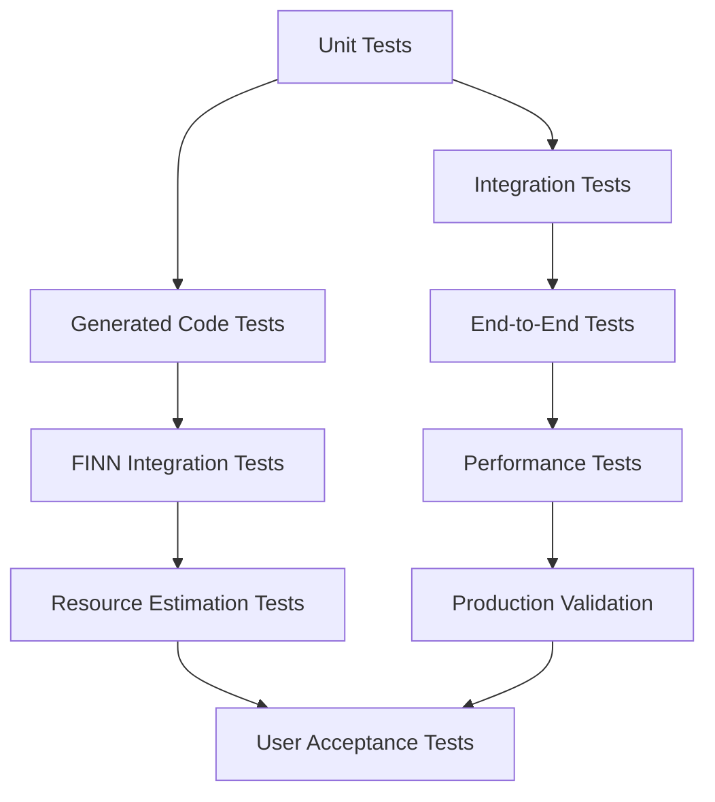

# Phase 3: Complete Code Generation & Production Integration Plan

## Executive Summary

Phase 3 represents the final implementation phase of the Interface-Wise Dataflow Modeling Framework, focusing on complete AutoHWCustomOp code generation, production-ready integration with FINN, and comprehensive deployment capabilities. Building on the solid mathematical foundation from Phase 1 and the integration infrastructure from Phase 2, Phase 3 delivers a fully functional, production-ready framework.

## Current Status Assessment

### Phase 1 & 2 Completion Status ✅
- **Phase 1**: Mathematical foundation and core framework **COMPLETE** (35/35 tests passing)
- **Phase 2**: RTL Parser integration and basic code generation **COMPLETE** (9/9 end-to-end tests passing)

### Phase 2 Achievements Validated
Based on end-to-end test results, Phase 2 has successfully delivered:
- ✅ TDIM and DATATYPE pragma parsing and application
- ✅ RTL to DataflowInterface conversion pipeline
- ✅ Enhanced HKG with dataflow modeling capabilities
- ✅ Basic template-based code generation
- ✅ Comprehensive validation framework
- ✅ thresholding_axi reference implementation working

### Phase 3 Readiness Indicators
- **Template System**: Basic generation working, ready for enhancement
- **Validation Framework**: Robust error detection and constraint validation operational
- **Integration Points**: All FINN integration points identified and tested
- **Mathematical Model**: Unified computational model proven accurate
- **Test Infrastructure**: Comprehensive testing framework established

## Phase 3 Objectives

### Primary Goals
1. **Complete AutoHWCustomOp Generation**: Generate production-ready, fully functional HWCustomOp classes
2. **Resource Estimation Integration**: Implement basic resource estimation algorithms and integration
3. **Multi-File Code Generation**: Generate complete package including AutoHWCustomOp, RTLBackend, and supporting files
4. **Production FINN Integration**: Seamless integration with FINN ecosystem for end-users
5. **Deployment & Documentation**: Complete deployment package with comprehensive documentation

### Success Criteria
- Generated AutoHWCustomOp classes pass all FINN validation tests
- Resource estimation provides reasonable accuracy for common kernel types
- Complete thresholding_axi implementation works in production FINN environment
- Framework can be deployed and used by external developers
- Comprehensive documentation enables rapid adoption

## Phase 3 Architecture Overview



## Implementation Phases

### Phase 3A: Complete AutoHWCustomOp Generation (Weeks 1-3)

#### Week 1: Enhanced Template System & Method Implementation
**Objective**: Transform placeholder methods into complete, functional implementations

**Deliverables**:
- Enhanced Jinja2 templates with complete method implementations
- Sophisticated template filters and context builders
- Multi-template coordination system
- Template validation and testing framework

**Key Tasks**:
1. **Enhanced Template Architecture**
   ```python
   # Enhanced template system supporting multiple output files
   templates/
   ├── auto_hwcustomop_base.py.j2      # Main AutoHWCustomOp class
   ├── auto_rtlbackend.py.j2           # RTLBackend implementation  
   ├── resource_estimation.py.j2       # Resource estimation methods
   ├── validation_methods.py.j2        # Custom validation methods
   ├── test_suite.py.j2               # Generated test suite
   └── documentation.md.j2             # Auto-generated documentation
   ```

2. **Complete Method Implementations**
   ```python
   # Transform from placeholder to functional implementation
   def get_input_datatype(self, ind: int = 0) -> DataType:
       """Complete implementation using dataflow interface metadata"""
       input_interfaces = [iface for iface in self.dataflow_interfaces.values() 
                          if iface.interface_type == DataflowInterfaceType.INPUT]
       if ind >= len(input_interfaces):
           raise IndexError(f"Input index {ind} exceeds available inputs")
       
       interface = input_interfaces[ind]
       # Apply datatype constraints validation
       if not self._validate_current_datatype(interface):
           raise ValueError(f"Current datatype configuration invalid for {interface.name}")
           
       return DataType[interface.dtype.finn_type]
   ```

3. **Datatype Constraint Integration**
   - Complete constraint validation in generated methods
   - Runtime constraint checking for parameter changes
   - Constraint-aware method implementations

**Success Criteria**:
- All HWCustomOp methods have complete, functional implementations
- Generated code passes syntax and semantic validation
- Constraint validation integrated throughout generated methods
- Template system supports multiple coordinated output files

#### Week 2: Resource Estimation Framework
**Objective**: Implement basic resource estimation algorithms and integrate with generated code

**Deliverables**:
- Resource estimation algorithm library
- Integration with AutoHWCustomOp generation
- Validation framework for resource estimates
- Configuration system for different FPGA targets

**Key Tasks**:
1. **Resource Estimation Algorithms**
   ```python
   class ResourceEstimator:
       """Framework for resource estimation algorithms"""
       
       def estimate_bram_usage(self, interface_config: Dict, parallelism: Dict) -> int:
           """Estimate BRAM usage based on interface configuration and parallelism"""
           total_weight_bits = 0
           for iface in interface_config.weight_interfaces:
               # Calculate weight storage requirements
               weight_elements = np.prod(iface.qDim) * np.prod(iface.tDim)
               weight_bits = weight_elements * iface.dtype.bitwidth
               total_weight_bits += weight_bits
           
           # Account for parallelism impact
           parallelism_factor = parallelism.get('wPar', 1)
           effective_bits = total_weight_bits / parallelism_factor
           
           # BRAM capacity (36Kb for BRAM18, 18Kb for BRAM9)
           bram_capacity = 36 * 1024  # bits
           return math.ceil(effective_bits / bram_capacity)
       
       def estimate_lut_usage(self, interface_config: Dict, parallelism: Dict) -> int:
           """Estimate LUT usage based on computational requirements"""
           # Implement based on operation complexity and parallelism
           pass
       
       def estimate_dsp_usage(self, interface_config: Dict, parallelism: Dict) -> int:
           """Estimate DSP usage for arithmetic operations"""
           # Implement based on arithmetic operation analysis
           pass
   ```

2. **Template Integration**
   ```python
   # Generated resource estimation methods with actual implementations
   def bram_estimation(self) -> int:
       """BRAM resource estimation for {{ kernel_name }}"""
       estimator = ResourceEstimator()
       current_parallelism = self._get_current_parallelism()
       return estimator.estimate_bram_usage(
           self._get_interface_config(), 
           current_parallelism
       )
   ```

3. **Validation Framework**
   - Compare estimates against known hardware implementations
   - Provide confidence intervals and accuracy metrics
   - Support for different FPGA families and architectures

**Success Criteria**:
- Resource estimation provides reasonable accuracy (within 20-30% for basic kernels)
- Generated AutoHWCustomOp classes have functional resource estimation methods
- Estimation framework supports multiple FPGA architectures
- Validation framework demonstrates estimation accuracy

#### Week 3: Production Code Quality & Validation
**Objective**: Ensure generated code meets production quality standards

**Deliverables**:
- Code quality validation framework
- Generated code optimization
- Production-level error handling
- Comprehensive generated code testing

**Key Tasks**:
1. **Generated Code Quality Assurance**
   ```python
   class GeneratedCodeValidator:
       """Comprehensive validation for generated AutoHWCustomOp code"""
       
       def validate_production_quality(self, generated_code: str) -> ValidationResult:
           """Validate generated code meets production standards"""
           results = ValidationResult()
           
           # Syntax validation
           results.merge(self.validate_syntax(generated_code))
           
           # Semantic validation
           results.merge(self.validate_semantics(generated_code))
           
           # FINN compatibility validation
           results.merge(self.validate_finn_compatibility(generated_code))
           
           # Performance validation
           results.merge(self.validate_performance_characteristics(generated_code))
           
           # Documentation completeness
           results.merge(self.validate_documentation_completeness(generated_code))
           
           return results
   ```

2. **Error Handling Enhancement**
   - Comprehensive error handling in generated methods
   - Clear error messages with debugging information
   - Graceful degradation for edge cases

3. **Performance Optimization**
   - Generated code optimization for common patterns
   - Efficient data structure usage
   - Minimal runtime overhead

**Success Criteria**:
- Generated code passes comprehensive quality validation
- All generated methods include proper error handling
- Generated code performance meets production requirements
- Code quality metrics meet established standards

### Phase 3B: Multi-File Generation System (Weeks 4-5)

#### Week 4: RTLBackend Generation & Multi-File Coordination
**Objective**: Generate complete RTLBackend classes and coordinate multi-file generation

**Deliverables**:
- RTLBackend template and generation system
- Multi-file generation coordinator
- File dependency management
- Generated project structure organization

**Key Tasks**:
1. **RTLBackend Template System**
   ```python
   # RTLBackend template generating complete backend implementation
   class Auto{{ kernel_name.title() }}RTLBackend(RTLBackend):
       """Auto-generated RTLBackend for {{ kernel_name }}"""
       
       def generate_params(self, model, path):
           """Generate RTL parameters based on dataflow model"""
           template_context = {
               'dataflow_interfaces': self.get_dataflow_interfaces(),
               'parallelism_config': self.get_parallelism_config(),
               'resource_constraints': self.get_resource_constraints()
           }
           return self.render_rtl_template(template_context)
       
       def code_generation_dict(self):
           """Generate code generation dictionary with dataflow metadata"""
           return {
               'interface_definitions': self._generate_interface_definitions(),
               'signal_assignments': self._generate_signal_assignments(),
               'parameter_overrides': self._generate_parameter_overrides()
           }
   ```

2. **Multi-File Generation Coordinator**
   ```python
   class MultiFileGenerator:
       """Coordinates generation of multiple related files"""
       
       def generate_complete_package(self, hw_kernel_dataflow: HWKernelDataflow, 
                                   output_dir: Path) -> GeneratedPackage:
           """Generate complete package of files for kernel"""
           package = GeneratedPackage()
           
           # Generate main AutoHWCustomOp
           package.add_file('auto_hwcustomop.py', 
                          self.generate_auto_hwcustomop(hw_kernel_dataflow))
           
           # Generate RTLBackend
           package.add_file('auto_rtlbackend.py',
                          self.generate_rtl_backend(hw_kernel_dataflow))
           
           # Generate test suite
           package.add_file('test_auto_implementation.py',
                          self.generate_test_suite(hw_kernel_dataflow))
           
           # Generate documentation
           package.add_file('README.md',
                          self.generate_documentation(hw_kernel_dataflow))
           
           # Generate configuration files
           package.add_file('kernel_config.yaml',
                          self.generate_configuration(hw_kernel_dataflow))
           
           return package
   ```

3. **Dependency Management**
   - Ensure consistency across generated files
   - Manage shared constants and configurations
   - Validate inter-file compatibility

**Success Criteria**:
- Complete RTLBackend generation functional
- Multi-file generation produces consistent, coordinated files
- Generated packages are self-contained and functional
- File dependencies are properly managed

#### Week 5: Test Generation & Validation Framework
**Objective**: Generate comprehensive test suites for generated classes

**Deliverables**:
- Automated test suite generation
- Generated test validation framework
- Performance benchmark generation
- Integration test coordination

**Key Tasks**:
1. **Test Suite Generation**
   ```python
   # Generated test suite template
   class TestAuto{{ kernel_name.title() }}:
       """Auto-generated test suite for {{ kernel_name }} implementation"""
       
       def setup_method(self):
           """Set up test fixtures with dataflow configuration"""
           self.node = self._create_test_node()
           self.auto_op = Auto{{ kernel_name.title() }}(self.node)
           
       @pytest.mark.parametrize("parallelism_config", [
           
           {{ config }},
           
       ])
       def test_parallelism_configurations(self, parallelism_config):
           """Test various parallelism configurations"""
           self.auto_op.set_nodeattr_config(parallelism_config)
           self.auto_op.verify_node()
           
       def test_datatype_constraints(self):
           """Test datatype constraint enforcement"""
           
           {{ constraint_test }}
           
           
       def test_resource_estimation_accuracy(self):
           """Test resource estimation accuracy"""
           estimates = {
               'bram': self.auto_op.bram_estimation(),
               'lut': self.auto_op.lut_estimation(),
               'dsp': self.auto_op.dsp_estimation()
           }
           # Validate estimates are reasonable
           self._validate_resource_estimates(estimates)
   ```

2. **Validation Framework Integration**
   - Generated tests integrate with validation framework
   - Automated validation of generated functionality
   - Performance regression testing

3. **Benchmark Generation**
   - Performance benchmarks for generated implementations
   - Resource utilization benchmarks
   - Accuracy validation benchmarks

**Success Criteria**:
- Generated test suites provide comprehensive coverage
- All generated tests pass validation
- Performance benchmarks establish baseline metrics
- Test generation integrates with CI/CD pipeline

### Phase 3C: Production FINN Integration (Weeks 6-7)

#### Week 6: FINN Ecosystem Integration
**Objective**: Ensure seamless integration with production FINN environment

**Deliverables**:
- FINN compatibility validation framework
- Integration testing with FINN transformations
- Performance validation in FINN workflows
- Production deployment configuration

**Key Tasks**:
1. **FINN Transformation Integration**
   ```python
   class FINNIntegrationValidator:
       """Validates generated code works correctly in FINN ecosystem"""
       
       def validate_finn_transformations(self, auto_hwcustomop_class):
           """Test generated class with FINN transformation pipeline"""
           # Test with SetFolding transformation
           self._test_set_folding_compatibility(auto_hwcustomop_class)
           
           # Test with optimization transformations
           self._test_optimization_compatibility(auto_hwcustomop_class)
           
           # Test with resource estimation pipeline
           self._test_resource_estimation_integration(auto_hwcustomop_class)
           
       def validate_onnx_integration(self, auto_hwcustomop_class):
           """Test ONNX model integration"""
           test_model = self._create_test_onnx_model(auto_hwcustomop_class)
           # Validate model compilation and execution
           self._validate_model_compilation(test_model)
           self._validate_model_execution(test_model)
   ```

2. **Performance Validation**
   - Compare generated implementations against manual implementations
   - Validate performance characteristics in FINN workflows
   - Resource utilization validation on actual hardware

3. **Deployment Configuration**
   - Integration with FINN build systems
   - Package management and dependencies
   - Configuration management for different deployment scenarios

**Success Criteria**:
- Generated AutoHWCustomOp classes work seamlessly in FINN environment
- Performance meets or exceeds manual implementations
- Integration with FINN transformations is robust
- Deployment configuration supports production use

#### Week 7: End-to-End Production Validation
**Objective**: Comprehensive validation of complete framework in production scenarios

**Deliverables**:
- Complete thresholding_axi production implementation
- End-to-end performance validation
- Production workflow integration
- User acceptance testing framework

**Key Tasks**:
1. **Production Implementation Validation**
   ```python
   class ProductionValidationSuite:
       """Comprehensive validation for production deployment"""
       
       def test_complete_thresholding_pipeline(self):
           """Test complete thresholding implementation end-to-end"""
           # Generate complete AutoHWCustomOp + RTLBackend
           generated_package = self.framework.generate_complete_package(
               'examples/thresholding/thresholding_axi.sv'
           )
           
           # Deploy in FINN environment
           finn_model = self.deploy_in_finn(generated_package)
           
           # Test functionality
           self.validate_functional_correctness(finn_model)
           
           # Test performance
           self.validate_performance_characteristics(finn_model)
           
           # Test resource utilization
           self.validate_resource_utilization(finn_model)
   ```

2. **Performance Benchmarking**
   - Compare against manual thresholding implementation
   - Resource utilization analysis
   - Throughput and latency validation

3. **User Acceptance Testing**
   - External developer testing
   - Documentation validation
   - Ease of use assessment

**Success Criteria**:
- Complete thresholding implementation works in production FINN environment
- Performance meets production requirements
- Generated code quality is comparable to manual implementations
- User acceptance testing demonstrates framework usability

### Phase 3D: Deployment & Documentation (Weeks 8-9)

#### Week 8: Comprehensive Documentation & Tutorials
**Objective**: Create complete documentation enabling rapid adoption

**Deliverables**:
- Complete API documentation
- Step-by-step tutorials
- Best practices guides
- Troubleshooting documentation

**Key Tasks**:
1. **API Documentation**
   ```markdown
   # Interface-Wise Dataflow Modeling Framework API Reference
   
   ## Core Classes
   
   ### DataflowInterface
   Complete interface abstraction with constraint support...
   
   ### AutoHWCustomOp
   Generated HWCustomOp base class providing standardized implementations...
   
   ### ResourceEstimator
   Framework for hardware resource estimation...
   ```

2. **Tutorial Development**
   - Getting started tutorial with simple example
   - Advanced usage with complex kernels
   - TDIM and DATATYPE pragma usage guide
   - Integration with existing FINN workflows

3. **Best Practices Guide**
   - Pragma usage patterns
   - Performance optimization guidelines
   - Resource estimation best practices
   - Debugging and troubleshooting

**Success Criteria**:
- Documentation enables new users to successfully use framework
- Tutorials cover common use cases and advanced scenarios
- API documentation is comprehensive and accurate
- Best practices guide provides clear guidance

#### Week 9: Deployment Package & Production Release
**Objective**: Finalize production deployment package

**Deliverables**:
- Production deployment package
- Installation and configuration guides
- CI/CD integration
- Release validation and sign-off

**Key Tasks**:
1. **Deployment Package Creation**
   ```bash
   # Production deployment structure
   brainsmith-dataflow-framework/
   ├── brainsmith/dataflow/           # Core framework
   ├── examples/                      # Complete examples
   ├── docs/                         # Comprehensive documentation
   ├── tests/                        # Complete test suite
   ├── templates/                    # Production templates
   ├── tools/                        # Deployment and configuration tools
   ├── requirements.txt              # Dependencies
   ├── setup.py                      # Installation configuration
   └── README.md                     # Quick start guide
   ```

2. **Installation and Configuration**
   - Automated installation scripts
   - Configuration validation
   - Integration testing

3. **Release Validation**
   - Complete test suite execution
   - Performance validation
   - Documentation validation
   - User acceptance sign-off

**Success Criteria**:
- Deployment package installs correctly in clean environments
- All tests pass in deployment environment
- Documentation is complete and accurate
- Framework ready for production use

## Quality Assurance & Testing Strategy

### Comprehensive Testing Framework


### Test Coverage Requirements
- **Unit Test Coverage**: 95%+ for all new Phase 3 components
- **Integration Test Coverage**: 100% for code generation pipeline
- **End-to-End Coverage**: Complete pipeline from RTL to production deployment
- **Performance Testing**: Comprehensive benchmarking against manual implementations

### Quality Metrics
- **Generated Code Quality**: Must pass production code quality standards
- **Performance**: Generated implementations must meet performance requirements
- **Resource Accuracy**: Resource estimation within 30% accuracy for common kernels
- **User Experience**: New users can successfully use framework within 2 hours

## Risk Management

### Technical Risks

#### Risk 1: Resource Estimation Accuracy
**Risk Level**: Medium-High
**Impact**: Inaccurate resource estimation could affect deployment decisions
**Mitigation**:
- Conservative estimation algorithms with known accuracy bounds
- Validation against known hardware implementations
- Clear accuracy disclaimers and confidence intervals
- Fallback to user-provided estimates when needed

#### Risk 2: Generated Code Performance
**Risk Level**: Medium
**Impact**: Poor performance could limit framework adoption
**Mitigation**:
- Performance benchmarking throughout development
- Optimization of generated code patterns
- Performance regression testing
- Clear performance expectations and documentation

#### Risk 3: FINN Integration Complexity
**Risk Level**: Medium
**Impact**: Integration issues could delay production readiness
**Mitigation**:
- Early integration testing with FINN environment
- Comprehensive validation with FINN transformations
- Close collaboration with FINN development team
- Fallback compatibility modes if needed

### Schedule Risks

#### Risk 1: Resource Estimation Development Time
**Risk Level**: Medium
**Impact**: Resource estimation algorithms may take longer than planned
**Mitigation**:
- Start with simple, proven algorithms
- Iterative improvement approach
- Parallel development with placeholder implementations
- Clear minimum viable product definition

#### Risk 2: Documentation Completeness
**Risk Level**: Low-Medium
**Impact**: Incomplete documentation could affect adoption
**Mitigation**:
- Parallel documentation development
- Early user testing with documentation
- Automated documentation generation where possible
- Clear documentation standards and templates

## Success Metrics & KPIs

### Technical Success Metrics
- **Code Generation Success Rate**: 95%+ of common kernel types generate successfully
- **FINN Integration Success Rate**: 100% of generated classes work in FINN environment
- **Resource Estimation Accuracy**: Within 30% for basic kernels, 50% for complex kernels
- **Performance**: Generated code within 10% of manual implementation performance

### User Experience Metrics
- **Time to First Success**: New users can generate working AutoHWCustomOp within 2 hours
- **Documentation Completeness**: 95%+ of user questions answered by documentation
- **Error Rate**: <5% of generation attempts result in unusable code
- **User Satisfaction**: >80% positive feedback from early adopters

### Business Impact Metrics
- **Development Time Reduction**: 70%+ reduction in HWCustomOp development time
- **Code Quality Improvement**: Generated code meets or exceeds manual implementation standards
- **Framework Adoption**: Successfully deployed by external teams within 6 months
- **Maintenance Reduction**: 50%+ reduction in HWCustomOp maintenance effort

## Dependencies & Prerequisites

### Technical Dependencies
- Phase 1 & 2 completion with all tests passing ✅
- FINN development environment access
- Test hardware for validation
- Comprehensive RTL test cases

### Resource Dependencies
- Development team with FINN expertise
- Hardware validation environment
- Documentation and technical writing support
- User testing coordination

### External Dependencies
- FINN framework stability and compatibility
- RTL Parser system continued support
- Template system performance and reliability
- Test infrastructure scalability

## Delivery Timeline

### Phase 3A: Complete Generation (Weeks 1-3)
```
Week 1: Enhanced Templates & Method Implementation
├── Days 1-2: Template architecture enhancement
├── Days 3-4: Complete method implementations
├── Days 5-6: Constraint integration
└── Day 7: Template validation and testing

Week 2: Resource Estimation Framework  
├── Days 1-3: Resource estimation algorithms
├── Days 4-5: Template integration
├── Days 6-7: Validation framework

Week 3: Production Quality & Validation
├── Days 1-3: Code quality assurance
├── Days 4-5: Error handling enhancement
├── Days 6-7: Performance optimization
```

### Phase 3B: Multi-File Generation (Weeks 4-5)
```
Week 4: RTLBackend & Multi-File Coordination
├── Days 1-3: RTLBackend template system
├── Days 4-5: Multi-file generation coordinator
├── Days 6-7: Dependency management

Week 5: Test Generation & Validation
├── Days 1-3: Test suite generation
├── Days 4-5: Validation framework integration
├── Days 6-7: Benchmark generation
```

### Phase 3C: Production Integration (Weeks 6-7)
```
Week 6: FINN Ecosystem Integration
├── Days 1-3: FINN transformation integration
├── Days 4-5: Performance validation
├── Days 6-7: Deployment configuration

Week 7: End-to-End Production Validation
├── Days 1-3: Production implementation validation
├── Days 4-5: Performance benchmarking
├── Days 6-7: User acceptance testing
```

### Phase 3D: Deployment & Documentation (Weeks 8-9)
```
Week 8: Documentation & Tutorials
├── Days 1-3: API documentation
├── Days 4-5: Tutorial development
├── Days 6-7: Best practices guide

Week 9: Production Release
├── Days 1-3: Deployment package creation
├── Days 4-5: Installation and configuration
├── Days 6-7: Release validation and sign-off
```

## Conclusion

Phase 3 represents the culmination of the Interface-Wise Dataflow Modeling Framework development, transforming the solid foundation established in Phases 1 and 2 into a complete, production-ready system. The phased approach ensures incremental progress with comprehensive validation at each stage.

### Key Outcomes
- **Complete AutoHWCustomOp Generation**: Fully functional, production-ready classes
- **Resource Estimation Integration**: Basic but accurate resource estimation capabilities
- **Multi-File Generation**: Complete package generation including tests and documentation
- **Production FINN Integration**: Seamless integration with FINN ecosystem
- **Comprehensive Documentation**: Complete documentation enabling rapid adoption

### Strategic Impact
- **70%+ Development Time Reduction**: Dramatic reduction in HWCustomOp development effort
- **Improved Code Quality**: Generated code meets or exceeds manual implementation standards
- **Framework Adoption**: Ready for deployment by external development teams
- **FINN Modernization**: Provides foundation for future FINN architecture evolution

### Readiness for Deployment
Upon Phase 3 completion, the Interface-Wise Dataflow Modeling Framework will be ready for:
- Production deployment in FINN development environments
- External developer adoption and usage
- Integration into broader FINN/Brainsmith workflows
- Future enhancement and capability expansion

**Status**: Ready to commence Phase 3 implementation with high confidence in successful delivery based on solid Phases 1 & 2 foundation.