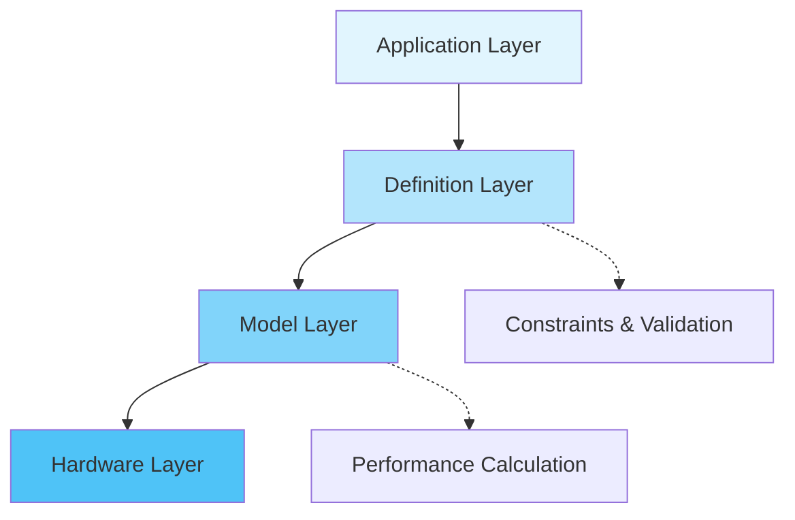
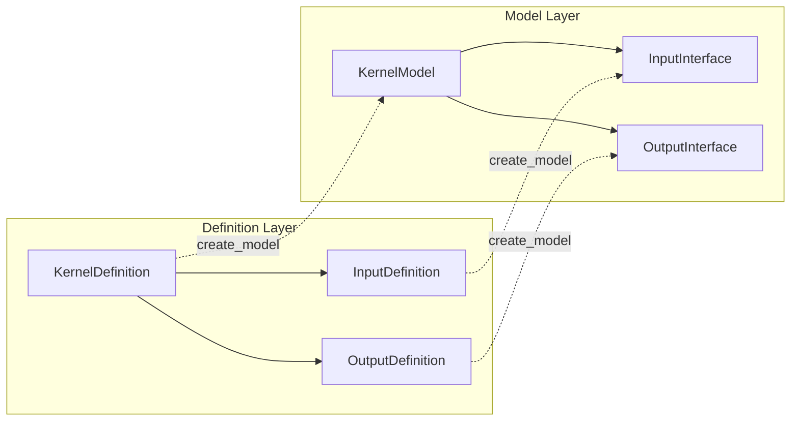
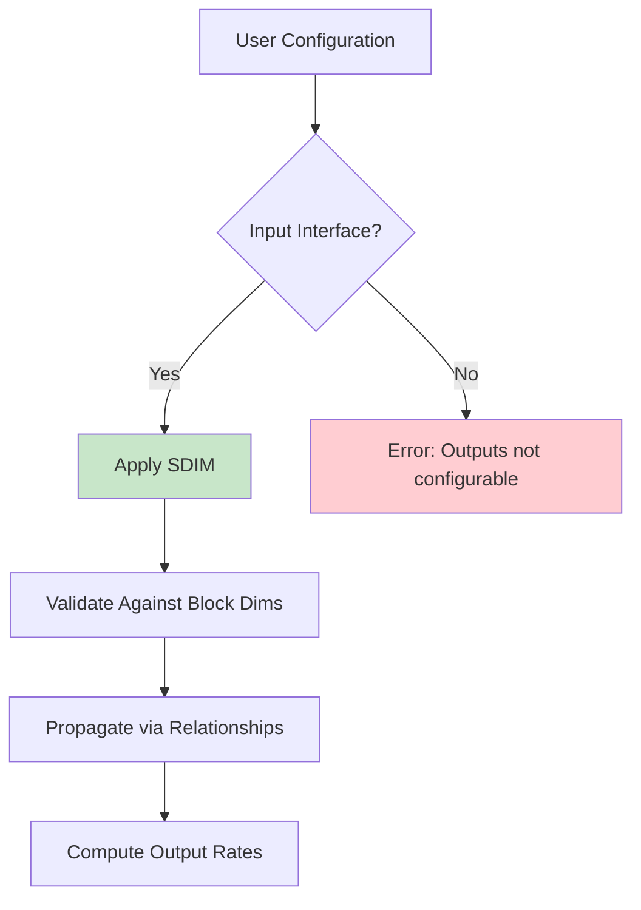
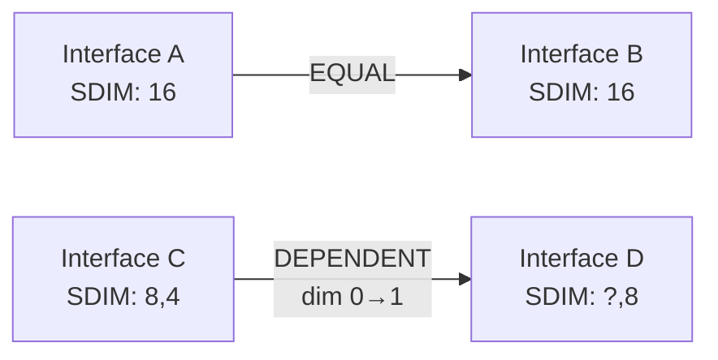

# Dataflow Module Architecture

## Overview

The Brainsmith Dataflow module provides a comprehensive type system and abstraction layer for representing hardware accelerator kernels on FPGAs. It bridges high-level PyTorch models to low-level RTL implementations through a clean, validated API.

## Design Philosophy

### 1. Separation of Concerns



- **Definitions**: Immutable schemas with constraints
- **Models**: Runtime instances with concrete values
- **Clear boundaries**: Each layer has distinct responsibilities

### 2. Type Safety First

```python
# Compile-time type safety through separate classes
InputDefinition   # Can only create InputInterface
OutputDefinition  # Can only create OutputInterface
KernelDefinition  # Orchestrates all interfaces

# Runtime validation
datatype_constraints=[DatatypeConstraintGroup("INT", 8, 16)]
# ✓ INT8, INT16 allowed
# ✗ FLOAT32 rejected at model creation
```

### 3. QONNX Integration

Uses industry-standard QONNX types exclusively:
- No custom type system to maintain
- Direct FINN compatibility
- Comprehensive hardware type support

## Core Architecture

### Layer Structure

```
┌─────────────────────────────────────────────────────────┐
│                  Application Layer                      │
│         PyTorch Models, ONNX Graphs, User Code          │
├─────────────────────────────────────────────────────────┤
│                  Definition Layer                       │
│    InputDefinition   OutputDefinition   KernelDefinition│
│    (Schemas, Constraints, Relationships, Validation)     │
├─────────────────────────────────────────────────────────┤
│                    Model Layer                          │
│    InputInterface    OutputInterface    KernelModel     │
│    (Runtime Instances, Concrete Types, Performance)     │
├─────────────────────────────────────────────────────────┤
│                   Support Layer                         │
│    Relationships    Tiling System    QONNX Types        │
│    (Constraints, Expressions, Type Validation)          │
└─────────────────────────────────────────────────────────┘
```

### Component Relationships



## Data Hierarchy

The system models four levels of data granularity:

```
Tensor Level (Complete Data)
    ↓ Block Tiling
Block Level (Processing Unit)
    ↓ Stream Tiling  
Stream Level (Per Clock Cycle)
    ↓ Element Access
Element Level (Individual Values)
```

### Example: Conv2D Processing

```python
# Tensor: [1, 256, 224, 224]  # Full image
# Block:  [1, 64, 14, 14]     # Process in tiles
# Stream: [1, 8, 1, 1]        # 8 channels/clock
# Element: INT8               # Individual pixels
```

## Key Design Patterns

### 1. Definition/Model Split

**Why?**
- Immutability: Definitions are reusable templates
- Flexibility: One definition → many configurations
- Validation: Constraints checked once at model creation

```python
# Definition (what CAN be)
input_def = InputDefinition(
    name="data",
    datatype_constraints=[...],  # Allowed types
    block_tiling=["BATCH", "CH"]  # Parameterized
)

# Model (what IS)
input_model = input_def.create_model(
    tensor_dims=(32, 128),
    datatype=DataType["INT8"],  # Concrete type
    parameter_binding={"BATCH": 1, "CH": 16}
)
```

### 2. Separate Input/Output Classes

**Why?**
- Type safety: Can't misconfigure outputs
- Clarity: Different semantics and capabilities
- SDIM control: Only inputs are configurable

```python
# Inputs have configurable streaming
input_interface.sdim = [8, 16]  # ✓ Allowed

# Outputs compute their rates
output_interface.sdim = [...]    # ✗ Not allowed
output_interface.streaming_rate  # ✓ Computed value
```

### 3. Constraint-Based Validation

**Why?**
- Early error detection
- Clear error messages
- Composable constraints

```python
# Datatype constraints
DatatypeConstraintGroup("INT", 8, 16)  # Range of widths

# Dimensional relationships
RelationType.EQUAL      # Dimensions must match
RelationType.DEPENDENT  # Computed from source
RelationType.MULTIPLE   # Factor relationship
```

### 4. Tiling Expression System

**Why?**
- Declarative: Say what, not how
- Flexible: Mix fixed and parameterized
- Validated: Checked at compile and runtime

```python
# Expression types in tiling
[1,         # Singleton (no tiling)
 "PARAM",   # Runtime parameter
 ":",       # Full dimension
 32]        # Fixed size
```

## SDIM Architecture

### Streaming Dimension (SDIM) Control Flow



### SDIM Principles

1. **Input-Only Configuration**: Outputs derive their rates
2. **Relationship Propagation**: DEPENDENT relationships spread SDIM
3. **Validation**: SDIM ≤ block dimensions
4. **Performance Impact**: Directly affects bandwidth calculations

## Relationship System

### Relationship Types

```python
# 1. EQUAL - Full equality
add_relationship("A", "B", RelationType.EQUAL)
# A.shape == B.shape, A.sdim == B.sdim

# 2. DEPENDENT - Dimension-specific
add_relationship("A", "B", RelationType.DEPENDENT,
                source_dim=1, target_dim=0)
# B[0] depends on A[1]

# 3. MULTIPLE - Scaling factor
add_relationship("input", "output", RelationType.MULTIPLE,
                factor=4)
# output.size == 4 * input.size
```

### Propagation Rules



## Performance Modeling

### Metrics Calculation

```python
# Bandwidth = Elements × Frequency
streaming_bandwidth = prod(sdim)  # elements/cycle
bandwidth_bits = streaming_bandwidth * datatype.bitwidth()

# Throughput = Frequency / InitiationInterval  
initiation_interval = tensor_size / streaming_bandwidth
throughput_fps = clock_freq / initiation_interval
```

### Performance Hierarchy

```
KernelModel.calculate_performance_metrics()
    ├── Input Metrics
    │   ├── streaming_bandwidth
    │   ├── bandwidth_bits
    │   └── initiation_interval
    ├── Output Metrics
    │   ├── streaming_rate
    │   └── bandwidth_bits
    └── Aggregate Metrics
        ├── total_bandwidth_mbps
        └── throughput_fps
```

## Integration Points

### RTL Parser Integration

```
RTL with Pragmas → Parser → KernelDefinition → FINN HWCustomOp
                              ↓
                          KernelModel → Performance Analysis
```

### FINN Code Generation

```python
# Automatic parameter extraction
kernel_def.get_required_parameters()
# → {"SIMD": "input_stream_tiling", ...}

# Maps to FINN nodeattr_types
def get_nodeattr_types(self):
    return {
        "SIMD": ('i', False, 1),
        "PE": ('i', False, 1),
        # ... extracted parameters
    }
```

## Design Rationale

### Why Not Unified Interface Class?

Previous design had single Interface class with direction enum:
- **Problem**: Easy to misconfigure outputs with SDIM
- **Problem**: Different validation rules mixed together
- **Solution**: Separate classes enforce correct usage

### Why SDIM Over iPar?

Legacy iPar was ambiguous scalar:
- **Problem**: Which dimension does iPar=16 apply to?
- **Problem**: Can't have different streaming per dimension
- **Solution**: SDIM is explicit per-dimension control

### Why QONNX Types?

Custom type system was maintenance burden:
- **Problem**: Duplicating QONNX functionality
- **Problem**: Integration required translation
- **Solution**: Use industry standard directly

## Best Practices

### 1. Definition Reuse
```python
# Create once, use many times
CONV_INPUT_DEF = InputDefinition(...)

# Different models from same definition
small_model = CONV_INPUT_DEF.create_model(tensor_dims=(28, 28), ...)
large_model = CONV_INPUT_DEF.create_model(tensor_dims=(224, 224), ...)
```

### 2. Validate Early
```python
# Check definition consistency
errors = kernel_def.validate()
if errors:
    raise ValueError(f"Invalid kernel: {errors}")
```

### 3. Use Relationships
```python
# Express constraints explicitly
kernel_def.add_relationship("weights", "output", 
                          RelationType.DEPENDENT,
                          source_dim=0, target_dim=1)
```

### 4. Parameter Naming
```python
# Use descriptive parameter names
block_tiling=["BATCH_TILES", "CHANNEL_TILES"]  # Clear
block_tiling=["M", "N"]  # Ambiguous
```

## Future Extensions

### Planned Enhancements

1. **Expression Evaluator**: Complex constraint expressions
2. **Auto-Tuning**: Automatic parameter optimization
3. **Multi-Kernel**: Pipeline and dataflow graphs
4. **Profiling**: Runtime performance tracking

### Extension Points

- Custom relationship types via `coupling_func`
- New tiling strategies in `TilingStrategy`
- Additional validation in constraint system
- Performance model refinements

## Summary

The Dataflow architecture provides:
- **Type Safety**: Separate input/output classes
- **Flexibility**: Definition/model separation  
- **Validation**: Comprehensive constraint checking
- **Performance**: Accurate modeling and metrics
- **Integration**: Direct FINN compatibility

This clean separation of concerns enables both correctness and optimization in the hardware accelerator design flow.