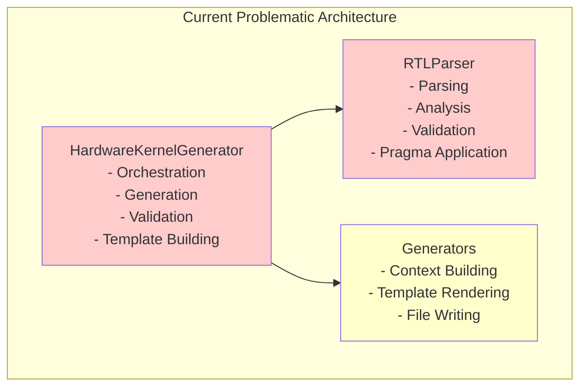
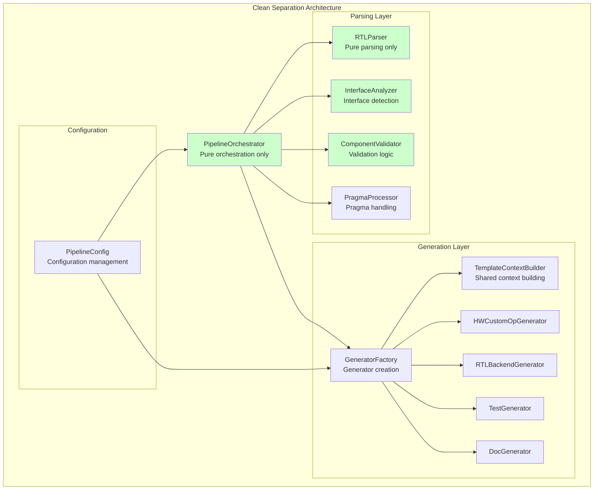

# Phase 2: Architectural Refactoring - Proposal and Implementation Plan

## Executive Summary

Phase 2 focuses on **Architectural Refactoring** to address the core separation of concerns violations identified in the issues analysis. Building on the solid foundation established by Phase 1, this phase will restructure the system architecture to achieve clean separation between orchestration, generation, parsing, and validation responsibilities.

**Timeline**: 2-4 weeks  
**Priority**: Medium  
**Risk Level**: Medium (architectural changes)  
**Dependencies**: Phase 1 (Complete) ✅

## Phase 2 Objectives

### Primary Goals
1. **Separate Orchestration from Generation** - Extract generation logic from HardwareKernelGenerator
2. **Extract Parser Responsibilities** - Separate parsing, analysis, and validation concerns
3. **Create Shared Template Context Builder** - Eliminate code duplication in template context building
4. **Establish Component Reusability** - Enable independent use of all generators and components

### Success Metrics
- **Cyclomatic Complexity**: Reduce average from ~15 to <10 per method
- **Code Duplication**: Reduce from ~20% to <5%
- **Component Independence**: All generators usable in isolation
- **Separation of Concerns**: Clear single responsibility per class

## Architectural Vision

### Current Architecture Issues


### Target Architecture


## Detailed Implementation Plan

### Week 1: Foundation Refactoring

#### Task 1.1: Create Configuration Framework (Days 1-2)

**Objective**: Establish centralized configuration management

```python
# Create brainsmith/tools/hw_kernel_gen/config.py
@dataclass
class PipelineConfig:
    """Central configuration for the generation pipeline."""
    
    # Input configuration
    rtl_file_path: Path
    compiler_data_path: Path
    output_dir: Path
    custom_doc_path: Optional[Path] = None
    
    # Processing configuration
    debug_enabled: bool = True
    dataflow_enabled: bool = True
    validation_enabled: bool = True
    
    # Template configuration
    template_dir: Optional[Path] = None
    template_cache_enabled: bool = True
    template_cache_size: int = 400
    
    # Generator configuration
    generators_enabled: Set[str] = field(default_factory=lambda: {
        "hwcustomop", "rtlbackend", "test", "documentation"
    })
    
    # Output configuration
    class_name_override: Optional[str] = None
    file_naming_strategy: str = "default"  # default, explicit, custom
    
    @classmethod
    def from_args(cls, **kwargs) -> "PipelineConfig":
        """Create configuration from command line arguments or dict."""
        
    def validate(self) -> ValidationResult:
        """Validate configuration consistency and file availability."""

@dataclass 
class GenerationConfig:
    """Configuration specific to code generation."""
    template_config: TemplateConfig
    backend_config: BackendConfig
    test_config: TestConfig
    doc_config: DocumentationConfig

@dataclass
class TemplateConfig:
    """Template-specific configuration."""
    template_dir: Path
    cache_enabled: bool = True
    cache_size: int = 400
    auto_reload: bool = False
    strict_undefined: bool = True
```

#### Task 1.2: Extract Template Context Builder (Days 2-3)

**Objective**: Centralize template context building logic

```python
# Create brainsmith/tools/hw_kernel_gen/template_context.py
@dataclass
class BaseContext:
    """Base template context used by all generators."""
    kernel_name: str
    class_name: str
    source_file: str
    generation_timestamp: str
    rtl_parameters: List[Dict[str, Any]]
    rtl_interfaces: Dict[str, Interface]
    rtl_pragmas: List[Pragma]

@dataclass
class HWCustomOpContext(BaseContext):
    """HWCustomOp-specific template context."""
    dataflow_interfaces: List[InterfaceTemplateData]
    weight_interfaces_count: int
    kernel_complexity: str
    kernel_type: str
    resource_estimation_required: bool

@dataclass
class RTLBackendContext(BaseContext):
    """RTLBackend-specific template context."""
    dataflow_model: Optional[DataflowModel]
    backend_type: str
    synthesis_config: Dict[str, Any]

class TemplateContextBuilder:
    """Centralized template context building with caching."""
    
    def __init__(self, config: TemplateConfig):
        self.config = config
        self._context_cache: Dict[str, BaseContext] = {}
    
    def build_base_context(self, hw_kernel: HWKernel, config: PipelineConfig) -> BaseContext:
        """Build common context used by all generators."""
        cache_key = f"base_{hw_kernel.name}_{config.rtl_file_path}"
        
        if cache_key not in self._context_cache:
            context = BaseContext(
                kernel_name=hw_kernel.name,
                class_name=self._generate_class_name(hw_kernel.name, config),
                source_file=str(config.rtl_file_path.name),
                generation_timestamp=datetime.now().isoformat(),
                rtl_parameters=self._process_parameters(hw_kernel.parameters),
                rtl_interfaces=hw_kernel.interfaces,
                rtl_pragmas=hw_kernel.pragmas
            )
            self._context_cache[cache_key] = context
        
        return self._context_cache[cache_key]
    
    def build_hwcustomop_context(self, base: BaseContext, 
                                dataflow_model: DataflowModel) -> HWCustomOpContext:
        """Build HWCustomOp-specific context."""
        
    def build_rtlbackend_context(self, base: BaseContext, 
                                backend_config: BackendConfig) -> RTLBackendContext:
        """Build RTLBackend-specific context."""
        
    def clear_cache(self):
        """Clear template context cache."""
        self._context_cache.clear()
```

### Week 2: Parser Separation

#### Task 2.1: Extract Interface Analysis (Days 4-5)

**Objective**: Separate interface analysis from parsing

```python
# Create brainsmith/tools/hw_kernel_gen/analysis/interface_analyzer.py
class InterfaceAnalyzer:
    """Dedicated interface analysis and detection."""
    
    def __init__(self, config: AnalysisConfig):
        self.config = config
        self.interface_builder = InterfaceBuilder(debug=config.debug_enabled)
    
    def analyze_interfaces(self, parsed_data: ParsedRTLData) -> AnalyzedInterfaces:
        """
        Analyze ports and group into logical interfaces.
        
        Args:
            parsed_data: Raw parsing results from RTLParser
            
        Returns:
            AnalyzedInterfaces with grouped interface data
        """
        interfaces, unassigned_ports = self.interface_builder.build_interfaces(
            parsed_data.ports
        )
        
        # Perform analysis-specific validation
        analysis_result = self._validate_interface_requirements(interfaces)
        
        return AnalyzedInterfaces(
            interfaces=interfaces,
            unassigned_ports=unassigned_ports,
            analysis_result=analysis_result
        )
    
    def _validate_interface_requirements(self, interfaces: Dict[str, Interface]) -> ValidationResult:
        """Validate interface requirements specific to analysis phase."""
        result = ValidationResult()
        
        # Check for required interfaces
        has_global_control = any(
            iface.type == InterfaceType.GLOBAL_CONTROL 
            for iface in interfaces.values()
        )
        
        if not has_global_control:
            result.add_error(InterfaceDetectionError(
                "Missing required Global Control interface",
                context={"required_signals": ["ap_clk", "ap_rst_n"]},
                suggestions=[
                    "Add ap_clk and ap_rst_n signals",
                    "Verify signal naming conventions",
                    "Check interface detection logic"
                ]
            ))
        
        # Validate AXI-Stream interfaces
        input_streams = [iface for iface in interfaces.values() 
                        if iface.type == InterfaceType.AXI_STREAM and 
                        iface.metadata.get('direction') == Direction.INPUT]
        
        if not input_streams:
            result.add_error(InterfaceDetectionError(
                "No input AXI-Stream interfaces found",
                suggestions=[
                    "Check AXI signal naming (s_axis_*)",
                    "Verify tdata, tvalid, tready signals present",
                    "Review interface detection patterns"
                ]
            ))
        
        return result

@dataclass
class AnalyzedInterfaces:
    """Results of interface analysis."""
    interfaces: Dict[str, Interface]
    unassigned_ports: List[Port]
    analysis_result: ValidationResult
```

#### Task 2.2: Extract Pragma Processing (Days 5-6)

**Objective**: Separate pragma processing from parsing

```python
# Create brainsmith/tools/hw_kernel_gen/analysis/pragma_processor.py
class PragmaProcessor:
    """Dedicated pragma extraction and application."""
    
    def __init__(self, config: PragmaConfig):
        self.config = config
        self.pragma_handler = PragmaHandler(debug=config.debug_enabled)
        self.pragma_validators = self._create_validators()
    
    def process_pragmas(self, parsed_data: ParsedRTLData, 
                       analyzed_interfaces: AnalyzedInterfaces) -> EnhancedInterfaces:
        """
        Extract and apply pragmas to interfaces and parameters.
        
        Args:
            parsed_data: Raw parsing results
            analyzed_interfaces: Interface analysis results
            
        Returns:
            EnhancedInterfaces with pragma modifications applied
        """
        # Extract pragmas from AST
        extracted_pragmas = self.pragma_handler.extract_pragmas(parsed_data.ast_root)
        
        # Validate pragma combinations and syntax
        validation_result = self._validate_pragmas(extracted_pragmas, analyzed_interfaces)
        
        if validation_result.has_errors():
            raise PragmaProcessingError(
                "Pragma validation failed",
                context={"errors": validation_result.errors},
                suggestions=["Review pragma syntax and combinations"]
            )
        
        # Apply pragmas to interfaces
        enhanced_interfaces = self._apply_pragmas_to_interfaces(
            extracted_pragmas, analyzed_interfaces.interfaces
        )
        
        # Apply pragmas to parameters  
        enhanced_parameters = self._apply_pragmas_to_parameters(
            extracted_pragmas, parsed_data.parameters
        )
        
        return EnhancedInterfaces(
            interfaces=enhanced_interfaces,
            parameters=enhanced_parameters,
            applied_pragmas=extracted_pragmas,
            processing_result=validation_result
        )
    
    def _validate_pragmas(self, pragmas: List[Pragma], 
                         interfaces: AnalyzedInterfaces) -> ValidationResult:
        """Validate pragma syntax and combinations."""
        result = ValidationResult()
        
        for pragma in pragmas:
            for validator in self.pragma_validators:
                if validator.can_validate(pragma):
                    validation = validator.validate(pragma, interfaces)
                    result.merge(validation)
        
        return result

class PragmaValidator(ABC):
    """Base class for pragma validators."""
    
    @abstractmethod
    def can_validate(self, pragma: Pragma) -> bool:
        """Check if this validator can handle the pragma type."""
        
    @abstractmethod  
    def validate(self, pragma: Pragma, context: AnalyzedInterfaces) -> ValidationResult:
        """Validate the pragma."""

class TdimPragmaValidator(PragmaValidator):
    """Validator for TDIM pragmas."""
    
    def can_validate(self, pragma: Pragma) -> bool:
        return pragma.type == PragmaType.TDIM
    
    def validate(self, pragma: Pragma, context: AnalyzedInterfaces) -> ValidationResult:
        """Validate TDIM pragma syntax and interface references."""
        result = ValidationResult()
        
        # Check if referenced interface exists
        interface_name = pragma.parsed_data.get("interface_name")
        if interface_name not in context.interfaces:
            result.add_error(PragmaProcessingError(
                f"TDIM pragma references unknown interface '{interface_name}'",
                pragma_text=pragma.raw_text,
                pragma_type="TDIM",
                suggestions=[
                    "Check interface name spelling",
                    "Verify interface exists in RTL",
                    "Review interface detection results"
                ]
            ))
        
        # Validate dimension expressions
        dimensions = pragma.parsed_data.get("dimensions", [])
        for dim_expr in dimensions:
            if not self._is_valid_dimension_expression(dim_expr):
                result.add_error(PragmaProcessingError(
                    f"Invalid dimension expression: {dim_expr}",
                    pragma_text=pragma.raw_text,
                    suggestions=[
                        "Use valid parameter names or numeric values",
                        "Check arithmetic expression syntax",
                        "Verify parameter references exist"
                    ]
                ))
        
        return result
```

### Week 3: Generator Factory and Orchestration

#### Task 3.1: Create Generator Factory (Days 7-8)

**Objective**: Centralize generator creation and management

```python
# Create brainsmith/tools/hw_kernel_gen/generation/generator_factory.py
class GeneratorFactory:
    """Factory for creating and managing specialized generators."""
    
    def __init__(self, config: GenerationConfig):
        self.config = config
        self.template_manager = TemplateManager(config.template_config)
        self.context_builder = TemplateContextBuilder(config.template_config)
        self._generators: Dict[str, Generator] = {}
    
    def create_generators(self) -> Dict[str, Generator]:
        """Create all enabled generators."""
        generators = {}
        
        if "hwcustomop" in self.config.generators_enabled:
            generators["hwcustomop"] = self._create_hwcustomop_generator()
        
        if "rtlbackend" in self.config.generators_enabled:
            generators["rtlbackend"] = self._create_rtlbackend_generator()
        
        if "test" in self.config.generators_enabled:
            generators["test"] = self._create_test_generator()
        
        if "documentation" in self.config.generators_enabled:
            generators["documentation"] = self._create_documentation_generator()
        
        self._generators = generators
        return generators
    
    def _create_hwcustomop_generator(self) -> HWCustomOpGenerator:
        """Create HWCustomOp generator with shared dependencies."""
        return HWCustomOpGenerator(
            template_manager=self.template_manager,
            context_builder=self.context_builder,
            config=self.config.hwcustomop_config
        )
    
    def _create_rtlbackend_generator(self) -> RTLBackendGenerator:
        """Create RTLBackend generator."""
        return RTLBackendGenerator(
            template_manager=self.template_manager,
            context_builder=self.context_builder,
            config=self.config.backend_config
        )
    
    def get_generator(self, generator_type: str) -> Generator:
        """Get a specific generator by type."""
        if generator_type not in self._generators:
            raise CodeGenerationError(
                f"Generator type '{generator_type}' not available",
                generator_type=generator_type,
                context={"available_generators": list(self._generators.keys())},
                suggestions=[
                    "Check generator type spelling",
                    "Verify generator is enabled in configuration",
                    "Create generator using factory first"
                ]
            )
        
        return self._generators[generator_type]

class TemplateManager:
    """Centralized template management with caching."""
    
    def __init__(self, config: TemplateConfig):
        self.config = config
        self._env = self._create_jinja_environment()
        self._compiled_templates: Dict[str, Template] = {}
    
    def _create_jinja_environment(self) -> Environment:
        """Create optimized Jinja2 environment."""
        return Environment(
            loader=FileSystemLoader(str(self.config.template_dir)),
            cache_size=self.config.cache_size if self.config.cache_enabled else 0,
            auto_reload=self.config.auto_reload,
            undefined=StrictUndefined if self.config.strict_undefined else Undefined,
            trim_blocks=True,
            lstrip_blocks=True
        )
    
    def get_template(self, template_name: str) -> Template:
        """Get compiled template with caching."""
        if not self.config.cache_enabled:
            return self._env.get_template(template_name)
        
        if template_name not in self._compiled_templates:
            try:
                self._compiled_templates[template_name] = self._env.get_template(template_name)
            except TemplateNotFound as e:
                raise CodeGenerationError(
                    f"Template '{template_name}' not found",
                    template_name=template_name,
                    context={"template_dir": str(self.config.template_dir)},
                    suggestions=[
                        "Check template file exists",
                        "Verify template directory path", 
                        "Check template file permissions"
                    ]
                )
        
        return self._compiled_templates[template_name]
    
    def clear_cache(self):
        """Clear template cache."""
        self._compiled_templates.clear()
```

#### Task 3.2: Create Pipeline Orchestrator (Days 8-10)

**Objective**: Pure orchestration without generation logic

```python
# Create brainsmith/tools/hw_kernel_gen/orchestration/pipeline_orchestrator.py
class PipelineOrchestrator:
    """Pure orchestration - coordinates pipeline execution without generation logic."""
    
    def __init__(self, config: PipelineConfig):
        self.config = config
        self.generators = GeneratorFactory(config.generation_config).create_generators()
        self.validators = ValidatorFactory.create_validators(config.validation_config)
        
        # Processing components
        self.rtl_parser = RTLParser(debug=config.debug_enabled)
        self.interface_analyzer = InterfaceAnalyzer(config.analysis_config)
        self.pragma_processor = PragmaProcessor(config.pragma_config)
        
        # Results storage
        self.pipeline_results = PipelineResults()
        
    def run_pipeline(self, inputs: PipelineInputs) -> PipelineResults:
        """
        Execute complete pipeline with clear phase separation.
        
        Args:
            inputs: Pipeline input specification
            
        Returns:
            PipelineResults with all generated artifacts
        """
        try:
            # Phase 1: Parse RTL
            parsed_data = self._parse_rtl_phase(inputs.rtl_file_path)
            
            # Phase 2: Parse Compiler Data  
            compiler_data = self._parse_compiler_data_phase(inputs.compiler_data_path)
            
            # Phase 3: Analyze Interfaces
            analyzed_interfaces = self._analyze_interfaces_phase(parsed_data)
            
            # Phase 4: Process Pragmas
            enhanced_interfaces = self._process_pragmas_phase(parsed_data, analyzed_interfaces)
            
            # Phase 5: Build Dataflow Model
            dataflow_model = self._build_dataflow_model_phase(enhanced_interfaces, compiler_data)
            
            # Phase 6: Generate Artifacts
            generation_results = self._generate_artifacts_phase(
                enhanced_interfaces, dataflow_model, compiler_data
            )
            
            # Phase 7: Validate Results
            validation_results = self._validate_results_phase(generation_results)
            
            return PipelineResults(
                parsed_data=parsed_data,
                analyzed_interfaces=analyzed_interfaces,
                enhanced_interfaces=enhanced_interfaces,
                dataflow_model=dataflow_model,
                generation_results=generation_results,
                validation_results=validation_results,
                success=True
            )
            
        except Exception as e:
            # Use error recovery if configured
            if self.config.error_recovery_enabled:
                recovery_result = self._attempt_error_recovery(e)
                if recovery_result:
                    return recovery_result
            
            # Re-raise with rich context
            raise self._enhance_error_context(e)
    
    def _parse_rtl_phase(self, rtl_file_path: Path) -> ParsedRTLData:
        """Phase 1: Parse RTL with pure parsing logic."""
        logger.info(f"Phase 1: Parsing RTL file {rtl_file_path}")
        
        try:
            hw_kernel = self.rtl_parser.parse_file(str(rtl_file_path))
            return ParsedRTLData(
                hw_kernel=hw_kernel,
                ast_root=self.rtl_parser.tree.root_node,
                source_file=rtl_file_path
            )
        except Exception as e:
            raise RTLParsingError(
                "RTL parsing phase failed",
                file_path=str(rtl_file_path),
                context={"phase": "parse_rtl", "original_error": str(e)},
                suggestions=[
                    "Check RTL file syntax and format",
                    "Verify file permissions and accessibility",
                    "Review parser debug output"
                ]
            )
    
    def _analyze_interfaces_phase(self, parsed_data: ParsedRTLData) -> AnalyzedInterfaces:
        """Phase 3: Analyze interfaces with dedicated analyzer."""
        logger.info("Phase 3: Analyzing interfaces")
        
        try:
            return self.interface_analyzer.analyze_interfaces(parsed_data)
        except Exception as e:
            raise InterfaceDetectionError(
                "Interface analysis phase failed",
                context={"phase": "analyze_interfaces", "original_error": str(e)},
                suggestions=[
                    "Check interface signal naming conventions",
                    "Verify required interfaces present",
                    "Review interface detection logic"
                ]
            )
    
    def _generate_artifacts_phase(self, enhanced_interfaces: EnhancedInterfaces,
                                 dataflow_model: DataflowModel,
                                 compiler_data: CompilerData) -> GenerationResults:
        """Phase 6: Generate all artifacts using factory."""
        logger.info("Phase 6: Generating artifacts")
        
        results = GenerationResults()
        
        # Build shared base context
        base_context = self.generators["hwcustomop"].context_builder.build_base_context(
            enhanced_interfaces.to_hw_kernel(), self.config
        )
        
        for generator_type, generator in self.generators.items():
            try:
                logger.info(f"Generating {generator_type} artifacts")
                
                artifact = generator.generate(
                    base_context=base_context,
                    enhanced_interfaces=enhanced_interfaces,
                    dataflow_model=dataflow_model,
                    output_dir=self.config.output_dir
                )
                
                results.add_artifact(generator_type, artifact)
                
            except Exception as e:
                if self.config.continue_on_generator_failure:
                    logger.warning(f"Generator {generator_type} failed: {e}")
                    results.add_failure(generator_type, e)
                else:
                    raise CodeGenerationError(
                        f"Artifact generation failed for {generator_type}",
                        generator_type=generator_type,
                        context={"phase": "generate_artifacts", "original_error": str(e)},
                        suggestions=[
                            f"Check {generator_type} generator configuration",
                            "Verify template availability and syntax", 
                            "Review generation context data"
                        ]
                    )
        
        return results

@dataclass
class PipelineInputs:
    """Input specification for pipeline execution."""
    rtl_file_path: Path
    compiler_data_path: Path
    custom_doc_path: Optional[Path] = None

@dataclass  
class PipelineResults:
    """Complete results of pipeline execution."""
    parsed_data: ParsedRTLData
    analyzed_interfaces: AnalyzedInterfaces
    enhanced_interfaces: EnhancedInterfaces
    dataflow_model: DataflowModel
    generation_results: GenerationResults
    validation_results: ValidationResults
    success: bool
    execution_time: float = 0.0
    warnings: List[str] = field(default_factory=list)
```

### Week 4: Integration and Testing

#### Task 4.1: Update Existing Generators (Days 11-12)

**Objective**: Adapt existing generators to new architecture

```python
# Update brainsmith/tools/hw_kernel_gen/generators/hw_custom_op_generator.py
class HWCustomOpGenerator(Generator):
    """Updated HWCustomOp generator using shared infrastructure."""
    
    def __init__(self, template_manager: TemplateManager, 
                 context_builder: TemplateContextBuilder,
                 config: HWCustomOpConfig):
        self.template_manager = template_manager
        self.context_builder = context_builder
        self.config = config
    
    def generate(self, base_context: BaseContext,
                enhanced_interfaces: EnhancedInterfaces,
                dataflow_model: DataflowModel,
                output_dir: Path) -> GeneratedArtifact:
        """Generate HWCustomOp using shared infrastructure."""
        
        # Build specialized context
        hwcustomop_context = self.context_builder.build_hwcustomop_context(
            base_context, dataflow_model
        )
        
        # Get template
        template = self.template_manager.get_template("hw_custom_op_slim.py.j2")
        
        # Render content
        generated_code = template.render(**hwcustomop_context.__dict__)
        
        # Write to file
        output_file = output_dir / f"{base_context.class_name.lower()}.py"
        output_file.parent.mkdir(parents=True, exist_ok=True)
        
        with open(output_file, 'w', encoding='utf-8') as f:
            f.write(generated_code)
        
        return GeneratedArtifact(
            artifact_type="hwcustomop",
            file_path=output_file,
            content=generated_code,
            metadata={
                "class_name": base_context.class_name,
                "interface_count": len(hwcustomop_context.dataflow_interfaces),
                "template_used": "hw_custom_op_slim.py.j2"
            }
        )

# Create base Generator interface
class Generator(ABC):
    """Base interface for all generators."""
    
    @abstractmethod
    def generate(self, base_context: BaseContext,
                enhanced_interfaces: EnhancedInterfaces,
                dataflow_model: DataflowModel,
                output_dir: Path) -> GeneratedArtifact:
        """Generate artifact with consistent interface."""
        
    def validate_inputs(self, **kwargs) -> ValidationResult:
        """Validate generator inputs."""
        return ValidationResult()
```

#### Task 4.2: Backward Compatibility Layer (Days 12-13)

**Objective**: Maintain existing API compatibility

```python
# Update brainsmith/tools/hw_kernel_gen/hkg.py for backward compatibility
class HardwareKernelGenerator:
    """
    Backward compatibility wrapper around new PipelineOrchestrator.
    
    Maintains existing API while using new architecture internally.
    """
    
    def __init__(self, rtl_file_path: str, compiler_data_path: str, 
                 output_dir: str, custom_doc_path: Optional[str] = None):
        """Initialize with backward compatibility."""
        
        # Create new config from legacy parameters
        self.config = PipelineConfig(
            rtl_file_path=Path(rtl_file_path),
            compiler_data_path=Path(compiler_data_path),
            output_dir=Path(output_dir),
            custom_doc_path=Path(custom_doc_path) if custom_doc_path else None,
            
            # Use legacy defaults
            debug_enabled=True,
            dataflow_enabled=True,
            validation_enabled=True
        )
        
        # Create new orchestrator
        self.orchestrator = PipelineOrchestrator(self.config)
        
        # Legacy state for compatibility
        self.hw_kernel_data: Optional[HWKernel] = None
        self.generated_files: Dict[str, Path] = {}
        
    def run(self, stop_after: Optional[str] = None) -> Dict[str, Path]:
        """Legacy run method using new architecture."""
        
        inputs = PipelineInputs(
            rtl_file_path=self.config.rtl_file_path,
            compiler_data_path=self.config.compiler_data_path,
            custom_doc_path=self.config.custom_doc_path
        )
        
        # Execute new pipeline
        results = self.orchestrator.run_pipeline(inputs)
        
        # Extract legacy data for compatibility
        self.hw_kernel_data = results.parsed_data.hw_kernel
        
        # Map new results to legacy format
        self.generated_files = {}
        for artifact_type, artifact in results.generation_results.artifacts.items():
            self.generated_files[artifact_type] = artifact.file_path
        
        return self.generated_files
    
    def generate_auto_hwcustomop(self, template_path: str, output_path: str) -> str:
        """Legacy method for single HWCustomOp generation."""
        
        # Use new architecture for single generation
        hwcustomop_generator = self.orchestrator.generators["hwcustomop"]
        
        # Create minimal pipeline inputs
        inputs = PipelineInputs(
            rtl_file_path=self.config.rtl_file_path,
            compiler_data_path=self.config.compiler_data_path
        )
        
        # Run minimal pipeline for HWCustomOp only
        results = self.orchestrator.run_pipeline(inputs)
        
        # Extract HWCustomOp result
        hwcustomop_artifact = results.generation_results.artifacts["hwcustomop"]
        
        return str(hwcustomop_artifact.file_path)
```

#### Task 4.3: Comprehensive Testing (Days 13-14)

**Objective**: Validate new architecture with comprehensive tests

```python
# Create tests/test_phase2_architecture.py
class TestPhase2Architecture:
    """Test new architectural components."""
    
    def test_pipeline_orchestrator_basic_flow(self):
        """Test basic pipeline orchestration."""
        config = PipelineConfig.from_defaults()
        orchestrator = PipelineOrchestrator(config)
        
        inputs = PipelineInputs(
            rtl_file_path=Path("test_kernel.sv"),
            compiler_data_path=Path("test_data.py")
        )
        
        # Mock the file system for testing
        with mock_file_system():
            results = orchestrator.run_pipeline(inputs)
            
            assert results.success
            assert results.parsed_data is not None
            assert results.generation_results.artifacts["hwcustomop"] is not None
    
    def test_generator_factory_independence(self):
        """Test generators can be used independently."""
        config = GenerationConfig.from_defaults()
        factory = GeneratorFactory(config)
        
        generators = factory.create_generators()
        
        # Test HWCustomOp generator independently  
        hwcustomop_gen = generators["hwcustomop"]
        
        # Create test context
        base_context = BaseContext(
            kernel_name="test_kernel",
            class_name="TestKernel",
            # ... other required fields
        )
        
        artifact = hwcustomop_gen.generate(
            base_context=base_context,
            enhanced_interfaces=mock_interfaces,
            dataflow_model=mock_dataflow_model,
            output_dir=Path("test_output")
        )
        
        assert artifact.artifact_type == "hwcustomop"
        assert artifact.file_path.exists()
    
    def test_template_context_sharing(self):
        """Test template context builder eliminates duplication."""
        config = TemplateConfig.from_defaults()
        builder = TemplateContextBuilder(config)
        
        # Build base context once
        base_context = builder.build_base_context(mock_hw_kernel, mock_config)
        
        # Use for multiple generators
        hwcustomop_context = builder.build_hwcustomop_context(base_context, mock_dataflow)
        rtlbackend_context = builder.build_rtlbackend_context(base_context, mock_backend_config)
        
        # Verify shared data
        assert hwcustomop_context.kernel_name == rtlbackend_context.kernel_name
        assert hwcustomop_context.class_name == rtlbackend_context.class_name
    
    def test_backward_compatibility(self):
        """Test legacy API still works."""
        # Old API should work unchanged
        hkg = HardwareKernelGenerator(
            rtl_file_path="test.sv",
            compiler_data_path="test.py", 
            output_dir="output/"
        )
        
        generated_files = hkg.run()
        
        assert "hw_custom_op" in generated_files
        assert generated_files["hw_custom_op"].exists()

class TestComponentSeparation:
    """Test clean separation of concerns."""
    
    def test_parser_only_parses(self):
        """Test RTLParser only does parsing."""
        parser = RTLParser()
        
        # Should only return parsed data, not do analysis
        hw_kernel = parser.parse_file("test.sv")
        
        assert hw_kernel.name is not None
        assert hw_kernel.parameters is not None
        assert hw_kernel.interfaces is not None
        # Parser should not have done pragma application
        
    def test_analyzer_only_analyzes(self):
        """Test InterfaceAnalyzer only does analysis."""
        analyzer = InterfaceAnalyzer(AnalysisConfig.from_defaults())
        
        parsed_data = mock_parsed_data()
        analyzed = analyzer.analyze_interfaces(parsed_data)
        
        assert analyzed.interfaces is not None
        assert analyzed.analysis_result is not None
        # Analyzer should not have applied pragmas
    
    def test_orchestrator_only_orchestrates(self):
        """Test PipelineOrchestrator only coordinates."""
        orchestrator = PipelineOrchestrator(PipelineConfig.from_defaults())
        
        # Orchestrator should not contain generation logic
        assert not hasattr(orchestrator, 'generate_hwcustomop')
        assert not hasattr(orchestrator, '_build_template_context')
        
        # Should only coordinate components
        assert hasattr(orchestrator, 'rtl_parser')
        assert hasattr(orchestrator, 'interface_analyzer')
        assert hasattr(orchestrator, 'generators')
```

## Implementation Timeline

### Week 1: Foundation (Days 1-3)
- **Day 1**: Create configuration framework
- **Day 2**: Extract template context builder  
- **Day 3**: Create shared infrastructure

### Week 2: Parser Separation (Days 4-6)
- **Day 4**: Extract interface analyzer
- **Day 5**: Extract pragma processor
- **Day 6**: Create component validators

### Week 3: Generation Architecture (Days 7-10)
- **Day 7**: Create generator factory
- **Day 8**: Create template manager
- **Day 9**: Create pipeline orchestrator
- **Day 10**: Integration testing

### Week 4: Polish and Validation (Days 11-14)
- **Day 11**: Update existing generators
- **Day 12**: Create backward compatibility
- **Day 13**: Comprehensive testing
- **Day 14**: Documentation and validation

## Risk Mitigation

### Technical Risks
1. **Breaking Changes**: Mitigated by backward compatibility layer
2. **Performance Regression**: Template caching and optimized components
3. **Integration Issues**: Comprehensive testing at each phase

### Implementation Risks  
1. **Complexity**: Incremental approach with validation at each step
2. **Timeline**: Buffer built into 2-4 week estimate
3. **Dependencies**: Clear phase separation allows parallel development

## Success Validation

### Code Quality Metrics
- **Cyclomatic Complexity**: <10 per method (from ~15)
- **Code Duplication**: <5% (from ~20%)
- **Separation Score**: Single responsibility per class
- **Test Coverage**: >90% for new components

### Functional Validation
- **Backward Compatibility**: All existing APIs work unchanged
- **Component Independence**: Each generator usable in isolation
- **Performance**: No degradation in generation speed
- **Error Handling**: Rich errors preserved from Phase 1

## Expected Outcomes

### Immediate Benefits
1. **Clean Architecture**: Clear separation of concerns
2. **Reusable Components**: Independent generator usage
3. **Reduced Duplication**: Shared template context building
4. **Better Testing**: Isolated component testing

### Long-term Benefits
1. **Easier Maintenance**: Single responsibility components
2. **Enhanced Extensibility**: New generators easily added
3. **Better Performance**: Template caching and optimizations
4. **Improved Debugging**: Clear error propagation

Phase 2 establishes a robust, maintainable architecture that supports the system's evolution while preserving all existing functionality through comprehensive backward compatibility.