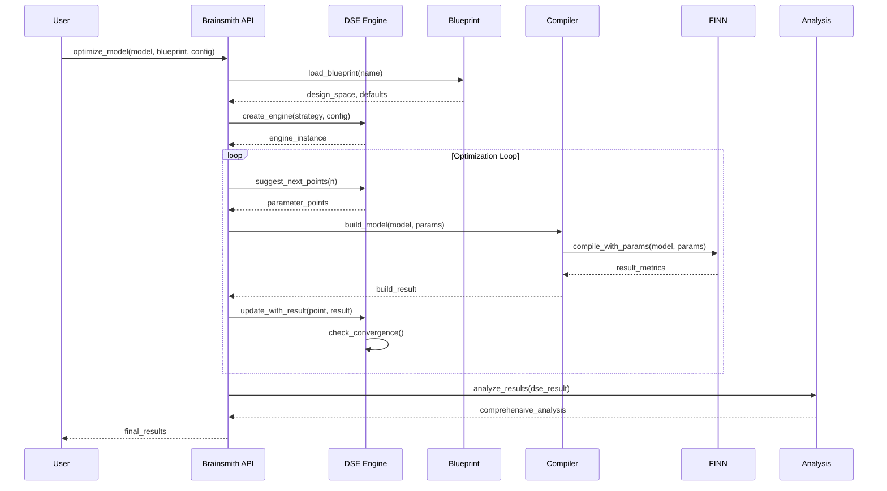

# Brainsmith Platform Architecture Overview

## 🏗️ **System Architecture**

This document provides a detailed technical overview of the Brainsmith platform architecture, focusing on the Phase 3 DSE interface implementation and complete system integration.

## 📊 **High-Level Architecture Diagram**

```
┌─────────────────────────────────────────────────────────────────────────────────┐
│                            BRAINSMITH PLATFORM                                  │
├─────────────────────────────────────────────────────────────────────────────────┤
│                              USER INTERFACE LAYER                               │
├─────────────────────────────────────────────────────────────────────────────────┤
│  Python API          │  CLI Tools          │  Jupyter Notebooks │  Web Dashboard │
│  brainsmith.optimize  │  brainsmith-opt     │  Interactive DSE   │  (Future)      │
│  brainsmith.explore   │  brainsmith-analyze │  Visualization     │                │
├─────────────────────────────────────────────────────────────────────────────────┤
│                           CORE ORCHESTRATION LAYER                              │
├─────────────────────────────────────────────────────────────────────────────────┤
│  Compiler            │  Configuration      │  Result Management │  Metrics       │
│  - Build coordination│  - Parameter mgmt   │  - Result storage  │  - Performance │
│  - Step execution    │  - Blueprint config │  - Analysis cache  │  - Hardware    │
│  - Error handling    │  - DSE settings     │  - Export formats  │  - Quality     │
├─────────────────────────────────────────────────────────────────────────────────┤
│                         DESIGN SPACE EXPLORATION LAYER                          │
├─────────────────────────────────────────────────────────────────────────────────┤
│  DSE Interface       │  Strategy Manager   │  Analysis Engine   │  External Integ│
│  - Engine abstraction│  - Algorithm select │  - Pareto analysis │  - scikit-opt  │
│  - Multi-objective   │  - Config templates │  - Statistical    │  - Optuna      │
│  - Progress tracking │  - Validation       │  - Convergence     │  - DEAP        │
│  - Result aggregation│  - Recommendations  │  - Trade-offs      │  - Hyperopt    │
├─────────────────────────────────────────────────────────────────────────────────┤
│  SimpleDSE Engines   │  External Adapters  │  Analysis Tools    │  Visualization │
│  - Random sampling   │  - Bayesian opt     │  - NSGA-II ranking │  - Pareto plots│
│  - Latin hypercube   │  - Genetic alg      │  - Hypervolume     │  - Convergence │
│  - Sobol sequences   │  - TPE optimization │  - Sensitivity     │  - Correlation │
│  - Adaptive learning │  - Differential evol│  - Export JSON/CSV │  - Interactive │
├─────────────────────────────────────────────────────────────────────────────────┤
│                           BLUEPRINT MANAGEMENT LAYER                            │
├─────────────────────────────────────────────────────────────────────────────────┤
│  Blueprint Base      │  Design Spaces      │  Parameter Defs    │  Templates     │
│  - Abstract patterns │  - Search spaces    │  - Type system     │  - YAML configs│
│  - Inheritance model │  - Constraints      │  - Range validation│  - Extensible  │
│  - Validation        │  - Dependencies     │  - Default values  │  - Reusable    │
├─────────────────────────────────────────────────────────────────────────────────┤
│  Concrete Blueprints │  Specialized Configs│  Domain Knowledge  │  Best Practices│
│  - BERT models       │  - Transformer opts │  - FPGA heuristics │  - Performance │
│  - Custom designs    │  - Memory layouts   │  - Resource limits │  - Optimization│
│  - Legacy support    │  - Precision modes  │  - Timing constraints│ - Guidelines  │
├─────────────────────────────────────────────────────────────────────────────────┤
│                            COMPILATION LAYER                                    │
├─────────────────────────────────────────────────────────────────────────────────┤
│  FINN Integration    │  Step Library       │  Custom Operations │  HW Generation │
│  - Model conversion  │  - Transformation   │  - Custom kernels  │  - RTL generation│
│  - Optimization      │  - Analysis steps   │  - HLS backends    │  - Synthesis   │
│  - Synthesis         │  - Verification     │  - RTL parsing     │  - Place & route│
│  - Deployment        │  - Cleanup          │  - Code generation │  - Bitstream   │
├─────────────────────────────────────────────────────────────────────────────────┤
│                              HARDWARE LAYER                                     │
├─────────────────────────────────────────────────────────────────────────────────┤
│  FPGA Targets        │  Synthesis Tools    │  Verification      │  Deployment    │
│  - Xilinx platforms  │  - Vivado HLS       │  - Simulation      │  - Board support│
│  - Intel platforms   │  - Vitis HLS        │  - Hardware-in-loop│  - Driver gen  │
│  - Edge devices      │  - Custom flows     │  - Timing analysis │  - Runtime     │
└─────────────────────────────────────────────────────────────────────────────────┘
```

## 🔄 **Data Flow Architecture**

### **1. Optimization Workflow**

```
Input Model → Blueprint Selection → Design Space Definition → DSE Strategy Selection
     ↓              ↓                       ↓                        ↓
Parameter Space ← Design Constraints ← Search Strategy ← Objective Functions
     ↓              ↓                       ↓                        ↓
DSE Engine → Point Generation → Parameter Evaluation → Result Collection
     ↓              ↓                       ↓                        ↓
Convergence Check ← Progress Monitor ← Performance Metrics ← FINN Compilation
     ↓                                      ↓                        ↓
Final Analysis ← Pareto Frontier ← Statistical Analysis ← Results Export
```

### **2. Component Interaction Flow**



## 🎯 **Core Component Architecture**

### **DSE Interface System**

```python
# Abstract interface hierarchy
DSEInterface (ABC)
├── DSEEngine (Base implementation)
│   ├── SimpleDSEEngine (Built-in algorithms)
│   └── ExternalDSEAdapter (External framework bridge)
└── DSEConfiguration (Configuration management)
    ├── DSEObjective (Optimization objectives)
    └── DSEProgress (Progress tracking)

# Strategy management
StrategySelector
├── get_recommended_strategies()
├── validate_strategy_config()
└── create_dse_config_for_strategy()

# Analysis pipeline
ParetoAnalyzer → DSEAnalyzer → ConvergenceAnalysis → SensitivityAnalysis
```

### **Blueprint Architecture**

```python
# Blueprint inheritance hierarchy
Blueprint (ABC)
├── TransformerBlueprint
│   ├── BERTBlueprint
│   └── BERTExtensibleBlueprint
└── CustomBlueprint (User-defined)

# Supporting components
DesignSpace
├── ParameterDefinition
│   ├── IntegerParameter
│   ├── ContinuousParameter
│   ├── CategoricalParameter
│   └── BooleanParameter
└── DesignPoint (Parameter instantiation)

# Management layer
BlueprintManager
├── register_blueprint()
├── discover_blueprints()
└── validate_blueprint()
```

### **Compilation Pipeline**

```python
# Compilation orchestration
BrainsmithCompiler
├── execute_build_steps()
├── handle_errors()
└── collect_metrics()

# Step library architecture
Step (ABC)
├── TransformationStep
├── AnalysisStep
├── OptimizationStep
└── VerificationStep

# FINN integration
FINNInterface
├── setup_finn_environment()
├── execute_finn_compilation()
└── extract_performance_metrics()
```

## ⚡ **Performance Architecture**

### **Scalability Design**

```
┌─────────────────────────────────────────────────────────────────┐
│                    PERFORMANCE OPTIMIZATION                     │
├─────────────────────────────────────────────────────────────────┤
│  Parallel Evaluation  │  Caching Strategy   │  Memory Management │
│  - Process pools      │  - Result cache     │  - Streaming       │
│  - Thread pools       │  - Design point     │  - Lazy loading    │
│  - Async execution    │  - Analysis cache   │  - Garbage collect │
├─────────────────────────────────────────────────────────────────┤
│  Algorithm Efficiency │  Resource Monitoring│  Adaptive Scaling  │
│  - Early stopping     │  - CPU utilization  │  - Dynamic threads │
│  - Smart sampling     │  - Memory usage     │  - Queue management│
│  - Convergence detect │  - Disk I/O         │  - Load balancing  │
├─────────────────────────────────────────────────────────────────┤
│  External Integration │  Fault Tolerance    │  Progress Tracking │
│  - Library fallbacks  │  - Error recovery   │  - Real-time stats │
│  - Graceful degradat  │  - Checkpoint/resume│  - ETA calculation │
│  - Resource limits    │  - Partial results  │  - Live monitoring │
└─────────────────────────────────────────────────────────────────┘
```

### **Memory and Compute Optimization**

- **Streaming Architecture**: Process results without storing all data in memory
- **Incremental Analysis**: Update statistics and analysis in real-time
- **Adaptive Precision**: Trade accuracy for speed based on problem requirements
- **Resource Limits**: Configurable memory and CPU usage constraints
- **External Library Management**: Graceful fallback when optimization libraries unavailable

## 🔌 **Integration Architecture**

### **External Framework Integration**

```python
# External adapter pattern
ExternalDSEAdapter
├── BayesianOptimizationAdapter (scikit-optimize)
├── OptunaTTPEAdapter (Optuna)
├── GeneticAlgorithmAdapter (DEAP)
└── HyperoptAdapter (Hyperopt)

# Fallback strategy
if external_library_available:
    engine = ExternalDSEAdapter(framework, config)
else:
    engine = SimpleDSEEngine(fallback_strategy, config)
```

### **FINN Framework Integration**

```python
# Four-hook architecture integration
FINNInterface
├── pre_compilation_hook()    # Custom transformations
├── compilation_hook()        # Core FINN compilation
├── post_compilation_hook()   # Performance extraction
└── verification_hook()       # Result validation

# Extensible step library
StepLibrary
├── TransformerSteps (BERT, GPT, etc.)
├── CommonSteps (Cleanup, verification)
└── CustomSteps (User-defined)
```

## 🎨 **Extensibility Architecture**

### **Plugin System**

```python
# Plugin registration system
PluginManager
├── register_blueprint(name, blueprint_class)
├── register_dse_engine(name, engine_class)
├── register_analysis_plugin(name, analyzer_class)
└── register_step(name, step_class)

# Custom extensions
class CustomOptimizer(DSEEngine):
    def suggest_next_points(self, n_points=1):
        # Custom optimization logic
        return points

# Registration
brainsmith.register_dse_engine("custom_algo", CustomOptimizer)
```

### **Configuration System**

```python
# Hierarchical configuration
BrainsmithConfig
├── GlobalConfig (Platform-wide settings)
├── BlueprintConfig (Blueprint-specific)
├── DSEConfig (Optimization settings)
└── CompilationConfig (Build settings)

# Environment-based configuration
config = BrainsmithConfig.from_environment()
config.merge_from_file("custom_config.yaml")
config.validate()
```

## 📊 **Quality Assurance Architecture**

### **Testing Strategy**

```
┌─────────────────────────────────────────────────────────────────┐
│                        TESTING PYRAMID                         │
├─────────────────────────────────────────────────────────────────┤
│                    End-to-End Tests                            │
│              Integration & Workflow Tests                      │
│                   Component Tests                              │
│                     Unit Tests                                 │
├─────────────────────────────────────────────────────────────────┤
│  Test Categories:                                              │
│  - Unit: Individual function/class testing                    │
│  - Component: Module integration testing                      │
│  - Integration: Cross-component workflow testing              │
│  - End-to-End: Complete user scenario testing                 │
│  - Performance: Scalability and efficiency testing            │
│  - Regression: Backward compatibility testing                 │
└─────────────────────────────────────────────────────────────────┘
```

### **Validation Framework**

```python
# Comprehensive validation pipeline
ValidationSuite
├── EnvironmentValidator (Dependencies, versions)
├── ConfigurationValidator (Settings, parameters)
├── ResultValidator (Output correctness)
└── PerformanceValidator (Efficiency, scalability)

# Continuous validation
@validate_input
@validate_output
@performance_monitor
def optimize_model(...):
    # Implementation with automatic validation
    pass
```

## 🚀 **Deployment Architecture**

### **Distribution Strategy**

```
┌─────────────────────────────────────────────────────────────────┐
│                    DEPLOYMENT OPTIONS                          │
├─────────────────────────────────────────────────────────────────┤
│  Local Development  │  Research Computing │  Cloud Platforms   │
│  - Direct install   │  - HPC clusters     │  - AWS/Azure/GCP   │
│  - Virtual envs     │  - SLURM integration│  - Kubernetes      │
│  - Development mode │  - Parallel jobs    │  - Serverless      │
├─────────────────────────────────────────────────────────────────┤
│  Enterprise Deploy  │  Edge Computing     │  Hybrid Solutions  │
│  - Docker containers│  - ARM platforms    │  - On-prem + cloud │
│  - Security hardened│  - Resource limited │  - Data locality   │
│  - Compliance ready │  - Power efficient  │  - Compliance      │
└─────────────────────────────────────────────────────────────────┘
```

### **Scalability Architecture**

- **Horizontal Scaling**: Distribute optimization across multiple machines
- **Vertical Scaling**: Optimize for high-memory, high-CPU systems
- **Cloud Native**: Support for Kubernetes, auto-scaling, and managed services
- **Edge Deployment**: Lightweight deployment for resource-constrained environments

## 🔒 **Security and Compliance**

### **Security Architecture**

```python
# Security layers
SecurityManager
├── InputValidation (Sanitize user inputs)
├── ResourceLimits (Prevent resource exhaustion)
├── AccessControl (Permission management)
└── AuditLogging (Security event tracking)

# Compliance features
ComplianceFramework
├── DataProtection (GDPR, privacy)
├── IntellectualProperty (Model protection)
├── AuditTrails (Change tracking)
└── Certification (Industry standards)
```

## 📈 **Future Architecture Evolution**

### **Planned Enhancements**

1. **AI-Driven Optimization**: Machine learning for strategy selection and parameter tuning
2. **Distributed Computing**: Native support for cluster and cloud-based optimization
3. **Real-Time Hardware Validation**: Hardware-in-the-loop testing during optimization
4. **Collaborative Platform**: Multi-user design spaces and shared optimization results
5. **Industry Integration**: Enterprise-grade features for production deployment

### **Technology Roadmap**

- **Phase 4**: CLI interface and batch processing capabilities
- **Phase 5**: Web dashboard and visualization platform
- **Phase 6**: Cloud-native architecture and distributed optimization
- **Phase 7**: AI-driven optimization and autonomous design exploration

This architecture provides a solid foundation for current capabilities while enabling future growth and enhancement of the Brainsmith platform.