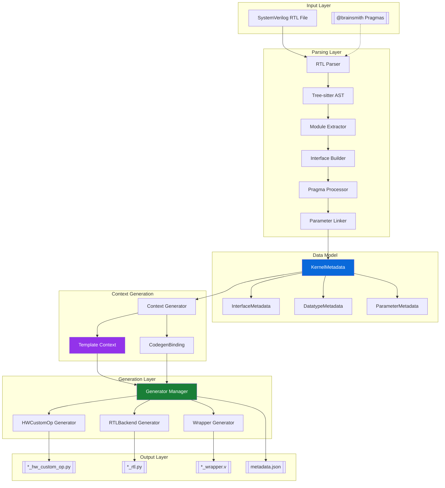

# Kernel Integrator Architecture Documentation

## System Overview

The Kernel Integrator is a sophisticated tool that transforms SystemVerilog RTL modules into FINN-compatible HWCustomOp implementations. It employs a modular, pipeline-based architecture with clear separation of concerns.

## High-Level Architecture



## Component Architecture

### 1. CLI and Configuration Layer

**Purpose**: Entry point and configuration management

**Components**:
- `cli.py`: Command-line interface and orchestration
- `config.py`: Path validation and directory management
- `kernel_integrator.py`: Main workflow coordinator

**Key Features**:
- Argument parsing and validation
- Output directory determination
- Progress reporting and error handling

### 2. RTL Parser Subsystem

**Purpose**: Extract structured information from SystemVerilog files

**Components**:
- `ASTParser`: Tree-sitter based SystemVerilog parsing
- `ModuleExtractor`: Module hierarchy and structure extraction
- `InterfaceScanner`: Protocol-based interface detection
- `PragmaHandler`: Pragma parsing and application
- `ParameterLinker`: Automatic parameter-to-interface linking

**Interface Detection Patterns**:
```
AXI-Stream: *_TDATA, *_TVALID, *_TREADY
AXI-Lite:   *_AWADDR, *_AWVALID, *_WDATA, etc.
Global:     *_clk, *_rst_n
```

**Auto-linking Conventions**:
```
{interface}_WIDTH  → Interface bit width
{interface}_SIGNED → Signedness flag
{interface}_BDIM   → Block dimensions
{interface}_SDIM   → Stream dimensions
```

### 3. Data Model Layer

**Purpose**: Structured representation of kernel information

**Core Classes**:

```python
@dataclass
class KernelMetadata:
    kernel_name: str
    rtl_file: Path
    parameters: Dict[str, ParameterMetadata]
    interfaces: Dict[str, InterfaceMetadata]
    datatype_defaults: Dict[str, str]
    top_module: Optional[str]

@dataclass
class InterfaceMetadata:
    interface_name: str
    interface_type: InterfaceType
    rtl_signals: Dict[str, str]
    datatype_constraints: List[DatatypeConstraintGroup]
    block_dimensions: List[Union[int, str]]
    stream_dimensions: Optional[List[Union[int, str]]]
```

### 4. Context Generation Layer

**Purpose**: Transform metadata into template-ready context

**Key Transformations**:
1. Parameter categorization (node attributes vs derived)
2. Interface grouping by type
3. CodegenBinding creation for explicit parameter mapping
4. Default value resolution
5. Validation and constraint checking

**CodegenBinding Structure**:
```python
@dataclass
class CodegenBinding:
    parameter_name: str
    source_type: ParameterBindingType
    source_value: str
    target_code: str
```

### 5. Code Generation Pipeline

**Purpose**: Render templates to generate output files

**Architecture**:
- **GeneratorBase**: Abstract base for all generators
- **GeneratorManager**: Plugin discovery and orchestration
- **Template Engine**: Jinja2-based rendering

**Generator Types**:
1. **HWCustomOp Generator**: Creates FINN operator class
2. **RTLBackend Generator**: Creates RTL compilation backend
3. **RTLWrapper Generator**: Creates Verilog interface wrapper

**Template Features**:
- Conditional rendering based on interface types
- Parameter binding code generation
- FINN API compliance
- Extensible filter system

## Data Flow Pipeline

### 1. Parsing Phase
```
RTL File → Tree-sitter → AST → Module Extraction → Interface Detection → Pragma Application → KernelMetadata
```

### 2. Transformation Phase
```
KernelMetadata → Parameter Analysis → Interface Categorization → Binding Generation → TemplateContext
```

### 3. Generation Phase
```
TemplateContext + Templates → Jinja2 Rendering → Generated Code → File Writing → Metadata Creation
```

## Design Patterns and Principles

### 1. Separation of Concerns
- Parsing isolated from generation
- Data models independent of processing logic
- Templates separate from business logic

### 2. Plugin Architecture
- Generators auto-discovered at runtime
- Easy addition of new output formats
- Template-based extensibility

### 3. Fail-Fast Validation
- Early validation at each stage
- Comprehensive error messages
- Graceful degradation where possible

### 4. Convention over Configuration
- Smart defaults based on naming patterns
- Minimal required configuration
- Override capability where needed

## Integration Points

### 1. FINN Integration
- Compliant HWCustomOp base class usage
- Proper node attribute management
- RTLBackend template substitution

### 2. Kernel Modeling Integration
- KernelDefinition creation from metadata
- SDIM architecture support
- Datatype constraint mapping

### 3. Build System Integration
- Docker-based execution environment
- Automated dependency management
- Reproducible builds

## Extension Points

### 1. Adding New Generators
```python
class MyGenerator(GeneratorBase):
    name = "my_generator"
    template_file = "my_template.j2"
    output_pattern = "{kernel_name}_my_output.ext"
```

### 2. Adding New Pragmas
```python
class MyPragma(BasePragma):
    def apply_to_metadata(self, metadata, visitor):
        # Custom pragma logic
```

### 3. Custom Interface Protocols
- Add detection patterns to InterfaceScanner
- Define protocol validation rules
- Map to appropriate InterfaceType

## Performance Characteristics

- **Parsing**: 10-20ms for typical kernels
- **Context Generation**: 5-10ms
- **Template Rendering**: 20-30ms per template
- **Total E2E**: ~75ms for complete generation

## Error Handling Strategy

1. **Validation Layers**:
   - RTL file existence and format
   - Pragma syntax and semantics
   - Interface completeness
   - Parameter consistency

2. **Error Reporting**:
   - Detailed error messages with context
   - Suggestion for fixes where possible
   - Non-fatal warnings for best practices

3. **Recovery Mechanisms**:
   - Partial generation on non-critical errors
   - Detailed logs for debugging
   - Rollback on critical failures