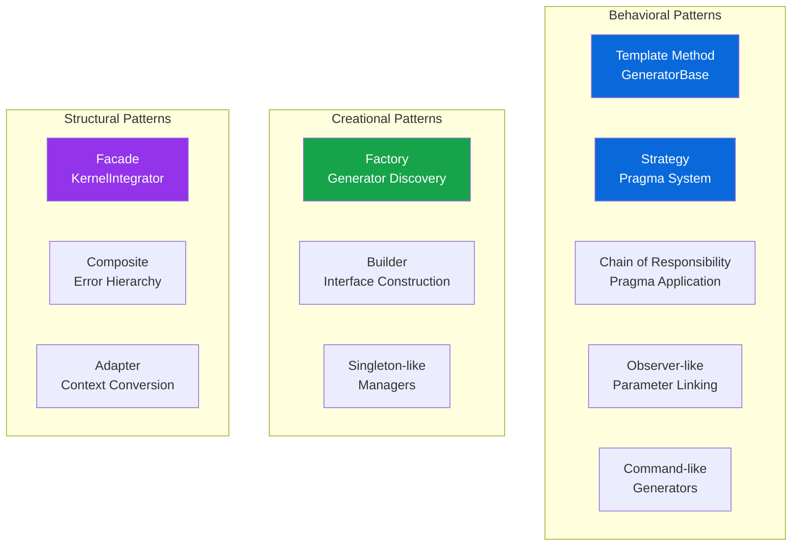
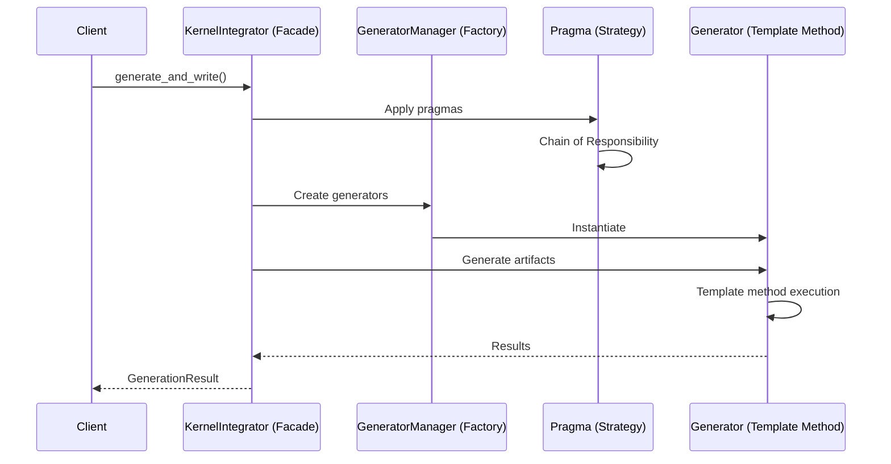

# Kernel Integrator Design Patterns

This document catalogs the design patterns employed in the Kernel Integrator architecture, demonstrating how established software engineering patterns enable extensibility, maintainability, and clean separation of concerns.

## Pattern Overview



## Behavioral Patterns

### 1. Template Method Pattern

**Location**: `generators/base.py`

```python
class GeneratorBase(ABC):
    """Base generator using Template Method pattern"""
    
    def generate(self, context: TemplateContext) -> str:
        # Template method defining algorithm
        processed_context = self.process_context(context)
        template = self.get_template_file()
        return self.render(template, processed_context)
    
    def process_context(self, context: TemplateContext) -> TemplateContext:
        """Hook method - subclasses override as needed"""
        return context
    
    @abstractmethod
    def get_template_file(self) -> str:
        """Abstract method - subclasses must implement"""
        pass
```

**Benefits**:
- Enforces consistent generation workflow
- Allows customization without breaking the algorithm
- Makes generator behavior predictable

### 2. Strategy Pattern

**Location**: `rtl_parser/pragmas/`

```python
# Base strategy interface
class Pragma(ABC):
    @abstractmethod
    def apply_to_kernel(self, kernel: KernelMetadata) -> None:
        """Strategy method"""
        pass

# Concrete strategies
class BDimPragma(InterfacePragma):
    def apply_to_interface(self, metadata: InterfaceMetadata) -> None:
        """BDIM-specific processing"""
        metadata.block_dimensions = self.parsed_inputs["dimensions"]

class SDimPragma(InterfacePragma):
    def apply_to_interface(self, metadata: InterfaceMetadata) -> None:
        """SDIM-specific processing"""
        metadata.stream_dimensions = self.parsed_inputs["dimensions"]
```

**Benefits**:
- New pragma types added without modifying existing code
- Each pragma encapsulates its own parsing and application logic
- Runtime selection of appropriate strategy

### 3. Chain of Responsibility Pattern

**Location**: `rtl_parser/parser.py`

```python
def _apply_pragmas(self, kernel_metadata: KernelMetadata) -> None:
    """Apply pragmas in sequence - each handles what it can"""
    for pragma in kernel_metadata.pragmas:
        try:
            pragma.apply_to_kernel(kernel_metadata)
        except UnsupportedPragmaError:
            # Pass to next in chain
            continue
        except Exception as e:
            logger.warning(f"Pragma application failed: {e}")
```

**Benefits**:
- Pragmas processed independently
- Graceful handling of unsupported pragmas
- Easy to reorder or filter pragma processing

### 4. Observer Pattern (Implicit)

**Location**: `rtl_parser/parameter_linker.py`

```python
class ParameterLinker:
    """Observes unlinked parameters and auto-links them"""
    
    def apply_to_kernel_metadata(self, kernel_metadata: KernelMetadata) -> None:
        # Observe remaining parameters
        remaining_params = self._get_remaining_parameters(kernel_metadata)
        
        # React to patterns
        for param_name, param in remaining_params.items():
            for interface in kernel_metadata.interfaces.values():
                if self._matches_pattern(param_name, interface.interface_name):
                    self._link_parameter(param, interface)
```

**Benefits**:
- Decouples parameter detection from interface definition
- Automatic parameter binding based on conventions
- Extensible pattern matching

### 5. Command Pattern (Implicit)

**Location**: `generators/`

```python
class GeneratorBase:
    """Each generator is a command object"""
    name: str = None
    template_file: str = None
    output_pattern: str = None
    
    def execute(self, context: TemplateContext) -> GenerationResult:
        """Command execution"""
        return self._generate_output(context)
```

**Benefits**:
- Generation operations as first-class objects
- Can queue, log, or undo operations
- Parameterizable generation commands

## Creational Patterns

### 6. Factory Pattern

**Location**: `generators/manager.py`

```python
class GeneratorManager:
    def _discover_generators(self) -> None:
        """Factory method for generator discovery and instantiation"""
        generators_module = import_module("brainsmith.tools.kernel_integrator.generators")
        
        for name, obj in inspect.getmembers(generators_module):
            if self._is_valid_generator(obj):
                # Factory creates instance
                generator = obj()
                if generator.validate():
                    self.generators[generator.name] = generator
```

**Benefits**:
- Automatic discovery of new generators
- No manual registration required
- Consistent instantiation logic

### 7. Builder Pattern

**Location**: `rtl_parser/interface_builder.py`

```python
class InterfaceBuilder:
    """Builds complex InterfaceMetadata objects step by step"""
    
    def build_interface_metadata(self, ports: List[Port]) -> List[InterfaceMetadata]:
        # Step 1: Scan ports
        port_groups = self.scanner.scan(ports)
        
        # Step 2: Validate protocols
        validated_groups = []
        for group in port_groups:
            if self.validator.validate(group).valid:
                validated_groups.append(group)
        
        # Step 3: Create metadata
        metadata_list = []
        for group in validated_groups:
            metadata = self._create_base_metadata(group)
            metadata = self._enrich_metadata(metadata)
            metadata_list.append(metadata)
        
        return metadata_list
```

**Benefits**:
- Complex construction process encapsulated
- Step-by-step construction with validation
- Reusable for different interface types

### 8. Singleton Pattern (Usage)

**Location**: Various manager classes

```python
# Not enforced as true Singleton, but used as single instances
class GeneratorManager:
    """Single instance manages all generators"""
    
class PragmaHandler:
    """Single instance processes all pragmas"""
    
class ProtocolValidator:
    """Single instance validates all protocols"""
```

**Benefits**:
- Consistent state management
- Resource efficiency
- Simplified dependency injection

## Structural Patterns

### 9. Facade Pattern

**Location**: `kernel_integrator.py`

```python
class KernelIntegrator:
    """Facade providing simple interface to complex subsystem"""
    
    def generate_and_write(self, kernel_metadata: KernelMetadata) -> GenerationResult:
        """Single method hides complexity"""
        # Internally coordinates:
        # - Context generation
        # - Template selection
        # - Multiple generators
        # - File I/O
        # - Error aggregation
        
        context = self._create_context(kernel_metadata)
        results = self._generate_artifacts(context)
        self._write_files(results)
        return self._create_summary(results)
```

**Benefits**:
- Simple API for complex operations
- Shields clients from subsystem changes
- Centralized error handling

### 10. Composite Pattern

**Location**: `errors.py`

```python
class KIError(Exception):
    """Composite base for error hierarchy"""
    pass

class RTLParsingError(KIError):
    """Leaf: RTL parsing errors"""
    pass

class GenerationError(KIError):
    """Composite: Generation errors"""
    pass

class TemplateError(GenerationError):
    """Leaf: Template rendering errors"""
    pass
```

**Benefits**:
- Uniform error handling
- Hierarchical exception catching
- Extensible error types

### 11. Adapter Pattern

**Location**: `generators/manager.py`

```python
def _convert_context_to_template_vars(self, template_ctx: TemplateContext) -> Dict[str, Any]:
    """Adapts TemplateContext to Jinja2 dictionary format"""
    return {
        "kernel_name": template_ctx.module_name,
        "class_name": template_ctx.class_name,
        "rtl_file_name": template_ctx.rtl_file_name,
        "interfaces": [self._interface_to_dict(iface) for iface in template_ctx.interfaces],
        "node_attributes": template_ctx.node_attributes,
        "codegen_bindings": template_ctx.codegen_bindings,
        # ... adapt all fields
    }
```

**Benefits**:
- Bridges modern object interface with legacy dictionary API
- Allows gradual migration
- Maintains backward compatibility

## Pattern Interactions



## Design Pattern Benefits

### Extensibility
- **Strategy Pattern**: Easy to add new pragma types
- **Factory Pattern**: New generators auto-discovered
- **Template Method**: New generators follow established workflow

### Maintainability
- **Facade Pattern**: Complex operations behind simple interface
- **Builder Pattern**: Complex construction logic encapsulated
- **Composite Pattern**: Uniform error handling

### Testability
- **Strategy Pattern**: Test pragma types independently
- **Template Method**: Test algorithm and customizations separately
- **Command Pattern**: Test generators in isolation

### Flexibility
- **Chain of Responsibility**: Reorder pragma processing
- **Observer Pattern**: Auto-link parameters based on patterns
- **Adapter Pattern**: Support multiple context formats

## Anti-patterns Avoided

1. **God Object**: Responsibilities distributed across focused classes
2. **Spaghetti Code**: Clear separation and patterns prevent tangling
3. **Copy-Paste Programming**: Template Method and inheritance reduce duplication
4. **Hard Coding**: Factory and Strategy patterns enable configuration

## Conclusion

The Kernel Integrator demonstrates mature software engineering through appropriate use of design patterns. Each pattern serves a specific purpose and contributes to the overall goals of extensibility, maintainability, and clean architecture. The patterns work together cohesively to create a system that is both powerful and easy to extend.