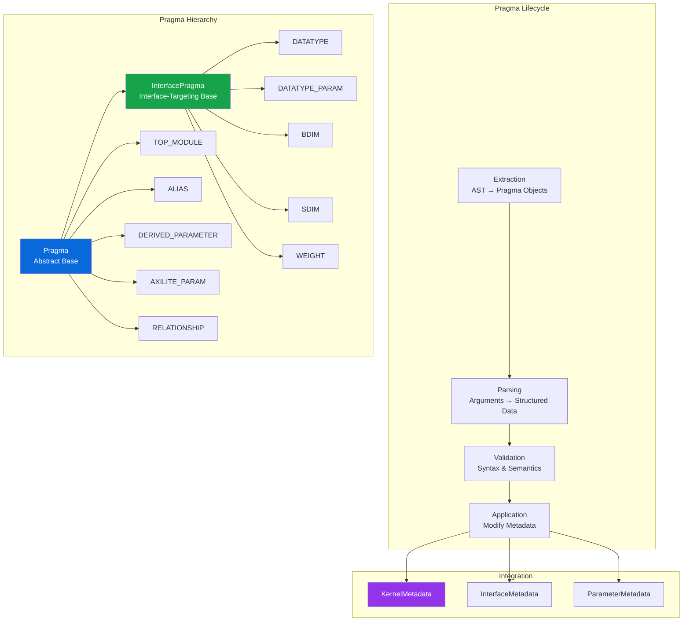

# Pragma System Analysis

## Overview

The pragma system provides a mechanism for annotating SystemVerilog RTL with metadata that guides automated FINN HWCustomOp generation. Pragmas are special comments (`// @brainsmith <type> <args...>`) that express designer intent beyond what can be inferred from RTL structure alone.

## System Architecture



## Pragma Types and Usage

### 1. Module-Level Pragmas

#### TOP_MODULE
```systemverilog
// @brainsmith TOP_MODULE my_accelerator
```
- Selects top module in multi-module files
- Required when multiple modules exist
- Validates module name exists

### 2. Interface Configuration Pragmas

#### DATATYPE
```systemverilog
// Single type constraint
// @brainsmith DATATYPE input0 UINT 8 16

// Multiple types allowed
// @brainsmith DATATYPE input0 [INT, UINT, FIXED] 8 32

// Wildcard (any type)
// @brainsmith DATATYPE input0 * 16 16
```
- Constrains allowed datatypes for interfaces
- Supports type lists and wildcards
- Min/max bit width specification

#### DATATYPE_PARAM
```systemverilog
// @brainsmith DATATYPE_PARAM input0 width INPUT_WIDTH
// @brainsmith DATATYPE_PARAM input0 signed INPUT_SIGNED
```
- Maps RTL parameters to datatype properties
- Properties: width, signed, format, bias, fractional_width
- Creates internal datatypes if interface not found

#### WEIGHT
```systemverilog
// @brainsmith WEIGHT weights_V
```
- Marks input interfaces as weight type
- Changes interface categorization
- Affects SDIM applicability

### 3. Dimension Pragmas

#### BDIM (Block Dimensions)
```systemverilog
// Single dimension
// @brainsmith BDIM input0 INPUT_BDIM

// Multi-dimensional
// @brainsmith BDIM input0 [BDIM_H, BDIM_W, BDIM_C]

// With SHAPE mapping
// @brainsmith BDIM input0 [B0, B1] SHAPE=[TILE_H, TILE_W]
```
- Specifies block dimension parameters
- Supports singleton dimensions ("1")
- Optional SHAPE for tiling expressions

#### SDIM (Stream Dimensions)
```systemverilog
// Single dimension
// @brainsmith SDIM input0 INPUT_SDIM

// Multi-dimensional with SHAPE
// @brainsmith SDIM input0 [S0, S1] SHAPE=[SIMD, :]
```
- Specifies streaming dimension parameters
- Only for INPUT and WEIGHT interfaces
- SHAPE controls parallelism mapping

### 4. Parameter Management Pragmas

#### ALIAS
```systemverilog
// @brainsmith ALIAS NUM_CHANNELS channels
```
- Exposes RTL parameter with user-friendly name
- Creates node attribute in FINN
- Validates parameter existence

#### DERIVED_PARAMETER
```systemverilog
// @brainsmith DERIVED_PARAMETER total_weights channels * kernel_size
```
- Defines computed parameters
- Python expression evaluation
- Available in RTL backend

#### AXILITE_PARAM
```systemverilog
// @brainsmith AXILITE_PARAM threshold_base s_axilite
```
- Links parameter to AXI-Lite interface
- For runtime-configurable values
- Generates register mapping

### 5. Relationship Pragma

#### RELATIONSHIP
```systemverilog
// @brainsmith RELATIONSHIP input0 output0 EQUAL
// @brainsmith RELATIONSHIP input0 weights DEPENDENT 0 1
```
- Defines inter-interface constraints
- Types: EQUAL, DEPENDENT, MULTIPLE, DIVISIBLE
- Used by Kernel Modeling validation

## Pragma Processing Pipeline

### 1. Extraction Phase

```python
def extract_pragmas(self, tree: Tree) -> List[Pragma]:
    # Find all comment nodes
    comment_nodes = find_all_comments(tree)
    
    # Filter for @brainsmith comments
    pragma_comments = [c for c in comment_nodes 
                      if '@brainsmith' in c.text]
    
    # Parse each pragma
    pragmas = []
    for comment in pragma_comments:
        pragma_type, args = parse_pragma_text(comment.text)
        pragma_class = self.pragma_constructors[pragma_type]
        pragma = pragma_class(
            type=pragma_type,
            inputs=args,
            line_number=comment.start_point[0]
        )
        pragmas.append(pragma)
```

### 2. Parsing Phase

Each pragma implements `_parse_inputs()`:

```python
class BDimPragma(InterfacePragma):
    def _parse_inputs(self) -> Dict:
        # Extract interface name
        interface_name = self.inputs[0]
        
        # Parse dimension specification
        if len(self.inputs) == 1:
            # Single parameter
            dimensions = self.inputs[1]
        else:
            # List format [D0, D1, ...]
            dimensions = parse_list(self.inputs[1])
        
        # Parse optional SHAPE
        shape = parse_named_arg(self.inputs, "SHAPE")
        
        return {
            "interface_name": interface_name,
            "dimensions": dimensions,
            "shape": shape
        }
```

### 3. Validation Phase

Two-stage validation approach:

```python
# Immediate validation in _parse_inputs()
if not is_valid_identifier(interface_name):
    raise PragmaError(f"Invalid interface name: {interface_name}")

# Deferred validation with context
def validate_with_kernel(self, kernel: KernelMetadata):
    if self.parsed_data["param_name"] not in kernel.parameters:
        raise PragmaError(
            f"Parameter '{param_name}' not found in module"
        )
```

### 4. Application Phase

```python
def apply_to_kernel(self, kernel: KernelMetadata):
    # Find target (interface, parameter, etc.)
    target = self._find_target(kernel)
    
    # Apply modifications
    self._apply_effects(target)
    
    # Update tracking
    self._update_parameter_lists(kernel)
```

## Extension Mechanism

### Adding a New Pragma Type

1. **Define the pragma type**:
```python
# In rtl_data.py
class PragmaType(Enum):
    MY_PRAGMA = "MY_PRAGMA"
```

2. **Create pragma class**:
```python
# In pragmas/my_pragma.py
@dataclass
class MyPragma(InterfacePragma):  # or Pragma
    def _parse_inputs(self) -> Dict:
        # Validate and structure inputs
        return {"key": "value"}
    
    def apply_to_interface(self, metadata: InterfaceMetadata):
        # Modify metadata
        metadata.my_property = self.parsed_data["key"]
```

3. **Register in handler**:
```python
# In pragma_handler.py
self.pragma_constructors[PragmaType.MY_PRAGMA] = MyPragma
```

4. **Export from package**:
```python
# In pragmas/__init__.py
from .my_pragma import MyPragma
```

## Advanced Features

### Input Format Handling

The system intelligently parses various input formats:

```systemverilog
// Simple arguments
// @brainsmith PRAGMA arg1 arg2

// List arguments
// @brainsmith PRAGMA [item1, item2, item3]

// Named arguments
// @brainsmith PRAGMA arg KEY=value

// Complex combinations
// @brainsmith PRAGMA name [A, B] SHAPE=[x, y, z]
```

### Parameter Tracking

Sophisticated parameter management:

```python
# Three parameter categories:
exposed_parameters: Set[str]  # Node attributes
linked_parameters: Dict[str, LinkedParameter]  # Managed params
internal_datatypes: Dict[str, DatatypeMetadata]  # Internal types

# Automatic updates maintain consistency
```

### Error Handling

Comprehensive error reporting:

```python
class PragmaError(KIError):
    """Base for pragma-related errors"""
    
    def __init__(self, message: str, line_number: Optional[int] = None):
        if line_number:
            message = f"Line {line_number}: {message}"
        super().__init__(message)
```

## Design Principles

### 1. Fail-Fast Validation
- Validate syntax immediately in `_parse_inputs()`
- Defer semantic validation until context available
- Provide clear, actionable error messages

### 2. Separation of Concerns
- Pragmas are data containers
- Logic resides in handlers and appliers
- Clean interfaces between components

### 3. Extensibility
- New pragma types follow established patterns
- Minimal changes to existing code
- Plugin-style registration

### 4. Idempotency
- Pragmas can be applied multiple times safely
- Later pragmas override earlier ones
- No accumulation of side effects

### 5. Type Safety
- Strong typing throughout
- Enums for pragma types
- Dataclasses for structured data

## Integration Points

### With RTL Parser
- Extracted during AST traversal
- Applied after basic metadata creation
- Modifies metadata before final validation

### With Kernel Modeling
- Dimension pragmas → Interface constraints
- Relationships → Validation rules
- Datatypes → Type specifications

### With Code Generation
- ALIAS → Template variable names
- DERIVED → Generated expressions
- AXILITE → Register mappings

## Best Practices

1. **Use pragmas sparingly** - Rely on auto-detection when possible
2. **Be explicit** - Clear pragma intent aids maintenance
3. **Validate early** - Catch errors close to source
4. **Document pragmas** - Explain non-obvious usage
5. **Test thoroughly** - Pragma effects can be subtle

The pragma system exemplifies good software design with its extensible architecture, robust error handling, and clean separation of concerns. It successfully bridges the gap between hardware designer intent and automated tool requirements.