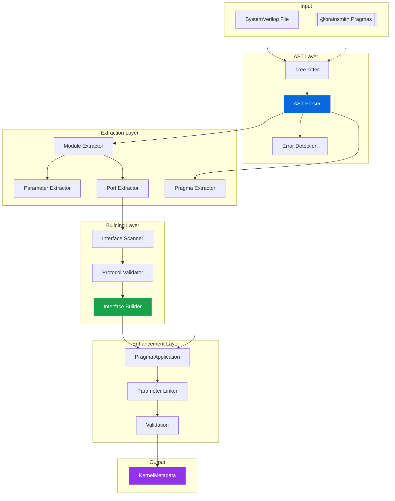

# RTL Parser Architecture Analysis

## Overview

The RTL Parser is a sophisticated component that transforms SystemVerilog RTL files into structured metadata for FINN HWCustomOp generation. It employs a multi-stage pipeline with clear separation of concerns and robust error handling.

## Architecture Diagram



## Parsing Pipeline

### Stage 1: AST Generation
```
SystemVerilog → Tree-sitter → Abstract Syntax Tree
```
- Tree-sitter provides robust SystemVerilog parsing
- Syntax error detection with location information
- Efficient traversal utilities

### Stage 2: Module Selection
```
AST → Module Discovery → Target Selection → Module Node
```
- Priority-based selection algorithm
- TOP_MODULE pragma support
- Multi-module file handling

### Stage 3: Component Extraction
```
Module Node → Parameters + Ports + Pragmas
```
- Parameter parsing with type handling
- ANSI-style port declaration support
- Comment-based pragma extraction

### Stage 4: Interface Building
```
Ports → Pattern Matching → Protocol Validation → InterfaceMetadata
```
- Regex-based port grouping
- Protocol compliance checking
- Direct metadata creation

### Stage 5: Enhancement
```
Metadata → Pragma Application → Auto-linking → Validation → Final Metadata
```
- Pragma-driven modifications
- Convention-based parameter linking
- Comprehensive validation

## Component Details

### 1. ASTParser

**Purpose**: Tree-sitter integration and AST operations

**Key Features**:
```python
class ASTParser:
    def __init__(self, language_path: str):
        # Load SystemVerilog grammar
        self.language = Language(language_path, 'systemverilog')
        self.parser = Parser()
        self.parser.set_language(self.language)
    
    def parse_file(self, file_path: Path) -> Tree:
        # File → UTF-8 bytes → Tree-sitter → AST
        
    def find_syntax_errors(self, tree: Tree) -> List[SyntaxError]:
        # BFS traversal for ERROR nodes
```

**Algorithms**:
- BFS for efficient error detection
- Recursive module finding
- Safe node property extraction

### 2. ModuleExtractor

**Purpose**: Module selection and component extraction

**Selection Algorithm**:
```python
def select_module(modules, top_module_pragma, target_module):
    if target_module:
        return find_exact_match(modules, target_module)
    elif len(modules) == 1:
        verify_pragma_if_present(modules[0], top_module_pragma)
        return modules[0]
    else:  # Multiple modules
        if not top_module_pragma:
            raise error("Multiple modules require TOP_MODULE pragma")
        return find_pragma_match(modules, top_module_pragma)
```

**Parameter Extraction**:
- Filters out localparams
- Handles parameter types (integer, string, etc.)
- Extracts default values

**Port Extraction**:
- ANSI-style port support
- Direction detection (input/output/inout)
- Width expression parsing

### 3. InterfaceScanner

**Purpose**: Pattern-based port grouping

**Pattern Registry**:
```python
PATTERNS = {
    # Global control
    r'(\w+)_(clk|clock)$': InterfaceType.CONTROL,
    r'(\w+)_(rst|reset|rstn|rst_n)$': InterfaceType.CONTROL,
    
    # AXI-Stream
    r'(\w+)_TDATA$': InterfaceType.INPUT,  # Refined later
    r'(\w+)_TVALID$': InterfaceType.INPUT,
    r'(\w+)_TREADY$': InterfaceType.INPUT,
    
    # AXI-Lite
    r'(\w+)_AWADDR$': InterfaceType.CONFIG,
    r'(\w+)_AWVALID$': InterfaceType.CONFIG,
    # ... more patterns
}
```

**Grouping Algorithm**:
1. Match each port against patterns
2. Extract interface prefix
3. Group ports by (type, prefix)
4. Create PortGroup objects

### 4. InterfaceBuilder

**Purpose**: Orchestrate interface creation

**Building Process**:
```python
def build_interface_metadata(ports):
    # Stage 1: Scan
    port_groups, unassigned = scanner.scan(ports)
    
    # Stage 2: Validate
    valid_groups = []
    for group in port_groups:
        if validator.validate(group).valid:
            valid_groups.append(group)
    
    # Stage 3: Create
    interfaces = []
    for group in valid_groups:
        metadata = create_metadata(group)
        interfaces.append(metadata)
    
    return interfaces, unassigned
```

### 5. ParameterLinker

**Purpose**: Automatic parameter-to-interface linking

**Linking Patterns**:
```python
# Interface parameters
{interface}_WIDTH → datatype.width
{interface}_SIGNED → datatype.signed
{interface}_BDIM → block_dimensions
{interface}_SDIM → stream_dimensions

# Indexed dimensions
{interface}_BDIM0, _BDIM1, ... → [BDIM0, BDIM1, ...]
```

**Algorithm**:
1. Scan unlinked parameters
2. Match against naming conventions
3. Create/update metadata structures
4. Track remaining unlinked parameters

## Data Structures

### Core RTL Structures

```python
@dataclass
class Parameter:
    name: str
    param_type: ParameterType
    default_value: Optional[str]
    description: Optional[str]
    template_param_name: Optional[str]

@dataclass
class Port:
    name: str
    direction: PortDirection
    width: Optional[int]
    description: Optional[str]

@dataclass
class PortGroup:
    interface_type: InterfaceType
    name: str
    ports: List[Port]
    metadata: Dict[str, Any]
```

### Validation Results

```python
@dataclass
class ValidationResult:
    valid: bool
    errors: List[str]
    warnings: List[str]
    protocol_type: Optional[str]
```

## Error Handling

### Error Hierarchy

```
RTLParsingError (Base)
├── SyntaxError: SystemVerilog syntax issues
├── ModuleNotFoundError: Module selection failures
├── PragmaError: Invalid pragma syntax/semantics
├── ValidationError: Metadata validation failures
└── LinkingError: Parameter linking issues
```

### Error Detection Points

1. **Syntax Level**: Tree-sitter ERROR nodes
2. **Structure Level**: Missing modules, invalid ports
3. **Semantic Level**: Invalid pragma references
4. **Validation Level**: Missing required parameters

## Performance Characteristics

| Operation | Complexity | Typical Time |
|-----------|------------|--------------|
| AST Parsing | O(n) | 5-10ms |
| Module Extraction | O(m) | 1-2ms |
| Interface Scanning | O(p*r) | 2-3ms |
| Pragma Application | O(g) | 1-2ms |
| Parameter Linking | O(p*i) | 1-2ms |

Where:
- n = source file size
- m = number of modules
- p = number of ports/parameters
- r = number of regex patterns
- g = number of pragmas
- i = number of interfaces

## Design Decisions

### 1. Direct Metadata Creation
- No intermediate representations
- Reduces transformation overhead
- Simplifies debugging

### 2. Pattern-Based Detection
- Leverages SystemVerilog naming conventions
- Extensible pattern registry
- Fallback to manual specification

### 3. Multi-Stage Pipeline
- Clear separation of concerns
- Easy to debug specific stages
- Allows partial results on errors

### 4. Tree-sitter Integration
- Robust, maintained parser
- Good SystemVerilog support
- Efficient AST operations

### 5. Fail-Fast with Recovery
- Early error detection
- Detailed error messages
- Continue parsing when possible

## Extension Points

### Adding New Interface Protocols

1. Add patterns to InterfaceScanner
2. Implement validation in ProtocolValidator
3. Map to appropriate InterfaceType

### Adding New Pragmas

1. Create pragma class inheriting from BasePragma
2. Implement parsing and application logic
3. Register in pragma type mapping

### Custom Parameter Linking

1. Extend ParameterLinker patterns
2. Add new metadata fields if needed
3. Update validation rules

## Best Practices

1. **Use Pragmas for Explicit Control**: When auto-detection isn't sufficient
2. **Follow Naming Conventions**: Enables automatic linking
3. **Validate Early**: Use strict mode during development
4. **Clear Error Messages**: Include context and suggestions
5. **Test with Real RTL**: Ensure patterns match actual usage