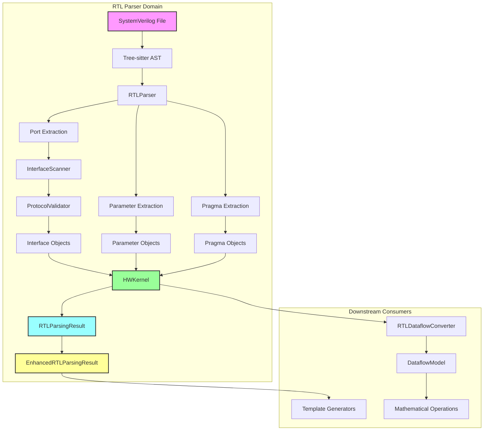

# RTL Parser Capabilities and Integration Guide

## Table of Contents
1. [Overview](#overview)
2. [Core Capabilities](#core-capabilities)
3. [Data Flow and Connections](#data-flow-and-connections)
4. [Interface Detection Details](#interface-detection-details)
5. [Pragma Processing System](#pragma-processing-system)
6. [Data Structures and Their Purpose](#data-structures-and-their-purpose)
7. [Integration Points](#integration-points)
8. [What RTL Parser Does and Doesn't Do](#what-rtl-parser-does-and-doesnt-do)
9. [Common Misconceptions](#common-misconceptions)
10. [Best Practices for Extension](#best-practices-for-extension)

## Overview

The RTL Parser is a **pure parsing and analysis tool** that extracts structural information from SystemVerilog RTL files. It performs static analysis only - no code generation, no mathematical computations, and no template rendering.

### Design Philosophy
- **Single Responsibility**: Parse SystemVerilog and extract metadata
- **No Side Effects**: Pure functional transformation from RTL → Data Structures
- **Extensible**: Clean abstractions for new interface types and pragmas
- **Validation-Focused**: Ensure correctness at parse time, not runtime

## Core Capabilities

### 1. SystemVerilog Parsing
- **Supported**: ANSI-style port declarations only
- **Extracted**: Module name, parameters, ports, pragmas
- **Preserved**: Width expressions as strings (no evaluation)
- **Multi-module**: Supports files with multiple modules (pragma selection)

### 2. Automatic Interface Detection
The parser automatically identifies and groups ports into interfaces based on naming conventions:

```systemverilog
// Automatically detected as AXI-Stream slave interface
input [31:0] s_axis_tdata,
input        s_axis_tvalid,
output       s_axis_tready,
input        s_axis_tlast,

// Automatically detected as AXI-Stream master interface  
output [31:0] m_axis_tdata,
output        m_axis_tvalid,
input         m_axis_tready,
output        m_axis_tlast,

// Automatically detected as Global Control
input ap_clk,
input ap_rst_n,
```

### 3. Protocol Validation
Each detected interface is validated against its protocol requirements:
- **Required signals** must be present
- **Optional signals** are allowed
- **Direction** must be consistent
- **Unknown signals** cause validation errors

### 4. Pragma Extraction and Processing
Extracts `@brainsmith` pragmas from comments and processes them:
- **Syntax validation** of pragma format
- **Type checking** of pragma arguments
- **Application** to relevant data structures
- **Error reporting** with line numbers

### 5. Width Expression Handling
Port widths are preserved as expressions, not evaluated:
```systemverilog
input [WIDTH-1:0] data,        // Preserved as "WIDTH-1:0"
input [31:0] fixed_data,       // Preserved as "31:0"
input [$clog2(DEPTH)-1:0] addr // Preserved as "$clog2(DEPTH)-1:0"
```

## Data Flow and Connections



## Interface Detection Details

### Detection Algorithm
1. **Port Collection**: Gather all module ports
2. **Pattern Matching**: Check each port against known patterns
3. **Grouping**: Group ports by common prefix/protocol
4. **Validation**: Validate each group against protocol rules
5. **Assignment**: Create Interface objects for valid groups

### Supported Interface Types

#### Global Control Interface
- **Pattern**: Exact name matching
- **Required**: `ap_clk`, `ap_rst_n`
- **Optional**: `ap_clk2x`
- **Wrapper Name**: Uses port names directly

#### AXI-Stream Interface
- **Pattern**: `*_axis_*` or `*_V_*` suffixes
- **Required**: `tdata`, `tvalid`, `tready`
- **Optional**: `tlast`, `tkeep`, `tstrb`, `tid`, `tdest`, `tuser`
- **Direction Detection**: 
  - `s_axis_*` or `*_slave_*` → INPUT
  - `m_axis_*` or `*_master_*` → OUTPUT
- **Wrapper Name**: `in0`, `in1` (inputs), `out0`, `out1` (outputs)

#### AXI-Lite Interface
- **Pattern**: `s_axi_*` prefix
- **Subsets Supported**:
  - Read-only (AR + R channels)
  - Write-only (AW + W + B channels)
  - Full (all channels)
- **Wrapper Name**: `config`

### Interface Metadata
Each interface stores:
- **Protocol type** (AXI_STREAM, AXI_LITE, GLOBAL_CONTROL)
- **Direction** (INPUT, OUTPUT, BIDIRECTIONAL)
- **Data width expression** (extracted from TDATA/WDATA)
- **Validation status**
- **Associated pragmas**

## Pragma Processing System

### Pragma Types and Their Effects

#### 1. TOP_MODULE
```systemverilog
// @brainsmith top_module my_kernel
```
- **Effect**: Selects specific module in multi-module files
- **Applied**: During module selection phase

#### 2. DATATYPE
```systemverilog
// @brainsmith datatype in0_V_data_V INT,UINT 8 32
```
- **Effect**: Adds datatype constraints to interface metadata
- **Format**: `interface_name type_list min_bits max_bits`
- **Applied**: After interface detection

#### 3. BDIM (Block Dimensions)
```systemverilog
// Enhanced format
// @brainsmith bdim in0_V_data_V -1 [16]

// Legacy format  
// @brainsmith bdim in0 PE*SIMD 1
```
- **Effect**: Adds dimensional metadata for chunking
- **Formats**: Enhanced (recommended) and legacy (supported)
- **Applied**: To interface metadata

#### 4. WEIGHT
```systemverilog
// @brainsmith weight weights_V_data_V
```
- **Effect**: Marks interface as weight input
- **Applied**: Sets interface category metadata

#### 5. DERIVED_PARAMETER
```systemverilog
// @brainsmith derived_parameter TOTAL_BITS WIDTH * DEPTH
```
- **Effect**: Adds computed parameters
- **Format**: `param_name python_expression`
- **Applied**: To kernel parameters list

### Pragma Processing Pipeline
1. **Extraction**: Regex-based extraction from comments
2. **Parsing**: Type-specific parsing with validation
3. **Storage**: Attached to HWKernel with line numbers
4. **Application**: Applied after interface detection

## Data Structures and Their Purpose

### HWKernel (Primary Output)
**Purpose**: Complete representation of parsed RTL module
```python
HWKernel:
  - name: Module identifier
  - parameters: List of module parameters
  - interfaces: Validated interface dictionary
  - pragmas: All extracted pragmas
  - metadata: Additional analysis results
```

### RTLParsingResult (Lightweight Alternative)
**Purpose**: Minimal structure for fast processing
```python
RTLParsingResult:
  - name: Module name only
  - interfaces: Basic interface data
  - pragmas: Pragma list
  - parameters: Parameter list
  - source_file: Path reference
  - parsing_warnings: Issues found
```

### EnhancedRTLParsingResult (Template-Ready)
**Purpose**: Pre-processed data for template generation
- Inherits from RTLParsingResult
- Adds template context generation
- Should be a simple data container (current implementation needs refactoring)

### Interface
**Purpose**: Validated protocol implementation
```python
Interface:
  - name: Interface identifier
  - type: Protocol type (enum)
  - ports: Port dictionary
  - validation_result: Protocol compliance
  - metadata: Width, direction, pragmas
  - wrapper_name: Template-friendly name
```

## Integration Points

### Input Requirements
1. **SystemVerilog file** with ANSI-style ports
2. **Tree-sitter grammar** (sv.so compiled library)
3. **Optional pragmas** in comments

### Output Consumers

#### 1. Template Generators
- Use HWKernel or EnhancedRTLParsingResult
- Access pre-categorized interfaces
- Read pragma metadata
- Generate code from static analysis

#### 2. RTLDataflowConverter
- Converts HWKernel → DataflowModel
- Uses interface metadata for dataflow setup
- Applies pragma constraints
- Enables mathematical operations

#### 3. Direct CLI Usage
- parse_rtl_file() → HWKernel
- parse_rtl_file_enhanced() → EnhancedRTLParsingResult
- Used by hw_kernel_gen and unified_hwkg

### API Functions
```python
# Standard parsing
def parse_rtl_file(rtl_file: Path, advanced_pragmas: bool = False) -> RTLParsingResult

# Enhanced parsing (template-ready)
def parse_rtl_file_enhanced(rtl_file: Path, advanced_pragmas: bool = False) -> EnhancedRTLParsingResult

# Legacy (full HWKernel)
def parse_rtl_file_legacy(rtl_file: Path, advanced_pragmas: bool = False) -> HWKernel
```

## What RTL Parser Does and Doesn't Do

### ✅ DOES
- Parse SystemVerilog structure
- Extract module metadata
- Detect and validate interfaces
- Process Brainsmith pragmas
- Preserve width expressions
- Validate protocol compliance
- Report parsing errors

### ❌ DOESN'T DO
- Generate any code
- Evaluate expressions
- Perform mathematical calculations
- Create DataflowModels
- Handle non-ANSI ports
- Make runtime decisions
- Render templates

### 🚫 SHOULD NEVER DO
- Template rendering
- Complexity estimation
- Resource calculations
- Chunking computations
- Performance analysis
- Code generation
- File I/O (except reading RTL)

## Common Misconceptions

### Misconception 1: "RTL Parser should estimate complexity"
**Reality**: Complexity depends on runtime parameters. RTL Parser only does static analysis.
**Correct Approach**: Complexity estimation belongs in DataflowModel or performance analyzers.

### Misconception 2: "RTL Parser should generate template context"
**Reality**: RTL Parser extracts data. Template context generation is a separate concern.
**Correct Approach**: Use a dedicated template context builder that consumes parser output.

### Misconception 3: "RTL Parser should process chunking strategies"
**Reality**: Chunking requires tensor shapes and parallelism parameters (runtime data).
**Correct Approach**: RTL Parser extracts pragma metadata; chunking happens in DataflowModel.

## Best Practices for Extension

### Adding New Interface Types
1. Define protocol in `protocol_validator.py`
2. Add detection pattern in `interface_scanner.py`
3. Create InterfaceType enum value
4. Update validation rules

### Adding New Pragmas
1. Define pragma type in `data.py`
2. Add parser in `pragma.py`
3. Implement application logic
4. Update documentation

### Modifying Data Structures
1. Keep backward compatibility
2. Add fields as optional
3. Provide migration utilities
4. Update all consumers

### Performance Optimization
1. Cache parsed results
2. Lazy evaluation where possible
3. Minimize AST traversals
4. Profile with large RTL files

## Summary

The RTL Parser is a well-designed, focused component that:
- **Excels at** static analysis of SystemVerilog
- **Provides** clean data structures for downstream use
- **Maintains** clear boundaries and responsibilities
- **Enables** flexible integration patterns

Understanding these capabilities and limitations is crucial for proper system architecture. The RTL Parser should remain a pure parsing tool, with other components handling generation, computation, and transformation tasks.