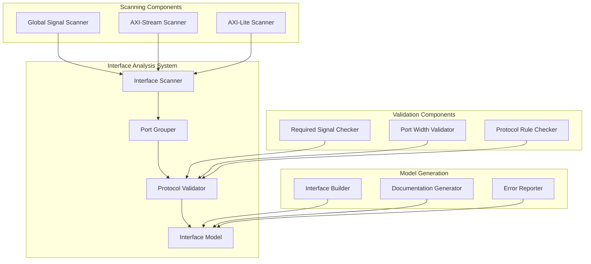

# RTL Parser Interface Analysis Implementation Plan

## Overview
This document outlines the implementation plan for enhancing the RTL Parser with advanced interface analysis capabilities. The system will identify, validate, and group ports into standard interfaces based on the AXI4 protocol family.

## Interface Types

### 1. Global Control Interface
Required control signals that must exist in every module:
- `ap_clk`: Input, Core clock
- `ap_rst_n`: Input, Active-low reset

Optional control signals:
- `ap_clk2x`: Input, Double-rate clock

### 2. Dataflow Interface (AXI-Stream)
For streaming data between kernels, following AXI-Stream protocol:

Required signals (per interface):
- `{name}_TDATA`: Input/Output, Data bus (width must be multiple of 8)
- `{name}_TVALID`: Input/Output, Data valid
- `{name}_TREADY`: Output/Input, Ready for data

Optional signals:
- `{name}_TLAST`: Input/Output, End of packet

### 3. Configuration Interface (AXI-Lite)
For runtime configuration and control, following AXI-Lite protocol:

Write channel (required signals):
- `config_AWADDR`: Input, Write address
- `config_AWPROT`: Input, Protection type
- `config_AWVALID`: Input, Address valid
- `config_AWREADY`: Output, Address ready
- `config_WDATA`: Input, Write data
- `config_WSTRB`: Input, Write strobe
- `config_WVALID`: Input, Write valid
- `config_WREADY`: Output, Write ready
- `config_BRESP`: Output, Write response
- `config_BVALID`: Output, Response valid
- `config_BREADY`: Input, Response ready

Read channel (required signals):
- `config_ARADDR`: Input, Read address
- `config_ARPROT`: Input, Protection type
- `config_ARVALID`: Input, Address valid
- `config_ARREADY`: Output, Address ready
- `config_RDATA`: Output, Read data
- `config_RRESP`: Output, Read response
- `config_RVALID`: Output, Read valid
- `config_RREADY`: Input, Read ready

## Architecture



## Implementation Plan

### 1. Core Data Structures

```python
# interface_types.py
class InterfaceType(Enum):
    GLOBAL_CONTROL = "global"
    AXI_STREAM = "axis"
    AXI_LITE = "axilite"

class PortGroup:
    """Group of related ports forming an interface"""
    def __init__(self, interface_type: InterfaceType):
        self.type = interface_type
        self.required_ports: Dict[str, Port] = {}
        self.optional_ports: Dict[str, Port] = {}
        self.metadata: Dict[str, Any] = {}

class Interface:
    """Validated interface with metadata"""
    def __init__(self, group: PortGroup):
        self.name: str
        self.type: InterfaceType
        self.ports: PortGroup
        self.validation_status: ValidationStatus
```

### 2. Interface Scanner

```python
# interface_scanner.py
class InterfaceScanner:
    """Identifies potential interfaces from port lists"""
    
    def scan_global_signals(self, ports: List[Port]) -> PortGroup:
        """Identify global control signals"""
        global_ports = PortGroup(InterfaceType.GLOBAL_CONTROL)
        for port in ports:
            if self._is_global_signal(port.name):
                global_ports.add_port(port)
        return global_ports
    
    def scan_axi_stream(self, ports: List[Port]) -> List[PortGroup]:
        """Identify AXI-Stream interfaces"""
        # Group ports by prefix (before _TDATA, etc)
        stream_groups = self._group_by_prefix(ports, "_T")
        return [self._build_stream_group(name, ports) 
                for name, ports in stream_groups.items()]
    
    def scan_axi_lite(self, ports: List[Port]) -> Optional[PortGroup]:
        """Identify AXI-Lite interface"""
        # Look for config_ prefix or AXI-Lite signals
        lite_ports = [p for p in ports if p.name.startswith("config_")]
        return self._build_lite_group(lite_ports) if lite_ports else None
```

### 3. Protocol Validator

```python
# protocol_validator.py
class ProtocolValidator:
    """Validates interface protocol requirements"""
    
    def validate_global_signals(self, group: PortGroup) -> ValidationResult:
        """Validate global control signals"""
        required = {"ap_clk", "ap_rst_n"}
        optional = {"ap_clk2x"}
        
        # Check required signals exist
        missing = required - set(group.required_ports.keys())
        if missing:
            return ValidationResult(False, f"Missing required signals: {missing}")
            
        # Validate signal properties
        for name, port in group.required_ports.items():
            if not self._validate_global_signal(name, port):
                return ValidationResult(False, f"Invalid global signal: {name}")
                
        return ValidationResult(True)
    
    def validate_axi_stream(self, group: PortGroup) -> ValidationResult:
        """Validate AXI-Stream interface"""
        # Validate required signals (TDATA, TVALID, TREADY)
        # Check TDATA width is multiple of 8
        # Verify signal directions
        
    def validate_axi_lite(self, group: PortGroup) -> ValidationResult:
        """Validate AXI-Lite interface"""
        # Validate write channel signals
        # Validate read channel signals
        # Check address width consistency
```

### 4. Interface Builder

```python
# interface_builder.py
class InterfaceBuilder:
    """Builds validated interface models"""
    
    def build_interfaces(self, 
                        ports: List[Port]) -> Dict[str, Interface]:
        """Build all interfaces from port list"""
        scanner = InterfaceScanner()
        validator = ProtocolValidator()
        
        # Scan for interfaces
        global_group = scanner.scan_global_signals(ports)
        stream_groups = scanner.scan_axi_stream(ports)
        lite_group = scanner.scan_axi_lite(ports)
        
        # Validate and build interfaces
        interfaces = {}
        
        # Global interface
        result = validator.validate_global_signals(global_group)
        if result.valid:
            interfaces["global"] = Interface(global_group)
            
        # Stream interfaces
        for group in stream_groups:
            result = validator.validate_axi_stream(group)
            if result.valid:
                interfaces[group.name] = Interface(group)
                
        # AXI-Lite interface
        if lite_group:
            result = validator.validate_axi_lite(lite_group)
            if result.valid:
                interfaces["config"] = Interface(lite_group)
                
        return interfaces
```

## Testing Strategy

### 1. Unit Tests

```python
# test_interface_scanner.py
def test_global_signal_detection():
    """Test global signal identification"""
    ports = [
        Port("ap_clk", Direction.INPUT, "1"),
        Port("ap_rst_n", Direction.INPUT, "1"),
        Port("ap_clk2x", Direction.INPUT, "1")
    ]
    scanner = InterfaceScanner()
    group = scanner.scan_global_signals(ports)
    assert len(group.required_ports) == 2
    assert len(group.optional_ports) == 1

# test_protocol_validator.py
def test_axi_stream_validation():
    """Test AXI-Stream protocol validation"""
    ports = [
        Port("in0_TDATA", Direction.INPUT, "32"),
        Port("in0_TVALID", Direction.INPUT, "1"),
        Port("in0_TREADY", Direction.OUTPUT, "1")
    ]
    group = PortGroup(InterfaceType.AXI_STREAM)
    for port in ports:
        group.add_port(port)
    
    validator = ProtocolValidator()
    result = validator.validate_axi_stream(group)
    assert result.valid
```

### 2. Integration Tests

```python
# test_interface_builder.py
def test_full_interface_analysis():
    """Test end-to-end interface building"""
    ports = [
        # Global signals
        Port("ap_clk", Direction.INPUT, "1"),
        Port("ap_rst_n", Direction.INPUT, "1"),
        
        # AXI-Stream input
        Port("in0_TDATA", Direction.INPUT, "32"),
        Port("in0_TVALID", Direction.INPUT, "1"),
        Port("in0_TREADY", Direction.OUTPUT, "1"),
        
        # AXI-Stream output
        Port("out0_TDATA", Direction.OUTPUT, "32"),
        Port("out0_TVALID", Direction.OUTPUT, "1"),
        Port("out0_TREADY", Direction.INPUT, "1"),
        
        # AXI-Lite config
        Port("config_AWADDR", Direction.INPUT, "32"),
        # ... other AXI-Lite signals
    ]
    
    builder = InterfaceBuilder()
    interfaces = builder.build_interfaces(ports)
    
    assert "global" in interfaces
    assert "in0" in interfaces
    assert "out0" in interfaces
    assert "config" in interfaces
```

## Success Criteria

1. **Interface Detection**
   - Correctly identifies all three interface types
   - Groups related ports accurately
   - Handles multiple AXI-Stream interfaces

2. **Protocol Validation**
   - Enforces required signal presence
   - Validates signal properties
   - Verifies protocol rules

3. **Error Handling**
   - Clear error messages for missing signals
   - Validation status for each interface
   - Detailed violation reporting

4. **Integration**
   - Clean integration with existing parser
   - No disruption to current functionality
   - Comprehensive test coverage

## Next Steps

1. Implement core data structures
2. Build interface scanner
3. Create protocol validator
4. Integrate interface builder
5. Add comprehensive tests
6. Document API and usage