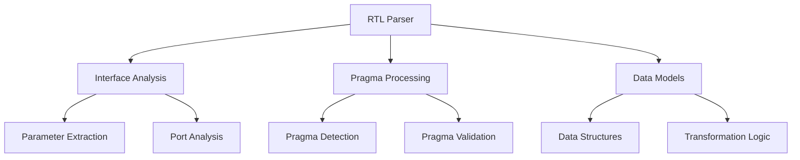

# RTL Parser Implementation Plan

## 1. Component Overview



## 2. Implementation Steps

### 2.1 Project Setup
1. Directory Structure:
```
/brainsmith/tools/hw_kernel_gen/
├── rtl_parser/
│   ├── __init__.py
│   ├── parser.py        # Main parser implementation
│   ├── interface.py     # Interface analysis
│   ├── pragma.py        # Pragma processing
│   └── data.py          # Data structures
├── tests/
│   ├── __init__.py
│   ├── test_parser.py
│   ├── test_interface.py
│   ├── test_pragma.py
│   └── fixtures/        # Test RTL files
└── setup.py
```

2. Dependencies:
- py-tree-sitter
- SystemVerilog grammar (sv.so)
- pytest for testing

### 2.2 Core Components

#### A. Interface Analysis
1. Parameter Extraction:
```python
class Parameter:
    name: str           # Parameter identifier
    param_type: str     # Parameter datatype
    default_value: str  # Default value if specified
    
def extract_parameters(ast: Node) -> List[Parameter]:
    """Extract parameters from module declaration"""
```

2. Port Analysis:
```python
class Port:
    name: str          # Port identifier
    direction: str     # "input" or "output"
    width: str        # Bit width expression
    
def extract_ports(ast: Node) -> List[Port]:
    """Extract ports from module declaration"""
```

#### B. Pragma Processing
1. Pragma Detection:
```python
class Pragma:
    type: str           # Pragma type identifier
    inputs: List[str]   # Pragma arguments
    line_number: int    # Source line number
    
def extract_pragmas(ast: Node) -> List[Pragma]:
    """Extract @brainsmith pragmas from comments"""
```

2. Pragma Registry:
```python
class PragmaHandler:
    """Base class for pragma processors"""
    def validate(self, inputs: List[str]) -> bool
    def process(self, inputs: List[str]) -> Dict
```

#### C. Data Models
1. Core Structures:
```python
class HWKernel:
    """Top-level representation of parsed RTL"""
    name: str
    parameters: List[Parameter]
    ports: List[Port]
    pragmas: List[Pragma]
```

2. Validation Rules:
- Parameter names must be valid identifiers
- Port widths must be preserved as expressions
- Pragmas must have valid type and inputs

### 2.3 Testing Strategy

1. Unit Tests:
- Parameter extraction
- Port width parsing
- Pragma detection
- Data validation

2. Integration Tests:
- Complete module parsing
- Error handling
- Large file processing

3. Test Fixtures:
```systemverilog
// Example test file
module test_kernel #(
    parameter WIDTH = 32
) (
    input logic clk,
    output logic [WIDTH-1:0] data
);
// @brainsmith interface AXI_STREAM
endmodule
```

### 2.4 Error Handling

1. Error Types:
```python
class ParserError(Exception):
    """Base class for parser errors"""
    
class SyntaxError(ParserError):
    """Invalid SystemVerilog syntax"""
    
class PragmaError(ParserError):
    """Invalid pragma format/content"""
```

2. Error Recovery:
- Continue parsing after non-fatal errors
- Provide clear error messages with line numbers
- Log warnings for potential issues

## 3. Development Process

1. Implementation Order:
   a. Basic AST parsing setup
   b. Parameter extraction
   c. Port analysis
   d. Pragma processing
   e. Data model integration
   f. Testing & validation

2. Code Quality:
   - Type hints
   - Comprehensive docstrings
   - Clear error messages
   - Performance considerations

3. Documentation:
   - API documentation
   - Usage examples
   - Error reference