# Three-Phase DSE Pipeline

## Interactive Pipeline Flow (Mermaid)

```mermaid
%%{init: {'theme':'default', 'themeVariables': {'fontSize': '16px'}}}%%
flowchart TB
    %% Input Layer
    subgraph INPUT["📥 Input Layer"]
        MODEL[["🧠 ONNX Model"]]
        BLUEPRINT[["📋 Blueprint YAML"]]
        CONFIG[["⚙️ Environment Config"]]
    end

    %% Phase 1
    subgraph PHASE1["🔨 Design Space Constructor"]
        direction TB
        FORGE["ForgeAPI"]
        PARSER["Blueprint Parser"]
        VALIDATOR["Schema Validator"]
        SPACE["Design Space"]
        
        FORGE --> PARSER
        PARSER --> VALIDATOR
        VALIDATOR --> SPACE
    end

    %% Phase 2
    subgraph PHASE2["🔍 Phase 2: Design Space Explorer"]
        direction TB
        EXPLORER["Explorer Engine"]
        GENERATOR["Combination Generator"]
        RANKER["Pareto Ranker"]
        EXECUTOR["Parallel Executor"]
        
        EXPLORER --> GENERATOR
        GENERATOR --> RANKER
        RANKER --> EXECUTOR
    end

    %% Phase 3
    subgraph PHASE3["🏗️ Phase 3: Build Runner"]
        direction TB
        RUNNER["Build Runner"]
        BACKEND["Backend Factory"]
        BUILDER["Hardware Builder"]
        METRICS["Metrics Collector"]
        
        RUNNER --> BACKEND
        BACKEND --> BUILDER
        BUILDER --> METRICS
    end

    %% Output Layer
    subgraph OUTPUT["📤 Output Layer"]
        RESULTS[["📊 Exploration Results"]]
        ARTIFACTS[["🎯 Build Artifacts"]]
        FPGA[["💾 FPGA Bitstream"]]
    end

    %% Connections
    MODEL --> PHASE1
    BLUEPRINT --> PHASE1
    CONFIG --> PHASE1
    
    PHASE1 --> PHASE2
    PHASE2 --> PHASE3
    
    PHASE3 --> RESULTS
    PHASE3 --> ARTIFACTS
    PHASE3 --> FPGA

    %% Styling
    style PHASE1 fill:#1f2937,color:#fff,stroke:#374151,stroke-width:3px
    style PHASE2 fill:#7c3aed,color:#fff,stroke:#6d28d9,stroke-width:3px
    style PHASE3 fill:#0891b2,color:#fff,stroke:#0e7490,stroke-width:3px
    style INPUT fill:#059669,color:#fff,stroke:#047857,stroke-width:2px
    style OUTPUT fill:#dc2626,color:#fff,stroke:#b91c1c,stroke-width:2px
```

## Phase Details

### Phase 1: Design Space Constructor
**Purpose**: Transform user specifications into a valid design space

**Components**:
- **ForgeAPI**: Main entry point for blueprint processing
- **Blueprint Parser**: YAML parsing with schema validation
- **Schema Validator**: Ensures blueprint correctness
- **Design Space**: Complete set of valid configurations

**Key Features**:
- Plugin auto-discovery
- Variant expansion (mutually exclusive options)
- Constraint validation
- O(1) plugin lookup optimization

### Phase 2: Design Space Explorer
**Purpose**: Systematically explore and rank configurations

**Components**:
- **Explorer Engine**: Orchestrates exploration process
- **Combination Generator**: Creates all valid BuildConfigs
- **Pareto Ranker**: Multi-objective optimization
- **Parallel Executor**: Concurrent build execution

**Key Features**:
- Exhaustive or intelligent sampling
- Resume capability for long runs
- Hook system for extensibility
- Real-time progress tracking

### Phase 3: Build Runner
**Purpose**: Execute hardware builds and collect metrics

**Components**:
- **Build Runner**: Abstract interface for backends
- **Backend Factory**: Selects appropriate backend
- **Hardware Builder**: Executes compilation
- **Metrics Collector**: Standardized metric collection

**Supported Backends**:
- Legacy FINN (current default)
- Future Brainsmith (plugin-based)
- Mock (for testing)

## Data Flow

1. **Input**: ONNX model + Blueprint YAML + Environment config
2. **Phase 1 Output**: DesignSpace object with all valid configurations
3. **Phase 2 Output**: Ranked BuildConfig array ready for execution
4. **Phase 3 Output**: BuildResult array with metrics and artifacts
5. **Final Output**: Best configuration, Pareto set, FPGA bitstream