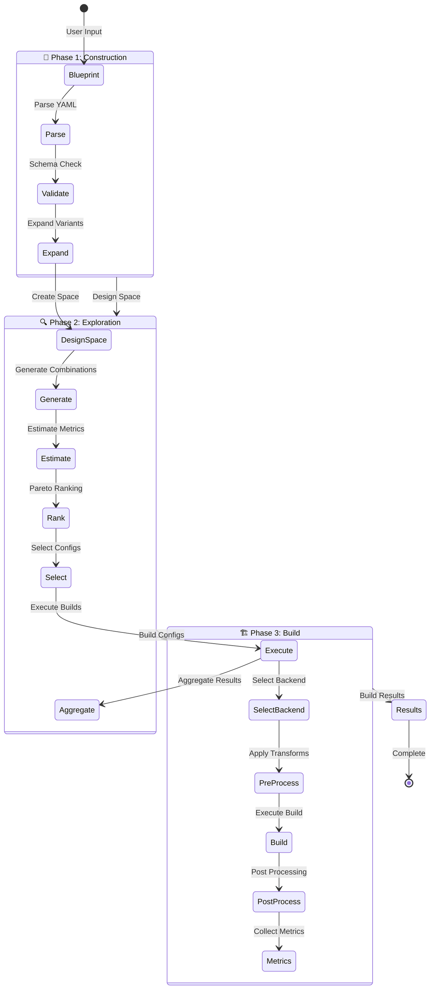

# Design Space Exploration Flow

## DSE State Machine (Mermaid)



## Exploration Strategies

### 1. Exhaustive Search
- Evaluates every possible configuration
- Guarantees finding global optimum
- Suitable for small design spaces (<1000 configs)

### 2. Random Sampling
- Randomly samples configurations
- Good for initial exploration
- Configurable sample size

### 3. Genetic Algorithm (Future)
- Evolutionary approach
- Guided by fitness function
- Efficient for large spaces

### 4. Bayesian Optimization (Future)
- ML-guided exploration
- Learns from previous evaluations
- Minimizes expensive builds

## Key Exploration Features

### Resume Capability
```python
# Long-running exploration with checkpointing
explorer = ExplorerEngine(
    build_runner_factory=FinnBuildRunner.create,
    hooks=[CachingHook(cache_dir=".cache/my_exploration")]
)

# Resume from checkpoint after interruption
results = explorer.explore(
    design_space,
    resume_from="dse_abc12345_config_00075"
)
```

### Hook System
- **LoggingHook**: Detailed exploration logging
- **CachingHook**: Result caching and resume
- **EarlyStoppingHook**: Stop on convergence
- **MetricsHook**: Real-time metric collection
- **Custom Hooks**: User-defined behavior

### Parallel Execution
- Configurable worker pool size
- Thread-safe build execution
- Automatic load balancing
- Failed build recovery

### Constraint System
```yaml
search:
  constraints:
    - metric: "lut_utilization"
      operator: "<="
      value: 0.85
    - metric: "throughput"
      operator: ">="
      value: 1000.0
```

## Exploration Metrics

### Performance Metrics
- **Throughput**: Inferences per second
- **Latency**: End-to-end delay
- **Clock Frequency**: Operating frequency

### Resource Metrics
- **LUT Utilization**: Logic resources
- **BRAM Utilization**: Memory blocks
- **DSP Utilization**: Math units
- **FF Utilization**: Flip-flops

### Power Metrics
- **Dynamic Power**: Active power consumption
- **Static Power**: Idle power consumption
- **Total Power**: Combined estimate

## Results Analysis

### Pareto Frontier
Multi-objective optimization finding non-dominated solutions:
- No other solution is better in ALL metrics
- Represents trade-off curve
- Helps select based on priorities

### Ranking Algorithms
1. **Weighted Sum**: Combine metrics with weights
2. **Pareto Dominance**: Find non-dominated set
3. **Constraint Satisfaction**: Filter valid configs
4. **Custom Ranking**: User-defined functions