# Backend System Architecture

## Backend Factory Pattern (Mermaid)

```mermaid
%%{init: {'theme':'default', 'themeVariables': {'fontSize': '16px', 'primaryColor': '#1f2937', 'primaryBorderColor': '#374151', 'secondaryColor': '#7c3aed', 'tertiaryColor': '#0891b2'}}}%%
flowchart LR
    subgraph "🎯 Build Configuration"
        CONFIG[BuildConfig]
        CONFIG -->|config_id| ID[Config ID]
        CONFIG -->|kernels| KERN[Kernel Selections]
        CONFIG -->|transforms| TRANS[Transform Sequence]
        CONFIG -->|backend| BACK[Backend Type]
    end
    
    subgraph "🏭 Backend Factory"
        FACTORY{Backend Factory}
        FACTORY -->|legacy_finn| FINN[FINN Backend]
        FACTORY -->|future| FUTURE[Future Backend]
        FACTORY -->|mock| MOCK[Mock Backend]
    end
    
    subgraph "🔧 Backend Implementation"
        FINN --> FINNIMPL[Legacy FINN<br/>• HLS Synthesis<br/>• RTL Generation<br/>• IP Creation]
        FUTURE --> FUTUREIMPL[Future Brainsmith<br/>• Plugin-based<br/>• Multi-backend<br/>• Extensible]
        MOCK --> MOCKIMPL[Mock Backend<br/>• Testing<br/>• Simulation<br/>• Fast iteration]
    end
    
    subgraph "📊 Results"
        RESULT[BuildResult]
        RESULT --> STATUS[Status]
        RESULT --> METRICS[Metrics]
        RESULT --> ARTIFACTS[Artifacts]
    end
    
    CONFIG --> FACTORY
    FINNIMPL --> RESULT
    FUTUREIMPL --> RESULT
    MOCKIMPL --> RESULT
    
    style FACTORY fill:#7c3aed,color:#fff,stroke:#6d28d9,stroke-width:3px
    style FINN fill:#0891b2,color:#fff
    style FUTURE fill:#059669,color:#fff
    style MOCK fill:#f59e0b,color:#fff
```



## Backend Types

### 1. Legacy FINN Backend (Current Default)

**Purpose**: Integration with existing FINN toolchain

**Features**:
- Step-based pipeline execution
- Mature HLS/RTL generation
- Xilinx Vivado integration
- Production-tested

**Pipeline Steps**:
```python
build_steps = [
    "step_tidy_up",
    "step_streamline", 
    "step_convert_to_hw",
    "step_specialize_layers",
    "step_create_dataflow_partition",
    "step_target_fps_parallelization",
    "step_apply_folding_config",
    "step_minimize_bit_width",
    "step_generate_estimate_reports",
    "step_hw_codegen",
    "step_hw_ipgen",
    "step_out_of_context_synthesis",
    "step_synthesize_bitfile"
]
```

### 2. Future Brainsmith Backend

**Purpose**: Next-generation plugin-based backend

**Features**:
- Kernel-level backend selection
- Dynamic plugin loading
- Multi-language support (HLS, RTL, C++)
- Extensible architecture

**Architecture**:
```python
# Per-kernel backend selection
kernels = {
    "LayerNorm": ["LayerNormHLS", "LayerNormRTL"],
    "MatMul": ["MatMulHLS", "MatMulDSP", "MatMulLUT"],
    "Softmax": ["SoftmaxHLS", "SoftmaxPipelined"]
}
```

### 3. Mock Backend

**Purpose**: Testing and development

**Features**:
- Configurable success rate
- Predictable metrics
- No hardware requirements
- Fast execution

**Use Cases**:
- DSE algorithm testing
- CI/CD pipelines
- Frontend development
- Performance estimation

## Backend Interface

```python
class BuildRunnerInterface(ABC):
    """Abstract interface for all backends"""
    
    @abstractmethod
    def get_backend_name(self) -> str:
        """Return backend identifier"""
        pass
    
    @abstractmethod
    def get_supported_output_stages(self) -> List[OutputStage]:
        """Return supported output stages"""
        pass
    
    @abstractmethod
    def run(self, config: BuildConfig) -> BuildResult:
        """Execute build and return results"""
        pass
```

## Build Execution Flow

### 1. Backend Selection
```python
def create_build_runner(backend_type: str) -> BuildRunnerInterface:
    if backend_type == "legacy_finn":
        return LegacyFinnBackend()
    elif backend_type == "future":
        return FutureBrainsmithBackend()
    elif backend_type == "mock":
        return MockBuildRunner()
    else:
        raise ValueError(f"Unknown backend: {backend_type}")
```

### 2. Build Process
1. **Preprocessing**: Apply input transforms
2. **Compilation**: Backend-specific build
3. **Postprocessing**: Apply output transforms
4. **Metrics Collection**: Gather performance data
5. **Artifact Generation**: Save outputs

### 3. Result Structure
```python
@dataclass
class BuildResult:
    config_id: str
    status: BuildStatus
    start_time: datetime
    end_time: Optional[datetime]
    metrics: Optional[BuildMetrics]
    artifacts: Dict[str, Path]
    error_message: Optional[str]
    warnings: List[str]
```

## Backend-Specific Features

### FINN Backend
- **Vivado Integration**: Direct synthesis flow
- **IP Generation**: Packaged IP cores
- **Board Support**: Pynq, ZCU104, Alveo
- **Optimization**: Auto-folding, bit-width minimization

### Future Backend
- **Plugin Discovery**: Automatic backend detection
- **Mixed Backends**: Different backends per kernel
- **Custom Generators**: User-defined code generation
- **Language Agnostic**: HLS, RTL, OpenCL, etc.

### Mock Backend
- **Metric Simulation**: Realistic performance estimates
- **Error Injection**: Test error handling
- **Deterministic**: Reproducible results
- **Configuration**: YAML-based behavior

## Backend Configuration

```yaml
# Blueprint backend configuration
global:
  backend: "legacy_finn"  # or "future", "mock"
  
finn_config:
  board: "Pynq-Z1"
  shell_flow_type: "vivado_zynq"
  vitis_platform: "xilinx_zcu104_base_202020_1"
  
future_config:
  default_language: "hls"
  kernel_backends:
    LayerNorm: "rtl"  # Override default
    
mock_config:
  success_rate: 0.95
  metric_ranges:
    throughput: [100, 1000]
    latency: [1, 10]
```