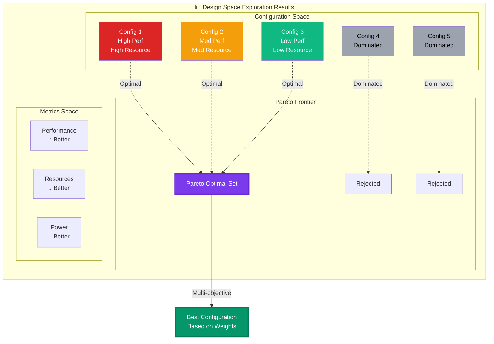

# Pareto Optimization in DSE

## Multi-Objective Optimization Visualization (Mermaid)



## Pareto Frontier Concept (ASCII Art)

```
Performance (fps) ↑
        │
   1000 ├ C1 ●─────────┐
        │              │
    800 ├              │ Pareto
        │              │ Frontier
    600 ├       C2 ●───┤
        │              │
    400 ├              │
        │     C4 ○     │
    200 ├              C3 ●
        │   C5 ○         
      0 └────┴────┴────┴────► Resource Usage (%)
        0   20   40   60   80

    ● = Pareto Optimal (non-dominated)
    ○ = Dominated configurations
```

## Key Concepts

### 1. Dominance
A configuration **dominates** another if:
- It's better in at least one metric
- It's not worse in any metric

Example:
- Config A: 800 fps, 50% LUT
- Config B: 600 fps, 60% LUT
- A dominates B (higher fps, lower LUT)

### 2. Pareto Optimality
A configuration is **Pareto optimal** if:
- No other configuration dominates it
- It represents a valid trade-off

### 3. Trade-off Analysis
Pareto frontier shows:
- Available trade-offs
- Diminishing returns
- Design boundaries

## Implementation in Brainsmith

### Metric Collection
```python
@dataclass
class BuildMetrics:
    # Performance metrics
    throughput: float      # inferences/second
    latency: float        # microseconds
    
    # Resource metrics  
    lut_utilization: float    # percentage
    bram_utilization: float   # percentage
    dsp_utilization: float    # percentage
    ff_utilization: float     # percentage
    
    # Power metrics
    dynamic_power: float   # watts
    static_power: float    # watts
    total_power: float     # watts
    
    # Derived metrics
    power_efficiency: float  # fps/watt
    area_efficiency: float   # fps/LUT
```

### Pareto Ranking Algorithm
```python
def compute_pareto_frontier(results: List[BuildResult]) -> List[BuildConfig]:
    """Find non-dominated configurations"""
    pareto_configs = []
    
    for candidate in results:
        dominated = False
        for other in results:
            if dominates(other.metrics, candidate.metrics):
                dominated = True
                break
        
        if not dominated:
            pareto_configs.append(candidate.config)
    
    return pareto_configs
```

### Weighted Selection
```python
# Define optimization weights
weights = {
    "throughput": 0.4,      # 40% importance
    "power_efficiency": 0.3,  # 30% importance
    "lut_utilization": 0.3   # 30% importance (minimize)
}

# Find best weighted configuration
best_config = results.get_best_weighted(weights)
```

## Visualization Examples

### 2D Trade-off Curve
```
Throughput vs Resources:
- Each point is a configuration
- Pareto frontier connects optimal points
- Area under curve shows feasible region
```

### 3D Pareto Surface
```
Throughput vs Resources vs Power:
- 3D surface of optimal configurations
- Multiple 2D projections for analysis
- Interactive exploration possible
```

### Parallel Coordinates
```
Multi-dimensional visualization:
- Each vertical axis is a metric
- Lines connect metric values
- Pareto optimal lines highlighted
```

## Use Cases

### 1. Resource-Constrained Design
Find highest performance within resource budget:
```yaml
constraints:
  - metric: "lut_utilization"
    operator: "<="
    value: 0.7  # 70% max
```

### 2. Performance Requirements
Find most efficient design meeting performance:
```yaml
constraints:
  - metric: "throughput"
    operator: ">="
    value: 1000  # min 1000 fps
```

### 3. Balanced Optimization
Equal weight to all metrics:
```python
weights = {
    "throughput": 0.33,
    "power_efficiency": 0.33,
    "resource_efficiency": 0.34
}
```

## Advanced Features

### Dynamic Weight Adjustment
- Interactive weight tuning
- Real-time frontier updates
- Sensitivity analysis

### Constraint Relaxation
- Gradually relax constraints
- Find feasibility boundaries
- Trade-off exploration

### Hierarchical Objectives
- Primary: Meet constraints
- Secondary: Optimize metrics
- Tertiary: Minimize cost

## Best Practices

1. **Define Clear Objectives**: Know what metrics matter
2. **Set Realistic Constraints**: Based on platform limits
3. **Explore Trade-offs**: Don't fixate on single metric
4. **Validate Results**: Ensure metrics are accurate
5. **Document Decisions**: Record weight rationale
6. **Iterate**: Refine based on results