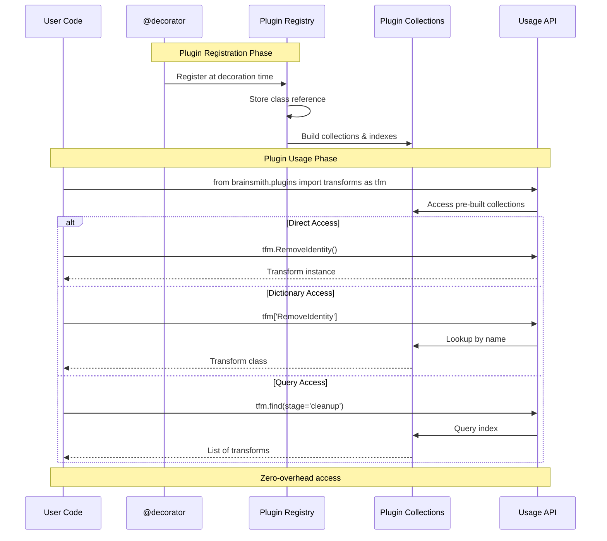

# Plugin Discovery and Registration

## Registration Sequence Diagram (Mermaid)



## Plugin Registration Flow (ASCII Art)

```
PLUGIN REGISTRATION & DISCOVERY FLOW
═══════════════════════════════════

1. DECORATION TIME (Import)
   ─────────────────────────
   
   @transform(name="Cleanup")     @kernel(name="MatMul")
   class MyTransform:             class MatMulOp:
        │                              │
        ▼                              ▼
   ┌──────────────────────────────────────┐
   │         GLOBAL REGISTRY              │
   │   • transforms: Dict[str, Type]      │
   │   • kernels: Dict[str, Type]         │
   │   • backends: Dict[str, Type]        │
   │   • steps: Dict[str, Type]           │
   └──────────────────────────────────────┘
   
2. COLLECTION BUILDING
   ──────────────────
   
   Registry ──► Collections ──► Indexes
                    │              │
                    ▼              ▼
              ┌──────────┐  ┌──────────────┐
              │ By Stage │  │ By Framework │
              │ By Type  │  │ By Backend   │
              │ By Name  │  │ By Category  │
              └──────────┘  └──────────────┘

3. USAGE TIME
   ──────────
   
   User Code           Plugin Collections
       │                      │
       ▼                      ▼
   tfm.Cleanup() ────► Direct Access ────► Instance
   tfm['Cleanup'] ───► Dict Lookup ─────► Class
   tfm.find(...) ────► Query Index ─────► List[Type]
```

## Registration Mechanisms

### 1. Decorator Registration
```python
@transform(
    name="RemoveIdentity",
    stage="cleanup",
    framework="qonnx",
    priority=100
)
class RemoveIdentityOps:
    """Remove identity operations from graph"""
    
    def apply(self, model):
        # Implementation
        return optimized_model
```

### 2. Auto-Discovery Process
```python
# During module import
brainsmith/
├── transforms/
│   ├── __init__.py      # Imports all submodules
│   ├── cleanup.py       # Contains @transform classes
│   └── optimization.py  # More @transform classes

# Automatic registration on import
from brainsmith.transforms import *  # All registered!
```

### 3. Framework Integration
```python
# QONNX transforms auto-registered
@framework_transform("qonnx", qonnx.cleanup.RemoveIdentity)
class QONNXRemoveIdentity:
    pass

# FINN transforms auto-registered  
@framework_transform("finn", finn.transform.Streamline)
class FINNStreamline:
    pass
```

## Collection Organization

### Hierarchical Structure
```
Plugin Collections
├── transforms/
│   ├── all()              # All transforms
│   ├── cleanup/           # By stage
│   │   ├── RemoveIdentity
│   │   └── FoldConstants
│   ├── optimization/
│   │   ├── Streamline
│   │   └── SetTiled
│   └── qonnx/            # By framework
│       ├── all()
│       └── find()
├── kernels/
│   ├── all()
│   ├── finn/
│   └── brainsmith/
└── backends/
    ├── by_kernel()
    └── by_language()
```

### Index Types
```python
# Pre-computed indexes for O(1) lookup
indexes = {
    "by_name": {"RemoveIdentity": RemoveIdentityOps},
    "by_stage": {"cleanup": [RemoveIdentityOps, ...]},
    "by_framework": {"qonnx": [...]},
    "by_category": {"synthesis": [...]},
    "by_kernel": {"MatMul": [MatMulHLS, MatMulRTL]},
    "by_language": {"hls": [...], "rtl": [...]}
}
```

## Usage Patterns

### 1. Direct Attribute Access
```python
from brainsmith.plugins import transforms as tfm

# Zero overhead - direct class access
model = tfm.RemoveIdentity().apply(model)
model = tfm.qonnx.FoldConstants().apply(model)
```

### 2. Dynamic Plugin Selection
```python
# Runtime plugin selection
plugin_name = config["transform"]
transform_class = tfm[plugin_name]
model = transform_class().apply(model)
```

### 3. Plugin Discovery
```python
# Find all cleanup transforms
cleanup_transforms = tfm.find(stage="cleanup")

# Find backends for a kernel
matmul_backends = backends.find(kernel="MatMul")

# Get all FINN kernels
finn_kernels = kernels.finn.all()
```

### 4. Category-Based Access
```python
# Build steps by category
synthesis_steps = steps.synthesis.all()
verification_steps = steps.verification.all()

# Transforms by framework
qonnx_transforms = tfm.qonnx.all()
finn_transforms = tfm.finn.all()
```

## Performance Optimizations

### 1. Lazy Loading
```python
# Plugins loaded only when accessed
class LazyPluginCollection:
    def __getattr__(self, name):
        if name not in self._loaded:
            self._load_plugin(name)
        return self._loaded[name]
```

### 2. Cached Lookups
```python
# First lookup builds cache
@lru_cache(maxsize=128)
def find_plugins(stage=None, framework=None):
    # Query implementation
    return matching_plugins
```

### 3. Production Mode
```python
# Blueprint loader creates minimal registry
def load_blueprint_plugins(blueprint):
    """Load only plugins referenced in blueprint"""
    required_plugins = extract_plugin_names(blueprint)
    return create_subset_registry(required_plugins)
```

## Error Handling

### Registration Errors
```python
# Duplicate registration detection
@transform(name="Duplicate")
class Transform1:
    pass

@transform(name="Duplicate")  # Error!
class Transform2:
    pass
# Raises: PluginRegistrationError
```

### Usage Errors
```python
# Plugin not found
try:
    transform = tfm['NonExistent']
except KeyError as e:
    print(f"Plugin not found: {e}")
    suggestions = find_similar_names('NonExistent')
    print(f"Did you mean: {suggestions}")
```

### Validation
```python
# Plugin interface validation
def validate_plugin(plugin_class):
    required_methods = ['apply', 'get_nodeattr_types']
    for method in required_methods:
        if not hasattr(plugin_class, method):
            raise ValidationError(f"Missing method: {method}")
```

## Best Practices

1. **Use Direct Access**: `tfm.PluginName()` for known plugins
2. **Validate Early**: Check plugin existence at startup
3. **Document Plugins**: Include docstrings and examples
4. **Test Registration**: Unit test plugin discovery
5. **Monitor Performance**: Profile plugin loading time
6. **Handle Errors**: Graceful fallback for missing plugins