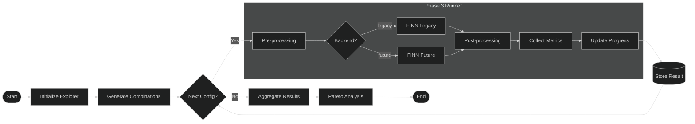
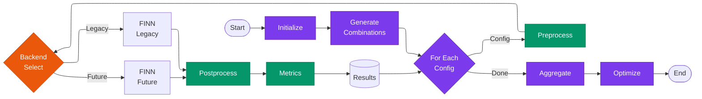
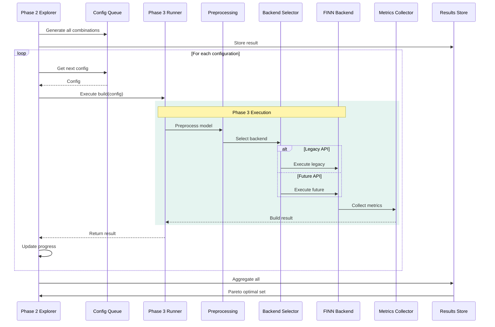
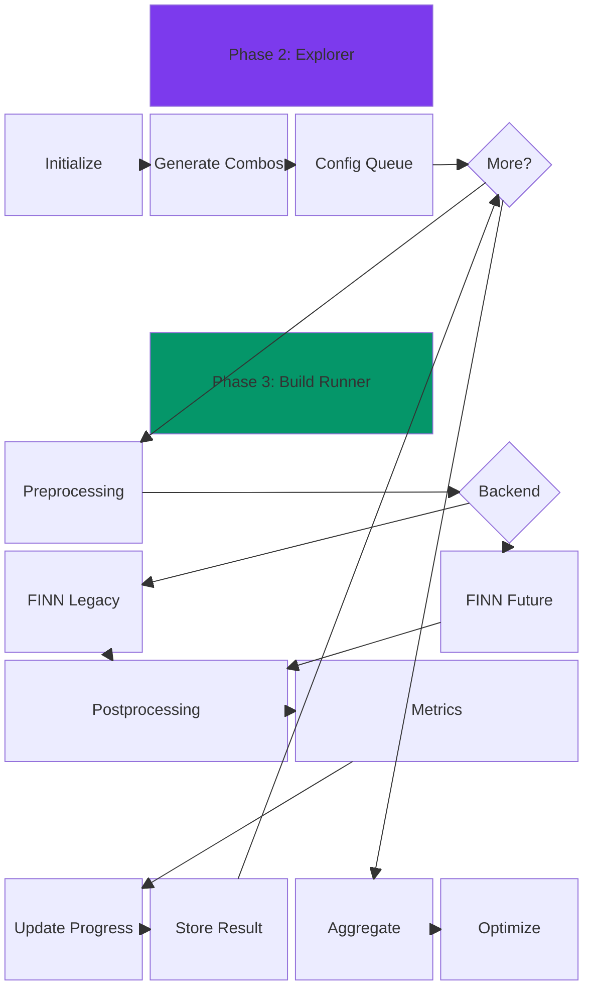
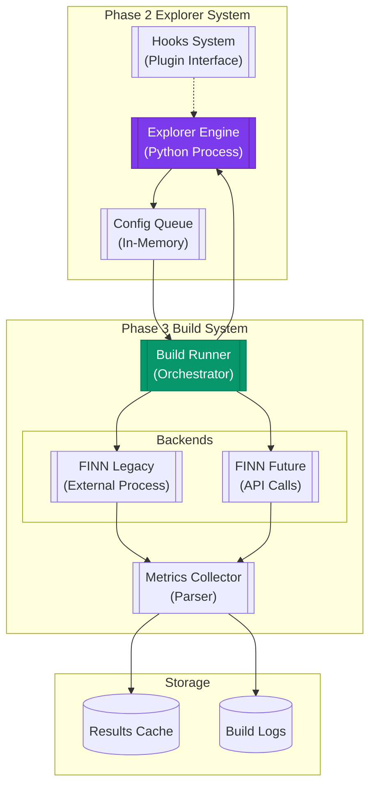

# Diagram 13 Variations: Combined Phase 2 and 3 Execution Flow

```mermaid
%%{ init: { "theme":"dark",
           "flowchart": { "curve":"basis",
                          "nodeSpacing":40,
                          "rankSpacing":30 } } }%%

flowchart LR
    %% ---------- palette ----------
    classDef subgraphFill fill:#374151,stroke:#1f2937,stroke-width:2px;
    classDef primary      fill:#111827,stroke:#374151,color:#fff;
    classDef decision     fill:#7c3aed,stroke:#6b21a8,color:#fff;
    classDef green        fill:#059669,stroke:#047857,color:#fff;

    %% ---------- Phase-2 control loop ----------
    DesignSpace([DesignSpace]):::green --> Init[Initialize Explorer]:::primary
    Init --> Gen[Generate Combinations]:::primary
    Gen  --> Next{Next Config?}:::decision

    Next -- No --> Agg[Aggregate Results]:::primary
    Agg  --> Pareto[Pareto Analysis]:::primary
    Pareto --> End([End]):::primary

    %% ---------- Phase-3 worker ----------
    subgraph P3["Phase 3 Runner"]
        direction TB
        Pre[Pre-processing]:::primary --> B{Backend?}:::decision
        B -- legacy --> L[FINN Legacy]:::primary
        B -- future --> F[FINN Future]:::primary
        L & F --> Post[Post-processing]:::primary
        Post --> M[Collect Metrics]:::primary
        M --> Prog[Update Progress]:::primary
    end
    class P3 subgraphFill;

    %% ---------- loop wiring ----------
    Next  -- Yes --> Pre
    Prog  --> Store[(Store Result)]:::primary
    Store --> Next
```





## 1. Flowchart Version (Top-Bottom)

```mermaid
flowchart TB
    accTitle: Combined Phase 2 and 3 Execution (Flowchart)
    accDescr: Flowchart showing Phase 2 exploration orchestrating Phase 3 builds

    Start([Start]) --> Init[Initialize Explorer]
    Init --> GenCombo[Generate Combinations]
    GenCombo --> NextConfig{Next Config?}
    
    NextConfig -->|Yes| P3
    NextConfig -->|No| Agg[Aggregate Results]
    
    subgraph P3 ["Phase 3 Runner"]
        Pre[Preprocessing]
        Backend{Backend?}
        Legacy[FINN Legacy]
        Future[FINN Future]
        Post[Postprocessing]
        Metrics[Collect Metrics]
        
        Pre --> Backend
        Backend -->|legacy| Legacy
        Backend -->|future| Future
        Legacy --> Post
        Future --> Post
        Post --> Metrics
    end
    
    Metrics --> Progress[Update Progress]
    Progress --> Results[(Store Result)]
    Results --> NextConfig
    
    Agg --> Optimize[Pareto Analysis]
    Optimize --> End([End])
    
    style P3 fill:#374151,stroke:#1f2937,stroke-width:2px
    style Backend fill:#7c3aed,stroke:#6b21a8,color:#fff
```



## 2. Flowchart Version (Left-Right with ELK)



## 3. Sequence Diagram Version



## 4. Block Diagram Version



## 5. Gitgraph Version (Creative Use)

```mermaid
gitgraph TB:
    accTitle: Phase 2/3 Execution as Branches
    accDescr: Creative use of gitgraph to show parallel execution paths

    commit id: "Initialize Explorer"
    commit id: "Generate Combinations"
    
    branch config-1
    checkout config-1
    commit id: "Preprocess C1"
    commit id: "FINN Legacy" tag: "backend"
    commit id: "Metrics C1"
    
    checkout main
    branch config-2
    checkout config-2
    commit id: "Preprocess C2"
    commit id: "FINN Future" tag: "backend"
    commit id: "Metrics C2"
    
    checkout main
    merge config-1
    merge config-2
    commit id: "Aggregate Results"
    commit id: "Pareto Analysis" tag: "optimal"
```

## 6. C4 Container Diagram Style (Using Flowchart)



## Comparison

Each diagram type offers different strengths:

1. **Flowchart TB**: Best for showing the overall flow and decision points
2. **Flowchart LR (ELK)**: Compact horizontal layout, good for wide displays
3. **Sequence**: Best for showing the temporal interaction and method calls
4. **Block**: Good for showing architectural layers and components
5. **Gitgraph**: Creative visualization of parallel execution paths
6. **C4 Style**: Best for showing system architecture and components

The state diagram (original #13) remains good for showing the state machine nature of the explorer, while these alternatives each emphasize different aspects of the same system.