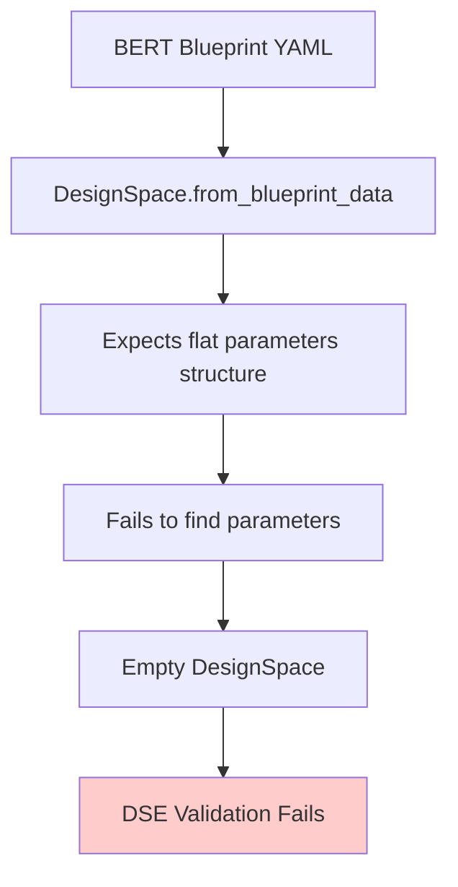
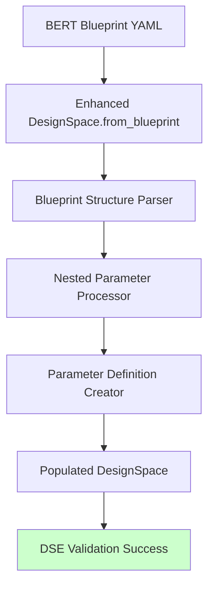
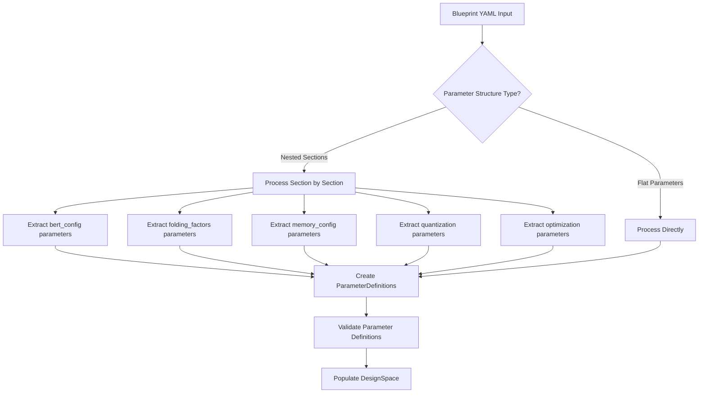

# 🎯 Enhanced DesignSpace Blueprint Integration Plan

## 📊 Current State Analysis

**Problem**: The existing `DesignSpace.from_blueprint_data()` method doesn't handle the nested BERT blueprint structure, causing empty parameter spaces.

**Root Cause**: The method expects a flat parameter structure, but BERT blueprints have nested sections (bert_config, folding_factors, etc.).

## 🏗️ Architectural Approach: Direct Blueprint Ingestion

Instead of extracting/converting parameters in `api.py`, we'll enhance the `DesignSpace` class to natively understand and process blueprint structures.

### Current Flow (Broken)



### Enhanced Flow (Proposed)



## 🔄 Blueprint Structure Processing Pipeline



## 📋 Implementation Plan

### Phase 1: Enhance DesignSpace Class

#### 1. Add Enhanced Blueprint Processing Methods

```python
@classmethod
def from_blueprint(cls, blueprint_path: str) -> 'DesignSpace':
    """Create design space directly from blueprint file."""
    
@classmethod  
def from_blueprint_data(cls, blueprint_data: Dict[str, Any]) -> 'DesignSpace':
    """Enhanced method to handle nested blueprint structures."""
    
def _process_nested_parameters(self, parameters_section: Dict[str, Any]) -> None:
    """Process nested parameter sections from blueprint."""
    
def _create_parameter_definition(self, param_name: str, param_config: Dict[str, Any]) -> ParameterDefinition:
    """Create parameter definition from blueprint parameter config."""
```

#### 2. Blueprint Parameter Structure Handler

```python
def _extract_blueprint_parameters(self, blueprint_data: Dict[str, Any]) -> Dict[str, ParameterDefinition]:
    """Extract all parameters from blueprint, handling nested sections."""
    parameter_definitions = {}
    
    if 'parameters' in blueprint_data:
        parameters = blueprint_data['parameters']
        
        for section_name, section_data in parameters.items():
            if self._is_nested_section(section_data):
                # Handle nested sections like bert_config, folding_factors
                for param_name, param_config in section_data.items():
                    if param_name != 'description':
                        full_param_name = f"{section_name}.{param_name}"
                        param_def = self._create_parameter_definition(full_param_name, param_config)
                        parameter_definitions[full_param_name] = param_def
            else:
                # Handle direct parameters
                param_def = self._create_parameter_definition(section_name, section_data)
                parameter_definitions[section_name] = param_def
    
    return parameter_definitions
```

### Phase 2: Update API Integration

#### 1. Modify `_setup_dse_configuration()` in `api.py`

```python
def _setup_dse_configuration(blueprint_data, objectives, constraints, target_device):
    """Setup DSE configuration using enhanced DesignSpace."""
    
    # Create design space directly from blueprint
    design_space = DesignSpace.from_blueprint_data(blueprint_data)
    
    # Validate design space
    is_valid, errors = design_space.validate()
    if not is_valid:
        logger.warning(f"Design space validation issues: {errors}")
    
    # Convert to parameter space format for DSE
    parameter_space = design_space.to_parameter_space()
    
    return DSEConfiguration(
        parameter_space=parameter_space,
        objectives=dse_objectives,
        constraints=dse_constraints,
        blueprint_path=None
    )
```

#### 2. Add Parameter Space Conversion Method

```python
def to_parameter_space(self) -> Dict[str, List[Any]]:
    """Convert DesignSpace to DSE ParameterSpace format."""
    parameter_space = {}
    
    for param_name, param_def in self.parameters.items():
        if param_def.type == 'categorical' and param_def.values:
            parameter_space[param_name] = param_def.values
        elif param_def.type in ['integer', 'float', 'continuous']:
            if param_def.range_min is not None and param_def.range_max is not None:
                # Generate range values
                if param_def.type == 'integer':
                    parameter_space[param_name] = list(range(
                        int(param_def.range_min), 
                        int(param_def.range_max) + 1
                    ))
                else:
                    # For float, use discrete steps
                    step = (param_def.range_max - param_def.range_min) / 10
                    values = []
                    current = param_def.range_min
                    while current <= param_def.range_max:
                        values.append(current)
                        current += step
                    parameter_space[param_name] = values
            else:
                parameter_space[param_name] = [param_def.default] if param_def.default is not None else [0]
        elif param_def.type == 'boolean':
            parameter_space[param_name] = [True, False]
        else:
            parameter_space[param_name] = [param_def.default] if param_def.default is not None else [None]
    
    return parameter_space
```

### Phase 3: Blueprint Parameter Mapping Logic

#### BERT Blueprint Parameter Processing

```python
def _process_bert_blueprint_parameter(self, param_name: str, param_config: Dict[str, Any]) -> ParameterDefinition:
    """Process BERT-specific parameter configurations."""
    
    # Handle range-based parameters
    if 'range' in param_config:
        param_range = param_config['range']
        return ParameterDefinition(
            name=param_name,
            param_type='categorical',  # Treat ranges as categorical for discrete values
            values=param_range,
            default=param_config.get('default', param_range[0] if param_range else None)
        )
    
    # Handle values-based parameters
    elif 'values' in param_config:
        return ParameterDefinition(
            name=param_name,
            param_type='categorical',
            values=param_config['values'],
            default=param_config.get('default', param_config['values'][0] if param_config['values'] else None)
        )
    
    # Handle default-only parameters
    elif 'default' in param_config:
        default_value = param_config['default']
        param_type = 'boolean' if isinstance(default_value, bool) else \
                    'integer' if isinstance(default_value, int) else \
                    'float' if isinstance(default_value, float) else \
                    'categorical'
        
        return ParameterDefinition(
            name=param_name,
            param_type=param_type,
            values=[default_value] if param_type == 'categorical' else None,
            default=default_value
        )
    
    # Fallback for simple values
    else:
        return ParameterDefinition(
            name=param_name,
            param_type='categorical',
            values=[param_config] if not isinstance(param_config, dict) else [None],
            default=param_config if not isinstance(param_config, dict) else None
        )
```

## 🧪 Expected Parameter Processing

### BERT Blueprint Input
```yaml
parameters:
  bert_config:
    description: "BERT model architecture configuration"
    hidden_size:
      range: [256, 384, 512, 768]
      default: 384
    num_layers:
      range: [1, 3, 6, 12]
      default: 3
  folding_factors:
    description: "FINN folding parameters"
    mvau_pe:
      range: [4, 8, 16, 32]
      default: 8
```

### Enhanced DesignSpace Output
```python
design_space.parameters = {
    'bert_config.hidden_size': ParameterDefinition(
        name='bert_config.hidden_size',
        param_type='categorical',
        values=[256, 384, 512, 768],
        default=384
    ),
    'bert_config.num_layers': ParameterDefinition(
        name='bert_config.num_layers', 
        param_type='categorical',
        values=[1, 3, 6, 12],
        default=3
    ),
    'folding_factors.mvau_pe': ParameterDefinition(
        name='folding_factors.mvau_pe',
        param_type='categorical', 
        values=[4, 8, 16, 32],
        default=8
    )
}
```

### DSE Parameter Space Output
```python
parameter_space = {
    'bert_config.hidden_size': [256, 384, 512, 768],
    'bert_config.num_layers': [1, 3, 6, 12], 
    'folding_factors.mvau_pe': [4, 8, 16, 32]
}
```

## 🎯 Advantages of This Approach

✅ **Clean Architecture** - Blueprint processing logic contained in DesignSpace class  
✅ **Reusable** - Any blueprint can be processed using the same methods  
✅ **Extensible** - Easy to add new blueprint parameter types  
✅ **Type Safety** - Proper ParameterDefinition objects with validation  
✅ **Backwards Compatible** - Existing DesignSpace functionality preserved  

## 📂 Files to Modify

### 1. `brainsmith/core/dse/design_space.py`
- Enhance `from_blueprint_data()` method
- Add `_extract_blueprint_parameters()` method
- Add `_process_bert_blueprint_parameter()` method  
- Add `to_parameter_space()` method
- Add `from_blueprint()` class method

### 2. `brainsmith/core/api.py`
- Update `_setup_dse_configuration()` to use enhanced DesignSpace
- Remove hardcoded `parameter_space={}` 

## 🔧 Implementation Steps

1. **Enhance DesignSpace class** with blueprint processing methods
2. **Update API integration** to use DesignSpace.from_blueprint_data()
3. **Add parameter space conversion** method for DSE compatibility
4. **Test with BERT blueprint** to verify 21 parameters extracted
5. **Validate DSE pipeline** works end-to-end

## 🎯 Success Criteria

✅ **DesignSpace directly processes blueprint YAML**  
✅ **21 BERT parameters extracted and typed correctly**  
✅ **Parameter space conversion works for DSE**  
✅ **BERT demo runs without "Parameter space is empty" error**  
✅ **Clean, reusable architecture for all blueprints**

---

**This approach makes DesignSpace the authoritative blueprint processor, eliminating the need for extraction/conversion patches in the API layer.**