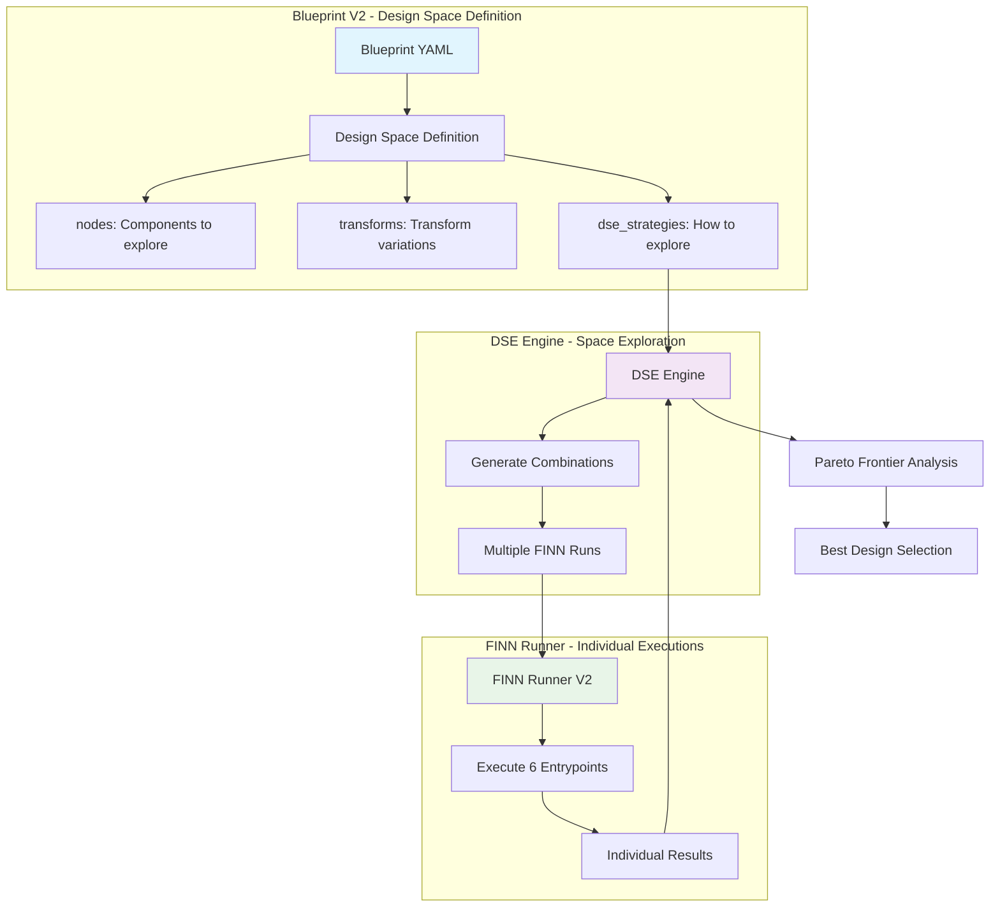

# Optimal Blueprint/DSE/Runner System for 6-Entrypoint FINN Architecture

## Overview

This document outlines the optimal design for a new Blueprint/DSE/Runner system that accommodates the FINN 6-entrypoint architecture. The key insight is that **Blueprints define Design Spaces**, not configurations, and **Brainsmith iteratively runs FINN** to explore that space using DSE strategies.

## Core Architecture



## Blueprint V2 Structure - Design Space Definition

### Example: BERT Accelerator Blueprint

```yaml
name: "bert_accelerator_v2"
version: "2.0"
base_blueprint: "transformer_base"  # Optional inheritance

# Design Space Definition - Components to explore
nodes:
  # Custom operations design space (Entrypoint 1)
  canonical_ops:
    available:
      - "LayerNorm"
      - "Softmax" 
      - "MultiHeadAttention"
      - "GELU"
    exploration:
      - required: ["LayerNorm", "Softmax"]  # Always included
      - optional: ["MultiHeadAttention", "GELU"]  # DSE explores with/without

  # Hardware kernels design space (Entrypoints 3 & 4)
  hw_kernels:
    available:
      - "MatMul": ["matmul_rtl", "matmul_hls", "matmul_mixed"]
      - "Conv2D": ["conv2d_hls", "conv2d_rtl"]
      - "LayerNorm": ["layernorm_custom", "layernorm_builtin"]
      - "Softmax": ["softmax_hls", "softmax_lookup"]
      - "Add"  # Single option - import all attached specializations
    exploration:
      - required: ["MatMul", "LayerNorm"]  # Must have implementations
      - optional: ["Conv2D", "Softmax"]   # May or may not be needed
      - mutually_exclusive:
          - ["matmul_rtl", "matmul_hls"]  # Can't use both in same run

# Transform design space (Entrypoints 2, 5, 6)
transforms:
  # Model topology transforms design space (Entrypoint 2)
  model_topology:
    available:
      - "cleanup"
      - "streamlining" 
      - "aggressive_streamlining"
      - "conservative_streamlining"
      - "constant_folding"
      - "remove_head"
      - "remove_tail"
    exploration:
      - required: ["cleanup"]
      - optional: ["constant_folding", "remove_head", "remove_tail"]
      - mutually_exclusive:
          - ["aggressive_streamlining", "conservative_streamlining"]
      - dependencies:
          - "streamlining": ["cleanup"]  # streamlining requires cleanup first

  # Hardware kernel transforms design space (Entrypoint 5)
  hw_kernel:
    available:
      - "target_fps_parallelization"
      - "apply_folding_config"
      - "minimize_bit_width"
      - "optimize_memory_bandwidth"
    exploration:
      - required: ["target_fps_parallelization", "apply_folding_config"]
      - optional: ["minimize_bit_width", "optimize_memory_bandwidth"]

  # Hardware graph transforms design space (Entrypoint 6)
  hw_graph:
    available:
      - "set_fifo_depths"
      - "create_stitched_ip"
      - "optimize_pipeline"
    exploration:
      - required: ["set_fifo_depths", "create_stitched_ip"]
      - optional: ["optimize_pipeline"]

# External configuration files (not DSE parameters)
configuration_files:
  folding_override: "configs/bert_folding.json"  # Override FINN's auto-folding
  platform_config: "configs/zynq_ultrascale.yaml"
  verification_data: "data/bert_test_vectors.npz"

# DSE Strategy Configuration
dse_strategies:
  # Primary strategy for this blueprint
  primary_strategy: "hierarchical_exploration"
  
  # Strategy definitions
  strategies:
    # Strategy 1: Quick initial exploration
    quick_scan:
      description: "Fast exploration of main design choices"
      max_evaluations: 20
      sampling: "latin_hypercube"
      focus_areas:
        - "kernel_selection"  # Focus on kernel choices first
        - "required_transforms"  # Only test required transforms
      
    # Strategy 2: Comprehensive exploration  
    comprehensive:
      description: "Full exploration of design space"
      max_evaluations: 100
      sampling: "adaptive_grid"
      focus_areas:
        - "all_combinations"  # Test all valid combinations
      
    # Strategy 3: Performance optimization
    performance_focused:
      description: "Focus on throughput optimization"
      max_evaluations: 50
      sampling: "pareto_guided"
      objectives:
        - "throughput": "maximize"
        - "latency": "minimize"
      constraints:
        - "resource_utilization < 0.8"

# Multi-objective optimization
objectives:
  primary:
    - name: "throughput"
      direction: "maximize"
      weight: 1.0
  secondary:
    - name: "resource_efficiency" 
      direction: "maximize"
      weight: 0.7
    - name: "power_consumption"
      direction: "minimize"
      weight: 0.5

# Resource and performance constraints
constraints:
  resource_limits:
    lut_utilization: 0.85
    dsp_utilization: 0.80
    bram_utilization: 0.75
  performance_requirements:
    min_throughput_fps: 1000
    max_latency_ms: 50
    max_power_w: 25
```

## System Components

### 1. Blueprint V2 Parser

```python
# brainsmith/core/blueprint_v2.py
@dataclass
class DesignSpaceDefinition:
    """Defines the design space to be explored."""
    nodes: NodeDesignSpace
    transforms: TransformDesignSpace
    configuration_files: Dict[str, str]
    dse_strategies: DSEStrategies
    objectives: List[Objective]
    constraints: Dict[str, Any]

@dataclass
class NodeDesignSpace:
    """Node component design space."""
    canonical_ops: ComponentSpace
    hw_kernels: ComponentSpace

@dataclass
class ComponentSpace:
    """Design space for a component category."""
    available: List[Union[str, Dict[str, List[str]]]]
    exploration: ExplorationRules

@dataclass
class ExplorationRules:
    """Rules for exploring component combinations."""
    required: List[str] = field(default_factory=list)
    optional: List[str] = field(default_factory=list) 
    mutually_exclusive: List[List[str]] = field(default_factory=list)
    dependencies: Dict[str, List[str]] = field(default_factory=dict)
```

### 2. DSE Engine V2 - Design Space Explorer

```python
# brainsmith/core/dse_v2/space_explorer.py
class DesignSpaceExplorer:
    """Explores design space defined by Blueprint V2."""
    
    def __init__(self, blueprint: DesignSpaceDefinition):
        self.blueprint = blueprint
        self.strategy_executor = StrategyExecutor(blueprint.dse_strategies)
        
    def explore_design_space(self, model_path: str) -> DSEResults:
        """Execute DSE strategy to explore the design space."""
        
        # Generate all valid combinations based on exploration rules
        valid_combinations = self._generate_valid_combinations()
        
        # Apply DSE strategy to select which combinations to evaluate
        selected_combinations = self.strategy_executor.select_combinations(
            valid_combinations, 
            self.blueprint.dse_strategies.primary_strategy
        )
        
        # Execute FINN runs for selected combinations
        results = []
        for combination in selected_combinations:
            finn_config = self._combination_to_finn_config(combination)
            result = self._execute_finn_run(model_path, finn_config)
            results.append(result)
            
            # Adaptive strategy may modify remaining combinations based on results
            if self.strategy_executor.is_adaptive():
                selected_combinations = self.strategy_executor.adapt_selection(
                    selected_combinations, results
                )
        
        return self._analyze_results(results)
    
    def _generate_valid_combinations(self) -> List[ComponentCombination]:
        """Generate all valid component combinations respecting rules."""
        combinations = []
        
        # Generate combinations for each component type
        node_combinations = self._generate_node_combinations()
        transform_combinations = self._generate_transform_combinations()
        
        # Cross product with constraint validation
        for nodes in node_combinations:
            for transforms in transform_combinations:
                combination = ComponentCombination(nodes=nodes, transforms=transforms)
                if self._validate_combination(combination):
                    combinations.append(combination)
        
        return combinations
    
    def _combination_to_finn_config(self, combination: ComponentCombination) -> FINNConfig:
        """Convert component combination to FINN configuration."""
        
        # Build 6-entrypoint FINN configuration
        entrypoint_config = {
            'entrypoint_1': combination.nodes.canonical_ops,
            'entrypoint_2': combination.transforms.model_topology,
            'entrypoint_3': [k for k, v in combination.nodes.hw_kernels.items()],
            'entrypoint_4': [v for k, v in combination.nodes.hw_kernels.items()],
            'entrypoint_5': combination.transforms.hw_kernel,
            'entrypoint_6': combination.transforms.hw_graph
        }
        
        # Add configuration files
        config_files = self.blueprint.configuration_files
        
        return FINNConfig(
            entrypoints=entrypoint_config,
            folding_config_file=config_files.get('folding_override'),
            platform_config_file=config_files.get('platform_config'),
            verification_data=config_files.get('verification_data')
        )
```

### 3. FINN Runner V2 - Individual Execution

```python
# brainsmith/core/finn_v2/entrypoint_runner.py
class EntrypointFINNRunner:
    """Executes individual FINN runs with 6-entrypoint configuration."""
    
    def execute_finn_run(self, model_path: str, finn_config: FINNConfig) -> FINNResult:
        """Execute single FINN run with resolved 6-entrypoint configuration."""
        
        try:
            # Build FINN step list from entrypoint configuration
            finn_steps = self._build_finn_steps(finn_config.entrypoints)
            
            # Create DataflowBuildConfig
            build_config = self._create_dataflow_build_config(
                steps=finn_steps,
                folding_config_file=finn_config.folding_config_file,
                platform_config_file=finn_config.platform_config_file
            )
            
            # Execute FINN build
            build_result = build_dataflow(model=model_path, cfg=build_config)
            
            # Extract metrics per entrypoint
            entrypoint_metrics = self._extract_entrypoint_metrics(build_result)
            
            return FINNResult(
                success=True,
                build_result=build_result,
                entrypoint_metrics=entrypoint_metrics,
                configuration=finn_config
            )
            
        except Exception as e:
            return FINNResult(
                success=False,
                error=str(e),
                configuration=finn_config
            )
    
    def _build_finn_steps(self, entrypoint_config: Dict[str, List[str]]) -> List[str]:
        """Build FINN step list from 6-entrypoint configuration."""
        
        steps = []
        
        # Entrypoint 1: Register canonical ops
        for op in entrypoint_config['entrypoint_1']:
            steps.append(f"register_custom_op_{op}")
        
        # Entrypoint 2: Topology transforms
        steps.extend([f"step_{transform}" for transform in entrypoint_config['entrypoint_2']])
        
        # Entrypoint 3 & 4: Hardware kernels and specializations
        steps.append("step_convert_to_hls")
        steps.append("step_create_dataflow_partition")
        for kernel in entrypoint_config['entrypoint_3']:
            steps.append(f"register_kernel_{kernel}")
        for specialization in entrypoint_config['entrypoint_4']:
            steps.append(f"apply_specialization_{specialization}")
        
        # Entrypoint 5: Hardware kernel transforms
        steps.extend([f"step_{transform}" for transform in entrypoint_config['entrypoint_5']])
        
        # Entrypoint 6: Hardware graph transforms
        steps.extend([f"step_{transform}" for transform in entrypoint_config['entrypoint_6']])
        
        return steps
```

## DSE Strategy Examples

### 1. Hierarchical Exploration Strategy

```python
# brainsmith/core/dse_v2/strategies/hierarchical.py
class HierarchicalExplorationStrategy:
    """Explores design space in hierarchical phases."""
    
    def select_combinations(self, valid_combinations: List[ComponentCombination], 
                          strategy_config: Dict[str, Any]) -> List[ComponentCombination]:
        """Select combinations using hierarchical approach."""
        
        selected = []
        
        # Phase 1: Explore kernel choices (highest impact)
        kernel_variants = self._group_by_kernels(valid_combinations)
        phase1_selected = self._sample_kernel_variants(kernel_variants, n_samples=10)
        selected.extend(phase1_selected)
        
        # Phase 2: For best kernels, explore transform choices
        best_kernels = self._find_best_performing_kernels(phase1_selected)
        transform_variants = self._generate_transform_variants(best_kernels)
        phase2_selected = self._sample_transform_variants(transform_variants, n_samples=20)
        selected.extend(phase2_selected)
        
        # Phase 3: Fine-tune best combinations
        best_combinations = self._find_pareto_optimal(phase2_selected)
        phase3_selected = self._fine_tune_combinations(best_combinations)
        selected.extend(phase3_selected)
        
        return selected
```

### 2. Adaptive Strategy

```python
# brainsmith/core/dse_v2/strategies/adaptive.py
class AdaptiveExplorationStrategy:
    """Adapts exploration based on intermediate results."""
    
    def adapt_selection(self, remaining_combinations: List[ComponentCombination],
                       current_results: List[FINNResult]) -> List[ComponentCombination]:
        """Adapt remaining combinations based on current results."""
        
        # Analyze current results
        performance_trends = self._analyze_performance_trends(current_results)
        
        # Identify promising regions
        promising_regions = self._identify_promising_regions(performance_trends)
        
        # Focus remaining evaluations on promising regions
        adapted_combinations = []
        for combination in remaining_combinations:
            if self._is_in_promising_region(combination, promising_regions):
                adapted_combinations.append(combination)
        
        return adapted_combinations
```

## Integration with Existing System

### Modified forge() Function

```python
# brainsmith/core/api.py
def forge(
    model_path: str,
    blueprint_path: str,
    objectives: Dict[str, Any] = None,
    constraints: Dict[str, Any] = None,
    target_device: str = None,
    is_hw_graph: bool = False,
    build_core: bool = True,
    output_dir: Optional[str] = None
) -> Dict[str, Any]:
    """Enhanced forge function supporting Blueprint V2."""
    
    # Detect blueprint version
    if _is_blueprint_v2(blueprint_path):
        return _forge_v2(model_path, blueprint_path, objectives, constraints, 
                        target_device, is_hw_graph, build_core, output_dir)
    else:
        return _forge_v1(model_path, blueprint_path, objectives, constraints,
                        target_device, is_hw_graph, build_core, output_dir)

def _forge_v2(model_path: str, blueprint_path: str, **kwargs) -> Dict[str, Any]:
    """Execute forge with Blueprint V2 and design space exploration."""
    
    # Load Blueprint V2
    blueprint = load_blueprint_v2(blueprint_path)
    
    # Create design space explorer
    explorer = DesignSpaceExplorer(blueprint)
    
    # Execute design space exploration
    dse_results = explorer.explore_design_space(model_path)
    
    # Find best result based on objectives
    best_result = find_best_result(dse_results, blueprint.objectives)
    
    # Optionally build final core
    if kwargs.get('build_core', True):
        dataflow_core = build_final_core(best_result)
    else:
        dataflow_core = None
    
    return {
        'dataflow_graph': best_result.dataflow_graph,
        'dataflow_core': dataflow_core,
        'dse_results': dse_results,
        'exploration_summary': generate_exploration_summary(dse_results),
        'pareto_frontier': dse_results.pareto_frontier
    }
```

## File Structure

```
brainsmith/
├── core/
│   ├── blueprint_v2.py              # Blueprint V2 parser and data structures
│   ├── dse_v2/
│   │   ├── __init__.py
│   │   ├── space_explorer.py        # Main design space exploration engine
│   │   ├── combination_generator.py # Generate valid component combinations
│   │   ├── strategies/
│   │   │   ├── __init__.py
│   │   │   ├── hierarchical.py      # Hierarchical exploration strategy
│   │   │   ├── adaptive.py          # Adaptive exploration strategy
│   │   │   └── pareto_guided.py     # Pareto-guided strategy
│   │   └── strategy_executor.py     # Strategy execution framework
│   ├── finn_v2/
│   │   ├── __init__.py
│   │   ├── entrypoint_runner.py     # 6-entrypoint FINN runner
│   │   ├── config_builder.py        # FINN config builder from combinations
│   │   └── metrics_extractor.py     # Per-entrypoint metrics extraction
│   └── api.py                       # Modified forge function with V2 support
└── libraries/
    └── blueprints_v2/
        ├── transformers/
        │   ├── bert_accelerator_v2.yaml
        │   ├── gpt_accelerator_v2.yaml
        │   └── transformer_base.yaml
        ├── cnn/
        │   ├── resnet_accelerator_v2.yaml
        │   └── cnn_base.yaml
        └── rnn/
            └── lstm_accelerator_v2.yaml
```

## Key Benefits

1. **True Design Space Definition**: Blueprints define spaces to explore, not fixed configurations
2. **DSE Strategy Flexibility**: Multiple strategies for different exploration needs
3. **6-Entrypoint Alignment**: Direct mapping to FINN's new architecture
4. **Iterative FINN Execution**: Brainsmith orchestrates multiple FINN runs as intended
5. **Configuration File Integration**: External folding configs, platform configs, etc.
6. **Multi-objective Optimization**: Built-in support for Pareto analysis
7. **Adaptive Exploration**: Strategies can adapt based on intermediate results
8. **Hierarchical Blueprints**: Base blueprints for architecture families

This design properly separates concerns: **Blueprints define what to explore**, **DSE strategies define how to explore it**, and **FINN executes individual points** in the design space.