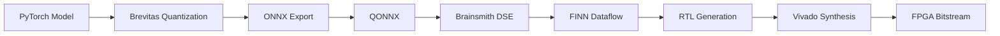
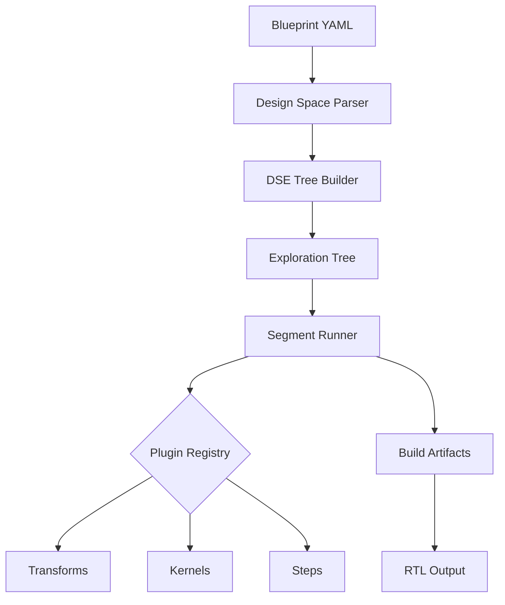
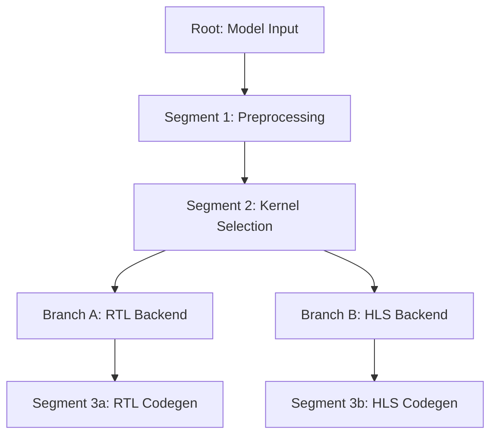
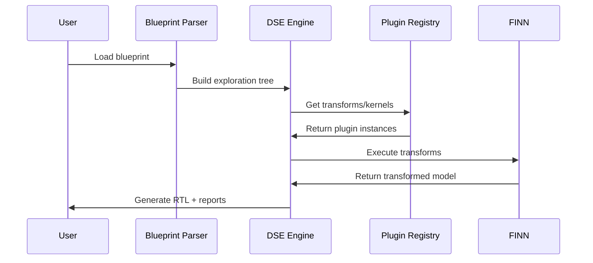
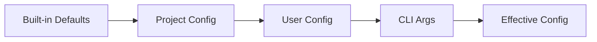

# Documentation Website Implementation Plan

## Phase 1: Initial Configuration & Proof-of-Concept

**Goal:** Set up Material for MkDocs with a working proof-of-concept deployable to GitHub Pages

**Estimated Time:** 3-4 hours

---

## Step 1: Install Dependencies (15 mins)

### 1.1 Add to pyproject.toml

Add documentation dependencies to a new `[tool.poetry.group.docs]` section:

```toml
[tool.poetry.group.docs]
optional = true

[tool.poetry.group.docs.dependencies]
mkdocs = "~=1.6.0"
mkdocs-material = "~=9.5.0"
mkdocstrings = {extras = ["python"], version = "~=0.25.0"}
mkdocs-git-revision-date-localized-plugin = "~=1.2.0"
mkdocs-minify-plugin = "~=0.8.0"
mike = "~=2.1.0"
pymdown-extensions = "~=10.8.0"
```

### 1.2 Install Dependencies

```bash
poetry install --with docs
```

---

## Step 2: Create MkDocs Configuration (30 mins)

### 2.1 Create mkdocs.yml

Create `mkdocs.yml` in the project root:

```yaml
site_name: Brainsmith
site_description: From PyTorch to RTL - FPGA Accelerator Compiler for AI
site_author: Microsoft & AMD
site_url: https://microsoft.github.io/brainsmith/  # Update with actual URL

repo_name: microsoft/brainsmith
repo_url: https://github.com/microsoft/brainsmith
edit_uri: edit/main/docs/

copyright: Copyright &copy; Microsoft Corporation

theme:
  name: material
  palette:
    # Light mode
    - media: "(prefers-color-scheme: light)"
      scheme: default
      primary: indigo
      accent: blue
      toggle:
        icon: material/brightness-7
        name: Switch to dark mode
    # Dark mode
    - media: "(prefers-color-scheme: dark)"
      scheme: slate
      primary: indigo
      accent: blue
      toggle:
        icon: material/brightness-4
        name: Switch to light mode

  features:
    - navigation.instant      # Fast page loads
    - navigation.tracking     # URL updates with scroll
    - navigation.tabs         # Top-level tabs
    - navigation.sections     # Collapsible sections
    - navigation.expand       # Expand all sections
    - navigation.top          # Back to top button
    - search.suggest          # Search suggestions
    - search.highlight        # Highlight search terms
    - content.code.copy       # Copy button for code blocks
    - content.code.annotate   # Annotations in code blocks

  icon:
    repo: fontawesome/brands/github

plugins:
  - search
  - mkdocstrings:
      handlers:
        python:
          options:
            docstring_style: google
            show_source: true
            show_root_heading: true
            show_root_full_path: false
            show_signature_annotations: true
            merge_init_into_class: true
            heading_level: 2
  - git-revision-date-localized:
      enable_creation_date: true
      type: timeago

markdown_extensions:
  # Code highlighting
  - pymdownx.highlight:
      anchor_linenums: true
      line_spans: __span
      pygments_lang_class: true
  - pymdownx.inlinehilite
  - pymdownx.superfences:
      custom_fences:
        - name: mermaid
          class: mermaid
          format: !!python/name:pymdownx.superfences.fence_code_format

  # Content features
  - pymdownx.tabbed:
      alternate_style: true
  - admonition
  - pymdownx.details
  - attr_list
  - md_in_html
  - def_list
  - pymdownx.tasklist:
      custom_checkbox: true

  # Navigation
  - toc:
      permalink: true
      toc_depth: 3

  # Typography
  - pymdownx.emoji:
      emoji_index: !!python/name:material.extensions.emoji.twemoji
      emoji_generator: !!python/name:material.extensions.emoji.to_svg

nav:
  - Home: index.md
  - Getting Started:
    - Installation: getting-started/installation.md
    - Quick Start: getting-started/quickstart.md
    - Configuration: getting-started/configuration.md
  - Architecture:
    - Overview: architecture/overview.md
    - Plugin System: architecture/plugin-system.md
  - API Reference:
    - Core: api-reference/core.md
    - Plugins: api-reference/plugins.md
  - Contributing: contributing.md

extra:
  social:
    - icon: fontawesome/brands/github
      link: https://github.com/microsoft/brainsmith
    - icon: fontawesome/brands/python
      link: https://pypi.org/project/brainsmith/
  version:
    provider: mike
```

---

## Step 3: Create Initial Documentation Structure (45 mins)

### 3.1 Create docs/ directory structure

```bash
mkdir -p docs/getting-started
mkdir -p docs/architecture
mkdir -p docs/api-reference
```

### 3.2 Create index.md (Landing Page)

Create `docs/index.md`:

```markdown
# Brainsmith

**From PyTorch to RTL - FPGA Accelerator Compiler for AI**

Brainsmith automates design space exploration (DSE) and implementation of neural networks on FPGA, from PyTorch to RTL. It builds on FINN, QONNX, and Brevitas to create dataflow accelerators with tunable parameters.

---

## Pre-Release

!!! warning "Pre-Release Status"
    This repository is in a pre-release state and under active co-development by Microsoft and AMD.

## Key Features

- **Plugin System** - Extensible architecture for registering custom kernels, transforms, and build steps
- **Blueprint Interface** - YAML-based declarative configuration with inheritance support
- **Segment-based Execution** - Efficient DSE through intelligent computation reuse
- **BERT Demo** - Example end-to-end acceleration (PyTorch to stitched-IP RTL)

## Quick Links

<div class="grid cards" markdown>

- :material-clock-fast: **[Quick Start](getting-started/quickstart.md)**

    Get up and running in minutes

- :material-cog: **[Installation](getting-started/installation.md)**

    Set up your development environment

- :material-book-open-variant: **[Architecture](architecture/overview.md)**

    Understand how Brainsmith works

- :material-code-braces: **[API Reference](api-reference/core.md)**

    Explore the codebase

</div>

## Architecture Overview



## Example: Design Space Exploration

```bash
# Run DSE with ONNX model and blueprint
smith model.onnx blueprint.yaml --output-dir ./results
```

## Built With

Brainsmith builds upon:

- [FINN](https://github.com/Xilinx/finn) - Dataflow compiler for quantized neural networks
- [QONNX](https://github.com/fastmachinelearning/qonnx) - Quantized ONNX representation
- [Brevitas](https://github.com/Xilinx/brevitas) - PyTorch quantization library

## License

This project is licensed under the MIT License - see the [LICENSE](https://github.com/microsoft/brainsmith/blob/main/LICENSE) file for details.

## Acknowledgments

Brainsmith is developed through a collaboration between Microsoft and AMD.
```

### 3.3 Create getting-started/installation.md

```markdown
# Installation

This guide will help you set up Brainsmith for development.

## Prerequisites

- Ubuntu 22.04+
- Python 3.10+
- Vivado Design Suite 2024.2
- [Poetry](https://python-poetry.org/docs/#installation)

## Poetry Environment Setup

### Automated Setup

```bash
# Run automated setup script
./setup-venv.sh

# Activate virtual environment
source .venv/bin/activate
```

### Manual Setup

If you prefer manual setup:

```bash
# Install Poetry (if not already installed)
curl -sSL https://install.python-poetry.org | python3 -

# Install dependencies
poetry install

# Activate virtual environment
poetry shell
```

## Configuration

### Initialize Configuration

```bash
# Create config file
brainsmith config init
```

This creates `~/.brainsmith/config.yaml`.

### Edit Configuration

Edit `~/.brainsmith/config.yaml` to set your Xilinx paths:

```yaml
xilinx_path: /opt/Xilinx/Vivado/2024.2
xilinx_version: 2024.2
build_dir: /tmp/finn_dev_${USER}
```

### Verify Configuration

```bash
# View current configuration
brainsmith config show

# Export environment variables
eval $(brainsmith config export)
```

## Validate Installation

Run the quick validation test:

```bash
./examples/bert/quicktest.sh
```

This runs a minimal BERT example (single layer) to verify everything works.

## Next Steps

- [Quick Start Guide](quickstart.md) - Run your first DSE
- [Configuration Guide](configuration.md) - Learn about configuration options
```

### 3.4 Create getting-started/quickstart.md

```markdown
# Quick Start

Get started with Brainsmith in 5 minutes.

## Prerequisites

Make sure you've completed the [installation](installation.md).

## Run Your First DSE

### 1. Prepare Your Model

For this quickstart, we'll use the included BERT example:

```bash
cd examples/bert
```

### 2. Run the Quick Test

```bash
./quicktest.sh
```

This will:

1. Generate a folding configuration for minimal resources
2. Build a single-layer BERT accelerator
3. Run RTL simulation to verify correctness

!!! info "Build Time"
    The quicktest takes approximately 30-60 minutes, depending on your system.

### 3. Explore Results

Results are saved in `examples/bert/quicktest/`:

```
quicktest/
├── model.onnx              # Quantized ONNX model
├── final_output/           # Generated RTL and reports
│   ├── stitched_ip/       # Synthesizable RTL
│   └── report/            # Performance estimates
└── build_dataflow.log     # Build log
```

## Understanding the Output

### Performance Report

Check `final_output/report/estimate_reports.json`:

```json
{
  "throughput": "1234.5 fps",
  "latency": "0.81 ms",
  "resources": {
    "LUT": 12345,
    "FF": 23456,
    "BRAM": 34,
    "DSP": 56
  }
}
```

### RTL Output

The generated RTL is in `final_output/stitched_ip/`:

- `finn_design_wrapper.v` - Top-level module
- `*.v` - Individual kernel implementations

## Next Steps

### Customize the Design

Edit the blueprint to explore different configurations:

```yaml
# bert_quicktest.yaml
design_space:
  kernels:
    - name: MatMul
      backends:
        - matmul_rtl  # Try different backends
  steps:
    - step_target_fps_parallelization:
        target_fps: 100  # Adjust target performance
```

### Run Full DSE

```bash
smith model.onnx blueprint.yaml --output-dir ./results
```

## Learn More

- [Architecture Overview](../architecture/overview.md) - Understand how Brainsmith works
- [Blueprint Reference](../user-guide/blueprints.md) - Learn blueprint syntax
- [CLI Reference](../user-guide/cli-reference.md) - Explore CLI commands
```

### 3.5 Create architecture/overview.md

```markdown
# Architecture Overview

Brainsmith's architecture is built around three core concepts: **Blueprints**, **Plugins**, and **Segment-based DSE**.

## High-Level Architecture



## Core Components

### 1. Blueprint System

Blueprints define design spaces in YAML:

```yaml
name: "My Accelerator"
design_space:
  kernels:
    - MatMul
    - Conv2d
  steps:
    - cleanup
    - qonnx_to_finn
    - step_create_dataflow_partition
```

**Key Features:**

- Inheritance support (`extends: base.yaml`)
- Dynamic step operations (insert, replace, remove)
- Parameter sweeps for exploration

**Location:** `brainsmith/core/design/`

### 2. Plugin Registry

A singleton registry manages all extensible components:

```python
from brainsmith.registry import transform, kernel, step

@transform(name="MyTransform")
class MyTransform:
    def apply(self, model):
        # Transform logic
        pass

@kernel(name="MyKernel")
class MyKernel:
    # Kernel implementation
    pass
```

**Plugin Types:**

- **Transforms** - Graph transformations
- **Kernels** - Hardware operator implementations
- **Backends** - RTL/HLS implementations per kernel
- **Steps** - Build pipeline operations

**Location:** `brainsmith/registry/registry.py`

### 3. Segment-Based DSE

The exploration tree is divided into segments for efficient computation reuse:



**Benefits:**

- Only changed segments re-execute
- Shared artifacts cached across branches
- Parallelizable execution (planned)

**Location:** `brainsmith/core/dse/`

## Compilation Pipeline

The standard dataflow compilation follows this pipeline:



### Pipeline Stages

1. **ONNX → QONNX** - Add quantization metadata
2. **QONNX → FINN** - Create dataflow partition
3. **Kernel Inference** - Replace ops with hardware kernels
4. **Specialization** - Configure kernel parameters
5. **Folding** - Apply parallelization strategy
6. **Bit Width Minimization** - Optimize data types
7. **Hardware Codegen** - Generate RTL/HLS
8. **IP Generation** - Create Vivado IP blocks
9. **FIFO Sizing** - Determine buffer depths
10. **Stitched IP** - Connect kernels with AXI stream
11. **RTL Simulation** - Verify correctness

## Configuration System

Pydantic-based configuration with layered overrides:



**Priority Order:**

1. CLI arguments / environment vars (highest)
2. Explicit `--config` file
3. Project config (`./brainsmith_config.yaml` or `./.brainsmith/config.yaml`)
4. User config (`~/.brainsmith/config.yaml`)
5. Built-in defaults (lowest)

**Location:** `brainsmith/config/`

## Two-CLI Design

### `brainsmith` CLI

Application-level commands:

- `config init/show/export` - Configuration management
- `setup all` - Dependency installation
- `smith ...` - Proxy to smith CLI

### `smith` CLI

Operational commands:

- `dse model.onnx blueprint.yaml` - Run DSE
- `kernel file.sv` - Generate kernel from RTL

**Location:** `brainsmith/interface/cli.py`

## Key Patterns

### Decorator-Based Registration

```python
@transform(name="CustomTransform", framework="brainsmith")
class CustomTransform(Transformation):
    pass
```

### Framework Integration

External transforms from FINN/QONNX are wrapped:

```python
# Automatically wrapped
get_transform("finn:Streamline")  # FINN transform
get_transform("qonnx:InferShapes")  # QONNX transform
```

### Lazy Plugin Loading

Plugins are discovered on first access:

```python
# First call triggers discovery
transform_cls = get_transform("MyTransform")
```

## Next Steps

- [Plugin System](plugin-system.md) - Deep dive into plugins
- [Segment Execution](segment-execution.md) - DSE tree mechanics (coming soon)
- [Dataflow Pipeline](dataflow-pipeline.md) - Compilation stages (coming soon)
```

### 3.6 Create api-reference/core.md

```markdown
# Core API Reference

::: brainsmith.core
    options:
      show_root_heading: true
      show_source: false
      heading_level: 2

## Main API

::: brainsmith.core.explore_design_space
    options:
      show_root_heading: true
      heading_level: 3

## DSE Components

::: brainsmith.core.DSESegment
    options:
      show_root_heading: true
      heading_level: 3

::: brainsmith.core.DSETree
    options:
      show_root_heading: true
      heading_level: 3

::: brainsmith.core.SegmentRunner
    options:
      show_root_heading: true
      heading_level: 3

## Design Components

::: brainsmith.core.DesignSpace
    options:
      show_root_heading: true
      heading_level: 3

::: brainsmith.core.parse_blueprint
    options:
      show_root_heading: true
      heading_level: 3

## Configuration

::: brainsmith.core.ForgeConfig
    options:
      show_root_heading: true
      heading_level: 3
```

### 3.7 Create api-reference/plugins.md

```markdown
# Plugin System API Reference

The plugin system is the core of Brainsmith's extensibility.

## Registry

::: brainsmith.registry.Registry
    options:
      show_root_heading: true
      heading_level: 3
      members:
        - register
        - get
        - find
        - all
        - reset

## Registration Functions

::: brainsmith.registry.plugin
    options:
      show_root_heading: true
      heading_level: 3

::: brainsmith.registry.transform
    options:
      show_root_heading: true
      heading_level: 3

::: brainsmith.registry.kernel
    options:
      show_root_heading: true
      heading_level: 3

::: brainsmith.registry.backend
    options:
      show_root_heading: true
      heading_level: 3

::: brainsmith.registry.step
    options:
      show_root_heading: true
      heading_level: 3

## Access Functions

::: brainsmith.registry.get_transform
    options:
      show_root_heading: true
      heading_level: 3

::: brainsmith.registry.get_kernel
    options:
      show_root_heading: true
      heading_level: 3

::: brainsmith.registry.get_backend
    options:
      show_root_heading: true
      heading_level: 3

::: brainsmith.registry.get_step
    options:
      show_root_heading: true
      heading_level: 3

## Query Functions

::: brainsmith.registry.list_transforms
    options:
      show_root_heading: true
      heading_level: 3

::: brainsmith.registry.list_kernels
    options:
      show_root_heading: true
      heading_level: 3

::: brainsmith.registry.has_transform
    options:
      show_root_heading: true
      heading_level: 3
```

### 3.8 Create contributing.md

```markdown
# Contributing to Brainsmith

We welcome contributions! This guide will help you get started.

## Development Setup

1. Fork the repository
2. Clone your fork:
   ```bash
   git clone https://github.com/YOUR_USERNAME/brainsmith.git
   cd brainsmith
   ```
3. Run setup:
   ```bash
   ./setup-venv.sh
   source .venv/bin/activate
   ```
4. Configure Vivado paths:
   ```bash
   brainsmith config init
   # Edit ~/.brainsmith/config.yaml
   ```

## Running Tests

```bash
# All tests
pytest tests/

# Specific test file
pytest tests/integration/test_plugin_system.py

# With coverage
pytest tests/ --cov=brainsmith.core
```

## Code Style

We use minimal linting rules during the alpha phase:

```bash
# Check code
ruff check brainsmith/ tests/

# Auto-fix issues
ruff check --fix brainsmith/ tests/

# Format code
ruff format brainsmith/ tests/
```

### Style Guidelines

- Line length: 100 characters
- Python 3.10+ required
- Docstring style: Google format preferred

## Making Changes

1. Create a feature branch:
   ```bash
   git checkout -b feature/my-feature
   ```

2. Make your changes

3. Add tests for new functionality

4. Run tests and linting:
   ```bash
   pytest tests/
   ruff check brainsmith/ tests/
   ```

5. Commit with descriptive messages:
   ```bash
   git commit -m "Add feature X that does Y"
   ```

6. Push to your fork:
   ```bash
   git push origin feature/my-feature
   ```

7. Open a Pull Request on GitHub

## PR Guidelines

- Describe what your PR does and why
- Reference any related issues
- Ensure all tests pass
- Add documentation for new features
- Keep PRs focused and reasonably sized

## Documentation

When adding features, update documentation:

- Add/update docstrings
- Update relevant markdown docs in `docs/`
- Add examples if applicable

Build docs locally:

```bash
mkdocs serve
```

Then open http://127.0.0.1:8000

## Questions?

- Open an [issue](https://github.com/microsoft/brainsmith/issues)
- Start a [discussion](https://github.com/microsoft/brainsmith/discussions)

## Code of Conduct

Please be respectful and follow our [Code of Conduct](https://github.com/microsoft/brainsmith/blob/main/CODE_OF_CONDUCT.md).
```

---

## Step 4: Set Up GitHub Actions for Auto-Deploy (30 mins)

### 4.1 Create .github/workflows/docs.yml

```yaml
name: Deploy Documentation

on:
  push:
    branches:
      - main
  workflow_dispatch:

permissions:
  contents: write

jobs:
  deploy:
    runs-on: ubuntu-latest
    steps:
      - uses: actions/checkout@v4
        with:
          fetch-depth: 0  # Needed for git-revision-date-localized

      - name: Setup Python
        uses: actions/setup-python@v5
        with:
          python-version: '3.10'

      - name: Install Poetry
        uses: snok/install-poetry@v1
        with:
          version: 1.8.0
          virtualenvs-create: true
          virtualenvs-in-project: true

      - name: Install dependencies
        run: |
          poetry install --with docs

      - name: Build and deploy docs
        run: |
          poetry run mkdocs gh-deploy --force
```

---

## Step 5: Enable GitHub Pages (5 mins)

1. Go to repository Settings → Pages
2. Source: Deploy from a branch
3. Branch: `gh-pages` / `/ (root)`
4. Save

---

## Step 6: Test Locally (15 mins)

### 6.1 Build and serve locally

```bash
# Activate environment
source .venv/bin/activate

# Serve with live reload
mkdocs serve
```

Open http://127.0.0.1:8000

### 6.2 Test all features

- [ ] Navigation works
- [ ] Search works
- [ ] Code blocks render correctly
- [ ] Dark/light mode toggle
- [ ] Mermaid diagrams render
- [ ] API reference pages load
- [ ] Mobile responsive

---

## Step 7: Deploy to GitHub Pages (10 mins)

### 7.1 Manual deployment (first time)

```bash
# Build and deploy
mkdocs gh-deploy --force
```

### 7.2 Verify deployment

Visit: `https://microsoft.github.io/brainsmith/`

---

## Step 8: Add Documentation Badge to README (5 mins)

Add to README.md:

```markdown
[](https://microsoft.github.io/brainsmith/)
```

---

## Deliverables Checklist

- [ ] `mkdocs.yml` configured with Material theme
- [ ] Documentation structure created in `docs/`
- [ ] Landing page (`index.md`) with overview
- [ ] Getting started guides (installation, quickstart)
- [ ] Architecture overview with Mermaid diagrams
- [ ] API reference pages using mkdocstrings
- [ ] Contributing guide
- [ ] GitHub Actions workflow for auto-deploy
- [ ] GitHub Pages enabled
- [ ] Local build tested
- [ ] Initial deployment completed
- [ ] README badge added

---

## Success Criteria

✅ Documentation site is live at GitHub Pages URL
✅ All pages render correctly with proper navigation
✅ Search functionality works
✅ API reference auto-generates from docstrings
✅ Mermaid diagrams display correctly
✅ Dark/light mode toggle functions
✅ Mobile responsive design
✅ Auto-deployment on push to main branch

---

## Next Steps (Phase 2)

After proof-of-concept is working:

1. **Content Migration** - Move existing docs to new structure
2. **Tutorials** - Add hands-on guides with code examples
3. **API Coverage** - Document all major modules
4. **Versioning** - Set up mike for version management
5. **Advanced Features** - Add social cards, more diagrams
6. **Search Optimization** - Configure search weights and boosts

---

## Troubleshooting

### Poetry install fails
```bash
# Clear cache and retry
poetry cache clear pypi --all
poetry install --with docs
```

### mkdocs serve fails
```bash
# Check Python version
python --version  # Should be 3.10+

# Reinstall dependencies
poetry install --with docs --sync
```

### GitHub Pages not updating
```bash
# Force rebuild
mkdocs gh-deploy --force

# Check GitHub Actions logs in repo
```

### Mermaid diagrams not rendering
- Ensure `pymdownx.superfences` is configured correctly in mkdocs.yml
- Check JavaScript console for errors
- Verify Mermaid syntax is valid

---

## Time Breakdown

| Task | Estimated Time |
|------|----------------|
| Install dependencies | 15 mins |
| Configure mkdocs.yml | 30 mins |
| Create doc structure | 45 mins |
| GitHub Actions setup | 30 mins |
| Enable GitHub Pages | 5 mins |
| Local testing | 15 mins |
| Deploy to GitHub Pages | 10 mins |
| Add README badge | 5 mins |
| **Total** | **~2.5 hours** |

Add buffer time for troubleshooting: **3-4 hours total**
